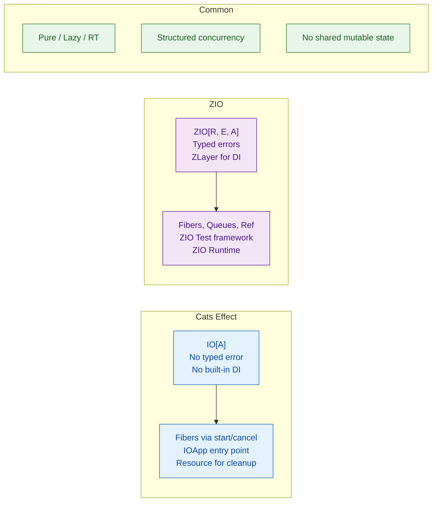

# Cats and ZIO Overview

> [!abstract] TL;DR
> Cats Effect and ZIO are Scala's two dominant **functional effect systems** — pure, referentially transparent wrappers around side effects. `cats.effect.IO[A]` is a lazy description of a computation. `ZIO[R, E, A]` extends this with typed errors `E` and dependency injection `R`. Both support structured concurrency, fibers, and resource management far superior to `Future`. They serve as the foundation of the modern Scala backend stack.

---

## Intuition

A `Future[A]` starts running immediately and can't be cancelled. An `IO[A]` is just a **description of what to run** — pure and lazy. Until you call `unsafeRunSync()`, nothing happens. This means `IO` values are values: you can pass them around, compose them, retry them, time them out, and test them without a thread pool. The program's entry point is the only place where `IO` is "run" — everywhere else you compose descriptions.

---

## How It Works

### Cats Effect — IO[A]

```scala
import cats.effect.*
import cats.effect.syntax.all.*
import cats.syntax.all.*

// IO is a lazy, pure description of computation
val greet: IO[Unit] = IO.println("Hello, World!")   // nothing happens yet
val answer: IO[Int] = IO.pure(42)                   // already-known value

// Composition
val program: IO[String] = for
  _    <- IO.println("Starting...")
  n    <- IO(scala.util.Random.nextInt(100))
  msg  <- IO.pure(s"Got: $n")
  _    <- IO.println(msg)
yield msg

// Running (only in Main)
object Main extends IOApp.Simple:
  def run: IO[Unit] = program.void
```

### Concurrency with Fibers

```scala
import cats.effect.*
import scala.concurrent.duration.*

// Fiber: lightweight thread managed by the runtime (not OS thread)
val task1: IO[String] = IO.sleep(2.seconds) *> IO.pure("result1")
val task2: IO[String] = IO.sleep(1.seconds) *> IO.pure("result2")

// parMapN — run concurrently, wait for both
val parallel: IO[(String, String)] =
  (task1, task2).parMapN((a, b) => (a, b))
// Takes 2 seconds (not 3) — both run concurrently

// parTraverse — process list concurrently
val urls = List("url1", "url2", "url3")
val results: IO[List[String]] =
  urls.parTraverse(url => httpGet(url))

// Race — run two, take first to complete, cancel the other
val fastest: IO[Either[String, String]] =
  IO.race(
    IO.sleep(2.seconds) *> IO.pure("slow"),
    IO.sleep(1.seconds) *> IO.pure("fast")
  )
// Right("fast")
```

### Resource Management — Guaranteed Cleanup

```scala
import cats.effect.Resource

// Resource[F, A] — acquire + guaranteed release
val fileResource: Resource[IO, java.io.BufferedReader] =
  Resource.fromAutoCloseable(
    IO(java.io.BufferedReader(java.io.FileReader("data.txt")))
  )

// Use: connection guaranteed to close even on exception
val readLines: IO[List[String]] =
  fileResource.use: reader =>
    IO(Iterator.continually(reader.readLine()).takeWhile(_ != null).toList)

// Combine resources
val dbPool:    Resource[IO, ConnectionPool] = makePool()
val kafkaProd: Resource[IO, KafkaProducer]  = makeProducer()

val app: IO[Unit] = (dbPool, kafkaProd).tupled.use: (pool, producer) =>
  runApplication(pool, producer)   // both closed on exit, in reverse order
```

### ZIO — ZIO[R, E, A]

```scala
import zio.*
import zio.Console.*

// ZIO[R, E, A]:
//   R = environment (dependencies — ZLayer provides them)
//   E = typed error (not just Throwable)
//   A = success value

// Simple ZIO
val hello: ZIO[Any, Nothing, Unit] = printLine("Hello, ZIO!")
// Any R = no deps needed; Nothing E = can't fail; Unit A = returns unit

// ZIO aliases:
// Task[A]    = ZIO[Any, Throwable, A]   — like IO, can throw
// UIO[A]     = ZIO[Any, Nothing, A]     — infallible
// IO[E, A]   = ZIO[Any, E, A]           — no deps, typed error
// RIO[R, A]  = ZIO[R, Throwable, A]     — needs env, can throw

val safeDiv: IO[String, Int] = ZIO.attempt(10 / 0)
  .mapError(e => s"Division error: ${e.getMessage}")
```

### ZIO Layers — Dependency Injection

```scala
// Define service traits
trait UserService:
  def findById(id: Long): Task[Option[User]]

trait EmailService:
  def send(to: String, body: String): Task[Unit]

// Implement with ZLayers
val liveUserService: ZLayer[Any, Nothing, UserService] =
  ZLayer.succeed(new UserService:
    def findById(id: Long) = ZIO.succeed(Some(User(id, "Alice")))
  )

val liveEmailService: ZLayer[Any, Nothing, EmailService] =
  ZLayer.succeed(new EmailService:
    def send(to: String, body: String) = ZIO.succeed(println(s"Email to $to: $body"))
  )

// Compose services using ZIO environment
val notifyUser: ZIO[UserService & EmailService, Throwable, Unit] =
  for
    svc   <- ZIO.service[UserService]
    email <- ZIO.service[EmailService]
    user  <- svc.findById(1L)
    _     <- user match
               case Some(u) => email.send(u.name, "Hello!")
               case None    => ZIO.unit
  yield ()

// Provide layers at the edge
val program = notifyUser.provide(liveUserService, liveEmailService)
```

### Cats Effect vs ZIO — Side by Side



## Cats Effect vs ZIO Comparison

| Feature | Cats Effect | ZIO |
|---|---|---|
| Typed errors | No (`Throwable` only) | Yes (`ZIO[R, E, A]`) |
| Dependency injection | External (doobie, http4s wiring) | Built-in ZLayer |
| Test framework | munit-cats-effect | ZIO Test (built-in) |
| Ecosystem | http4s, doobie, fs2, tapir | ZIO HTTP, ZIO Quill, ZIO Streams |
| Learning curve | Lower (simpler type signature) | Higher (R/E/A) |
| Popularity | Larger ecosystem (more libs) | Growing fast |
| Interop | Works with Cats Core typeclasses | Cats interop module available |

## Common Pitfalls

| # | Pitfall | Fix |
|---|---------|-----|
| 1 | Calling `unsafeRunSync()` inside business logic — blocks fiber thread | Only call at the application boundary (`main` method) |
| 2 | Using `IO { sideEffect() }` for blocking calls — starves compute thread pool | Use `IO.blocking { ... }` to shift to a blocking thread pool |
| 3 | Forgetting to `use` a `Resource` — resources leak on exception | Always access Resource values inside `.use { ... }` |
| 4 | ZIO: using `ZIO.attempt` for domain errors — loses typed error information | Define `case class` error types and use `ZIO.fail(DomainError(...))` |
| 5 | Mixing Future and IO without `Dispatcher` or `.fromFuture` | Use `IO.fromFuture(IO(myFuture))` to bridge Future into IO |

## Review Questions

1. Why is `IO[A]` referentially transparent but `Future[A]` is not?
2. What does the `R` in `ZIO[R, E, A]` represent, and how does `ZLayer` fill it?
3. When would you choose `IO.blocking` over `IO.apply`?

---

Related: [[Scala_Typeclasses]] | [[Scala_Error_Handling_FP]] | [[Scala_Futures_and_Promises]] | [[Scala_Testing]]

#Scala
