# Scala Master MOC

> [!abstract] About
> 25 notes across 4 sections — JVM functional-OOP hybrid language with a strong type system. Scala unifies object-oriented programming with principled functional programming (immutability, algebraic types, higher-kinded typeclasses) on the JVM, compiling also to JavaScript and native binaries. It is the language of Apache Spark, Akka, and the Cats/ZIO functional effect ecosystem.

---

## Knowledge Map

```mermaid
graph TD
    ROOT["Scala\nOOP + FP on JVM"]:::root

    ROOT --> F1["01 Fundamentals"]:::sec
    ROOT --> F2["02 Functional Programming"]:::sec
    ROOT --> F3["03 Concurrency & Ecosystem"]:::sec
    ROOT --> F4["04 Testing & Style"]:::sec

    F1 --> N01["Scala_Overview\nJVM, targets, industry"]:::note
    F1 --> N02["Types_and_Variables\nval/var, hierarchy, Option"]:::note
    F1 --> N03["Control_Flow\nmatch, for/yield, @tailrec"]:::note
    F1 --> N04["Functions\nHOF, currying, by-name"]:::note
    F1 --> N05["OOP\ncase class, trait, companion"]:::note
    F1 --> N06["Pattern_Matching\nunapply, guards, sealed"]:::note

    F2 --> N07["Immutability_and_ADTs\nsealed+case = ADT"]:::note
    F2 --> N08["Collections\nList, Vector, LazyList"]:::note
    F2 --> N09["Typeclasses\ngiven/using, Cats"]:::note
    F2 --> N10["Generics_and_Variance\n+A, -A, F[_]"]:::note
    F2 --> N11["Error_Handling_FP\nEither, Validated, EitherT"]:::note

    F3 --> N12["Futures_and_Promises\nFuture, EC, Promise"]:::note
    F3 --> N13["Akka_Actors_Intro\nactor model, Typed"]:::note
    F3 --> N14["Spark_Basics\nDataFrame, Dataset, SQL"]:::note
    F3 --> N15["Play_Framework\nMVC, routes, JSON, Slick"]:::note
    F3 --> N16["Build_Tools\nsbt, Mill, Scala CLI"]:::note

    F4 --> N17["Scala_Testing\nScalaTest, ScalaCheck, munit"]:::note
    F4 --> N18["Style_Guide\nimmutability, expressions, scalafmt"]:::note
    F4 --> N19["Cats_and_ZIO\nIO, ZIO[R,E,A], Resource"]:::note

    classDef root fill:#FCE4EC,stroke:#C62828,color:#B71C1C
    classDef sec fill:#EDE7F6,stroke:#6A1B9A,color:#1A237E
    classDef note fill:#E8F5E9,stroke:#2E7D32,color:#1B5E20
```



---

## Sections

### Section 01 — Scala Fundamentals

| Note | Topics | Difficulty |
|------|--------|-----------|
| [[Scala_Overview]] | JVM targets, Scala 2 vs 3, sbt, Java interop, industry | Beginner |
| [[Scala_Types_and_Variables]] | val/var/lazy val, type hierarchy, Any/Nothing/Unit, Option | Beginner |
| [[Scala_Control_Flow]] | if expression, match/case, for/yield, @tailrec, try/catch | Beginner |
| [[Scala_Functions]] | def vs val fn, HOF, currying, by-name, given/using | Beginner |
| [[Scala_OOP]] | class, case class, trait, object, companion, sealed | Beginner |
| [[Scala_Pattern_Matching]] | unapply, guards, @ binding, list patterns, exhaustiveness | Intermediate |

### Section 02 — Functional Programming

| Note | Topics | Difficulty |
|------|--------|-----------|
| [[Scala_Immutability_and_ADTs]] | Product/sum types, sealed trait + case class, Option/Either/Try | Intermediate |
| [[Scala_Collections]] | List/Vector/Map/Set, map/filter/flatMap/fold, LazyList | Beginner |
| [[Scala_Typeclasses]] | Typeclass pattern, given/using, context bounds, Cats Functor/Monad | Advanced |
| [[Scala_Generics_and_Variance]] | Covariant +A, contravariant -A, bounds <: >:, F[_] HKT | Advanced |
| [[Scala_Error_Handling_FP]] | Either short-circuit, Validated accumulation, EitherT, railway | Intermediate |

### Section 03 — Concurrency and Ecosystem

| Note | Topics | Difficulty |
|------|--------|-----------|
| [[Scala_Futures_and_Promises]] | Future[T], ExecutionContext, parallel, recover, Promise | Intermediate |
| [[Akka_Actors_Intro]] | Actor model, Akka Typed, supervision, ask pattern | Intermediate |
| [[Scala_Spark_Basics]] | SparkSession, DataFrame/Dataset, transformations vs actions, SQL | Intermediate |
| [[Play_Framework]] | routes DSL, Action/Controller, Play JSON, Slick, async | Intermediate |
| [[Scala_Build_Tools]] | sbt DSL, libraryDependencies, Mill, Scala CLI, ecosystem libs | Beginner |

### Section 04 — Testing and Style

| Note | Topics | Difficulty |
|------|--------|-----------|
| [[Scala_Testing]] | ScalaTest, munit, ScalaCheck PBT, Mockito-Scala, async | Intermediate |
| [[Scala_Style_Guide]] | Immutability, expressions, no null, naming, scalafmt | Beginner |
| [[Cats_and_ZIO_Overview]] | IO[A], ZIO[R,E,A], fibers, Resource, ZLayer, comparison | Advanced |

---

## Learning Paths

### Path A — Data Engineer (Spark Focus)

Recommended for: ETL pipelines, big data, distributed analytics

1. [[Scala_Overview]] → [[Scala_Types_and_Variables]] → [[Scala_Control_Flow]]
2. [[Scala_Functions]] → [[Scala_OOP]] → [[Scala_Pattern_Matching]]
3. [[Scala_Collections]] → [[Scala_Immutability_and_ADTs]]
4. [[Scala_Spark_Basics]] ← primary focus, deep dive here
5. [[Scala_Build_Tools]] (sbt for Spark projects)
6. [[Scala_Testing]] (ScalaTest for Spark jobs)

### Path B — Backend Services (Akka / Play)

Recommended for: REST APIs, microservices, reactive systems

1. [[Scala_Overview]] → [[Scala_Types_and_Variables]] → [[Scala_OOP]]
2. [[Scala_Functions]] → [[Scala_Pattern_Matching]] → [[Scala_Control_Flow]]
3. [[Scala_Error_Handling_FP]] → [[Scala_Futures_and_Promises]]
4. [[Akka_Actors_Intro]] → [[Play_Framework]]
5. [[Scala_Build_Tools]] → [[Scala_Testing]]
6. [[Scala_Style_Guide]]

### Path C — Functional Programmer (Cats / ZIO)

Recommended for: pure FP, effect systems, type-safe APIs

1. [[Scala_Overview]] → [[Scala_Types_and_Variables]] → [[Scala_Functions]]
2. [[Scala_Immutability_and_ADTs]] → [[Scala_Collections]]
3. [[Scala_Pattern_Matching]] → [[Scala_Error_Handling_FP]]
4. [[Scala_Generics_and_Variance]] → [[Scala_Typeclasses]]
5. [[Cats_and_ZIO_Overview]] ← primary focus
6. [[Scala_Testing]] (property-based with ScalaCheck)
7. [[Scala_Style_Guide]]

---

## Scala vs Other JVM Languages

| Aspect | Java | Kotlin | Scala |
|---|---|---|---|
| Paradigm | OOP primary | OOP + some FP | OOP + FP equal weight |
| Type system | Generics (erasure) | Generics + reified | Full variance, HKT, typeclasses |
| Null safety | `@Nullable` annotations | Type system (`?`) | `Option[T]` + explicit null (Scala 3) |
| Immutability | `final` fields | `val` | `val` + case class by default |
| Pattern matching | `switch` (Java 21+) | `when` | `match` (most powerful) |
| FP libraries | Limited | Arrow | Cats, ZIO (industry-grade) |
| Build tool | Maven/Gradle | Gradle/Maven | sbt/Mill |
| Primary use case | Enterprise, Android | Android, Backend | Spark, Akka, FP backend |

---

## Quick Reference

```scala
// Scala 3 in one snippet
sealed trait Shape
case class Circle(r: Double)    extends Shape
case class Rect(w: Double, h: Double) extends Shape

def area(s: Shape): Double = s match
  case Circle(r)    => math.Pi * r * r
  case Rect(w, h)   => w * h

val shapes: List[Shape] = List(Circle(5), Rect(3, 4), Circle(2))
val areas: List[Double] = shapes.map(area)
val total: Double       = areas.sum

// Option chaining
def largestArea(ss: List[Shape]): Option[Double] =
  ss.map(area).maxOption

// Either error handling
def describeArea(s: Shape): Either[String, String] =
  val a = area(s)
  if a <= 0 then Left("Non-positive area")
  else Right(f"area = $a%.2f")
```

---

Related: [[_MOC_AI_ML_Master]] | [[_MOC_DSA_Master]] | [[_MOC_SystemDesign_Master]] | [[_MOC_DevOps_Master]]

#Scala
