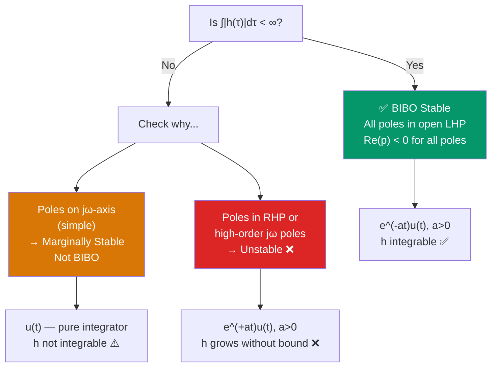

# ⚖️ BIBO Stability of CT LTI Systems

> [!abstract] TL;DR
> A CT LTI system is BIBO (Bounded Input, Bounded Output) stable if and only if its impulse response $h(t)$ is absolutely integrable: $\int_{-\infty}^{\infty}|h(\tau)|\,d\tau < \infty$. Equivalently, all poles of the transfer function $H(s)$ must lie strictly in the open left-half of the complex $s$-plane. Poles on the $j\omega$-axis yield marginal stability (not BIBO); poles in the right-half plane yield instability.

## Intuition — analogy FIRST

Imagine filling a bathtub (the system output) while someone pours water in at a bounded rate (the input). A stable drain ensures the tub never overflows — however long you run the tap, the water level stays bounded. An unstable system is like a plugged drain with an inflow: water accumulates indefinitely. The condition $\int|h(\tau)|d\tau < \infty$ says the drain's "memory" of past inputs decays fast enough that bounded inflows never accumulate into an unbounded output. A pure integrator ($h=u(t)$, analogous to no drain) is not BIBO stable: a constant input produces a ramp output that grows forever.

---

## How It Works



---

## Key Concepts / Details

### BIBO Stability Definition

$$\exists\, M_x < \infty:\; |x(t)| \leq M_x\;\forall t \implies \exists\, M_y < \infty:\; |y(t)| \leq M_y\;\forall t$$

In words: for every bounded input, the output must also remain bounded for all time.

### Necessary and Sufficient Condition for CT LTI Systems

**Theorem**: A CT LTI system with impulse response $h(t)$ is BIBO stable if and only if

$$\int_{-\infty}^{\infty} |h(\tau)|\,d\tau < \infty \qquad (\text{i.e., } h \in L^1(\mathbb{R}))$$

**Proof sketch (sufficiency):**

$$|y(t)| = \left|\int_{-\infty}^{\infty} x(\tau)\,h(t-\tau)\,d\tau\right| \leq \int_{-\infty}^{\infty} |x(\tau)|\,|h(t-\tau)|\,d\tau$$

$$\leq M_x \int_{-\infty}^{\infty} |h(t-\tau)|\,d\tau = M_x \int_{-\infty}^{\infty} |h(\sigma)|\,d\sigma = M_x \cdot \|h\|_1 \triangleq M_y < \infty$$

**Proof sketch (necessity):** Construct the "worst-case" bounded input $x(\tau) = \text{sgn}(h(-\tau))$, which satisfies $|x|\leq 1$. Then $y(0) = \int |h(\tau)|d\tau$. If this integral diverges, $y(0)=\infty$, violating BIBO.

### Stability Classification

| Class | Condition on $h(t)$ | Pole Locations | Example |
|-------|---------------------|----------------|---------|
| **BIBO Stable** | $\int_{-\infty}^{\infty}\|h\| < \infty$ | All poles: $\text{Re}(p) < 0$ | $h = e^{-2t}u(t)$ |
| **Marginally Stable** | $\int_0^{\infty}\|h\| = \infty$, $h$ bounded | Simple poles on $j\omega$-axis | $h = u(t)$ (pole at $s=0$) |
| **Unstable** | $h(t) \to \infty$ | Any pole in RHP or repeated on $j\omega$ | $h = e^{+t}u(t)$ |

### Pole-Location Criterion (via Laplace Transform)

For a rational transfer function $H(s) = N(s)/D(s)$, the poles are the roots of $D(s)=0$.

$$\text{BIBO Stable} \iff \text{all poles satisfy } \text{Re}(p_k) < 0$$

Examples:

| $H(s)$ | Poles | Stable? |
|--------|-------|---------|
| $\dfrac{1}{s+2}$ | $p = -2$ | ✅ Yes |
| $\dfrac{1}{s}$ | $p = 0$ (on $j\omega$-axis) | ⚠️ Marginally (not BIBO) |
| $\dfrac{1}{s-1}$ | $p = +1$ (RHP) | ❌ No |
| $\dfrac{s+1}{(s+2)(s+3)}$ | $p=-2,-3$ (both LHP) | ✅ Yes |
| $\dfrac{1}{(s+1)(s^2+4)}$ | $p=-1,\pm j2$ | ⚠️ Marginally (poles on $j\omega$) |

### Pure Integrator — A Canonical Non-Stable System

The **accumulator** $y(t) = \int_{-\infty}^{t} x(\tau)\,d\tau$ has $h(t) = u(t)$.

$$\int_0^{\infty} |u(\tau)|\,d\tau = \int_0^{\infty} 1\,d\tau = \infty \implies \text{NOT BIBO stable}$$

Counter-example: input $x(t) = u(t)$ (bounded by 1), output $y(t) = t\,u(t)$ grows without bound.

### Lyapunov Stability vs. BIBO Stability

| Stability Type | Definition | Focus |
|----------------|------------|-------|
| **BIBO** | Bounded input → bounded output | Input-output (external) |
| **Lyapunov** | State trajectory remains near equilibrium if initially near it | State-space (internal) |

For linear systems, Lyapunov asymptotic stability $\implies$ BIBO stability, but the converse is not guaranteed without controllability and observability.

### Python: Stability Check via Pole Locations

```python
import numpy as np
import matplotlib.pyplot as plt
from scipy.signal import lti, impulse

def check_bibo(num, den, T=10, dt=1e-3):
    """Check BIBO stability numerically and via poles."""
    sys = lti(num, den)
    poles = np.roots(den)
    is_stable = np.all(np.real(poles) < 0)
    
    t = np.linspace(0, T, int(T / dt))
    _, h_t = impulse(sys, T=t)
    l1_norm = np.trapz(np.abs(h_t), t)
    
    print(f"Poles: {poles}")
    print(f"Max Re(pole) = {np.max(np.real(poles)):.4f}")
    print(f"Stable (all Re(p)<0): {is_stable}")
    print(f"||h||_L1 ≈ {l1_norm:.4f}  ({'bounded' if l1_norm < 1e4 else 'diverging'})\n")
    return t, h_t

fig, axes = plt.subplots(1, 3, figsize=(15, 4))

systems = [
    ("Stable: 1/(s+2)",        [1], [1, 2]),
    ("Marginally: 1/s",        [1], [1, 0]),
    ("Unstable: 1/(s-1)",      [1], [1, -1]),
]

for ax, (label, num, den) in zip(axes, systems):
    t, h = check_bibo(num, den)
    ax.plot(t, h); ax.set_title(label); ax.set_ylim(-3, 3); ax.grid(True)
    ax.axhline(0, color='k', linewidth=0.5)

plt.tight_layout(); plt.show()
```

---

## Real-World Notes

- **Feedback amplifier design**: op-amp circuits are analyzed for BIBO stability via the loop gain. Insufficient phase margin (poles migrating toward the RHP) causes oscillation or saturation.
- **Control systems**: a PID controller without integral windup protection can make a stable plant marginally stable or unstable; stability margins (gain margin, phase margin) quantify proximity to the RHP.
- **Power grid**: the electric power grid is a massive LTI-like system. Generator exciter controls are tuned to ensure poles in the LHP; a poorly tuned exciter can cause inter-area oscillations (poles on the $j\omega$-axis).
- **Audio filters**: all-pole IIR audio filters (Butterworth, Chebyshev) are designed with poles inside the unit circle (discrete-time LHP equivalent); an overflow in fixed-point arithmetic can cause effective pole migration to the boundary.
- **Marginal stability acceptance**: in oscillators and signal generators, poles exactly on the $j\omega$-axis are desired to produce sustained sinusoidal output — intentional marginal stability.

---

## Common Pitfalls

- **Marginal stability $\neq$ BIBO stable**: a system with simple poles on the $j\omega$-axis produces bounded outputs to sinusoidal inputs at other frequencies but an unbounded output at the resonant frequency. It is NOT BIBO stable.
- **Repeated poles on $j\omega$-axis**: a double pole at $s=0$ gives $h(t) = t\,u(t)$, which grows without bound even with zero forcing — clearly unstable.
- **Stability is about $h(t)$, not $x(t)$**: the bounded-input condition says *every* bounded input must produce a bounded output. Finding one bounded input that gives a bounded output is not sufficient.
- **Open-loop vs. closed-loop stability**: an unstable plant can be stabilized by feedback, but the closed-loop poles must be in the LHP; always analyze the closed-loop transfer function.
- **Numerical $L^1$ norm**: when computing $\int|h|$ numerically over a finite window $[0, T]$, use a large enough $T$ and small enough $dt$; a decaying exponential needs $T \gg 1/a$.

---

## Related Concepts

- [[System_Properties]] — BIBO is one of the five fundamental system properties
- [[Impulse_Response]] — $h(t)$ is the object on which the BIBO condition is evaluated
- [[CT_Convolution]] — Bounding $|y(t)| \leq M_x \cdot \|h\|_{L^1}$ is proved via the convolution bound

---

## Review Questions

1. Prove that $h(t) = \sin(\omega_0 t)\,u(t)$ is NOT BIBO stable by constructing a bounded input that produces an unbounded output.
2. A second-order system has $H(s) = \frac{10}{s^2 + 3s + 2}$. Find the poles, classify as stable/marginally stable/unstable, and compute $\int_0^{\infty}|h(t)|\,dt$ analytically using partial fractions.
3. Explain why a pure differentiator $y(t) = dx/dt$ is BIBO unstable, even though its "impulse response" is $h(t) = \delta'(t)$.

---

## Sources

- Oppenheim & Willsky, *Signals and Systems*, 2nd ed., Ch. 2 & 9
- Haykin & Van Veen, *Signals and Systems*, 2nd ed., Ch. 3
- Ogata, *Modern Control Engineering*, 5th ed., Ch. 5

#signals-and-systems #ct-signals #intermediate
