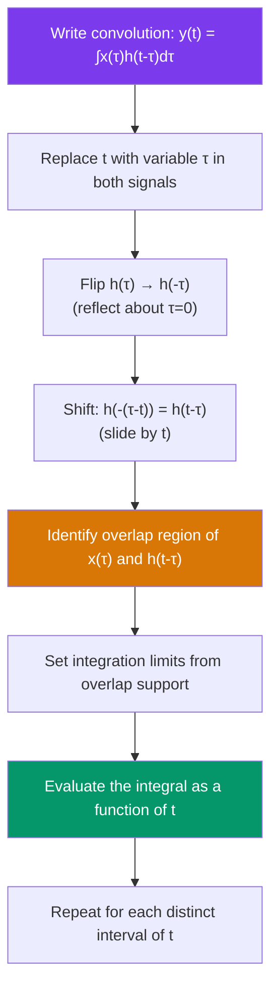

# 🔄 Continuous-Time Convolution

> [!abstract] TL;DR
> The convolution integral $y(t) = (x * h)(t) = \int_{-\infty}^{\infty} x(\tau)\,h(t-\tau)\,d\tau$ computes the output of any CT LTI system given input $x(t)$ and impulse response $h(t)$. The graphical "flip-and-slide" procedure makes the integration limits visible, and the algebraic properties (commutativity, associativity, distributivity) enable cascade and parallel system simplification.

## Intuition — analogy FIRST

Imagine computing the total sunlight accumulated in a greenhouse at time $t$. The sun intensity at time $\tau$ is $x(\tau)$, and the glass transmits heat with a decay profile $h(t-\tau)$ (older sunlight has partially dissipated by time $t$). The total warmth at time $t$ is the integral of all past sunlight weighted by how much of that old heat remains — that is convolution. The key insight is that you **flip** $h$ (looking backward in time from the current instant) and **slide** it across $x$ as $t$ advances.

---

## How It Works



---

## Key Concepts / Details

### Formal Definition

$$y(t) = (x * h)(t) \triangleq \int_{-\infty}^{\infty} x(\tau)\,h(t-\tau)\,d\tau$$

The dummy variable of integration is $\tau$; $t$ is the free variable (the output time index).

### Graphical (Flip-and-Slide) Procedure

1. **Write both signals as functions of $\tau$**: $x(\tau)$ and $h(\tau)$.
2. **Flip** $h$: form $h(-\tau)$ (reflect about $\tau = 0$).
3. **Shift**: form $h(t-\tau) = h(-((\tau-t)))$, i.e., slide the flipped $h$ by $t$ to the right.
4. **Identify support overlap**: determine the range of $\tau$ where both $x(\tau)$ and $h(t-\tau)$ are nonzero simultaneously.
5. **Integrate** over the overlap region; the limits depend on $t$.
6. **Partition the $t$-axis** into intervals where the overlap region changes (breakpoints occur when edges of one signal align with edges of the other).

### Algebraic Properties

| Property | Statement |
|----------|-----------|
| **Commutativity** | $x * h = h * x$ |
| **Associativity** | $(x * h_1) * h_2 = x * (h_1 * h_2)$ |
| **Distributivity** | $x * (h_1 + h_2) = x*h_1 + x*h_2$ |
| **Shift** | $x(t-t_1) * h(t-t_2) = y(t-t_1-t_2)$ |
| **Impulse identity** | $x * \delta = x$ |
| **Shifted impulse** | $x * \delta(t-T) = x(t-T)$ |
| **Duration** | If $x$ has duration $D_1$ and $h$ has duration $D_2$, then $y$ has duration $D_1 + D_2$ |

**Cascade of systems**: commutativity and associativity mean two LTI systems in cascade can be swapped or merged:

$$x \to \boxed{h_1(t)} \to \boxed{h_2(t)} \to y \equiv x \to \boxed{h_1*h_2} \to y$$

**Parallel systems**: distributivity means two LTI branches sum to a single system:

$$y = x*h_1 + x*h_2 = x*(h_1+h_2)$$

---

### Worked Example 1: $\text{rect} * \text{rect}$ → Triangle

Let $x(t) = h(t) = \text{rect}(t) = u(t+\tfrac{1}{2}) - u(t-\tfrac{1}{2})$ (a pulse of width 1, centered at 0).

**Supports**: $x(\tau) \neq 0$ for $-\tfrac{1}{2} \leq \tau \leq \tfrac{1}{2}$; $h(t-\tau) \neq 0$ for $t - \tfrac{1}{2} \leq \tau \leq t + \tfrac{1}{2}$.

**Overlap** depends on $t$:

| Range of $t$ | Overlap | $y(t) = \int_{\text{overlap}} 1\,d\tau$ |
|---|---|---|
| $t < -1$ | None | $0$ |
| $-1 \leq t \leq 0$ | $[-\tfrac{1}{2},\; t+\tfrac{1}{2}]$ | $t + 1$ |
| $0 < t \leq 1$ | $[t-\tfrac{1}{2},\; \tfrac{1}{2}]$ | $1 - t$ |
| $t > 1$ | None | $0$ |

Result: $y(t) = \Lambda(t) = \max(1 - |t|, 0)$, a **triangle** of height 1, base $[-1, 1]$.

This demonstrates the duration rule: two rect pulses of width 1 convolve to a triangle of width 2.

---

### Worked Example 2: Exponential $*$ Rect

Let $x(t) = e^{-at}u(t)$ (causal decaying exponential, $a>0$) and $h(t) = u(t) - u(t-T)$ (rect pulse of duration $T$).

The causal forms restrict the integration:

$$y(t) = \int_0^{\min(t,T)} e^{-a(t-\tau)}\,d\tau$$

For $0 \leq t < T$:

$$y(t) = e^{-at}\int_0^{t} e^{a\tau}\,d\tau = e^{-at}\cdot\frac{e^{at}-1}{a} = \frac{1-e^{-at}}{a}$$

For $t \geq T$:

$$y(t) = e^{-at}\int_0^{T} e^{a\tau}\,d\tau = \frac{e^{-a(t-T)} - e^{-at}}{a} = \frac{e^{-at}(e^{aT}-1)}{a}$$

---

### Python: scipy Convolution

```python
import numpy as np
import matplotlib.pyplot as plt
from scipy.signal import convolve

dt = 1e-3
t = np.arange(-2, 4, dt)

# Example 1: rect * rect = triangle
rect = ((np.abs(t) <= 0.5)).astype(float)
triangle = convolve(rect, rect, mode='full') * dt
t_tri = np.arange(len(triangle)) * dt + 2 * t[0]

# Example 2: decaying exponential * rect
a = 2.0
T_rect = 1.0
exp_sig = np.exp(-a * t) * (t >= 0)
rect2 = ((t >= 0) & (t < T_rect)).astype(float)
y_conv = convolve(exp_sig, rect2, mode='full') * dt
t_conv = np.arange(len(y_conv)) * dt + 2 * t[0]

fig, axes = plt.subplots(1, 2, figsize=(12, 4))
axes[0].plot(t_tri, triangle, label="rect * rect")
axes[0].set_title("rect(t) * rect(t) = triangle"); axes[0].grid(True); axes[0].legend()

axes[1].plot(t_conv, y_conv, label="exp * rect")
axes[1].set_title(f"e^(-{a}t)u(t) * rect_T(t)"); axes[1].grid(True); axes[1].legend()

plt.tight_layout(); plt.show()

# Verify duration rule: support of rect is [-0.5, 0.5], width 1; rect*rect width = 2
nonzero = t_tri[np.abs(triangle) > 1e-3]
print(f"Triangle support: [{nonzero[0]:.2f}, {nonzero[-1]:.2f}]  (expected [-1, 1])")
```

---

## Real-World Notes

- **Audio equalization**: a digital equalizer is an LTI filter; its output at any time is the convolution of the audio input with the filter's impulse response.
- **MRI image reconstruction**: k-space data is related to the image by Fourier convolution theorems — efficient convolution is central to fast MRI.
- **Matched filter in radar**: the optimal radar receiver convolves the received signal with $h(t) = x^*(-t)$; convolution with a time-reversed signal is cross-correlation.
- **Convolution reverb** in music production: the dry audio signal is convolved with the impulse response of a physical space to simulate reverberation.
- **Duration rule in practice**: convolving an $N$-point FIR filter with an $M$-sample audio clip produces $N+M-1$ output samples — important for buffer sizing.

---

## Common Pitfalls

- **Forgetting to flip**: the integrand is $h(t-\tau)$, not $h(\tau)$. In the flip-and-slide method, you flip $h(\tau)$ to get $h(-\tau)$, then slide. Computing $\int x(\tau)h(\tau)d\tau$ (without the flip) gives cross-correlation, not convolution.
- **Wrong integration limits**: always derive limits from the support of the overlap. The most common error is using $[0, t]$ without checking whether $h$ or $x$ restricts the overlap further.
- **Off-by-$dt$ errors numerically**: discrete convolution accumulates as $\sum \cdot \Delta\tau$, not just $\sum$. Always multiply the sum by $dt$ for correct amplitude scaling.
- **Duration rule sign errors**: two causal signals with finite durations $D_1$ and $D_2$ produce output of duration $D_1 + D_2$, starting at the sum of their start times.
- **Confusing convolution with correlation**: convolution is $\int x(\tau)h(t-\tau)d\tau$ (flip+slide); cross-correlation is $\int x(\tau)h(\tau-t)d\tau$ (slide without flip). `np.correlate` does correlation; `scipy.signal.convolve` does convolution.

---

## Related Concepts

- [[Impulse_Response]] — Convolution is the mechanism that uses $h(t)$ to compute $y(t)$
- [[System_Properties]] — LTI property is the prerequisite for convolution to apply
- [[BIBO_Stability]] — $\int|h(\tau)|d\tau < \infty$ connects stability to convolution boundedness
- [[CT_Signals]] — Rect, impulse, and exponential signals are the standard convolution examples

---

## Review Questions

1. Use the flip-and-slide method to compute $(u(t)) * (e^{-2t}u(t))$ analytically. Check your answer by noting the result should equal the step response of an RC system with time constant $1/2$.
2. Two LTI systems $h_1(t) = e^{-t}u(t)$ and $h_2(t) = e^{-2t}u(t)$ are placed in cascade. What is the equivalent single-system impulse response?
3. Prove that $x(t) * \delta(t - T) = x(t-T)$ directly from the convolution integral definition.

---

## Sources

- Oppenheim & Willsky, *Signals and Systems*, 2nd ed., Ch. 2
- Haykin & Van Veen, *Signals and Systems*, 2nd ed., Ch. 2
- McClellan, Schafer & Yoder, *DSP First*, 2nd ed., Ch. 5

#signals-and-systems #ct-signals #intermediate
