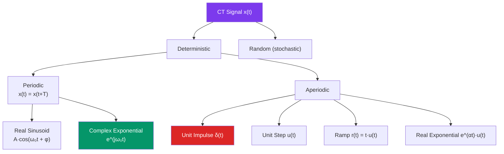

# 📶 Continuous-Time Signals

> [!abstract] TL;DR
> A continuous-time signal is a function $x(t)$ defined for all $t \in \mathbb{R}$. The elementary building blocks — unit impulse $\delta(t)$, unit step $u(t)$, ramp $r(t)$, sinusoid, and complex exponential — recur throughout signals and systems. Every signal can be classified by energy or power, and decomposed into even and odd parts.

## Intuition — analogy FIRST

Think of signals as the vocabulary of a language, and systems as grammar rules that transform sentences. Before writing any prose you must know individual words: the impulse is a "punctuation mark" that lasts an infinitesimal moment with unit area; the step is a light switch that flips on and stays on; the sinusoid is a steady rhythm like a metronome. Just as every sentence is built from letters, every signal fed into a system can be decomposed into shifted, scaled copies of these primitive signals.

---

## How It Works



---

## Key Concepts / Details

### Unit Impulse $\delta(t)$

The Dirac delta is not a classical function but a **distribution** defined by its sifting property:

$$\int_{-\infty}^{\infty} x(t)\,\delta(t - t_0)\,dt = x(t_0)$$

Properties:
- $\delta(t) = 0$ for $t \neq 0$ and $\int_{-\infty}^{\infty} \delta(t)\,dt = 1$
- Units: $[\delta(t)] = \text{time}^{-1}$ (so that the integral is dimensionless)
- Scaling: $\delta(at) = \frac{1}{|a|}\delta(t)$
- Approximation: $\delta(t) \approx \frac{1}{\Delta}\,\text{rect}\!\left(\frac{t}{\Delta}\right)$ as $\Delta \to 0$

Relation to unit step: $\delta(t) = \dfrac{d}{dt}u(t)$

### Unit Step $u(t)$

$$u(t) = \begin{cases} 1 & t > 0 \\ \frac{1}{2} & t = 0 \\ 0 & t < 0 \end{cases}$$

Relation to ramp: $u(t) = \dfrac{d}{dt}r(t)$, and $r(t) = \int_{-\infty}^{t} u(\tau)\,d\tau = t\,u(t)$

### Real Sinusoid

$$x(t) = A\cos(\omega_0 t + \phi)$$

- Amplitude $A$, angular frequency $\omega_0 = 2\pi f_0$ (rad/s), phase $\phi$ (rad)
- Period $T_0 = 1/f_0 = 2\pi/\omega_0$
- A power signal: $P = A^2/2$

### Complex Exponential

$$x(t) = e^{st}, \quad s = \sigma + j\omega \in \mathbb{C}$$

| $\sigma$ | Behavior |
|----------|----------|
| $\sigma < 0$ | Decaying oscillation (stable) |
| $\sigma = 0$ | Pure sinusoid $e^{j\omega t}$ |
| $\sigma > 0$ | Growing oscillation (unstable) |

Euler's formula: $e^{j\omega_0 t} = \cos(\omega_0 t) + j\sin(\omega_0 t)$

The complex exponential is the **eigenfunction of LTI systems**: if $x(t) = e^{st}$, then $y(t) = H(s)\,e^{st}$ where $H(s)$ is the system's transfer function.

### Energy and Power Signals

| Quantity | Definition | When Finite |
|----------|------------|-------------|
| Energy $E_x$ | $\int_{-\infty}^{\infty}\|x(t)\|^2\,dt$ | Energy signal |
| Power $P_x$ | $\lim_{T\to\infty}\frac{1}{2T}\int_{-T}^{T}\|x(t)\|^2\,dt$ | Power signal |

- A signal is an **energy signal** if $0 < E_x < \infty$ (then $P_x = 0$).
- A signal is a **power signal** if $0 < P_x < \infty$ (then $E_x = \infty$).
- A signal cannot be both simultaneously. The unit step is a power signal ($P = 1/2$). A decaying exponential $e^{-at}u(t)$, $a>0$ is an energy signal.

### Even/Odd Decomposition

Every signal decomposes uniquely into an even part and an odd part:

$$x_e(t) = \frac{x(t) + x(-t)}{2}, \qquad x_o(t) = \frac{x(t) - x(-t)}{2}$$

Verification: $x(t) = x_e(t) + x_o(t)$, $x_e(-t)=x_e(t)$, $x_o(-t)=-x_o(t)$

### Signal Transformations

Given $x(t)$, the three basic transformations are:

| Operation | Formula | Effect |
|-----------|---------|--------|
| Time shift | $x(t - t_0)$ | Delay ($t_0>0$) or advance ($t_0<0$) |
| Time reversal | $x(-t)$ | Flip about $t=0$ |
| Time scaling | $x(at)$ | Compress ($\|a\|>1$) or expand ($\|a\|<1$) |

Combined: $x(at - b)$ — scale first, then shift by $b/a$.

### Python: Constructing Elementary Signals

```python
import numpy as np
import matplotlib.pyplot as plt

dt = 1e-4
t = np.arange(-2, 4, dt)

# Unit step
u = (t >= 0).astype(float)

# Unit ramp
r = t * u

# Approximate impulse (rect with unit area)
delta_width = 0.01
delta = ((np.abs(t) < delta_width / 2) / delta_width).astype(float)

# Real sinusoid
f0 = 1.0  # Hz
x_sin = np.cos(2 * np.pi * f0 * t)

# Decaying complex exponential (alpha < 0)
alpha = -1.5
omega0 = 2 * np.pi * f0
x_cexp = np.exp((alpha + 1j * omega0) * t) * u

fig, axes = plt.subplots(2, 3, figsize=(14, 6))
for ax, sig, label in zip(axes.flat,
    [delta, u, r, x_sin, np.real(x_cexp), np.imag(x_cexp)],
    ["δ(t) approx", "u(t)", "r(t)", "cos(2πt)", "Re{e^(st)}·u(t)", "Im{e^(st)}·u(t)"]):
    ax.plot(t, sig); ax.set_title(label); ax.set_xlim(-1, 3); ax.grid(True)
plt.tight_layout(); plt.show()

# Energy of decaying exponential e^{-at}u(t), a > 0
a = 1.5
E = np.trapz(np.exp(-2 * a * t) * u, t)
print(f"Numerical energy: {E:.4f}, Analytical: {1/(2*a):.4f}")
```

---

## Real-World Notes

- **AC voltage** is modeled as a real sinusoid: $v(t) = 170\cos(2\pi \cdot 60\,t)$ V (US mains, 120 V RMS).
- **RC circuit transient response** is a decaying real exponential $e^{-t/RC}$, the impulse response of a first-order system.
- **Radar pulse**: a rect function models an idealized transmitted pulse; the echo is a delayed, attenuated version.
- **The complex exponential** $e^{j\omega t}$ is the eigenfunction of every LTI system — it passes through unchanged in shape, only scaled by $H(j\omega)$. This is why Fourier analysis is so powerful.
- **Impulsive forces** in mechanics (a hammer strike) are modeled by $F\,\delta(t)$; their strength is their impulse $\int F\,dt$, not their peak amplitude.

---

## Common Pitfalls

- **$\delta(t)$ has units of $\text{time}^{-1}$**: $\int \delta(t)\,dt = 1$ (dimensionless), so $\delta(t)$ itself carries inverse-time units. Forgetting this causes unit errors.
- **Energy vs. power confusion**: Periodic signals (sinusoids) are power signals, not energy signals. The unit step is a power signal. A finite-duration pulse is an energy signal.
- **Time scaling order**: $x(2t-3)$ means scale first (compress by 2), then shift by $3/2$, not shift by 3. The shift in $t$ is $b/a$ after factoring $x(a(t - b/a))$.
- **$\delta(t) \neq 0$ at $t=0$**: $\delta(t)$ is not a conventional function; writing $\delta(0) = \infty$ is informal shorthand. Only integrals of $\delta$ against test functions are rigorously defined.
- **Confusing $e^{j\omega_0 t}$ with $\cos(\omega_0 t)$**: the complex exponential is a 2D helix in the complex plane; the cosine is its real projection only.

---

## Related Concepts

- [[System_Properties]] — These signals are used as test inputs to identify system properties
- [[Impulse_Response]] — $\delta(t)$ is the defining input for the impulse response
- [[CT_Convolution]] — Convolution decomposes any input into a continuum of weighted impulses
- [[BIBO_Stability]] — Energy/power classification connects to boundedness conditions

---

## Review Questions

1. Verify using the sifting property that $\int_{-\infty}^{\infty} \cos(t)\,\delta(t - \pi/4)\,dt = \cos(\pi/4)$.
2. Is $x(t) = e^{-|t|}$ an energy signal or a power signal? Compute its energy analytically.
3. Find the even and odd parts of $x(t) = e^{-2t}u(t)$ and sketch both.

---

## Sources

- Oppenheim & Willsky, *Signals and Systems*, 2nd ed., Ch. 1
- Haykin & Van Veen, *Signals and Systems*, 2nd ed., Ch. 1
- Proakis & Manolakis, *Digital Signal Processing*, 4th ed., Ch. 1

#signals-and-systems #ct-signals #beginner
