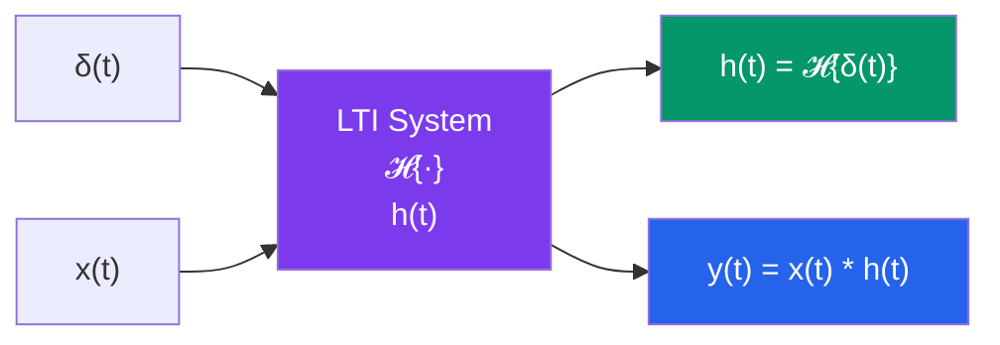

# 🔁 Impulse Response of CT LTI Systems

> [!abstract] TL;DR
> The impulse response $h(t) = \mathcal{H}\{\delta(t)\}$ completely characterizes any LTI system. Because any input can be represented as a superposition of weighted, shifted impulses, the output is the corresponding superposition of weighted, shifted copies of $h(t)$ — yielding the convolution integral $y(t) = \int_{-\infty}^{\infty} x(\tau)\,h(t-\tau)\,d\tau$.

## Intuition — analogy FIRST

Imagine you want to understand the acoustics of a concert hall. Instead of measuring its response to every possible piece of music — an infinite task — you fire a single starter pistol (an approximate impulse) and record the echo. That recording is the impulse response $h(t)$: the hall's "fingerprint." Now, for any piece of music $x(t)$, the sound heard in the hall is just $x(t)$ convolved with $h(t)$ — the music filtered through the hall's echo. A single measurement characterizes the hall completely, because the hall is linear (each frequency is scaled independently) and time-invariant (it works the same Tuesday or Thursday).

---

## How It Works



---

## Key Concepts / Details

### Derivation: Why $h(t)$ Characterizes the System

**Step 1 — Represent $x(t)$ as a superposition of impulses.**

Using the sifting property:

$$x(t) = \int_{-\infty}^{\infty} x(\tau)\,\delta(t-\tau)\,d\tau$$

This is not a manipulation — it is simply the definition of the Dirac delta: $x(t)$ is a weighted integral of shifted impulses, with weight $x(\tau)$ at location $\tau$.

**Step 2 — Apply $\mathcal{H}$ and use linearity + time-invariance.**

$$y(t) = \mathcal{H}\!\left\{\int_{-\infty}^{\infty} x(\tau)\,\delta(t-\tau)\,d\tau\right\}$$

By linearity (the integral is a limiting sum), $\mathcal{H}$ passes inside:

$$y(t) = \int_{-\infty}^{\infty} x(\tau)\,\mathcal{H}\!\left\{\delta(t-\tau)\right\}d\tau$$

By time-invariance, $\mathcal{H}\{\delta(t-\tau)\} = h(t-\tau)$. Therefore:

$$\boxed{y(t) = \int_{-\infty}^{\infty} x(\tau)\,h(t-\tau)\,d\tau = (x * h)(t)}$$

This is the **convolution integral** — the central result of LTI theory.

### Step Response

The **step response** $s(t)$ is the output to a unit step input $u(t)$:

$$s(t) = \int_{-\infty}^{\infty} u(\tau)\,h(t-\tau)\,d\tau = \int_{-\infty}^{t} h(\tau)\,d\tau$$

Equivalently: $s(t) = \int_{-\infty}^{t} h(\tau)\,d\tau$, and therefore:

$$h(t) = \frac{d}{dt}s(t)$$

The step response completely determines $h(t)$ (differentiate it), and vice versa (integrate it).

### Causal LTI Systems

For a causal LTI system, $h(t) = 0$ for $t < 0$. The convolution integral simplifies to:

$$y(t) = \int_{0}^{\infty} h(\tau)\,x(t-\tau)\,d\tau = \int_{-\infty}^{t} x(\tau)\,h(t-\tau)\,d\tau$$

This expresses the output as a weighted average of past inputs — the causal form.

### Connection to Differential Equations

An $N$th-order CT LTI system is often described by a constant-coefficient ODE:

$$\sum_{k=0}^{N} a_k \frac{d^k y}{dt^k} = \sum_{k=0}^{M} b_k \frac{d^k x}{dt^k}$$

Taking the Laplace transform: $Y(s) = H(s)\,X(s)$, where

$$H(s) = \frac{\sum_{k=0}^{M} b_k s^k}{\sum_{k=0}^{N} a_k s^k}$$

is the **transfer function**. The impulse response $h(t)$ is the inverse Laplace transform of $H(s)$.

### RC Circuit Example

For an RC lowpass filter (input $V_{in}$, output $V_C$, time constant $\tau = RC$):

$$H(s) = \frac{1/\tau}{s + 1/\tau} \implies h(t) = \frac{1}{\tau}e^{-t/\tau}\,u(t)$$

The impulse response is a causal, decaying exponential. Its step response:

$$s(t) = \left(1 - e^{-t/\tau}\right)u(t)$$

### Key Properties of $h(t)$

| Property | Condition on $h(t)$ |
|----------|---------------------|
| Causal | $h(t) = 0, \; t < 0$ |
| BIBO Stable | $\int_{-\infty}^{\infty}\|h(\tau)\|\,d\tau < \infty$ |
| Memoryless | $h(t) = c\,\delta(t)$ |
| Lossless (allpass) | $\int_{-\infty}^{\infty}\|h(t)\|^2 dt = 1$ (in appropriate sense) |

### Python: Step Response from Impulse Response

```python
import numpy as np
import matplotlib.pyplot as plt
from scipy.signal import lti, impulse, step

# RC lowpass: H(s) = (1/tau) / (s + 1/tau)
tau = 0.5  # seconds
sys = lti([1/tau], [1, 1/tau])

t_imp, h_t = impulse(sys, T=np.linspace(0, 5, 1000))
t_step, s_t = step(sys, T=np.linspace(0, 5, 1000))

# Verify: numerical integral of h(t) ≈ s(t)
dt = t_imp[1] - t_imp[0]
s_numerical = np.cumsum(h_t) * dt  # cumulative sum approximates integration

fig, axes = plt.subplots(1, 3, figsize=(14, 4))
axes[0].plot(t_imp, h_t); axes[0].set_title("Impulse Response h(t)"); axes[0].grid(True)
axes[1].plot(t_step, s_t, label="Analytical"); axes[1].plot(t_imp, s_numerical, '--', label="Numerical ∫h")
axes[1].set_title("Step Response s(t)"); axes[1].legend(); axes[1].grid(True)
axes[2].plot(t_imp, np.gradient(s_t, t_step), label="ds/dt ≈ h(t)")
axes[2].set_title("d/dt[s(t)] ≈ h(t)"); axes[2].grid(True)
plt.tight_layout(); plt.show()

print(f"∫|h(t)|dt = {np.trapz(np.abs(h_t), t_imp):.4f}  (< ∞ → BIBO stable)")
```

---

## Real-World Notes

- **System identification**: fire a near-impulse (short electrical pulse, acoustic click) into an unknown system and record the output to measure $h(t)$. Used in room acoustics, equalizer design, and econometrics.
- **RC circuit**: the impulse response $h(t) = (1/RC)e^{-t/(RC)}u(t)$ is an exponential decay with time constant $RC$. Faster $RC$ → wider bandwidth.
- **Convolution reverb** (digital audio): the impulse response of a physical space (cathedral, concert hall) is captured and convolved with dry audio to simulate that acoustic environment.
- **MRI machines** use $h(t)$ characterization to calibrate gradient coils for image reconstruction.
- **Matched filter** in radar: the optimal receiver filter has impulse response $h(t) = x^*(-t)$, the time-reversed conjugate of the transmitted pulse.

---

## Common Pitfalls

- **$h(t)$ is not $y(t)$**: $h(t)$ is the output only when the input is $\delta(t)$. For any other input, you must convolve.
- **Linearity AND time-invariance are both required**: computing $y(t) = x * h$ is only valid for LTI systems. A time-varying system has a two-variable kernel $h(t, \tau) \neq h(t-\tau)$.
- **Forgetting initial conditions**: the impulse response derivation assumes a system initially at rest (zero-state). Non-zero initial conditions add a zero-input response term.
- **Step response differentiation**: $h(t) = ds/dt$ only if $s(t)$ is differentiable everywhere. If the step response has a jump discontinuity, an impulse appears in $h(t)$.
- **Confusing $h(t)$ with $H(s)$**: $H(s)$ is the Laplace transform of $h(t)$, not $h(t)$ itself.

---

## Related Concepts

- [[CT_Signals]] — $\delta(t)$ is the defining input
- [[System_Properties]] — LTI property is prerequisite for $h(t)$ characterization
- [[CT_Convolution]] — Full treatment of the convolution integral
- [[BIBO_Stability]] — Stability condition in terms of $h(t)$

---

## Review Questions

1. Derive the convolution integral $y(t) = \int x(\tau)h(t-\tau)d\tau$ from first principles using only linearity and time-invariance.
2. An LTI system has $h(t) = e^{-3t}u(t)$. Find the step response $s(t)$ analytically, then verify $h(t) = ds/dt$.
3. Can a memoryless system have a non-trivial impulse response? What form must $h(t)$ take?

---

## Sources

- Oppenheim & Willsky, *Signals and Systems*, 2nd ed., Ch. 2
- Haykin & Van Veen, *Signals and Systems*, 2nd ed., Ch. 2
- Lathi & Ding, *Modern Digital and Analog Communication Systems*, 4th ed., Ch. 2

#signals-and-systems #ct-signals #intermediate
