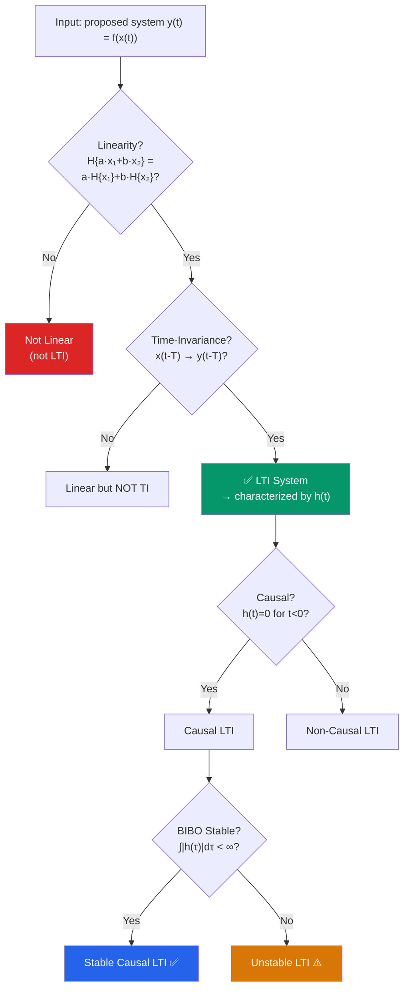

# ⚙️ System Properties

> [!abstract] TL;DR
> A system maps an input signal $x(t)$ to an output $y(t) = \mathcal{H}\{x(t)\}$. The five key properties — linearity, time-invariance, causality, BIBO stability, and memorylessness — determine what mathematical tools apply and how a system behaves. A system that is both linear and time-invariant (LTI) can be completely characterized by its impulse response $h(t)$.

## Intuition — analogy FIRST

Think of a system as a recipe. **Linearity** says: if you double every ingredient the dish doubles in size (homogeneity), and if you combine two recipes the combined result equals cooking them separately then mixing (additivity). **Time-invariance** says: the recipe works the same whether you cook it on Monday or Friday — the laws of physics do not change with the calendar. **Causality** says: you cannot taste the soup before you've added the salt. **Stability** says: a small bounded input shouldn't blow up into an infinitely large output. **Memorylessness** says: the output right now depends only on the input right now, not on anything that happened yesterday.

---

## How It Works

---

## Key Concepts / Details

### 1. Linearity

A system $\mathcal{H}$ is **linear** if it satisfies the **superposition principle**:

$$\mathcal{H}\{a\,x_1(t) + b\,x_2(t)\} = a\,\mathcal{H}\{x_1(t)\} + b\,\mathcal{H}\{x_2(t)\}$$

for all inputs $x_1, x_2$ and all scalars $a, b \in \mathbb{C}$.

**Test procedure:**
1. Compute $y_1 = \mathcal{H}\{x_1\}$ and $y_2 = \mathcal{H}\{x_2\}$.
2. Compute $y_3 = \mathcal{H}\{a x_1 + b x_2\}$ directly.
3. Check if $y_3 = a y_1 + b y_2$.

> [!tip] Shortcut for failure
> If $\mathcal{H}\{0\} \neq 0$, the system is NOT linear (a zero input must produce a zero output in any linear system).

### 2. Time-Invariance (TI)

A system is **time-invariant** if a time shift in the input produces an identical time shift in the output:

$$x(t) \to y(t) \implies x(t-T) \to y(t-T), \quad \forall T \in \mathbb{R}$$

**Test procedure:**
1. Find $y(t) = \mathcal{H}\{x(t)\}$.
2. Replace $x(t)$ with $x(t-T)$; call the result $y_1(t)$.
3. Compute $y_2(t) = y(t-T)$ by shifting the original output.
4. If $y_1(t) = y_2(t)$ for all $T$, the system is TI.

### 3. Causality

A system is **causal** if the output at time $t_0$ depends only on the input for $t \leq t_0$:

$$y(t_0) = F\!\left[\{x(t),\, t \leq t_0\}\right]$$

For an LTI system: **causal $\iff$ $h(t) = 0$ for $t < 0$.**

Non-causal systems are physically unrealizable in real-time but appear in offline/batch signal processing (e.g., zero-phase digital filters applied to recorded audio).

### 4. BIBO Stability

A system is **BIBO (Bounded Input, Bounded Output) stable** if every bounded input produces a bounded output:

$$|x(t)| \leq M_x < \infty \;\forall t \implies |y(t)| \leq M_y < \infty \;\forall t$$

For CT LTI: **BIBO stable $\iff$ $\int_{-\infty}^{\infty} |h(\tau)|\,d\tau < \infty$** (see [[BIBO_Stability]]).

### 5. Memorylessness

A system is **memoryless** (or **instantaneous**) if $y(t)$ depends only on $x(t)$ at that same instant:

$$y(t) = f(x(t), t)$$

A memoryless system has $h(t) = c\,\delta(t)$ for some constant $c$.

---

### Summary Table

| Property | Mathematical Test | Example (Passes) | Example (Fails) |
|----------|------------------|------------------|-----------------|
| Linearity | $\mathcal{H}\{ax_1+bx_2\}=ay_1+by_2$ | $y = 3x(t)$ | $y = x^2(t)$ |
| Time-Invariance | $\mathcal{H}\{x(t-T)\}=y(t-T)$ | $y = x(t-2)$ | $y = t\cdot x(t)$ |
| Causality | $h(t)=0$ for $t<0$ | $y = x(t-1)$ | $y = x(t+1)$ |
| BIBO Stability | $\int\|h\|<\infty$ | $y = e^{-t}x(t-\tau)$ via RC | $y = \int_{-\infty}^{t}x(\tau)d\tau$ (pure integrator) |
| Memoryless | $y(t)$ depends only on $x(t)$ | $y = 5x(t)$ | $y = x(t-1)$ |

---

### Worked Examples

**Example 1:** $y(t) = t\cdot x(t)$

- *Linear?* $\mathcal{H}\{ax_1+bx_2\} = t(ax_1+bx_2) = a(tx_1) + b(tx_2)$ ✓ Linear
- *Time-invariant?* Apply input $x(t-T)$: output is $t\cdot x(t-T)$. Shift original output: $y(t-T) = (t-T)\cdot x(t-T)$. Since $t \neq t-T$, **NOT time-invariant**. The gain changes with time.

**Example 2:** $y(t) = x(t-2)$

- *Linear?* $\mathcal{H}\{ax_1+bx_2\} = ax_1(t-2)+bx_2(t-2)$ ✓ Linear
- *Time-invariant?* Apply $x(t-T)$: output $x(t-T-2)$. Shift original: $y(t-T) = x(t-T-2)$ ✓ TI
- *Causal?* Output at $t$ depends on $x(t-2)$, past input only ✓ Causal
- *Memoryless?* Depends on $x(t-2)$, not $x(t)$ — has memory ✗

**Example 3:** $y(t) = x^2(t)$

- *Linear?* $\mathcal{H}\{x_1+x_2\} = (x_1+x_2)^2 = x_1^2 + 2x_1 x_2 + x_2^2 \neq y_1+y_2$ ✗ **Not linear**
- The cross-term $2x_1 x_2$ breaks superposition.

**Example 4:** $y(t) = \int_{-\infty}^{t} x(\tau)\,d\tau$ (pure integrator)

- Linear ✓, Time-invariant ✓, Causal ✓
- BIBO stable? $h(t) = u(t)$, and $\int_0^{\infty} 1\,d\tau = \infty$ ✗ **Not BIBO stable**. A DC step $x(t)=u(t)$ produces a ramp output that grows without bound.

---

## Real-World Notes

- **Audio equalizers** are linear TI systems — they reshape the frequency spectrum without distorting the amplitude in a signal-dependent way.
- **A diode** is memoryless but nonlinear — output depends only on current input, but the relationship is exponential.
- **An RLCG transmission line** is LTI, causal, and BIBO stable when properly terminated.
- **Time-varying amplifier gain** (e.g., AGC — Automatic Gain Control) is linear but NOT time-invariant; standard LTI Fourier methods do not apply directly.
- **Zero-phase filters** in offline audio mastering are non-causal LTI; they process the whole recording before playback.

---

## Common Pitfalls

- **Time-varying $\neq$ nonlinear**: $y = t\cdot x(t)$ is linear but not TI. These are independent properties.
- **Zero-input test**: if $x(t)=0$ gives $y(t)\neq 0$ (e.g., $y=x(t)+1$), the system is definitely non-linear.
- **Checking TI**: you must show $y_1(t) = y_2(t)$ symbolically for *all* $T$, not just for specific values.
- **Causality vs. stability**: a causal system need not be stable (e.g., $h(t) = e^{t}u(t)$), and a stable system need not be causal.
- **Memoryless $\implies$ causal** (trivially), but causal does NOT imply memoryless.

---

## Related Concepts

- [[CT_Signals]] — Test signals (impulse, step) used to probe system properties
- [[Impulse_Response]] — LTI systems are characterized by $h(t)$
- [[CT_Convolution]] — The input-output relation for any LTI system
- [[BIBO_Stability]] — In-depth treatment of the stability condition

---

## Review Questions

1. Show that $y(t) = \mathcal{Re}\{x(t)\}$ is NOT linear over $\mathbb{C}$ (hint: try scaling by $j$).
2. Is $y(t) = x(2t)$ time-invariant? Prove your answer with the shift test.
3. A system has $h(t) = e^{-2t}u(t) - e^{-3t}u(t)$. Is it causal? Is it BIBO stable?

---

## Sources

- Oppenheim & Willsky, *Signals and Systems*, 2nd ed., Ch. 1
- Lathi & Ding, *Modern Digital and Analog Communication Systems*, 4th ed., Ch. 1
- Proakis & Manolakis, *Digital Signal Processing*, 4th ed., Ch. 2

#signals-and-systems #ct-signals #beginner
