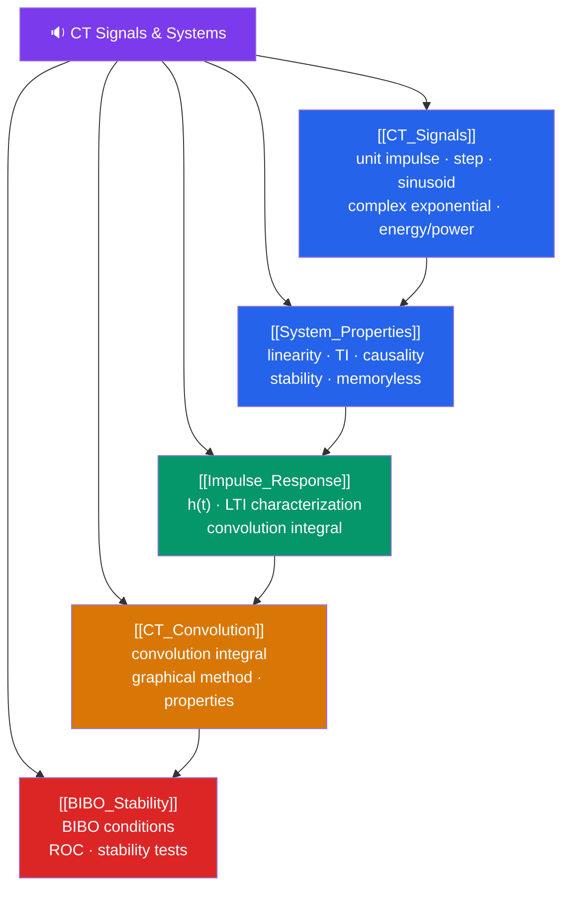

# 🗺️ Continuous-Time Signals and Systems — Map of Content

> [!abstract] What This Section Covers
> This section builds the foundation of continuous-time (CT) LTI (Linear Time-Invariant) systems analysis. You will master the elementary signal building blocks (impulse, step, ramp, sinusoid, complex exponential), understand the key properties that make a system LTI (linearity, time-invariance, causality, stability, memorylessness), and learn to characterize any LTI system completely by its impulse response. The central operation is **convolution** — the mathematical engine that computes any LTI system output from its impulse response and any input. Mastery here is prerequisite for all frequency-domain analysis in later sections.

## Concept Map

## Learning Path

1. [[CT_Signals]] — Elementary CT signals, energy vs power, even/odd decomposition.
2. [[System_Properties]] — Linearity, time-invariance, causality, stability, memorylessness.
3. [[Impulse_Response]] — The impulse response h(t) and LTI system characterization.
4. [[CT_Convolution]] — Convolution integral: definition, graphical method, algebraic properties.
5. [[BIBO_Stability]] — BIBO stability, condition on h(t), and stability implications.

## All Notes at a Glance

| Note | Difficulty | What You'll Learn |
|------|------------|-------------------|
| [[CT_Signals]] | Beginner | Unit impulse δ(t), unit step u(t), sinusoids, complex exponentials, energy and power signals |
| [[System_Properties]] | Beginner | Linearity, time-invariance, causality, stability, memorylessness — with precise mathematical tests |
| [[Impulse_Response]] | Intermediate | h(t) definition, why it completely characterizes an LTI system, superposition integral |
| [[CT_Convolution]] | Intermediate | Convolution integral, flip-and-slide graphical method, commutativity/associativity/distributivity |
| [[BIBO_Stability]] | Intermediate | BIBO stability condition (absolute integrability of h(t)), implications for system design |

## Key Questions This Section Answers

- What is the mathematical difference between the unit impulse and the unit step?
- How do you test whether a system is linear AND time-invariant?
- Why does knowing h(t) completely determine an LTI system's response to any input?
- How do you compute a convolution integral graphically?
- What is the necessary and sufficient condition for a CT LTI system to be BIBO stable?

## Related Sections

- [[_MOC_SS_Master|↑ Signals and Systems Master MOC]]
- [[_MOC_Fourier_Analysis|→ Fourier Analysis]]
- [[_MOC_Laplace_Transform|→ Laplace Transform]]

#MOC #signals-and-systems #ct-signals
