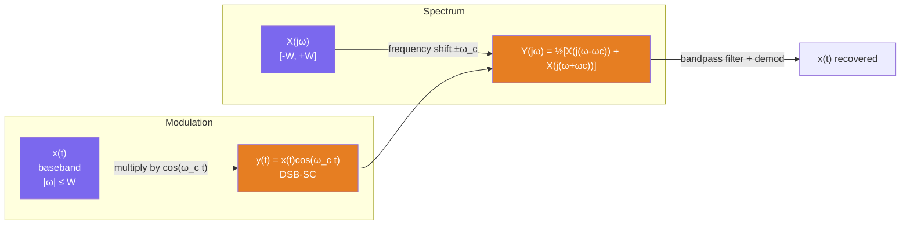

# 🛠️ Fourier Analysis Applications

> [!abstract] TL;DR
> Fourier analysis powers four cornerstone signal-processing operations: **ideal filtering** (frequency-selective signal separation), **AM modulation** (spectrum shifting for wireless transmission), **sampling** (discrete-time representation with Nyquist's criterion), and **Gibbs phenomenon** (unavoidable overshoot at discontinuities). Each application is a direct consequence of the CTFT properties developed in earlier notes.

## Intuition — analogy FIRST

Think of a crowded highway (your signal) carrying trucks of different sizes (frequencies). **Filtering** is a toll booth that only lets certain truck sizes through. **Modulation** is a transporter that shrinks all your trucks to fit a different highway (radio channel) and then restores them at the destination. **Sampling** takes a photograph of the highway every $T$ seconds — if cars move faster than one snapshot captures, they'll appear to travel backwards (aliasing). **Gibbs** is what happens when a road barrier (discontinuity) cannot be perfectly reconstructed from a finite number of frequency "building blocks."

---

## How It Works — AM Modulation Spectrum



---

## Key Concepts / Details

### 1. Ideal Filters

A filter is an LTI system with frequency response $H(j\omega) = Y(j\omega)/X(j\omega)$.

**Ideal Lowpass Filter (LPF):**
$$H_{LP}(j\omega) = \begin{cases} 1 & |\omega| \leq \omega_c \\ 0 & |\omega| > \omega_c \end{cases} = \text{rect}\!\left(\frac{\omega}{2\omega_c}\right)$$

Impulse response (via duality of rect↔sinc):
$$h_{LP}(t) = \frac{\omega_c}{\pi}\,\text{sinc}(\omega_c t) = \frac{\sin(\omega_c t)}{\pi t}$$

**Key problem:** $h_{LP}(t)$ is non-zero for $t < 0$ — the ideal LPF is **non-causal** and therefore **physically unrealisable** in real time.

**Other ideal filter types:**

| Filter | Passband | $H(j\omega)$ | Impulse response |
|--------|---------|--------------|-----------------|
| Highpass | $|\omega| > \omega_c$ | $1 - \text{rect}(\omega/2\omega_c)$ | $\delta(t) - \frac{\sin(\omega_c t)}{\pi t}$ |
| Bandpass | $\omega_1 < |\omega| < \omega_2$ | $\text{rect}$ around $\pm\omega_0$ | Modulated sinc |
| Bandstop | $|\omega| < \omega_1$ or $> \omega_2$ | Complement of BP | $\delta(t)$ − bandpass impulse |

**Practical filters** approximate the ideal response with a delay $t_d$ (making them causal) and a transition band. Common approximations: Butterworth (maximally flat), Chebyshev (equiripple in passband/stopband), Elliptic (equiripple in both).

### 2. AM Modulation (DSB-SC)

**Double-Sideband Suppressed Carrier (DSB-SC)** modulation:
$$y(t) = x(t) \cdot \cos(\omega_c t)$$

Using the frequency-shifting (modulation) property:
$$Y(j\omega) = \frac{1}{2}\left[X(j(\omega - \omega_c)) + X(j(\omega + \omega_c))\right]$$

- The baseband spectrum $X(j\omega)$ (occupying $|\omega| \leq W$) is **shifted to** $\pm\omega_c$
- Two sidebands appear: **upper sideband (USB)** at $\omega_c + W$ and **lower sideband (LSB)** at $\omega_c - W$
- The carrier $\cos(\omega_c t)$ itself is **suppressed** (no spike at $\pm\omega_c$)
- Required channel bandwidth: $2W$ (twice the baseband bandwidth)

**Demodulation:** Multiply $y(t)$ by $\cos(\omega_c t)$ again, then apply LPF:
$$y(t)\cos(\omega_c t) = x(t)\cos^2(\omega_c t) = \frac{x(t)}{2} + \frac{x(t)\cos(2\omega_c t)}{2}$$
LPF removes the double-frequency term, leaving $x(t)/2$. This requires **coherent detection** (receiver must know $\omega_c$ and phase).

**Conventional AM** adds a carrier: $y(t) = [A + x(t)]\cos(\omega_c t)$, enabling envelope detection but wasting power in the carrier.

### 3. Sampling and Nyquist Criterion (Preview)

Ideal sampling multiplies $x(t)$ by an impulse train:
$$x_s(t) = x(t) \cdot \sum_{n=-\infty}^{\infty}\delta(t - nT) = \sum_{n=-\infty}^{\infty}x(nT)\,\delta(t - nT)$$

The CTFT of the impulse train is another impulse train (FS of a periodic signal):
$$\mathcal{F}\left\{\sum_n \delta(t-nT)\right\} = \frac{2\pi}{T}\sum_k \delta\!\left(\omega - \frac{2\pi k}{T}\right)$$

Using the multiplication ↔ convolution property:
$$X_s(j\omega) = \frac{1}{T}\sum_{k=-\infty}^{\infty} X\!\left(j\!\left(\omega - \frac{2\pi k}{T}\right)\right)$$

The sampled spectrum is a **periodic replication** of $X(j\omega)$ with period $\omega_s = 2\pi/T$.

**Nyquist Condition** — no aliasing if and only if:
$$\omega_s \geq 2\omega_{\max} \quad \Longleftrightarrow \quad f_s \geq 2B$$

where $B$ is the one-sided bandwidth of $x(t)$.

**Aliasing:** If $\omega_s < 2\omega_{\max}$, the replicas overlap. A frequency $f$ above $f_s/2$ folds back to the alias $|f - f_s|$, indistinguishable from a legitimate low-frequency component.

### 4. Gibbs Phenomenon

When approximating a signal with a jump discontinuity by its partial Fourier Series:
$$\hat{x}_N(t) = \sum_{k=-N}^{N} c_k\, e^{jk\omega_0 t}$$

the reconstruction overshoots near the discontinuity by approximately:
$$\text{Overshoot} \approx \frac{1}{\pi}\int_0^{\pi}\frac{\sin u}{u}\,du - \frac{1}{2} \approx 0.0895$$

i.e., **~8.95% of the jump magnitude**, regardless of how large $N$ is. The overshoot spike narrows but never disappears. This is a consequence of the rectangular frequency window (abrupt cutoff at $\pm N\omega_0$) — applying a smooth window (Lanczos, Fejér) suppresses the Gibbs ripple.

---

## Python Demo — Ideal LPF via IDFT of Rect Spectrum

```python
import numpy as np
import matplotlib.pyplot as plt

def ideal_lpf_impulse(omega_c, t):
    """Ideal LPF impulse response h(t) = (ωc/π) sinc(ωc·t)."""
    # Use sinc(x) = sin(πx)/(πx) [numpy convention]; adjust argument
    # h(t) = sin(ωc t)/(πt) = (ωc/π) * sinc(ωc·t/π)
    return np.where(t == 0, omega_c / np.pi,
                    np.sin(omega_c * t) / (np.pi * t))

def apply_ideal_lpf_fft(x, dt, omega_c):
    """
    Apply ideal LPF to signal x (sampled at 1/dt Hz) using FFT.
    omega_c : cutoff in rad/s
    """
    N = len(x)
    X = np.fft.fft(x)
    omega = 2 * np.pi * np.fft.fftfreq(N, d=dt)
    # Ideal rect frequency mask
    H = (np.abs(omega) <= omega_c).astype(float)
    Y = X * H
    y = np.fft.ifft(Y).real
    return y

# --- Demo: filter a noisy sinusoid ---
dt    = 0.001
t     = np.arange(-2, 2, dt)
omega_signal = 2 * np.pi * 5     # 5 Hz signal
omega_noise  = 2 * np.pi * 50    # 50 Hz noise
omega_c      = 2 * np.pi * 15    # 15 Hz cutoff

np.random.seed(42)
x_clean = np.sin(omega_signal * t)
x_noisy = x_clean + 0.5 * np.sin(omega_noise * t) + 0.2 * np.random.randn(len(t))
y_filtered = apply_ideal_lpf_fft(x_noisy, dt, omega_c)

# --- Gibbs phenomenon demo ---
T0 = 1.0
t_sq = np.linspace(0, 2 * T0, 2000)
omega0 = 2 * np.pi / T0
gibbs_N = [1, 5, 50]
x_sq_true = np.sign(np.sin(omega0 * t_sq))

fig, axes = plt.subplots(1, 3, figsize=(15, 4))

axes[0].plot(t, x_noisy, alpha=0.4, label='Noisy input')
axes[0].plot(t, y_filtered, 'r-', lw=2, label=f'LPF output (ωc={omega_c:.0f} rad/s)')
axes[0].plot(t, x_clean, 'k--', alpha=0.5, label='Clean signal')
axes[0].set_xlim(-0.5, 0.5); axes[0].legend(fontsize=8)
axes[0].set_title('Ideal Lowpass Filter')

# AM modulation spectrum
omega_bw = 2 * np.pi * np.fft.fftshift(np.fft.fftfreq(len(t), d=dt))
x_base = np.sinc(5 * t) * np.cos(2 * np.pi * 2 * t)   # baseband demo
omega_c_am = 2 * np.pi * 20
x_mod = x_base * np.cos(omega_c_am * t)
X_base_plot = np.abs(np.fft.fftshift(np.fft.fft(x_base))) * dt
X_mod_plot  = np.abs(np.fft.fftshift(np.fft.fft(x_mod)))  * dt
axes[1].plot(omega_bw / (2*np.pi), X_base_plot, label='Baseband |X(jω)|')
axes[1].plot(omega_bw / (2*np.pi), X_mod_plot,  label='DSB-SC |Y(jω)|', alpha=0.8)
axes[1].set_xlim(-50, 50); axes[1].legend(fontsize=8)
axes[1].set_xlabel('Frequency (Hz)'); axes[1].set_title('AM Modulation Spectrum')

for N in gibbs_N:
    x_gibbs = np.zeros_like(t_sq)
    for k in range(1, N+1, 2):
        x_gibbs += (4 / (np.pi * k)) * np.sin(k * omega0 * t_sq)
    axes[2].plot(t_sq / T0, x_gibbs, label=f'N={N}')
axes[2].plot(t_sq / T0, x_sq_true, 'k--', alpha=0.3, label='True')
axes[2].legend(fontsize=8); axes[2].set_xlim(0, 2)
axes[2].set_title(f'Gibbs Phenomenon (~{8.95:.1f}% overshoot)')
axes[2].set_xlabel('t / T₀')

plt.tight_layout()
plt.show()

# Measure Gibbs overshoot
x_g50 = np.zeros_like(t_sq)
for k in range(1, 51, 2):
    x_g50 += (4 / (np.pi * k)) * np.sin(k * omega0 * t_sq)
overshoot_pct = (np.max(x_g50) - 1.0) * 100
print(f"Measured Gibbs overshoot (N=50): {overshoot_pct:.2f}%")
```

---

## Real-World Notes

- **Ideal LPF non-causality** is why practical FIR filters introduce a group delay: you accept a fixed time delay in exchange for causality. A linear-phase FIR with 100 taps at 44.1 kHz adds ~1.1 ms delay — acceptable for most audio.
- **DSB-SC is used in stereo FM**: the L−R audio difference signal is modulated onto a 38 kHz subcarrier inside the FM channel using DSB-SC.
- **Nyquist sampling** underpins all digital audio (CD: 44.1 kHz > 2×20 kHz), medical imaging (ultrasound: sampled above the transducer bandwidth), and software-defined radio.
- **Aliasing in video**: wagon wheels appearing to spin backwards in old films is spatial aliasing — the frame rate (sampling rate) is below twice the wheel's rotation frequency.
- **Gibbs in image processing**: ringing artifacts around sharp edges in JPEG images compressed at high ratio come from truncating the DCT (2D Fourier) spectrum — this is Gibbs in two dimensions.

## Common Pitfalls

- Implementing an ideal LPF by zero-ing FFT bins and IFFT-ing back — this is correct in theory but the abrupt spectral cutoff produces Gibbs ringing in the time-domain output; use a raised-cosine or windowed-sinc roll-off in practice.
- Forgetting that DSB-SC doubles the required bandwidth: a 5 kHz voice signal needs a 10 kHz RF channel in DSB.
- Applying the Nyquist criterion as $f_s > 2B$ without anti-aliasing filtering — if the input contains any energy above $f_s/2$ before sampling, aliasing occurs regardless of the nominal signal bandwidth.
- Confusing the Nyquist **sampling rate** ($f_s = 2B$) with the Nyquist **frequency** ($f_N = f_s/2$, the highest representable frequency).
- Expecting Gibbs overshoot to shrink as $N \to \infty$ — the peak overshoot is a fixed 8.95%; only its width shrinks.

## Related Concepts

- [[Fourier_Transform]] — FT pairs and properties used throughout: rect↔sinc, frequency shifting, multiplication theorem
- [[Fourier_Properties]] — convolution theorem underlies filtering; frequency shifting underlies modulation
- [[Frequency_Spectrum]] — bandwidth constraints drive both filter cutoff and sampling rate choices
- [[Fourier_Series]] — Gibbs phenomenon originates in FS partial sums; sampling spectrum is a FS of the impulse train

## Review Questions

1. An ideal LPF is applied to a signal with spectrum $X(j\omega) = e^{-|\omega|}$. Compute the output energy as a function of cutoff frequency $\omega_c$, and find $\omega_c$ such that exactly 90% of the input energy is retained.
2. A DSB-SC signal $y(t) = x(t)\cos(\omega_c t)$ is demodulated by multiplying by $\cos(\omega_c t + \phi)$ instead of the exact $\cos(\omega_c t)$. Compute the demodulated spectrum and show what happens to the recovered signal amplitude as $\phi \to \pi/2$.
3. A continuous signal has bandwidth 8 kHz. You sample it at 20 kHz without an anti-aliasing filter, and there is a 9 kHz component in the input. At what frequency does the alias appear in the sampled spectrum?

## Sources

- Oppenheim & Willsky, *Signals and Systems*, 2nd ed., Chapters 4, 8
- Haykin & Van Veen, *Signals and Systems*, 2nd ed., Chapters 5–6
- Proakis & Salehi, *Communication Systems Engineering*, 2nd ed., Chapter 3

#signals-and-systems #fourier-analysis #advanced
