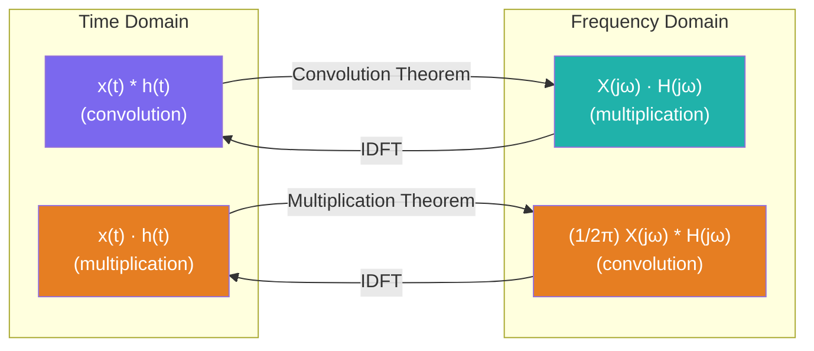

# ⚙️ Fourier Transform Properties

> [!abstract] TL;DR
> The ten core CTFT properties let you manipulate signals in either domain without re-evaluating the transform integral from scratch. The most powerful result is the **convolution theorem**: convolution in time becomes point-wise multiplication in frequency, turning differential-equation-based analysis of LTI systems into simple algebra.

## Intuition — analogy FIRST

Think of the Fourier Transform as a universal translator between two languages (time and frequency). Each property is a grammar rule in this translator: "shifting a sentence left in time adds a linear phase slope to its frequency translation." Once you know the rules, you never need to go back to the dictionary (the transform integral) — you can derive new transforms from known ones by applying grammar alone. The convolution theorem is the "star rule": it collapses the hardest operation in time (convolution = an integral over all shifts) into the easiest operation in frequency (point-wise multiply).

---

## How It Works



---

## Key Concepts / Details

### Complete Properties Table

Let $x(t) \xleftrightarrow{\mathcal{F}} X(j\omega)$ and $h(t) \xleftrightarrow{\mathcal{F}} H(j\omega)$.

| # | Property | Time Domain | Frequency Domain |
|---|----------|------------|-----------------|
| 1 | **Linearity** | $ax(t) + bh(t)$ | $aX(j\omega) + bH(j\omega)$ |
| 2 | **Time Shifting** | $x(t - t_0)$ | $e^{-j\omega t_0} X(j\omega)$ |
| 3 | **Frequency Shifting** | $e^{j\omega_0 t} x(t)$ | $X(j(\omega - \omega_0))$ |
| 4 | **Time Scaling** | $x(at)$ | $\frac{1}{\|a\|} X\!\left(\frac{j\omega}{a}\right)$ |
| 5 | **Duality** | $X(jt)$ | $2\pi\, x(-\omega)$ |
| 6 | **Differentiation (time)** | $\frac{d}{dt}x(t)$ | $j\omega\, X(j\omega)$ |
| 7 | **Integration** | $\int_{-\infty}^{t} x(\tau)\,d\tau$ | $\frac{X(j\omega)}{j\omega} + \pi X(0)\delta(\omega)$ |
| 8 | **Convolution** | $(x * h)(t)$ | $X(j\omega)\cdot H(j\omega)$ |
| 9 | **Multiplication** | $x(t)\cdot h(t)$ | $\frac{1}{2\pi}(X * H)(j\omega)$ |
| 10 | **Parseval's Theorem** | $\int_{-\infty}^{\infty}\|x(t)\|^2 dt$ | $\frac{1}{2\pi}\int_{-\infty}^{\infty}\|X(j\omega)\|^2 d\omega$ |

### Property Proofs / Sketches

**1. Linearity** — follows directly from linearity of the integral.

**2. Time Shifting**
$$\mathcal{F}\{x(t-t_0)\} = \int_{-\infty}^{\infty} x(t-t_0)e^{-j\omega t}dt \xrightarrow{\tau=t-t_0} e^{-j\omega t_0}\int x(\tau)e^{-j\omega\tau}d\tau = e^{-j\omega t_0}X(j\omega)$$
Key insight: shifting in time **multiplies the spectrum by a linear phase ramp** $e^{-j\omega t_0}$. The magnitude $|X(j\omega)|$ is unchanged — only the phase changes.

**3. Frequency Shifting (Modulation)**
$$\mathcal{F}\{e^{j\omega_0 t}x(t)\} = \int x(t)e^{-j(\omega-\omega_0)t}dt = X(j(\omega-\omega_0))$$
This is the cornerstone of **amplitude modulation** — multiplying by $e^{j\omega_0 t}$ shifts the entire spectrum by $\omega_0$.

**4. Time Scaling**
$$\mathcal{F}\{x(at)\} = \frac{1}{|a|}X\!\left(\frac{j\omega}{a}\right)$$
Compressing time ($|a|>1$) expands frequency and reduces amplitude; stretching time narrows the spectrum. This is the **time-bandwidth tradeoff**: you cannot simultaneously have a short-duration signal and a narrow bandwidth.

**5. Duality**
If $x(t) \leftrightarrow X(j\omega)$ then $X(jt) \leftrightarrow 2\pi x(-\omega)$.  
Example: since $\text{rect}(t) \leftrightarrow \tau\,\text{sinc}(\omega\tau/2)$, by duality $\text{sinc}(t) \leftrightarrow \pi\,\text{rect}(\omega/2\pi)$.

**6. Differentiation**
$$\mathcal{F}\left\{\frac{d}{dt}x(t)\right\} = j\omega\, X(j\omega)$$
Differentiation in time = multiplication by $j\omega$ in frequency. This converts differential equations into algebraic equations in $\omega$.

**7. Integration**
$$\mathcal{F}\left\{\int_{-\infty}^{t}x(\tau)\,d\tau\right\} = \frac{X(j\omega)}{j\omega} + \pi X(0)\delta(\omega)$$
The $\delta(\omega)$ term accounts for any DC component accumulated by the integrator.

**8. Convolution Theorem**
$$(x*h)(t) = \int_{-\infty}^{\infty}x(\tau)h(t-\tau)\,d\tau \xleftrightarrow{\mathcal{F}} X(j\omega)\cdot H(j\omega)$$
This is the single most important property in signal processing. LTI system analysis becomes:
$$Y(j\omega) = H(j\omega)\cdot X(j\omega)$$
where $H(j\omega)$ is the **frequency response** of the system.

**9. Multiplication (Frequency Convolution)**
$$x(t)\cdot h(t) \xleftrightarrow{\mathcal{F}} \frac{1}{2\pi}(X * H)(j\omega)$$
Dual of convolution theorem. Used in modulation analysis (AM, windowing, sampling).

**10. Parseval's Theorem**
$$E = \int_{-\infty}^{\infty}|x(t)|^2\,dt = \frac{1}{2\pi}\int_{-\infty}^{\infty}|X(j\omega)|^2\,d\omega$$
Total signal energy is conserved between domains. $|X(j\omega)|^2/(2\pi)$ is the **energy spectral density**.

---

## Python Demo — Convolution Theorem

```python
import numpy as np
import matplotlib.pyplot as plt

def fft_convolve(x, h, dt):
    """Convolve x and h via the FFT (convolution theorem)."""
    N = len(x) + len(h) - 1   # linear convolution length
    N_fft = 2 ** int(np.ceil(np.log2(N)))  # next power of 2
    X = np.fft.fft(x, n=N_fft)
    H = np.fft.fft(h, n=N_fft)
    y_fft = np.fft.ifft(X * H).real[:N] * dt
    return y_fft

# --- Verify: convolve two rect pulses → triangle via direct and FFT methods ---
dt = 0.01
t = np.arange(-3, 3, dt)

rect = np.where(np.abs(t) <= 0.5, 1.0, 0.0)  # rect(t)

# Direct convolution
y_direct = np.convolve(rect, rect, mode='full') * dt
t_conv = np.linspace(t[0] + t[0], t[-1] + t[-1], len(y_direct))

# FFT convolution
y_fft = fft_convolve(rect, rect, dt)
t_fft = np.linspace(t[0] + t[0], t[0] + t[0] + (len(y_fft) - 1) * dt, len(y_fft))

# Parseval verification
E_time = np.sum(rect**2) * dt
omega = 2 * np.pi * np.fft.fftfreq(len(t), d=dt)
X_rect = np.fft.fft(rect) * dt
E_freq = np.sum(np.abs(X_rect)**2) / (2 * np.pi) * (2 * np.pi / (len(t) * dt))
print(f"Energy (time domain):      {E_time:.4f}")
print(f"Energy (frequency domain): {E_freq:.4f}")
print(f"Parseval match: {np.isclose(E_time, E_freq, atol=1e-2)}")

fig, axes = plt.subplots(1, 2, figsize=(12, 4))

axes[0].plot(t_conv, y_direct, 'b-', lw=2, label='Direct convolution')
axes[0].plot(t_fft, y_fft, 'r--', lw=1.5, label='FFT convolution (convolution theorem)')
axes[0].set_xlabel('t'); axes[0].set_title('rect(t) * rect(t) = tri(t)')
axes[0].legend(); axes[0].set_xlim(-3, 3)

# Show spectra
X_mag = np.abs(np.fft.fftshift(np.fft.fft(rect) * dt))
omega_plot = np.fft.fftshift(2 * np.pi * np.fft.fftfreq(len(t), d=dt))
axes[1].plot(omega_plot, X_mag**2 / (2 * np.pi), 'g-')
axes[1].set_xlabel('ω (rad/s)')
axes[1].set_title('Energy Spectral Density |X(jω)|²/(2π)')
axes[1].set_xlim(-30, 30)

plt.tight_layout()
plt.show()
```

---

## Real-World Notes

- The convolution theorem is why FIR filter implementation uses FFT-based overlap-add: $O(N\log N)$ instead of $O(N^2)$.
- Time shifting by fractional samples (non-integer $t_0/T_s$) is done in the frequency domain: multiply by $e^{-j\omega t_0}$, then IFFT — no interpolation required.
- Differentiation property converts a first-order ODE into the algebraic equation $j\omega Y = j\omega H \cdot X$, directly yielding the transfer function $H(j\omega)$.
- Parseval's theorem underpins energy-based SNR calculations: $\text{SNR} = E_\text{signal}/E_\text{noise}$ can be computed in either domain.
- The duality property links the rect↔sinc pair in both directions — crucial for understanding ideal filter impulse responses.

## Common Pitfalls

- **Time shift vs frequency shift**: $x(t-t_0)$ shifts in time (multiply by $e^{-j\omega t_0}$); $x(t)e^{j\omega_0 t}$ shifts in frequency. The sign conventions look similar but are distinct operations.
- **Scaling amplitude**: $x(at)$ introduces a $1/|a|$ factor — compressing time does not conserve the signal's peak value in the frequency domain.
- **Missing $\delta(\omega)$ in integration**: forgetting $\pi X(0)\delta(\omega)$ gives the wrong result whenever $x(t)$ has nonzero DC content.
- **Convolution length**: direct convolution of $N$-point and $M$-point sequences gives $N+M-1$ points; zero-padding the FFT to this length avoids circular convolution aliasing.
- **Factor of $1/(2\pi)$ in Parseval's**: the $2\pi$ factor depends on whether you use the $\omega$ or $f$ convention; consistency matters.

## Related Concepts

- [[Fourier_Transform]] — foundation; the pairs used in property examples
- [[Fourier_Series]] — same linearity and shift properties apply to FS coefficients
- [[Fourier_Applications]] — convolution theorem + frequency shifting → AM modulation and filtering
- [[LTI_Systems]] — frequency response $H(j\omega) = Y(j\omega)/X(j\omega)$ uses convolution theorem

## Review Questions

1. Use the time-shifting and linearity properties to find the CTFT of $x(t) = \delta(t-2) - \delta(t+2)$ without evaluating any integral. What does the spectrum look like?
2. A signal $x(t)$ has bandwidth $W$ rad/s. You stretch it to $x(t/2)$. What is the new bandwidth, and how does the peak spectral amplitude change?
3. Prove Parseval's theorem for continuous-time signals by substituting the inverse CTFT for one copy of $x(t)$ in the energy integral $\int|x(t)|^2 dt$.

## Sources

- Oppenheim & Willsky, *Signals and Systems*, 2nd ed., Chapter 4
- Haykin & Van Veen, *Signals and Systems*, 2nd ed., Chapter 5
- Proakis & Manolakis, *Digital Signal Processing*, 4th ed., Chapter 4

#signals-and-systems #fourier-analysis #intermediate
