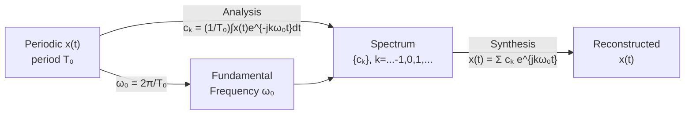

# 📐 Fourier Series

> [!abstract] TL;DR
> Any periodic signal satisfying mild smoothness conditions can be expressed as an infinite weighted sum of complex exponentials (or equivalently, sines and cosines). The Fourier Series analysis equation extracts the coefficient cₖ at each harmonic; the synthesis equation reconstructs the signal. This is the bridge from time to frequency for periodic signals.

## Intuition — analogy FIRST

Think of a musical chord: it sounds like a single sound, but it is actually multiple pure tones (fundamental + harmonics) ringing at once. A piano tuner picks each frequency apart by ear. The Fourier Series is the mathematical tuner — given any repeating waveform, it decomposes it into a fundamental tone plus overtones at integer multiples of the fundamental frequency. The coefficients cₖ tell you "how loud" each overtone is.

---

## How It Works



---

## Key Concepts / Details

### Exponential (Complex) Form

For a periodic signal $x(t)$ with fundamental period $T_0$:

**Synthesis equation** (frequency → time):
$$x(t) = \sum_{k=-\infty}^{\infty} c_k \, e^{jk\omega_0 t}, \qquad \omega_0 = \frac{2\pi}{T_0}$$

**Analysis equation** (time → frequency):
$$c_k = \frac{1}{T_0} \int_{\langle T_0 \rangle} x(t)\, e^{-jk\omega_0 t}\, dt$$

The integral is over any complete period (e.g. $[0, T_0]$ or $[-T_0/2, T_0/2]$).

### Trigonometric (Real) Form

For real-valued $x(t)$, grouping conjugate pairs:
$$x(t) = a_0 + \sum_{n=1}^{\infty} \left[ a_n \cos(n\omega_0 t) + b_n \sin(n\omega_0 t) \right]$$

where:
$$a_0 = c_0, \qquad a_n = 2\,\text{Re}\{c_n\}, \qquad b_n = -2\,\text{Im}\{c_n\}$$

### Dirichlet Conditions (Convergence)

The Fourier Series converges to $x(t)$ at every point of continuity, and to the average of left/right limits at discontinuities, provided:

1. $x(t)$ is absolutely integrable over one period: $\int_{\langle T_0 \rangle} |x(t)|\, dt < \infty$
2. $x(t)$ has a finite number of maxima and minima in one period
3. $x(t)$ has a finite number of finite discontinuities in one period

### Gibbs Phenomenon

At a jump discontinuity, the partial sum $\hat{x}_N(t) = \sum_{k=-N}^{N} c_k e^{jk\omega_0 t}$ always overshoots by approximately **8.9%** of the jump magnitude. This overshoot does **not** diminish as $N \to \infty$ — the undershoot/overshoot just gets narrower. This is fundamental, not a numerical artifact.

### Parseval's Theorem (Power)

Average power of a periodic signal:
$$P = \frac{1}{T_0} \int_{\langle T_0 \rangle} |x(t)|^2\, dt = \sum_{k=-\infty}^{\infty} |c_k|^2$$

Power is spread across harmonics; $|c_k|^2$ is the power at the $k$-th harmonic.

### FS of Common Signals

| Signal | Period $T_0$ | Coefficients $c_k$ (k ≠ 0) | $c_0$ |
|--------|------------|----------------------------|-------|
| Square wave (±A, duty 50%) | $T_0$ | $\frac{A}{k\pi}\sin(k\pi/2) \cdot \frac{2}{1}$ → $\frac{2A}{k\pi}$ for odd k, 0 for even k | 0 |
| Sawtooth (slope ramp, period T₀) | $T_0$ | $\frac{jA}{2\pi k}$ | $A/2$ |
| Triangle wave | $T_0$ | $\frac{-A}{k^2\pi^2/2}$ for odd k | 0 |
| Full-wave rectified cosine | $\pi/\omega_0$ | $\frac{2A}{\pi(1-4k^2)}$ | $2A/\pi$ |

For the **square wave** with amplitude $A$ and period $T_0$ (high for first half, low for second half):
$$c_k = \begin{cases} 0 & k \text{ even, } k\neq 0 \\ \frac{A}{jk\pi} & k \text{ odd} \\ 0 & k = 0 \end{cases}$$

---

## Python Demo — Square Wave FS Coefficients

```python
import numpy as np
import matplotlib.pyplot as plt

def square_wave_fs(A, N_terms, T0=1.0, num_points=2000):
    """
    Reconstruct a square wave from its Fourier Series.
    A       : amplitude
    N_terms : number of harmonics to include
    T0      : period
    """
    t = np.linspace(0, 2 * T0, num_points)
    omega0 = 2 * np.pi / T0

    # True square wave
    x_true = A * np.sign(np.sin(omega0 * t))

    # Partial FS reconstruction
    x_fs = np.zeros_like(t)
    for k in range(1, N_terms + 1, 2):   # odd harmonics only
        c_k = A / (1j * k * np.pi)
        x_fs += 2 * np.real(c_k * np.exp(1j * k * omega0 * t))

    # Plot coefficient magnitudes
    k_vals = np.arange(-15, 16)
    c_mags = np.zeros(len(k_vals))
    for i, k in enumerate(k_vals):
        if k == 0:
            c_mags[i] = 0
        elif k % 2 != 0:
            c_mags[i] = abs(A / (1j * k * np.pi))

    fig, axes = plt.subplots(1, 2, figsize=(12, 4))

    axes[0].plot(t / T0, x_true, 'k--', alpha=0.4, label='True square wave')
    axes[0].plot(t / T0, x_fs, 'b-', label=f'FS N={N_terms}')
    axes[0].set_xlabel('t / T₀'); axes[0].set_ylabel('x(t)')
    axes[0].set_title('Fourier Series Reconstruction'); axes[0].legend()

    axes[1].stem(k_vals, c_mags, basefmt='k-', linefmt='b-', markerfmt='bo')
    axes[1].set_xlabel('Harmonic index k'); axes[1].set_ylabel('|cₖ|')
    axes[1].set_title('Fourier Coefficients |cₖ|')

    plt.tight_layout()
    plt.show()

square_wave_fs(A=1.0, N_terms=15)
```

---

## Real-World Notes

- Musical instruments produce rich harmonic spectra — a violin and a piano sound different at the same pitch because their $|c_k|$ distributions differ (timbre).
- Power systems engineers use FS to quantify harmonic distortion; total harmonic distortion (THD) = $\sqrt{\sum_{k=2}^{\infty}|c_k|^2} / |c_1|$.
- The Gibbs phenomenon explains why sharp edges in images look "ringing" after JPEG compression (which uses DCT, a close cousin of FS).
- EEG and ECG signals are analyzed with FS / FFT to identify dominant rhythms (alpha, beta waves; heart rate harmonics).
- FS convergence is in the $L^2$ sense (energy sense) even when point-wise convergence fails (e.g. at discontinuities).

## Common Pitfalls

- Forgetting to integrate over exactly one period — the starting point doesn't matter, but the window must equal $T_0$.
- Confusing $\omega_0 = 2\pi/T_0$ (rad/s) with $f_0 = 1/T_0$ (Hz); FS formulas differ depending on which convention is used.
- Expecting the partial sum to converge to the discontinuity value itself — it converges to the **average** of the left and right limits.
- Dropping the $1/T_0$ normalization factor in the analysis equation (a very common algebra error).
- Applying FS to non-periodic signals — use the Fourier Transform instead (FS is only for periodic signals).

## Related Concepts

- [[Fourier_Transform]] — generalises FS to aperiodic signals by letting $T_0 \to \infty$
- [[Fourier_Properties]] — properties derived here (linearity, shift) apply equally to FS
- [[Frequency_Spectrum]] — discrete line spectrum of a periodic signal comes from FS coefficients
- [[Fourier_Applications]] — Gibbs phenomenon application; filtering harmonics

## Review Questions

1. A periodic signal has fundamental frequency 100 Hz. At what frequencies do its Fourier Series components appear? If the signal is also an odd function, what can you say about the cosine coefficients $a_n$?
2. The Fourier Series of a square wave has no even harmonics. Explain why this follows directly from the half-wave symmetry $x(t - T_0/2) = -x(t)$.
3. You truncate a square wave's Fourier Series to 5 terms. Estimate the percentage overshoot near the discontinuity and explain why adding 100 more terms won't eliminate it.

## Sources

- Oppenheim & Willsky, *Signals and Systems*, 2nd ed., Chapter 3
- Haykin & Van Veen, *Signals and Systems*, 2nd ed., Chapter 4
- Proakis & Manolakis, *Digital Signal Processing*, 4th ed., Chapter 4

#signals-and-systems #fourier-analysis #beginner
