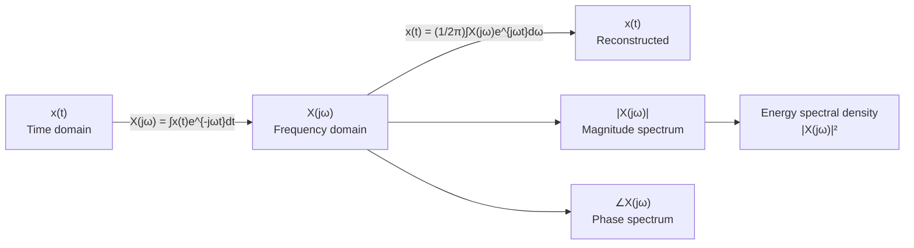

# 🔁 Fourier Transform (CTFT)

> [!abstract] TL;DR
> The Continuous-Time Fourier Transform (CTFT) decomposes an aperiodic signal into a continuous spectrum of complex exponentials. The analysis equation maps $x(t) \to X(j\omega)$; the synthesis (inverse) equation reconstructs $x(t)$ from $X(j\omega)$. The magnitude $|X(j\omega)|$ reveals which frequencies carry energy; the phase $\angle X(j\omega)$ tells you their timing relationships.

## Intuition — analogy FIRST

A prism splits white light into a rainbow — each colour is a different frequency of electromagnetic wave, and the brightness at each colour corresponds to the amplitude $|X(j\omega)|$ of that frequency. The CTFT does the same thing for any time-varying signal: pass the signal through a "mathematical prism" and read off the brightness (amplitude) and colour shift (phase) at every frequency. Unlike a real prism, the CTFT also allows you to reassemble the rainbow back into white light (inverse transform).

---

## How It Works



---

## Key Concepts / Details

### CTFT Definition

**Forward transform** (analysis):
$$X(j\omega) = \int_{-\infty}^{\infty} x(t)\, e^{-j\omega t}\, dt$$

**Inverse transform** (synthesis):
$$x(t) = \frac{1}{2\pi} \int_{-\infty}^{\infty} X(j\omega)\, e^{j\omega t}\, d\omega$$

> [!note] Notation
> The argument $j\omega$ (not just $\omega$) emphasises that $X$ is evaluated on the imaginary axis of the complex $s$-plane — this connects cleanly to the [[Laplace_Transform]] where $s = \sigma + j\omega$.

### Existence Conditions

The CTFT exists (as a classical integral) if:
$$\int_{-\infty}^{\infty} |x(t)|\, dt < \infty \qquad \text{(absolutely integrable)}$$

Signals like $u(t)$, $\cos(\omega_0 t)$, and periodic signals are **not** absolutely integrable, but their FTs exist in the **distributional sense** using Dirac delta functions $\delta(\omega)$.

### Standard Transform Pairs

| Signal $x(t)$ | Transform $X(j\omega)$ | Notes |
|--------------|----------------------|-------|
| $\delta(t)$ | $1$ | Impulse has flat (white) spectrum |
| $1$ | $2\pi\delta(\omega)$ | DC has all energy at ω=0 |
| $u(t)$ | $\pi\delta(\omega) + \frac{1}{j\omega}$ | Step function |
| $e^{-\alpha t}u(t),\; \alpha>0$ | $\frac{1}{\alpha + j\omega}$ | Decaying exponential |
| $e^{-\alpha\|t\|},\; \alpha>0$ | $\frac{2\alpha}{\alpha^2 + \omega^2}$ | Two-sided exponential |
| $\text{rect}(t/\tau)$ | $\tau \cdot \text{sinc}(\omega\tau/2)$ | $\text{sinc}(x)=\sin(x)/x$ here |
| $e^{j\omega_0 t}$ | $2\pi\delta(\omega - \omega_0)$ | Complex exponential |
| $\cos(\omega_0 t)$ | $\pi[\delta(\omega-\omega_0)+\delta(\omega+\omega_0)]$ | Even symmetry |

where $\text{sinc}(x) = \sin(x)/x$ (unnormalised convention).

### Magnitude and Phase Spectra

For a real signal $x(t)$, write $X(j\omega) = |X(j\omega)| e^{j\angle X(j\omega)}$ where:

- **Magnitude spectrum** $|X(j\omega)|$: always **even** (symmetric about $\omega=0$)
- **Phase spectrum** $\angle X(j\omega)$: always **odd** (anti-symmetric about $\omega=0$)

This means only the **positive-frequency half** carries unique information — the other half is redundant for real signals.

### Bandwidth Definitions

| Name | Definition | Use case |
|------|-----------|---------|
| 3 dB bandwidth | Frequencies where $|X(j\omega)|^2 \geq \frac{1}{2}|X(j\omega)|^2_\text{max}$ | Filters, amplifiers |
| Null-to-null | Distance between first nulls of $|X(j\omega)|$ | Rect/sinc signals |
| Essential (95%) | Smallest band containing 95% of signal energy | Practical system design |
| RMS bandwidth | $B_\text{rms} = \left(\frac{\int\omega^2|X|^2 d\omega}{\int|X|^2 d\omega}\right)^{1/2}$ | Theoretical analysis |

---

## Python Demo — CTFT via FFT

```python
import numpy as np
import matplotlib.pyplot as plt

def compute_ctft(x, t):
    """
    Approximate the CTFT using the FFT.
    x : signal samples
    t : time array (uniformly spaced)
    Returns (omega, X) where omega is in rad/s and X is the complex spectrum.
    """
    dt = t[1] - t[0]
    N = len(x)
    # FFT and shift zero-frequency to centre
    X = np.fft.fftshift(np.fft.fft(x)) * dt
    # Frequency axis in rad/s
    f = np.fft.fftshift(np.fft.fftfreq(N, d=dt))
    omega = 2 * np.pi * f
    return omega, X

# --- Example: decaying exponential e^{-2t}u(t) ---
alpha = 2.0
dt = 0.002
t = np.arange(-2, 10, dt)
x = np.where(t >= 0, np.exp(-alpha * t), 0)

omega, X_num = compute_ctft(x, t)

# Analytical: X(jω) = 1 / (α + jω)
X_ana = 1.0 / (alpha + 1j * omega)

# Plot
fig, axes = plt.subplots(2, 2, figsize=(12, 7))

axes[0, 0].plot(t, x); axes[0, 0].set_xlim(-1, 5)
axes[0, 0].set_xlabel('t (s)'); axes[0, 0].set_title('x(t) = e^{-αt}u(t)')

axes[0, 1].plot(omega, np.abs(X_num), label='Numerical FFT')
axes[0, 1].plot(omega, np.abs(X_ana), '--', label='Analytical')
axes[0, 1].set_xlim(-30, 30)
axes[0, 1].set_xlabel('ω (rad/s)'); axes[0, 1].set_title('Magnitude |X(jω)|')
axes[0, 1].legend()

axes[1, 0].plot(omega, np.angle(X_num, deg=True), label='Numerical')
axes[1, 0].plot(omega, np.angle(X_ana, deg=True), '--', label='Analytical')
axes[1, 0].set_xlim(-30, 30)
axes[1, 0].set_xlabel('ω (rad/s)'); axes[1, 0].set_title('Phase ∠X(jω) (degrees)')
axes[1, 0].legend()

# --- Second example: rectangular pulse ---
tau = 1.0
x_rect = np.where(np.abs(t) <= tau / 2, 1.0, 0.0)
omega2, X_rect = compute_ctft(x_rect, t)
X_rect_ana = tau * np.sinc(omega2 * tau / (2 * np.pi))  # np.sinc uses normalised sinc

axes[1, 1].plot(omega2, np.abs(X_rect), label='rect(t/τ) FFT')
axes[1, 1].plot(omega2, np.abs(X_rect_ana), '--', label='τ·sinc(ωτ/2)')
axes[1, 1].set_xlim(-40, 40)
axes[1, 1].set_xlabel('ω (rad/s)'); axes[1, 1].set_title('rect(t/τ) ↔ τ·sinc(ωτ/2)')
axes[1, 1].legend()

plt.tight_layout()
plt.show()
```

---

## Real-World Notes

- MRI machines use Fourier Transforms to reconstruct images from k-space (frequency-domain) measurements — the entire acquisition is built on the FT relationship between position and spatial frequency.
- Audio equalizers are FT-based: they reshape $|X(j\omega)|$ by attenuating or boosting frequency bands.
- The uncertainty principle (time-bandwidth product $\Delta t \cdot \Delta\omega \geq 1/2$) limits how sharp a pulse can be while still having a narrow spectrum.
- Radar systems measure target range via round-trip delay, which corresponds to a phase shift in $X(j\omega)$.
- The CTFT assumes infinite time extent — practical systems use windowed FTs (short-time Fourier transform, STFT) for non-stationary signals.

## Common Pitfalls

- Using the **normalised sinc** $\text{sinc}(x) = \sin(\pi x)/(\pi x)$ (NumPy convention) vs. the **unnormalised** $\sin(x)/x$ — which formula you use changes the rect↔sinc pair by a factor of $\pi$.
- Forgetting the $1/(2\pi)$ factor in the inverse transform when using the $\omega$ (rad/s) convention; the factor disappears if the transform pair uses $f$ (Hz).
- Confusing two-sided bandwidth with one-sided bandwidth — a filter labelled "10 kHz bandwidth" usually means one-sided ($-10$ to $+10$ kHz = 20 kHz total).
- Computing the FFT without multiplying by $\Delta t$ — the result is dimensionally wrong and won't match the analytical FT magnitude.
- Applying the FT to a signal that grows without bound (e.g. $e^{+2t}u(t)$) — the integral diverges; use the Laplace transform instead.

## Related Concepts

- [[Fourier_Series]] — discrete spectrum analogue; FS coefficients = sampled version of $X(j\omega)/T_0$ as $T_0 \to \infty$
- [[Fourier_Properties]] — all transform manipulation rules
- [[Frequency_Spectrum]] — deep dive into bandwidth, ESD, and windowing
- [[Laplace_Transform]] — generalises FT to $s = \sigma + j\omega$; FT is Laplace on imaginary axis

## Review Questions

1. Show from first principles that $\mathcal{F}\{e^{-\alpha t}u(t)\} = 1/(\alpha + j\omega)$ for $\alpha > 0$. Why does the condition $\alpha > 0$ matter?
2. Why does multiplying $x(t)$ by a rectangular window in the time domain cause spectral leakage (sidelobes) in $X(j\omega)$? Hint: use the convolution property.
3. The signal $x(t) = \text{rect}(t)$ has a first null at $\omega = 2\pi$ rad/s. If you compress the pulse to $\text{rect}(2t)$, where does the first null move, and why?

## Sources

- Oppenheim & Willsky, *Signals and Systems*, 2nd ed., Chapters 4–5
- Haykin & Van Veen, *Signals and Systems*, 2nd ed., Chapter 5
- Bracewell, *The Fourier Transform and Its Applications*, 3rd ed.

#signals-and-systems #fourier-analysis #intermediate
