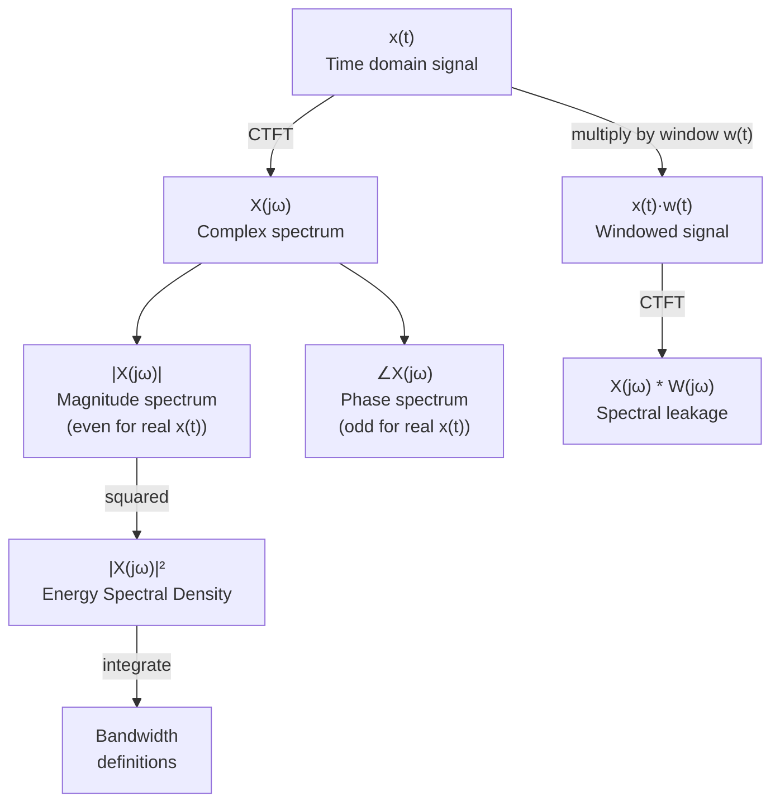

# 📊 Frequency Spectrum

> [!abstract] TL;DR
> The frequency spectrum of a signal is a complete description of its frequency content, captured by the magnitude $|X(j\omega)|$ and phase $\angle X(j\omega)$. The energy spectral density $|X(j\omega)|^2$ tells you how energy is distributed across frequencies. Bandwidth measures how "wide" the spectrum is, and windowing controls the spectral leakage that results from truncating a signal in time.

## Intuition — analogy FIRST

Imagine measuring how loud each note is when a full orchestra plays a chord. The **magnitude spectrum** is the plot of loudness vs. pitch — you can see which notes dominate and how much quieter the high overtones are. The **phase spectrum** tells you when each note started (its timing offset). **Bandwidth** is the range of pitches occupied (a piccolo is narrow-band; a crash cymbal is wide-band). **Windowing** is like recording through a door that opens and closes: the abrupt edges of the recording window introduce ringing artifacts (spectral leakage) that can obscure soft notes sitting near louder ones.

---

## How It Works



---

## Key Concepts / Details

### Magnitude and Phase Spectra

For $x(t) \in \mathbb{R}$, the CTFT satisfies the **Hermitian symmetry** condition:
$$X(-j\omega) = X^*(j\omega)$$

This immediately implies:
- $|X(-j\omega)| = |X(j\omega)|$ — magnitude is an **even** function
- $\angle X(-j\omega) = -\angle X(j\omega)$ — phase is an **odd** function

Consequence: the two-sided spectrum contains redundant information. One-sided spectra (showing only $\omega \geq 0$) are used in practice; energy is typically doubled to account for the negative-frequency half.

### Energy Spectral Density (ESD)

For a finite-energy signal ($\int|x(t)|^2 dt < \infty$), the **Energy Spectral Density** is:
$$S_x(\omega) = |X(j\omega)|^2 \qquad (\text{units: J·s/rad or J/Hz})$$

Total signal energy via Parseval's theorem:
$$E = \int_{-\infty}^{\infty}|x(t)|^2\,dt = \frac{1}{2\pi}\int_{-\infty}^{\infty}S_x(\omega)\,d\omega$$

### Bandwidth Definitions

| Bandwidth Type | Definition | Typical Usage |
|---------------|-----------|--------------|
| **3 dB (half-power)** | $B_{3dB}$: range of $\omega$ where $S_x \geq S_{x,\text{max}}/2$ | Filters, amplifiers |
| **Null-to-null** | Distance from first null to first null around the main lobe | rect/sinc signals |
| **Essential (95%)** | Smallest band containing 95% of total signal energy | Practical design |
| **RMS** | $B_\text{rms}^2 = \frac{\int\omega^2 S_x d\omega}{\int S_x d\omega}$ | Theoretical/communication systems |

For $e^{-\alpha t}u(t)$: 3 dB bandwidth is $\omega_{3dB} = \alpha$ rad/s (where $|X|^2 = 1/(2\alpha^2)$).

### Time-Bandwidth Product

A fundamental result from the uncertainty principle:
$$\Delta t \cdot \Delta\omega \geq \frac{1}{2}$$

where $\Delta t$ and $\Delta\omega$ are RMS durations in time and frequency. Equality holds for Gaussian signals. Practical consequences:
- A short pulse (small $\Delta t$) must have a **wide** spectrum (large $\Delta\omega$)
- Narrowband signals must be long in time
- You **cannot** simultaneously reduce both time duration and bandwidth

### One-Sided vs Two-Sided Spectra

| Representation | Frequency range | Amplitude scaling | When used |
|----------------|----------------|------------------|-----------|
| Two-sided | $-\infty < \omega < \infty$ | Direct $|X(j\omega)|$ | Theory, symmetry analysis |
| One-sided | $0 \leq \omega < \infty$ | $2|X(j\omega)|$ (double) | Practical measurements, audio |

### Spectral Leakage

When $x(t)$ is multiplied by a rectangular window $w(t) = \text{rect}(t/T)$ (i.e., we only observe a finite record of length $T$), the observed spectrum is:
$$X_w(j\omega) = \frac{1}{2\pi}X(j\omega) * W(j\omega) = \frac{1}{2\pi}X(j\omega) * T\,\text{sinc}(\omega T/2)$$

The sinc sidelobes of the rectangular window "leak" energy from strong spectral peaks into neighbouring frequency bins, obscuring weaker components. The first sidelobe of a rectangular window is only **13 dB** below the main lobe.

### Windowing Functions

Applying a smoother window reduces sidelobe levels at the cost of a wider main lobe:

| Window | First sidelobe (dB) | Main lobe width | Trade-off |
|--------|--------------------|-----------------|-----------| 
| Rectangular | −13 dB | $4\pi/T$ | Worst leakage, best resolution |
| Hann | −31 dB | $8\pi/T$ | Good balance |
| Hamming | −41 dB | $8\pi/T$ | Good stopband |
| Blackman | −57 dB | $12\pi/T$ | Best leakage suppression |
| Kaiser (β=8) | −57 dB | adjustable | Flexible parameterisation |

The Hann window: $w(t) = 0.5 + 0.5\cos(2\pi t/T)$ for $|t| \leq T/2$.

---

## Python Demo — One-Sided PSD and Windowing

```python
import numpy as np
import matplotlib.pyplot as plt
from scipy.signal import windows

# Signal: sum of two sinusoids at 50 Hz and 120 Hz, buried in noise
fs = 1000.0          # sampling frequency (Hz)
T  = 1.0             # observation window (s)
t  = np.arange(0, T, 1/fs)
N  = len(t)

np.random.seed(0)
x = np.sin(2 * np.pi * 50 * t) + 0.3 * np.sin(2 * np.pi * 120 * t) \
    + 0.5 * np.random.randn(N)

def one_sided_psd(x, fs, win=None):
    """Compute one-sided Power Spectral Density (V²/Hz)."""
    N = len(x)
    if win is not None:
        w = win(N)
        # Normalise window to preserve power
        x_win = x * w / np.sqrt(np.mean(w**2))
    else:
        x_win = x.copy()
    X = np.fft.rfft(x_win) / N
    f = np.fft.rfftfreq(N, d=1/fs)
    # One-sided: double all except DC and Nyquist
    psd = np.abs(X)**2
    psd[1:-1] *= 2
    psd_db = 10 * np.log10(psd + 1e-20)   # convert to dB
    return f, psd_db

f_rect, psd_rect = one_sided_psd(x, fs, win=None)
f_hann, psd_hann = one_sided_psd(x, fs, win=windows.hann)
f_hamm, psd_hamm = one_sided_psd(x, fs, win=windows.hamming)

fig, axes = plt.subplots(1, 2, figsize=(13, 5))

axes[0].plot(t[:200], x[:200])
axes[0].set_xlabel('Time (s)'); axes[0].set_ylabel('Amplitude')
axes[0].set_title('Signal x(t) (first 200 ms)')

axes[1].plot(f_rect, psd_rect, alpha=0.6, label='Rectangular window')
axes[1].plot(f_hann, psd_hann, label='Hann window')
axes[1].plot(f_hamm, psd_hamm, '--', label='Hamming window')
axes[1].set_xlim(0, 200)
axes[1].set_xlabel('Frequency (Hz)'); axes[1].set_ylabel('PSD (dB)')
axes[1].set_title('One-Sided PSD — Window Comparison')
axes[1].legend(); axes[1].grid(True, alpha=0.3)
axes[1].axvline(50, color='r', ls=':', alpha=0.5, label='50 Hz')
axes[1].axvline(120, color='g', ls=':', alpha=0.5, label='120 Hz')

plt.tight_layout()
plt.show()

# --- Essential bandwidth: find band containing 95% of energy ---
X_full = np.fft.rfft(x) / N
ESD = np.abs(X_full)**2
ESD[1:-1] *= 2   # one-sided correction
total_energy = np.sum(ESD)
cumulative = np.cumsum(ESD)
idx_95 = np.searchsorted(cumulative, 0.95 * total_energy)
print(f"Essential bandwidth (95% energy): {f_rect[idx_95]:.1f} Hz")
```

---

## Real-World Notes

- Spectrum analysers in RF engineering display one-sided PSD in dBm/Hz to characterise transmitter output and noise floors.
- The Hann window is the default in most audio FFT tools (spectrum analyser plugins in DAWs) because it balances resolution and sidelobe rejection.
- The time-bandwidth product explains why wideband radar uses short pulses (small $\Delta t$, large $\Delta\omega$) for fine range resolution.
- In digital communications, the **essential bandwidth** determines the minimum channel bandwidth needed to pass a signal without significant distortion.
- Gravitational wave detectors (LIGO) use carefully designed windows when computing spectrograms to avoid leakage masking the GW chirp signal.

## Common Pitfalls

- Plotting the two-sided spectrum without noting its redundancy — consumers often expect one-sided spectra and are confused by the mirror image.
- Forgetting to account for the window's power normalisation: multiplying by a window that reduces amplitude will artificially lower the PSD unless you normalise by $\sum w^2$.
- Interpreting the FFT output as the CTFT directly — FFT gives samples of $X(j\omega)$ spaced by $2\pi/T$ and you must multiply by $\Delta t$ to match the integral definition.
- Using a rectangular window for narrowband signals near strong interferers — sidelobes at −13 dB can completely bury weak tones.
- Confusing **power** spectral density (W/Hz, for power signals) with **energy** spectral density (J·s/rad, for energy signals).

## Related Concepts

- [[Fourier_Transform]] — $X(j\omega)$ is the raw material from which the spectrum is constructed
- [[Fourier_Properties]] — time scaling ↔ bandwidth tradeoff follows from the scaling property
- [[Fourier_Applications]] — bandwidth governs filter design, sampling rate, and modulation efficiency
- [[Fourier_Series]] — periodic signals have **discrete** line spectra instead of a continuous ESD

## Review Questions

1. Explain why the magnitude spectrum of a real signal is even and the phase spectrum is odd, starting from the definition $X(-j\omega) = X^*(j\omega)$.
2. A signal has 3 dB bandwidth of 100 Hz when observed through a rectangular window of length $T = 0.1$ s. You switch to a Hann window of the same length. How does the 3 dB bandwidth change, and how do the spectral sidelobes change?
3. You want to detect a tone at 55 Hz that is 40 dB weaker than a tone at 50 Hz. Which window would you choose, and why?

## Sources

- Oppenheim & Willsky, *Signals and Systems*, 2nd ed., Chapter 4
- Harris, F.J., "On the Use of Windows for Harmonic Analysis with the Discrete Fourier Transform," *Proc. IEEE*, 1978
- Proakis & Manolakis, *Digital Signal Processing*, 4th ed., Chapter 8

#signals-and-systems #fourier-analysis #intermediate
