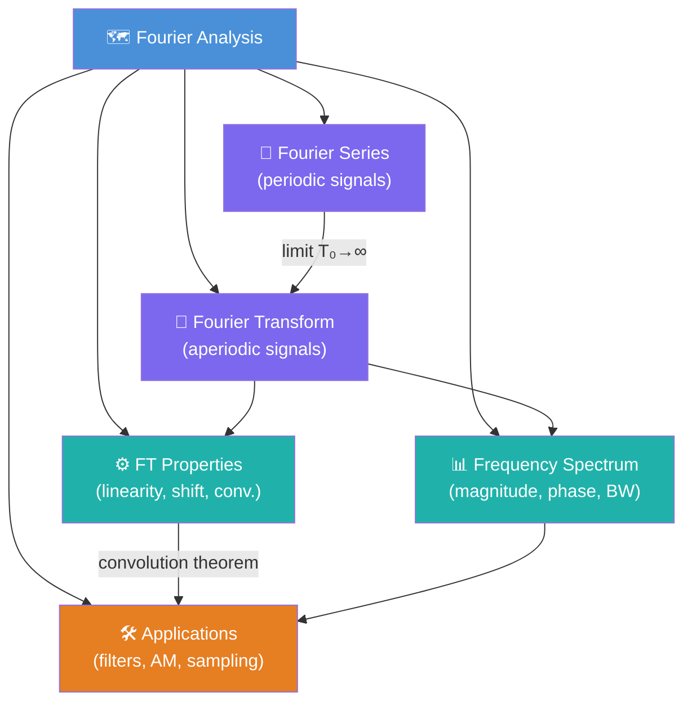

# 🗺️ MOC — Fourier Analysis

> [!abstract] What This Section Covers
> Fourier Analysis is the cornerstone of signal processing: it tells us how to decompose any signal into its constituent sinusoidal frequencies. This section covers **Fourier Series** for periodic continuous-time signals, the **Continuous-Time Fourier Transform (CTFT)** for aperiodic signals, all major **transform properties**, the geometry of **frequency spectra** (magnitude, phase, energy density, bandwidth), and concrete **applications** in filtering, AM modulation, and sampling. Together these tools let you move fluidly between the time domain and the frequency domain — the two lenses through which every signal-processing problem is solved.

---

## 🧭 Concept Map

---

## 🛤️ Learning Path

Work through these notes in order — each one builds on the last.

1. [[Fourier_Series]] — Start here: periodic signals, coefficients cₖ, Dirichlet conditions, Gibbs phenomenon
2. [[Fourier_Transform]] — Extend to aperiodic signals; CTFT pairs table; magnitude & phase spectra
3. [[Fourier_Properties]] — Master all 10 properties; convolution theorem is the key payoff
4. [[Frequency_Spectrum]] — Energy spectral density, bandwidth definitions, windowing
5. [[Fourier_Applications]] — Filters, AM modulation, Nyquist sampling, Gibbs in practice

---

## 📋 All Notes at a Glance

| Note | Difficulty | What You'll Learn |
|------|-----------|-------------------|
| [[Fourier_Series]] | Beginner | Represent periodic x(t) as sum of complex exponentials; compute cₖ; understand convergence |
| [[Fourier_Transform]] | Intermediate | CTFT definition and inverse; 8 standard pairs; magnitude/phase interpretation |
| [[Fourier_Properties]] | Intermediate | All 10 CTFT properties; convolution↔multiplication duality; Parseval's energy theorem |
| [[Frequency_Spectrum]] | Intermediate | ESD, 3dB/null-to-null/essential bandwidth; time-bandwidth product; windowing effects |
| [[Fourier_Applications]] | Advanced | Ideal filters, DSB-SC AM modulation, Nyquist sampling preview, Gibbs overshoot |

---

## ❓ Key Questions

1. Why does time-shifting a signal only affect the **phase** spectrum, not the magnitude spectrum?
2. A square wave has discontinuities — why does the Fourier Series reconstruction always overshoot by ~9%, no matter how many terms you include?
3. How does the Fourier Transform of a periodic signal (which doesn't satisfy the absolute-integrability condition) involve impulse functions?
4. If x(t) is real and even, what can you say about X(jω)?
5. You sample a 10 kHz audio signal at 18 kHz — where exactly does aliasing appear, and why?

---

## 🔗 Related Sections

| Section | Relationship |
|---------|-------------|
| [[_MOC_Signals_Systems_Master]] | Parent master MOC |
| [[_MOC_CT_Signals]] | Section 01 — continuous-time signals that we now analyze spectrally |
| [[_MOC_Laplace_Transform]] | Section 04 — generalises CTFT to the complex s-plane (σ+jω) |
| [[_MOC_DTFT_DFT]] | Section 05 — discrete-time counterpart; DFT is the computable version |
| [[_MOC_LTI_Systems]] | Section 03 — frequency response H(jω) connects directly to CTFT |

---

#MOC #signals-and-systems #fourier-analysis
