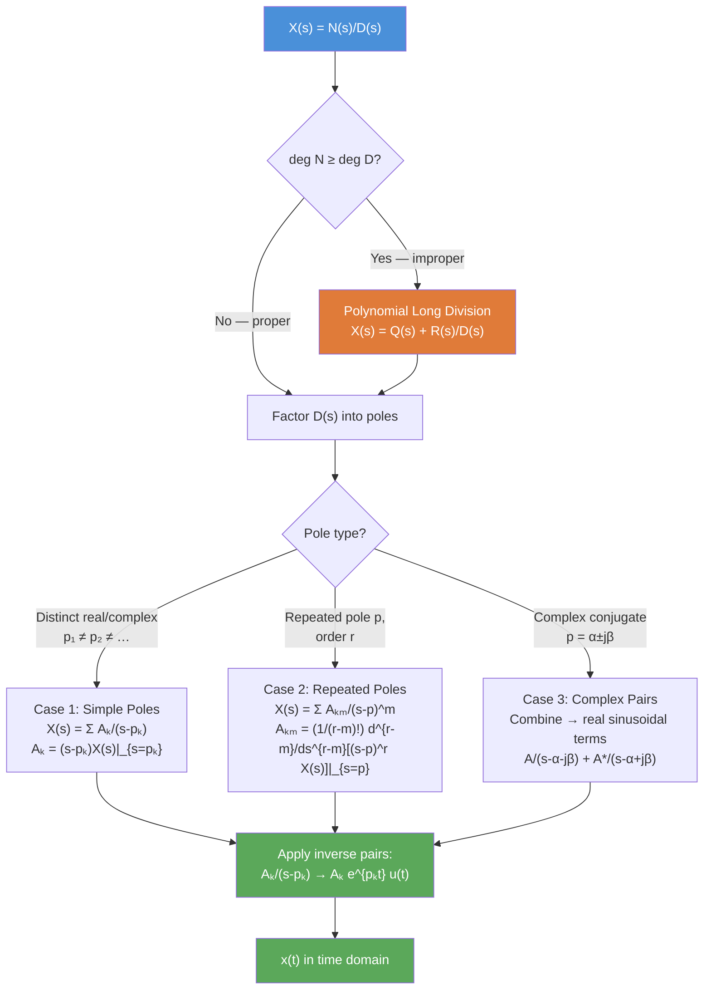

# 🔄 Inverse Laplace Transform

> [!abstract] TL;DR
> The inverse Laplace transform recovers $x(t)$ from $X(s)$ using Partial Fraction Expansion (PFE): decompose a rational $X(s)$ into a sum of simple terms whose inverses are known pairs. Three cases arise — distinct poles, repeated poles, and complex conjugate poles. Improper fractions require polynomial long division first.

## Intuition — analogy FIRST

PFE is like breaking a complex fraction into its constituent "atoms." Imagine you have a blended smoothie (the rational function $X(s)$) and want to know the original fruits (simple first-order terms). You separate the mixture using the residue formula — a mathematical centrifuge. Each fruit corresponds to a known Laplace pair: a first-order term $\frac{A}{s-p}$ is the smoothie-atom, and its inverse is $A\,e^{pt}u(t)$ — a pure exponential. Complex conjugate pairs produce damped sinusoids (two fruits that naturally come in pairs). Repeated poles are like a fruit that appears multiple times — each repetition adds a power of $t$ to the exponential.

---

## How It Works



---

## Key Concepts / Details

### Case 1 — Distinct (Simple) Poles

Given $X(s) = \frac{N(s)}{(s-p_1)(s-p_2)\cdots(s-p_N)}$ with all $p_k$ distinct:

$$X(s) = \sum_{k=1}^{N} \frac{A_k}{s - p_k}$$

**Residue formula** (cover-up method):

$$A_k = \lim_{s \to p_k} (s - p_k)\,X(s) = (s - p_k)\,X(s)\Big|_{s=p_k}$$

**Inverse**: $\displaystyle A_k/(s-p_k) \;\xrightarrow{\mathcal{L}^{-1}}\; A_k\,e^{p_k t}\,u(t)$ (causal system; right-sided ROC)

---

### Worked Example — Distinct Poles

$$X(s) = \frac{s+3}{(s+1)(s+2)}$$

**Step 1** — Partial fractions:
$$X(s) = \frac{A_1}{s+1} + \frac{A_2}{s+2}$$

**Step 2** — Residues:
$$A_1 = (s+1) \cdot \frac{s+3}{(s+1)(s+2)}\bigg|_{s=-1} = \frac{-1+3}{-1+2} = \frac{2}{1} = 2$$

$$A_2 = (s+2) \cdot \frac{s+3}{(s+1)(s+2)}\bigg|_{s=-2} = \frac{-2+3}{-2+1} = \frac{1}{-1} = -1$$

**Step 3** — Assemble and invert:
$$X(s) = \frac{2}{s+1} - \frac{1}{s+2} \quad\xrightarrow{\mathcal{L}^{-1}}\quad x(t) = \left(2e^{-t} - e^{-2t}\right)u(t)$$

---

### Case 2 — Repeated Poles

If $p$ is a pole of order $r$:

$$X(s) = \cdots + \sum_{m=1}^{r} \frac{A_m}{(s-p)^m}$$

**Residue for each term** ($m = 1, 2, \ldots, r$):

$$A_m = \frac{1}{(r-m)!} \frac{d^{r-m}}{ds^{r-m}}\left[(s-p)^r X(s)\right]\bigg|_{s=p}$$

**Inverse pairs** (causal ROC):

$$\frac{1}{(s-p)^m} \;\xrightarrow{\mathcal{L}^{-1}}\; \frac{t^{m-1}}{(m-1)!}\,e^{pt}\,u(t)$$

**Example**: $X(s) = \frac{1}{(s+2)^2(s+1)}$

$$X(s) = \frac{A_{21}}{(s+2)^2} + \frac{A_{22}}{s+2} + \frac{A_1}{s+1}$$

$A_{21} = (s+2)^2 X(s)\big|_{s=-2} = \frac{1}{s+1}\big|_{s=-2} = \frac{1}{-1} = -1$

$A_{22} = \frac{d}{ds}\left[(s+2)^2 X(s)\right]\big|_{s=-2} = \frac{d}{ds}\!\left[\frac{1}{s+1}\right]\big|_{s=-2} = \frac{-1}{(s+1)^2}\big|_{s=-2} = -1$

$A_1 = (s+1)X(s)\big|_{s=-1} = \frac{1}{(s+2)^2}\big|_{s=-1} = 1$

$$x(t) = \left[-t\,e^{-2t} - e^{-2t} + e^{-t}\right]u(t)$$

---

### Case 3 — Complex Conjugate Poles

For $p_{1,2} = -\alpha \pm j\beta$, the residues $A_1$ and $A_2 = A_1^*$ combine:

$$\frac{A}{s-(-\alpha - j\beta)} + \frac{A^*}{s-(-\alpha + j\beta)} \;\xrightarrow{\mathcal{L}^{-1}}\; 2|A|\,e^{-\alpha t}\cos(\beta t + \angle A)\,u(t)$$

Alternatively, complete the square in the denominator:

$$\frac{Bs + C}{(s+\alpha)^2 + \beta^2} = B\cdot\frac{s+\alpha}{(s+\alpha)^2+\beta^2} + \frac{C - B\alpha}{\beta}\cdot\frac{\beta}{(s+\alpha)^2+\beta^2}$$

$$\xrightarrow{\mathcal{L}^{-1}}\; \left[B\,e^{-\alpha t}\cos(\beta t) + \frac{C-B\alpha}{\beta}\,e^{-\alpha t}\sin(\beta t)\right]u(t)$$

---

### Improper Fractions (deg N ≥ deg D)

Perform polynomial long division first:

$$X(s) = Q(s) + \frac{R(s)}{D(s)}, \quad \deg R < \deg D$$

Then $Q(s) \leftrightarrow$ impulses and derivatives of impulse; $R(s)/D(s)$ is handled by PFE.

**Example**: $X(s) = \frac{s^2 + 3s + 2}{s^2 + 3s + 2} = 1 \;\to\; x(t) = \delta(t)$

More typically: $X(s) = \frac{s^2 + 5s + 7}{(s+1)(s+2)} = 1 + \frac{2s+5}{(s+1)(s+2)}$ (quotient is 1, then apply PFE to remainder).

---

### Python — PFE with SymPy

```python
import sympy as sp

s, t = sp.symbols('s t')

# Worked example: X(s) = (s+3) / [(s+1)(s+2)]
X = (s + 3) / ((s + 1) * (s + 2))

# Partial fraction decomposition
X_pf = sp.apart(X, s)
print("PFE:", X_pf)  # 2/(s+1) - 1/(s+2)

# Inverse Laplace
x_t = sp.inverse_laplace_transform(X_pf, s, t)
print("x(t) =", x_t)  # (2*exp(-t) - exp(-2*t))*Heaviside(t)

# Repeated poles example: 1 / [(s+2)^2 * (s+1)]
X2 = 1 / ((s + 2)**2 * (s + 1))
X2_pf = sp.apart(X2, s)
print("\nRepeated PFE:", X2_pf)
x2_t = sp.inverse_laplace_transform(X2_pf, s, t)
print("x2(t) =", x2_t)

# Complex poles: (s+1) / [(s+1)^2 + 4]
X3 = (s + 1) / ((s + 1)**2 + 4)
x3_t = sp.inverse_laplace_transform(X3, s, t)
print("\nComplex poles x3(t):", x3_t)  # exp(-t)*cos(2t)*u(t)

# scipy: residues for numerical PFE
from scipy import signal
num = [1, 3]    # s + 3
den = [1, 3, 2] # (s+1)(s+2) = s^2+3s+2
r, p, k = signal.residue(num, den)
print("\nscipy residues:", r)  # [2., -1.]
print("scipy poles:   ", p)   # [-2., -1.]
print("scipy direct:  ", k)   # [] (proper fraction)
```

---

## Real-World Notes

- PFE is the standard technique for solving any LCCDE with Laplace: transform, apply PFE, read off the time-domain solution.
- In control engineering, the partial fraction terms directly reveal the modes of the system — each pole corresponds to one natural mode.
- For numerical work, `scipy.signal.residue` computes residues reliably; for symbolic work, `sympy.apart` handles arbitrary rational functions.
- Complex conjugate poles always come in pairs for real-coefficient polynomials — they always produce real-valued sinusoidal time-domain terms.
- The cover-up method (Case 1) is fast and elegant; Cases 2 and 3 require derivatives or completing the square — slightly more labor-intensive.

## Common Pitfalls

- **Forgetting `u(t)`**: Every inverse pair assumes a right-sided (causal) ROC. The time-domain expression is $A_k e^{p_k t} u(t)$, not just $A_k e^{p_k t}$.
- **Sign errors in residue**: The residue formula evaluates at $s = p_k$; if the pole is at $s = -2$, substitute $s = -2$ — not $+2$.
- **Improper fractions**: If deg(N) ≥ deg(D), skipping long division leads to incorrect PFE coefficients.
- **Repeated poles formula**: The highest-order term $A_{r}/(s-p)^r$ uses the simple cover-up; lower-order terms $A_m$ require the $(r-m)$-th derivative.
- **Complex poles — completing the square**: After grouping conjugate terms, correctly re-express as $e^{-\alpha t}[\cdots\cos + \cdots\sin]$ — a sign error in the $\alpha$ exponent is common.

## Related Concepts

- [[Laplace_Transform]] — The pairs table used in the final inversion step
- [[Transfer_Functions]] — $H(s)$ is always inverted via PFE to get $h(t)$
- [[Stability_Frequency_Response]] — Pole locations revealed by PFE directly determine stability

## Review Questions

1. Invert $X(s) = \frac{2s+5}{(s+1)(s+3)}$ using PFE. Show all residue calculations and state the ROC assumption.
2. Find the inverse Laplace of $X(s) = \frac{3}{(s+2)^3}$. Which repeated-pole formula gives $A_{31}$? What is $x(t)$?
3. For $X(s) = \frac{s+1}{s^2+2s+5}$, rewrite as $\frac{(s+1)}{(s+1)^2 + 4}$ and invert without using residues. What is the form of $x(t)$?

## Sources

- Oppenheim & Willsky, *Signals and Systems*, 2nd ed., Chapter 9
- Haykin & Van Veen, *Signals and Systems*, Chapter 6
- Roberts, *Signals and Systems: Analysis Using Transform Methods*, Chapter 5

#signals-and-systems #laplace-transform #intermediate
