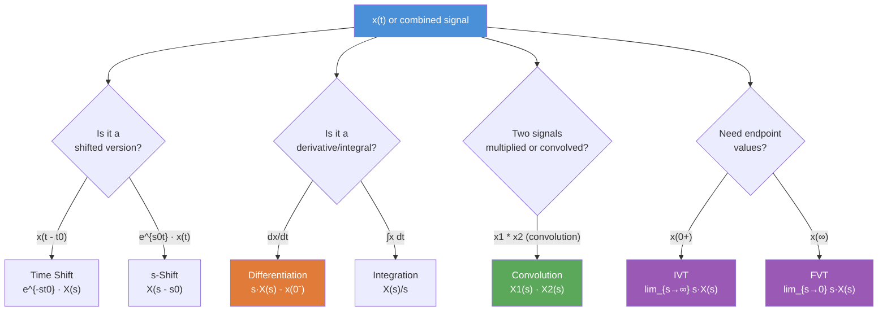

# ⚙️ Laplace Transform Properties

> [!abstract] TL;DR
> Laplace transform properties let you compute transforms of complicated signals by combining known pairs — no integral evaluation required. The differentiation property is the engine for converting LCCDEs to algebraic equations, and the Initial/Final Value Theorems let you read off $x(0^+)$ and $x(\infty)$ directly from $X(s)$ without inverting.

## Intuition — analogy FIRST

Properties are like grammar rules for the $s$-domain language. Just as you don't re-derive arithmetic from axioms every time — you use the rule "multiply by 10 to shift a decimal" — you don't re-evaluate the integral every time. Once you've memorized that time-shifting multiplies by $e^{-st_0}$ and differentiation multiplies by $s$, solving a differential equation becomes as mechanical as algebra. The differentiation property is especially powerful: it turns $\frac{d}{dt}$ into multiplication by $s$, flattening an ODE into an algebraic equation instantly.

---

## How It Works



---

## Key Concepts / Details

### Properties Reference Table

| Property | Time Domain | $s$-Domain | ROC Note |
|----------|-------------|-----------|----------|
| **Linearity** | $a\,x_1(t) + b\,x_2(t)$ | $a\,X_1(s) + b\,X_2(s)$ | At least $R_1 \cap R_2$ |
| **Time Shift** | $x(t-t_0)\,u(t-t_0)$ | $e^{-st_0}X(s)$ | Same ROC as $X$ |
| **s-Domain Shift** | $e^{s_0 t}\,x(t)$ | $X(s - s_0)$ | Shifted by $\text{Re}\{s_0\}$ |
| **Time Scaling** | $x(at)$ | $\dfrac{1}{\lvert a\rvert}X\!\left(\dfrac{s}{a}\right)$ | Scaled ROC |
| **Time Reversal** | $x(-t)$ | $X(-s)$ | ROC reflected |
| **Differentiation (unilateral)** | $\dfrac{dx}{dt}$ | $s\,X(s) - x(0^-)$ | Same or larger |
| **Nth Derivative** | $\dfrac{d^n x}{dt^n}$ | $s^n X(s) - s^{n-1}x(0^-) - \cdots - x^{(n-1)}(0^-)$ | — |
| **Time Integration** | $\displaystyle\int_{0}^{t} x(\tau)\,d\tau$ | $\dfrac{X(s)}{s}$ | $R \cap \{\text{Re}\{s\}>0\}$ |
| **Convolution** | $x_1(t) * x_2(t)$ | $X_1(s)\cdot X_2(s)$ | At least $R_1 \cap R_2$ |
| **Multiplication (s-diff)** | $t\,x(t)$ | $-\dfrac{dX}{ds}$ | Same ROC |
| **Initial Value Theorem** | $x(0^+)$ | $\displaystyle\lim_{s\to\infty} s\,X(s)$ | Requires $x(t)$ causal |
| **Final Value Theorem** | $\displaystyle\lim_{t\to\infty} x(t)$ | $\displaystyle\lim_{s\to 0} s\,X(s)$ | All poles of $sX(s)$ in LHP |

---

### Differentiation Property — The LCCDE Killer

For the unilateral LT, the Nth-order LCCDE

$$\sum_{k=0}^{N} a_k \frac{d^k y}{dt^k} = \sum_{k=0}^{M} b_k \frac{d^k x}{dt^k}$$

transforms to (zero initial conditions):

$$\left(\sum_{k=0}^{N} a_k s^k\right) Y(s) = \left(\sum_{k=0}^{M} b_k s^k\right) X(s)$$

giving $H(s) = Y(s)/X(s) = \frac{\sum b_k s^k}{\sum a_k s^k}$ directly.

With non-zero ICs, e.g., $y'' + 3y' + 2y = x(t)$ with $y(0^-)=1$, $y'(0^-)=0$:

$$[s^2 Y - s\cdot 1 - 0] + 3[s Y - 1] + 2Y = X(s)$$
$$Y(s)(s^2 + 3s + 2) = X(s) + s + 3$$
$$Y(s) = \underbrace{\frac{X(s)}{s^2+3s+2}}_{\text{zero-state}} + \underbrace{\frac{s+3}{s^2+3s+2}}_{\text{zero-input}}$$

---

### Initial Value Theorem (IVT)

$$x(0^+) = \lim_{s \to \infty} s\,X(s)$$

**Conditions**: $x(t)$ must be causal ($x(t)=0$, $t<0$) and $X(s)$ must be proper or strictly proper.

**Example**: $X(s) = \frac{s+3}{s^2+3s+2}$
$$\lim_{s\to\infty} s \cdot \frac{s+3}{s^2+3s+2} = \lim_{s\to\infty} \frac{s^2+3s}{s^2+3s+2} = 1 \quad \Rightarrow\quad x(0^+) = 1$$

---

### Final Value Theorem (FVT)

$$\lim_{t \to \infty} x(t) = \lim_{s \to 0} s\,X(s)$$

**Conditions**: $s\,X(s)$ must have ALL poles strictly in the open LHP (Re$\{p\}<0$). If $X(s)$ has poles on the $j\omega$-axis or in the RHP, the FVT gives a meaningless number.

**Example**: $X(s) = \frac{2}{s(s+1)}$ (step response of first-order system)
$$\lim_{s\to 0} s \cdot \frac{2}{s(s+1)} = \frac{2}{1} = 2 \quad\Rightarrow\quad x(\infty) = 2 \checkmark$$

**FVT failure example**: $X(s) = \frac{1}{s^2+1}$ (poles at $\pm j$, on $j\omega$-axis — $x(t)=\sin(t)$ oscillates, no limit):
$$\lim_{s\to 0} s \cdot \frac{1}{s^2+1} = 0 \quad \text{(WRONG — } x(t)\text{ doesn't converge)}$$

---

### Python — IVT and FVT Verification

```python
import sympy as sp

s = sp.Symbol('s')

# Example: X(s) = (s+3) / (s^2 + 3s + 2)
X = (s + 3) / (s**2 + 3*s + 2)

# Initial Value Theorem: lim s->inf of s*X(s)
ivt = sp.limit(s * X, s, sp.oo)
print(f"IVT: x(0+) = {ivt}")   # 1

# Final Value Theorem: lim s->0 of s*X(s)
fvt = sp.limit(s * X, s, 0)
print(f"FVT: x(inf) = {fvt}")  # 3/2

# Verify by inverting: X(s) = -1/(s+1) + 2/(s+2)
# x(t) = (-e^{-t} + 2e^{-2t})? No...
# Let's check via inverse_laplace_transform
t = sp.Symbol('t', positive=True)
x_t = sp.inverse_laplace_transform(X, s, t)
print(f"x(t) = {x_t}")
print(f"x(0+) = {sp.limit(x_t, t, 0, '+')}")    # Should match IVT
print(f"x(inf) = {sp.limit(x_t, t, sp.oo)}")     # Should match FVT

# Time shift property demonstration
# x(t-2)u(t-2) <-> e^{-2s} * X(s)
X_shifted = sp.exp(-2*s) * X
print("Shifted X(s):", X_shifted)
```

---

## Real-World Notes

- The differentiation property is why Laplace is the standard tool for solving circuits with L/C elements: $V_L = L\,di/dt \;\to\; V_L(s) = sL\,I(s) - L\,i(0^-)$.
- The convolution property ($x*h \leftrightarrow XH$) is what enables the transfer function concept: output = input times system in the $s$-domain.
- The FVT is used in control engineering to find the steady-state error of a control system without simulating the full transient.
- Time scaling compresses/expands signals: $x(2t)$ has half the duration and twice the bandwidth.
- The s-domain shift property explains why damped sinusoids $e^{-\alpha t}\cos(\omega_0 t)$ appear: they are cosines shifted by $\alpha$ in the $s$-domain.

## Common Pitfalls

- **IVT on improper fractions**: If degree of numerator $\geq$ degree of denominator, $sX(s) \to \infty$ — IVT doesn't apply directly. Separate the impulsive part first.
- **FVT with unstable poles**: Always check that all poles of $sX(s)$ are in the open LHP before applying FVT. Applying it blindly to oscillatory or growing signals gives a finite but wrong answer.
- **Time-shift vs s-shift confusion**: $x(t-t_0) \leftrightarrow e^{-st_0}X(s)$ (time domain shift); $e^{s_0 t}x(t) \leftrightarrow X(s-s_0)$ (frequency shift). They go in opposite domains.
- **Differentiation initial conditions**: The term $x(0^-)$ (not $x(0^+)$) appears in the formula. For zero-IC problems they're equal, but for impulse-driven systems they differ.
- **Linearity ROC**: The ROC of the sum is only guaranteed to contain $R_1 \cap R_2$; if there is pole-zero cancellation, it may be larger.

## Related Concepts

- [[Laplace_Transform]] — Base pairs that these properties operate on
- [[Transfer_Functions]] — Differentiation property derivation of $H(s)$
- [[Inverse_Laplace]] — After applying properties to get $X(s)$, PFE inverts it

## Review Questions

1. Use the differentiation property to find the Laplace transform of $\frac{d}{dt}[e^{-3t}u(t)]$ in two ways: (a) by differentiating $x(t)$ directly and computing its LT, (b) using $sX(s) - x(0^-)$. Verify they agree.
2. Given $X(s) = \frac{4s+5}{s^2+5s+6}$, apply the IVT and FVT to find $x(0^+)$ and $x(\infty)$. Is the FVT valid here?
3. A system has transfer function $H(s) = \frac{1}{s+2}$. Using the convolution property, find $Y(s)$ when $x(t) = e^{-t}u(t)$, then invert to get $y(t)$.

## Sources

- Oppenheim & Willsky, *Signals and Systems*, 2nd ed., Chapter 9
- Lathi & Ding, *Modern Digital and Analog Communication Systems*, Appendix B
- Phillips, Parr & Riskin, *Signals, Systems, and Transforms*, Chapter 5

#signals-and-systems #laplace-transform #intermediate
