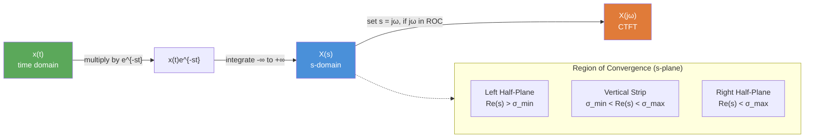

# 📐 Laplace Transform

> [!abstract] TL;DR
> The Laplace transform maps a continuous-time signal $x(t)$ to $X(s)$ in the complex $s$-plane, where $s = \sigma + j\omega$. The Region of Convergence (ROC) specifies which values of $s$ make the integral converge, and it is essential for uniquely recovering $x(t)$ from $X(s)$. The CTFT is the special case $\sigma = 0$, valid only when the ROC includes the $j\omega$-axis.

## Intuition — analogy FIRST

Think of the Laplace transform as a "weighted CTFT with a decay knob." When computing the CTFT you multiply $x(t)$ by $e^{-j\omega t}$ — a pure oscillator of unit magnitude. But if $x(t)$ grows over time (e.g., $e^{2t}$), this oscillator can't suppress the growth and the integral diverges.

The Laplace transform adds a real exponential damper: you multiply by $e^{-\sigma t}$ first, *then* take the Fourier transform of the damped signal. By choosing $\sigma$ large enough to beat the signal's growth, you force convergence. The set of all $\sigma$ values (and corresponding $s = \sigma + j\omega$ strips) that work is the ROC.

---

## How It Works



---

## Key Concepts / Details

### Bilateral (Two-Sided) Laplace Transform

$$X(s) = \int_{-\infty}^{\infty} x(t)\, e^{-st}\, dt, \quad s = \sigma + j\omega$$

The integral must converge absolutely: $\int_{-\infty}^{\infty} |x(t) e^{-\sigma t}|\, dt < \infty$.

### Unilateral (One-Sided) Laplace Transform

$$X(s) = \int_{0^-}^{\infty} x(t)\, e^{-st}\, dt$$

Lower limit $0^-$ captures impulses at $t=0$. This is standard for solving initial-value problems with non-zero initial conditions.

### Region of Convergence (ROC)

The ROC is an open vertical strip (or half-plane) in the $s$-plane:

| Signal Type | ROC Shape | Example |
|-------------|-----------|---------|
| Right-sided: $x(t) = 0$ for $t < T$ | Right half-plane: $\text{Re}\{s\} > \sigma_{\min}$ | $e^{-\alpha t}u(t) \Rightarrow \text{Re}\{s\} > -\alpha$ |
| Left-sided: $x(t) = 0$ for $t > T$ | Left half-plane: $\text{Re}\{s\} < \sigma_{\max}$ | $-e^{-\alpha t}u(-t) \Rightarrow \text{Re}\{s\} < -\alpha$ |
| Two-sided | Vertical strip: $\sigma_1 < \text{Re}\{s\} < \sigma_2$ | $e^{-a|t|} \Rightarrow -a < \text{Re}\{s\} < a$ |
| Finite duration | Entire $s$-plane (except possibly $s=0$ or $\infty$) | Rectangular pulse |

> [!important] ROC Rules
> - The ROC cannot contain any poles of $X(s)$.
> - For causal, stable LTI systems: ROC is a right half-plane containing the $j\omega$-axis.
> - The ROC determines $x(t)$ uniquely from $X(s)$.

### Transform Pairs Table

| $x(t)$ | $X(s)$ | ROC |
|--------|--------|-----|
| $\delta(t)$ | $1$ | All $s$ |
| $u(t)$ | $\dfrac{1}{s}$ | $\text{Re}\{s\} > 0$ |
| $-u(-t)$ | $\dfrac{1}{s}$ | $\text{Re}\{s\} < 0$ |
| $e^{-\alpha t}u(t)$ | $\dfrac{1}{s+\alpha}$ | $\text{Re}\{s\} > -\alpha$ |
| $t\, u(t)$ | $\dfrac{1}{s^2}$ | $\text{Re}\{s\} > 0$ |
| $t^n u(t)$ | $\dfrac{n!}{s^{n+1}}$ | $\text{Re}\{s\} > 0$ |
| $\sin(\omega_0 t)\,u(t)$ | $\dfrac{\omega_0}{s^2+\omega_0^2}$ | $\text{Re}\{s\} > 0$ |
| $\cos(\omega_0 t)\,u(t)$ | $\dfrac{s}{s^2+\omega_0^2}$ | $\text{Re}\{s\} > 0$ |
| $e^{-\alpha t}\sin(\omega_0 t)\,u(t)$ | $\dfrac{\omega_0}{(s+\alpha)^2+\omega_0^2}$ | $\text{Re}\{s\} > -\alpha$ |
| $e^{-\alpha t}\cos(\omega_0 t)\,u(t)$ | $\dfrac{s+\alpha}{(s+\alpha)^2+\omega_0^2}$ | $\text{Re}\{s\} > -\alpha$ |
| $\delta(t - t_0)$ | $e^{-st_0}$ | All $s$ |

### Relation to CTFT

$$X(j\omega) = X(s)\big|_{s=j\omega} \quad \text{only when the ROC includes the } j\omega\text{-axis}$$

Equivalently, $X(j\omega) = \mathcal{F}\{x(t)\} = \mathcal{L}\{x(t)\}\big|_{\sigma=0}$.

If the ROC excludes the $j\omega$-axis (e.g., an unstable system), the CTFT does not exist, but the Laplace transform still does.

### Python — Laplace Pairs Verification with SymPy

```python
import sympy as sp

t, s, alpha, omega0 = sp.symbols('t s alpha omega_0', real=True, positive=True)

# Verify e^{-alpha*t}*u(t) <-> 1/(s+alpha)
x = sp.exp(-alpha * t)
X = sp.laplace_transform(x, t, s)
print("e^(-at)u(t) ->", X)
# Output: (1/(alpha + s), -alpha, True)
#          ^^^^^^^^^^^   ^^^^^ ROC: Re{s} > -alpha

# Verify sin(omega0*t)*u(t)
x2 = sp.sin(omega0 * t)
X2 = sp.laplace_transform(x2, t, s)
print("sin(w0*t)u(t) ->", X2)
# Output: (omega_0/(omega_0**2 + s**2), 0, True)

# scipy: poles and zeros of a transfer function
from scipy import signal
import numpy as np

# H(s) = (s+3) / [(s+1)(s+2)] = (s+3)/(s^2+3s+2)
num = [1, 3]
den = [1, 3, 2]
sys = signal.TransferFunction(num, den)
print("Poles:", sys.poles)   # [-2. -1.]
print("Zeros:", sys.zeros)   # [-3.]
```

---

## Real-World Notes

- Every physical causal signal is right-sided, so the ROC is always a right half-plane — simplifying analysis greatly.
- In circuit analysis, the Laplace transform turns capacitor/inductor differential equations into impedance: $Z_C(s) = 1/(sC)$, $Z_L(s) = sL$.
- The $s$-plane pole locations directly encode the system's transient response: $\text{Re}\{p\} < 0$ gives decay, $\text{Re}\{p\} = 0$ gives oscillation, $\text{Re}\{p\} > 0$ gives growth.
- Control engineers design feedback loops by placing poles in the left half-plane using the Laplace framework.
- Unilateral LT is preferred in most engineering courses because it naturally handles initial conditions.

## Common Pitfalls

- **Forgetting the ROC**: Two different $x(t)$ can share the same $X(s)$ formula but have different ROCs — the ROC is not optional.
- **Using CTFT formula when ROC excludes $j\omega$-axis**: $X(j\omega) \neq X(s)|_{s=j\omega}$ when the system is unstable.
- **Bilateral vs unilateral confusion**: The unilateral transform assumes $x(t)=0$ for $t<0$; applying it to non-causal signals gives wrong answers.
- **Sign in the exponent**: $X(s) = \int x(t)e^{-st}dt$ — the minus sign is essential. Positive exponent gives the inverse.
- **ROC for sums**: When adding two Laplace transforms, the ROC of the sum is at least the intersection of the individual ROCs.

## Related Concepts

- [[Laplace_Properties]] — Rules to compute LT without evaluating integrals directly
- [[Transfer_Functions]] — $H(s) = Y(s)/X(s)$, built from these pairs
- [[Inverse_Laplace]] — Recovering $x(t)$ from $X(s)$ using PFE

## Review Questions

1. What is the ROC of $x(t) = e^{2t}u(t)$? Does its CTFT exist? Justify using the ROC.
2. Two signals have the same $X(s) = \frac{1}{s+3}$ but different ROCs: $\text{Re}\{s\}>-3$ and $\text{Re}\{s\}<-3$. What is $x(t)$ in each case?
3. Find the Laplace transform of $x(t) = e^{-2t}\cos(3t)\,u(t)$ and state the ROC.

## Sources

- Oppenheim & Willsky, *Signals and Systems*, 2nd ed., Chapter 9
- Haykin & Van Veen, *Signals and Systems*, Chapter 6
- Lathi & Ding, *Modern Digital and Analog Communication Systems*, Appendix B

#signals-and-systems #laplace-transform #intermediate
