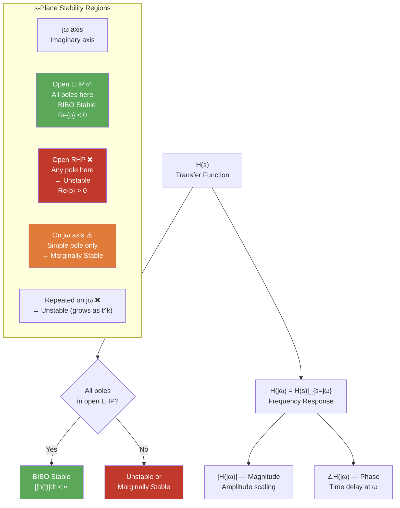

# 📊 Stability and Frequency Response

> [!abstract] TL;DR
> A causal LTI system is BIBO stable if and only if all poles of $H(s)$ lie in the open left half-plane. The Routh-Hurwitz criterion checks this without computing roots. Setting $s = j\omega$ in a stable $H(s)$ gives the frequency response $H(j\omega)$, whose magnitude and phase completely describe how each sinusoidal frequency is scaled and shifted.

## Intuition — analogy FIRST

Imagine each pole is a weight hanging from a mobile. A weight in the left half-plane pulls the mobile downward toward zero — the system returns to rest after perturbation (stable). A weight in the right half-plane pushes the mobile away from zero — the system runs away (unstable). A weight exactly on the $j\omega$-axis keeps the mobile at the same height forever — oscillating without decay (marginally stable). Frequency response is what you hear when you play a pure tone through a system — the system amplifies some frequencies, attenuates others. The pole-zero geometry in the $s$-plane tells you exactly where the peaks and notches are.

---

## How It Works



---

## Key Concepts / Details

### BIBO Stability from Poles

A causal LTI system with transfer function $H(s)$ is **BIBO stable** if and only if:
$$\int_{-\infty}^{\infty} |h(t)|\, dt < \infty$$

This is equivalent to: **all poles of $H(s)$ have strictly negative real parts** ($\text{Re}\{p_k\} < 0$ for all $k$).

| Pole configuration | Time-domain behavior | Stability classification |
|-------------------|---------------------|-------------------------|
| All poles in open LHP | $h(t) \to 0$ as $t \to \infty$ | **BIBO Stable** |
| Simple poles on $j\omega$-axis | $h(t)$ oscillates, bounded | **Marginally stable** |
| Repeated poles on $j\omega$-axis | $h(t)$ grows as $t^{k-1}$ | **Unstable** |
| Any pole in open RHP | $h(t)$ grows exponentially | **Unstable** |

---

### Routh-Hurwitz Stability Criterion

Given characteristic polynomial $A(s) = a_N s^N + a_{N-1}s^{N-1} + \cdots + a_1 s + a_0$:

**Necessary condition**: All coefficients $a_k > 0$ (same sign). If any are zero or negative, at least one root is in the RHP or on the $j\omega$-axis — stop.

**Routh Array Construction**: Build an $N+1$ row array:

| Row | $c_1$ | $c_2$ | $c_3$ | $\cdots$ |
|-----|-------|-------|-------|---------|
| $s^N$ | $a_N$ | $a_{N-2}$ | $a_{N-4}$ | $\cdots$ |
| $s^{N-1}$ | $a_{N-1}$ | $a_{N-3}$ | $a_{N-5}$ | $\cdots$ |
| $s^{N-2}$ | $b_1$ | $b_2$ | $b_3$ | $\cdots$ |
| $\vdots$ | $\vdots$ | | | |
| $s^0$ | $a_0$ | | | |

where: $b_1 = \dfrac{a_{N-1}\cdot a_{N-2} - a_N \cdot a_{N-3}}{a_{N-1}}$, $b_2 = \dfrac{a_{N-1}\cdot a_{N-4} - a_N \cdot a_{N-5}}{a_{N-1}}$, etc.

**Decision**: The number of sign changes in the **first column** = the number of roots in the **right half-plane**.

**Example**: $A(s) = s^3 + 2s^2 + 3s + 1$

| Row | Col 1 | Col 2 |
|-----|-------|-------|
| $s^3$ | 1 | 3 |
| $s^2$ | 2 | 1 |
| $s^1$ | $b_1 = \frac{2\cdot3 - 1\cdot1}{2} = \frac{5}{2}$ | 0 |
| $s^0$ | 1 | |

First column: $1, 2, 5/2, 1$ — all positive, **zero sign changes** → all roots in LHP → **stable**.

**Example (unstable)**: $A(s) = s^3 + s^2 + 2s + 8$

| Row | Col 1 | Col 2 |
|-----|-------|-------|
| $s^3$ | 1 | 2 |
| $s^2$ | 1 | 8 |
| $s^1$ | $\frac{1\cdot2-1\cdot8}{1} = -6$ | 0 |
| $s^0$ | 8 | |

First column: $1, 1, -6, 8$ — **two sign changes** → two roots in RHP → **unstable**.

---

### Frequency Response $H(j\omega)$

For a stable system (ROC includes $j\omega$-axis):

$$H(j\omega) = H(s)\big|_{s=j\omega} = |H(j\omega)|\,e^{j\angle H(j\omega)}$$

**Geometric interpretation** in the $s$-plane: evaluate $H(j\omega) = K\frac{\prod_m(j\omega - z_m)}{\prod_n(j\omega - p_n)}$

- $|H(j\omega)| = |K|\dfrac{\prod_m |j\omega - z_m|}{\prod_n |j\omega - p_n|}$ = product of distances from $j\omega$ point to zeros / product of distances to poles
- $\angle H(j\omega) = \sum_m \angle(j\omega - z_m) - \sum_n \angle(j\omega - p_n) + \angle K$

---

### First-Order System

$$H(s) = \frac{K}{s + a}, \quad a > 0$$

- **Time constant**: $\tau = 1/a$
- **DC gain**: $H(0) = K/a$
- **3 dB frequency**: $\omega_{3\text{dB}} = a$ rad/s (where $|H(j\omega)| = |H(0)|/\sqrt{2}$)
- **Magnitude**: $|H(j\omega)| = \dfrac{K}{\sqrt{\omega^2 + a^2}}$, rolls off at $-20$ dB/decade for $\omega \gg a$
- **Phase**: $\angle H(j\omega) = -\arctan(\omega/a)$, ranging from $0°$ to $-90°$

---

### Second-Order System

$$H(s) = \frac{\omega_n^2}{s^2 + 2\zeta\omega_n s + \omega_n^2}$$

| Parameter | Symbol | Meaning |
|-----------|--------|---------|
| Natural frequency | $\omega_n$ | Frequency of oscillation if no damping |
| Damping ratio | $\zeta$ | Controls decay rate; $\zeta = 1/2Q$ |
| Quality factor | $Q = 1/(2\zeta)$ | Sharpness of resonance peak |
| Damped natural freq. | $\omega_d = \omega_n\sqrt{1-\zeta^2}$ | Actual oscillation frequency ($\zeta < 1$) |

**Pole locations**: $p_{1,2} = -\zeta\omega_n \pm j\omega_n\sqrt{1-\zeta^2}$

**Cases**:
- $0 < \zeta < 1$ — **Underdamped**: Complex conjugate poles; $h(t) = \frac{\omega_n}{\omega_d}e^{-\zeta\omega_n t}\sin(\omega_d t)\,u(t)$
- $\zeta = 1$ — **Critically damped**: Repeated real poles at $-\omega_n$; fastest decay without overshoot
- $\zeta > 1$ — **Overdamped**: Two distinct real poles; no oscillation
- $\zeta = 0$ — **Undamped**: Poles on $j\omega$-axis; sustained oscillation (marginally stable)

**Resonant peak** (underdamped, $\zeta < 1/\sqrt{2}$): occurs at $\omega_r = \omega_n\sqrt{1-2\zeta^2}$

$$|H(j\omega_r)|_{\max} = \frac{1}{2\zeta\sqrt{1-\zeta^2}}$$

---

### Python — Frequency Response and Stability

```python
import numpy as np
import matplotlib.pyplot as plt
from scipy import signal

# Second-order system: wn=10, zeta=0.3
wn = 10.0
zeta = 0.3
num = [wn**2]
den = [1, 2*zeta*wn, wn**2]

sys = signal.TransferFunction(num, den)
print("Poles:", sys.poles)

w = np.logspace(-1, 2, 1000)
w_out, H = signal.freqs(num, den, worN=w)
mag_dB = 20 * np.log10(np.abs(H))
phase_deg = np.degrees(np.angle(H))

fig, axes = plt.subplots(2, 1, figsize=(8, 6))
axes[0].semilogx(w_out, mag_dB, label=f'ζ={zeta}')
axes[0].axhline(-3, color='r', linestyle='--', label='-3dB')
axes[0].set_ylabel('|H(jω)| (dB)')
axes[0].legend(); axes[0].grid(True, which='both')

axes[1].semilogx(w_out, phase_deg)
axes[1].set_xlabel('ω (rad/s)')
axes[1].set_ylabel('Phase (°)')
axes[1].grid(True, which='both')
plt.tight_layout()

# Routh-Hurwitz check: use numpy roots
coeffs = den  # [1, 6, wn^2]
roots = np.roots(coeffs)
print("Roots:", roots)
stable = all(r.real < 0 for r in roots)
print("Stable:", stable)

# Compare different zeta values
for z in [0.1, 0.3, 0.7, 1.0, 2.0]:
    d = [1, 2*z*wn, wn**2]
    _, H_z = signal.freqs(num, d, worN=w)
    plt.figure(2)
    plt.semilogx(w, 20*np.log10(np.abs(H_z)), label=f'ζ={z}')
plt.legend(); plt.grid(True, which='both')
plt.xlabel('ω (rad/s)'); plt.ylabel('|H| (dB)')
plt.title('Second-Order System: Effect of Damping Ratio')
plt.show()
```

---

## Real-World Notes

- Overdamped systems ($\zeta > 1$) are sluggish — door closers are designed this way to prevent slamming. Underdamped systems ($\zeta \approx 0.7$) offer the best tradeoff between speed and overshoot in many control applications.
- The Q factor of an RLC circuit or mechanical resonator directly equals $1/(2\zeta)$ — high-Q resonators (quartz crystals, MEMS oscillators) have $\zeta \approx 10^{-4}$, allowing very selective filtering.
- Routh-Hurwitz is essential when transfer functions have symbolic parameters (e.g., gain $K$) — it reveals the range of $K$ for stability without solving the polynomial.
- The 3 dB bandwidth of a first-order low-pass filter equals its pole frequency — this is why RC circuits have $f_{3\text{dB}} = 1/(2\pi RC)$.
- Resonant peaks in underdamped systems cause frequency-specific amplification that can be catastrophic in mechanical structures (Tacoma Narrows Bridge: resonance from $\zeta \approx 0.002$).

## Common Pitfalls

- **Routh-Hurwitz with zero in first column**: A zero in the first column indicates a root on the $j\omega$-axis. Use the $\epsilon$-method (replace zero with small $\epsilon > 0$, take $\lim_{\epsilon\to 0}$) or the auxiliary polynomial method.
- **FVT on marginally stable systems**: Systems with $j\omega$-axis poles have oscillating outputs — the final value does not exist. Applying FVT gives zero, which is wrong.
- **Frequency response only valid for stable systems**: For unstable $H(s)$, $s=j\omega$ is not in the ROC, so $H(j\omega)$ is not the Fourier transform of $h(t)$.
- **Confusing $\omega_n$, $\omega_d$, $\omega_r$**: Natural frequency $\omega_n$, damped natural frequency $\omega_d = \omega_n\sqrt{1-\zeta^2}$, and resonant peak frequency $\omega_r = \omega_n\sqrt{1-2\zeta^2}$ are all different for $\zeta < 1$.
- **Sign convention for Routh table**: Keep the row divisions consistent — always divide by the leading element of the previous row. A sign flip of an entire row is allowed (and changes the count).

## Related Concepts

- [[Transfer_Functions]] — Pole-zero plots and Bode plots derive from the same $H(s)$
- [[Inverse_Laplace]] — PFE of $H(s)$ reveals the modal decomposition used in stability analysis
- [[Laplace_Transform]] — ROC connection: stability requires ROC to include $j\omega$-axis

## Review Questions

1. For $H(s) = \frac{5}{s^3 + 6s^2 + 11s + 6}$: construct the full Routh array, determine how many roots are in the RHP, and classify the system's stability.
2. A second-order system has $\omega_n = 4\,\text{rad/s}$ and $\zeta = 0.5$. Find: (a) the damped natural frequency $\omega_d$, (b) the time constant of the envelope decay, (c) the resonant peak frequency $\omega_r$, and (d) the peak magnitude $|H(j\omega_r)|$.
3. Explain geometrically why a system with a pole close to the $j\omega$-axis (but in the LHP) exhibits a large resonant peak in $|H(j\omega)|$. Use the distance formula for frequency response.

## Sources

- Oppenheim & Willsky, *Signals and Systems*, 2nd ed., Chapter 9
- Ogata, *Modern Control Engineering*, 5th ed., Chapters 5–7
- Phillips, Parr & Riskin, *Signals, Systems, and Transforms*, Chapter 8

#signals-and-systems #laplace-transform #advanced
