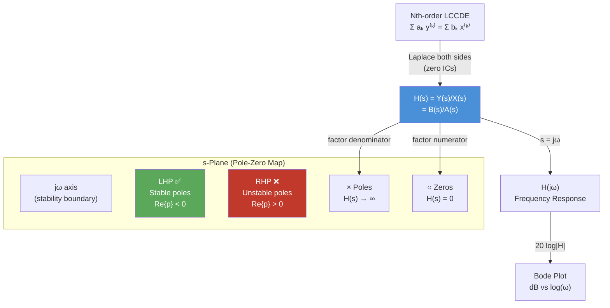

# 🔗 Transfer Functions

> [!abstract] TL;DR
> The transfer function $H(s) = Y(s)/X(s)$ is the Laplace transform of the impulse response and completely characterizes an LTI system. Its poles determine transient behavior and stability; its zeros shape the frequency response. Bode plots provide an asymptotic, log-scale sketch of $|H(j\omega)|$ and $\angle H(j\omega)$ that engineers use to design and analyze filters and controllers.

## Intuition — analogy FIRST

Think of $H(s)$ as the "personality profile" of a system. Once you know $H(s)$, you know everything about how the system responds — to any input, at any frequency, at any time. The poles are like the system's "natural tendencies": a pole at $s=-2$ means the system naturally wants to decay with time constant $0.5\,\text{s}$ regardless of the input. Zeros are "blind spots": a zero at $s = j\omega_0$ means the system completely rejects a sinusoid at frequency $\omega_0$. The Bode plot is just reading these personalities off a logarithmic ruler — each pole contributes a $-20\,\text{dB/decade}$ slope, each zero contributes $+20\,\text{dB/decade}$.

---

## How It Works



---

## Key Concepts / Details

### Definition and Derivation from LCCDE

For a causal LTI system described by:

$$\sum_{k=0}^{N} a_k \frac{d^k y}{dt^k} = \sum_{k=0}^{M} b_k \frac{d^k x}{dt^k}$$

Taking the Laplace transform (zero initial conditions):

$$H(s) = \frac{Y(s)}{X(s)} = \frac{\sum_{k=0}^{M} b_k s^k}{\sum_{k=0}^{N} a_k s^k} = \frac{B(s)}{A(s)}$$

In factored form:

$$H(s) = K \frac{\prod_{m=1}^{M}(s - z_m)}{\prod_{n=1}^{N}(s - p_n)}$$

where $z_m$ are **zeros** (roots of $B(s)$) and $p_n$ are **poles** (roots of $A(s)$), and $K = b_M / a_N$.

---

### Poles, Zeros, and Time-Domain Behavior

| Pole Location | Time-Domain Component | Character |
|---------------|----------------------|-----------|
| Real, $p = -a < 0$ | $e^{-at}$ | Decaying exponential |
| Real, $p = 0$ | Constant ($1$) | Marginal |
| Real, $p = a > 0$ | $e^{at}$ | Growing (unstable) |
| Complex conjugate $p = -\alpha \pm j\omega_d$ | $e^{-\alpha t}\cos(\omega_d t + \phi)$ | Damped oscillation |
| Purely imaginary $p = \pm j\omega_0$ | $\cos(\omega_0 t)$ | Undamped oscillation |
| Repeated real pole $p = -a$ (order $r$) | $t^{r-1}e^{-at}$ | Polynomial × exponential |

---

### Bode Plot Construction Rules

A Bode plot plots $20\log_{10}|H(j\omega)|$ (dB) and $\angle H(j\omega)$ (degrees) vs $\log_{10}(\omega)$.

**Asymptotic magnitude rules:**

| Factor | Magnitude contribution | Phase contribution |
|--------|----------------------|-------------------|
| Constant $K$ | $20\log_{10}|K|$ dB (flat) | $0°$ or $\pm 180°$ |
| Zero at origin $s$ | $+20$ dB/decade slope from $\omega=0$ | $+90°$ constant |
| Pole at origin $1/s$ | $-20$ dB/decade from $\omega=0$ | $-90°$ constant |
| Real zero $(1+s/\omega_z)$ | Slope changes by $+20$ dB/dec at $\omega_z$ | Adds $+45°$ at $\omega_z$, +90° total |
| Real pole $1/(1+s/\omega_p)$ | Slope changes by $-20$ dB/dec at $\omega_p$ | Adds $-45°$ at $\omega_p$, -90° total |
| Complex pole pair | $-40$ dB/dec past $\omega_n$; peak at resonance | $-90°$ at $\omega_n$, steeper for low $\zeta$ |

**Key conversions**: $\pm 20\,\text{dB/decade} \equiv \pm 6\,\text{dB/octave}$.

---

### Phase and Gain Margin

- **Gain Margin (GM)**: The additional gain (dB) allowable before instability — measured at the frequency where $\angle H(j\omega) = -180°$.
- **Phase Margin (PM)**: The additional phase lag before instability — measured at the gain crossover frequency where $|H(j\omega)| = 1$ (0 dB).

A system is stable if GM > 0 dB and PM > 0°. Typical design targets: PM ≥ 45°, GM ≥ 6 dB.

---

### Python — Bode Plot with scipy.signal

```python
import numpy as np
import matplotlib.pyplot as plt
from scipy import signal

# H(s) = 100(s + 2) / [(s + 1)(s^2 + 4s + 100)]
# Numerator: 100*(s + 2) = 100s + 200
# Denominator: (s+1)(s^2+4s+100) = s^3 + 5s^2 + 104s + 100
num = [100, 200]
den = [1, 5, 104, 100]

sys = signal.TransferFunction(num, den)

# Bode plot
w, mag, phase = signal.bode(sys, w=np.logspace(-1, 3, 1000))

fig, (ax1, ax2) = plt.subplots(2, 1, figsize=(8, 6))
ax1.semilogx(w, mag)
ax1.set_ylabel('Magnitude (dB)')
ax1.grid(True, which='both')
ax1.axhline(0, color='r', linestyle='--', label='0 dB')
ax1.legend()

ax2.semilogx(w, phase)
ax2.set_xlabel('Frequency (rad/s)')
ax2.set_ylabel('Phase (degrees)')
ax2.axhline(-180, color='r', linestyle='--', label='-180°')
ax2.grid(True, which='both')
ax2.legend()

plt.tight_layout()
plt.show()

# Poles and zeros
print("Poles:", sys.poles)
print("Zeros:", sys.zeros)

# Gain and phase margins
gm, pm, wg, wp = signal.margin(sys)
print(f"Gain margin: {20*np.log10(gm):.2f} dB at {wg:.2f} rad/s")
print(f"Phase margin: {pm:.2f}° at {wp:.2f} rad/s")
```

---

## Real-World Notes

- In audio equalizers, each band is implemented as a transfer function with poles/zeros placed to boost or cut specific frequency ranges.
- The gain-bandwidth product of op-amps is a consequence of the dominant-pole approximation — a single real pole approximation for $H(s)$.
- PID controllers add a zero at a desired frequency to improve phase margin: the derivative term shifts phase by $+90°$ locally.
- The Bode plot's asymptotic approximation is within 3 dB and 6° of the true response at the break frequencies — more than accurate enough for initial design.
- Mechanical systems have analogous transfer functions: spring-mass-damper systems have the same $H(s)$ form as RLC electrical circuits.

## Common Pitfalls

- **Improper $H(s)$** ($M > N$): Physically unrealizable in a strict sense (more zeros than poles). Means the system has a differentiator; Bode magnitude increases at high frequency without bound.
- **Reading pole-zero plots**: Poles are $\times$, zeros are $\circ$ — don't flip them. The stability region is the LEFT half-plane for poles.
- **Bode phase approximation**: Phase transition for a real pole spans roughly one decade (from $0.1\omega_p$ to $10\omega_p$), not just at the break frequency.
- **dB arithmetic**: $20\log_{10}(AB) = 20\log_{10}A + 20\log_{10}B$ — logs turn multiplication into addition, which is why each factor contributes independently to the Bode plot.
- **Gain vs gain margin**: The gain $K$ shifts the entire Bode magnitude curve up/down by $20\log_{10}|K|$ dB, directly affecting the gain margin.

## Related Concepts

- [[Laplace_Properties]] — Differentiation property derivation of $H(s)$
- [[Inverse_Laplace]] — PFE to go from $H(s)$ to $h(t)$
- [[Stability_Frequency_Response]] — Pole locations determine BIBO stability; $H(j\omega)$ from $H(s)$

## Review Questions

1. For $H(s) = \frac{10(s+5)}{(s+2)(s^2+2s+5)}$: identify all poles and zeros, sketch the pole-zero plot, and determine whether the system is BIBO stable.
2. Sketch the asymptotic Bode magnitude plot for $H(s) = \frac{s+10}{s(s+100)}$. Label all slopes and break frequencies.
3. A system has $H(s) = \frac{K}{(s+1)(s+5)}$. Using Bode plot reasoning, find the value of $K$ that places the gain crossover frequency at $\omega = 2\,\text{rad/s}$.

## Sources

- Oppenheim & Willsky, *Signals and Systems*, 2nd ed., Chapter 9
- Ogata, *Modern Control Engineering*, 5th ed., Chapter 8 (Bode plots)
- Franklin, Powell & Emami-Naeini, *Feedback Control of Dynamic Systems*, Chapter 6

#signals-and-systems #laplace-transform #intermediate
