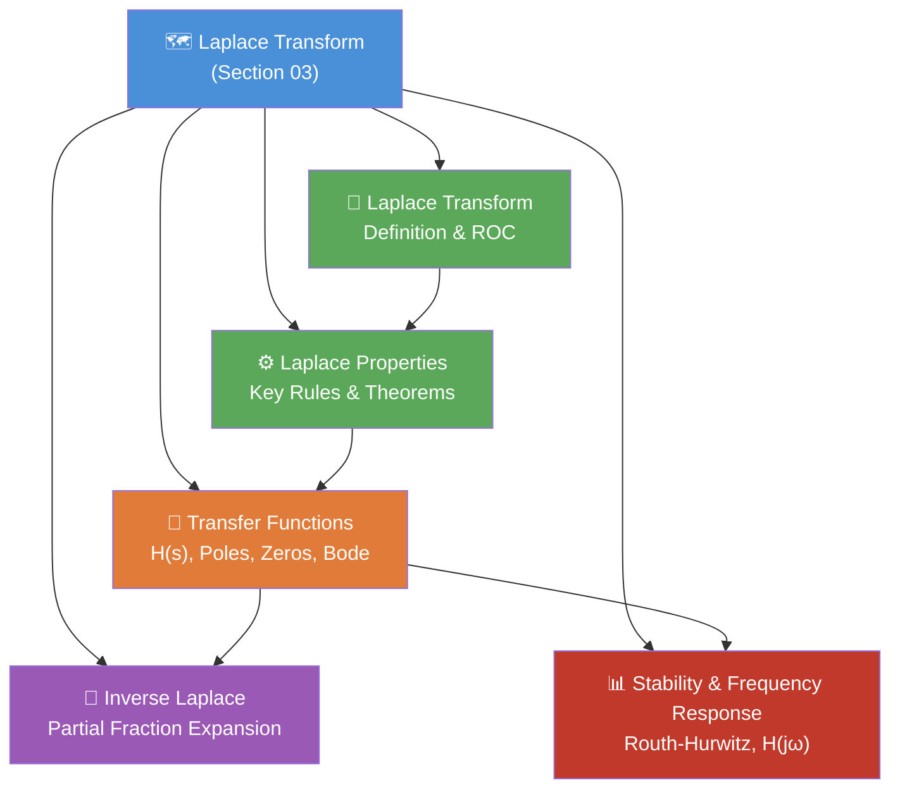

# 🗺️ MOC — Laplace Transform

> [!abstract] Section Overview
> The Laplace transform generalizes the CTFT by using complex frequency $s = \sigma + j\omega$ instead of purely imaginary $j\omega$. It converts differential equations into algebraic equations, captures transient (non-sinusoidal) behavior via the Region of Convergence (ROC), and provides the transfer function $H(s)$ for complete system characterization including stability and frequency response. This section covers the bilateral/unilateral Laplace transform, its properties, transfer functions, inverse Laplace via partial fractions, and Bode plot frequency response.

---

## Section Map

---

## Learning Path

> Follow this sequence for best conceptual build-up:

1. **[[Laplace_Transform]]** — Start here. Understand the $s$-plane, ROC, and the 10 fundamental transform pairs. Grasp why ROC determines the time-domain signal uniquely.
2. **[[Laplace_Properties]]** — Internalize how each property accelerates solving DEs. Pay special attention to the differentiation property and Initial/Final Value Theorems.
3. **[[Transfer_Functions]]** — Connect $H(s)$ to system behavior. Learn to read pole-zero plots and sketch Bode plots without software.
4. **[[Inverse_Laplace]]** — Master partial fraction expansion for distinct, repeated, and complex poles. This is the computational engine for solving LCCDEs.
5. **[[Stability_Frequency_Response]]** — Apply poles for BIBO stability decisions, Routh-Hurwitz for polynomials, and extract frequency response $H(j\omega)$ from $H(s)$.

---

## All Notes in This Section

| Note | Topic | Difficulty | Key Concepts |
|------|-------|------------|--------------|
| [[Laplace_Transform]] | Core definition & ROC | Intermediate | $X(s)$, bilateral vs unilateral, ROC regions, 10+ transform pairs |
| [[Laplace_Properties]] | Transform properties | Intermediate | Linearity, shifting, differentiation, IVT, FVT |
| [[Transfer_Functions]] | $H(s)$ & Bode plots | Intermediate | Poles, zeros, pole-zero plot, asymptotic Bode |
| [[Inverse_Laplace]] | Partial fraction expansion | Intermediate | Distinct/repeated/complex poles, residues, PFE algorithm |
| [[Stability_Frequency_Response]] | Stability & $H(j\omega)$ | Advanced | BIBO, Routh-Hurwitz, 1st/2nd-order systems, $Q$ factor |

---

## Key Questions This Section Answers

- Why does the CTFT fail for signals like $e^{2t}u(t)$, and how does the ROC fix this?
- Given a transfer function $H(s)$, how do you determine if the system is BIBO stable?
- How do you invert $X(s) = \frac{s+3}{(s+1)(s+2)}$ back to the time domain?
- What do poles and zeros tell you about the shape of the frequency response?
- How do you apply Routh-Hurwitz to check stability without computing roots?
- What is the physical meaning of the time constant $\tau$ and damping ratio $\zeta$?

---

## Related Sections

- [[../01_Signals_and_Systems/_MOC_Signals_Systems|Section 01 — Signals & Systems]] — Signal classification and system properties that motivate the transform.
- [[../02_CTFT/_MOC_CTFT|Section 02 — CTFT]] — The special case $s = j\omega$; Laplace generalizes CTFT.
- [[../04_DTFT_Z_Transform/_MOC_DTFT_Z|Section 04 — Z-Transform]] — Discrete-time analog: $z = e^{sT}$ maps $s$-plane to $z$-plane.
- [[../05_Sampling/_MOC_Sampling|Section 05 — Sampling]] — Laplace $\to$ $z$ connection via sampling theorem.

---

## Prerequisites

Before this section, you should be comfortable with:
- Continuous-time convolution and LTI systems
- Complex exponentials $e^{st}$ and Euler's formula
- First- and second-order linear differential equations
- Basic CTFT (at least the definition and a few pairs)

---

#MOC #signals-and-systems #laplace-transform
