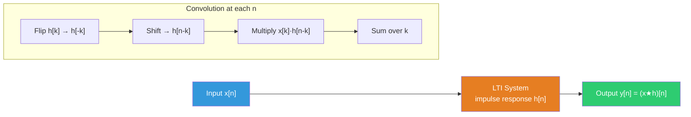

# 🔁 Discrete-Time Convolution

> [!abstract] TL;DR
> The convolution sum $y[n] = \sum_{k=-\infty}^{\infty} x[k]\,h[n-k]$ computes the output of any LTI DT system from its input $x[n]$ and impulse response $h[n]$. Finite-length convolution of signals of lengths $L$ and $M$ produces output of length $L + M - 1$. The graphical "flip-and-slide" method makes convolution intuitive before tackling its algebraic properties.

## Intuition — analogy FIRST

Think of $h[n]$ as a weighted "memory" window. At each time step $n$, you reverse the window, slide it along the input signal, multiply element-by-element, and sum everything up. It is like asking: "Given the system's memory profile $h[n]$, how much does each past input contribute to the output right now?" Each sample $x[k]$ that entered the system $n-k$ steps ago contributes $x[k] \cdot h[n-k]$ to the current output — the convolution sum adds all such contributions.

---

## How It Works



---

## Key Concepts / Details

### The Convolution Sum

$$y[n] = (x * h)[n] = \sum_{k=-\infty}^{\infty} x[k]\,h[n-k]$$

This is the **fundamental formula** for LTI DT system output. It is derived directly from the sifting property:

$$y[n] = \mathcal{H}\!\left\{\sum_k x[k]\,\delta[n-k]\right\} = \sum_k x[k]\,\mathcal{H}\{\delta[n-k]\} = \sum_k x[k]\,h[n-k]$$

### Algebraic Properties

| Property | Formula | Implication |
|----------|---------|------------|
| Commutativity | $x * h = h * x$ | Input and impulse response are interchangeable |
| Associativity | $(x * h_1) * h_2 = x * (h_1 * h_2)$ | Series LTI systems can be combined |
| Distributivity | $x * (h_1 + h_2) = x*h_1 + x*h_2$ | Parallel LTI systems add impulse responses |
| Identity | $x * \delta = x$ | Convolution with impulse returns the signal |
| Shift | $x * \delta[n-k] = x[n-k]$ | Shifted impulse delays the signal by $k$ |

### Length of Convolution

If $x[n]$ is nonzero for $0 \leq n \leq L-1$ (length $L$) and $h[n]$ is nonzero for $0 \leq n \leq M-1$ (length $M$), then:

$$\text{length}(y) = L + M - 1$$

$$y[n] \neq 0 \quad \text{for} \quad 0 \leq n \leq L + M - 2$$

### Graphical (Flip-and-Slide) Method

**Step 1**: Write $x[k]$ as a function of $k$ (fixed).  
**Step 2**: Flip $h[k]$ to get $h[-k]$.  
**Step 3**: Shift right by $n$ to get $h[n-k]$.  
**Step 4**: Multiply $x[k] \cdot h[n-k]$ and sum over all $k$.  
**Step 5**: Repeat for each value of $n$.

### Worked Example: Step-by-Step

Let $x[n] = \{1, 2, 1\}$ (for $n = 0, 1, 2$) and $h[n] = \{1, -1\}$ (for $n = 0, 1$).

Expected output length: $L + M - 1 = 3 + 2 - 1 = 4$.

**Polynomial method** (quick): treat as polynomials in $z^{-1}$:

$X(z^{-1}) = 1 + 2z^{-1} + z^{-2}$  
$H(z^{-1}) = 1 - z^{-1}$

$$Y(z^{-1}) = (1 + 2z^{-1} + z^{-2})(1 - z^{-1})$$

$$= 1 + 2z^{-1} + z^{-2} - z^{-1} - 2z^{-2} - z^{-3}$$

$$= 1 + z^{-1} - z^{-2} - z^{-3}$$

$$\Rightarrow y[n] = \{1, 1, -1, -1\}$$

**Verification by direct sum:**

| $n$ | $\sum_k x[k]h[n-k]$ | $y[n]$ |
|-----|---------------------|--------|
| 0 | $x[0]h[0]$ = 1·1 | 1 |
| 1 | $x[0]h[1]+x[1]h[0]$ = 1·(−1)+2·1 | 1 |
| 2 | $x[1]h[1]+x[2]h[0]$ = 2·(−1)+1·1 | −1 |
| 3 | $x[2]h[1]$ = 1·(−1) | −1 |

### Matrix (Toeplitz) Method

For finite sequences, convolution is a matrix-vector product. With $h = [h_0, h_1, h_2]^T$ and input $x$, the output $y = \mathbf{H}x$ where $\mathbf{H}$ is a Toeplitz matrix:

$$\mathbf{H} = \begin{bmatrix} h_0 & 0 & 0 \\ h_1 & h_0 & 0 \\ h_2 & h_1 & h_0 \\ 0 & h_2 & h_1 \\ 0 & 0 & h_2 \end{bmatrix}$$

This reveals that **every LTI DT system is a linear map** — multiplying by the Toeplitz impulse-response matrix.

### FIR Filter Interpretation

A finite impulse response (FIR) filter is just convolution with a finite-length $h[n]$:

$$y[n] = \sum_{k=0}^{M-1} h[k]\, x[n-k]$$

The $h[k]$ are called **tap weights** or **filter coefficients**. A moving average filter has $h[k] = 1/M$ for all $k$.

---

## Real-World Notes

- Digital FIR filters (audio EQ, image convolution, edge detection) are all convolution operations with a designed $h[n]$.
- Image convolution is 2D discrete convolution: $y[m,n] = \sum_{k,l} x[k,l]\,h[m-k,n-l]$.
- The fast convolution algorithm uses FFT: $O(N \log N)$ vs $O(N^2)$ for direct convolution — critical for large signals.
- Overlap-add and overlap-save methods perform block convolution for streaming applications (e.g., real-time audio effects).
- Polynomial multiplication, BigInteger multiplication, and cross-correlation are all convolution variants.

---

## Common Pitfalls

- Forgetting to flip $h$ in the graphical method — writing $h[n+k]$ instead of $h[n-k]$ gives correlation, not convolution.
- Off-by-one errors in the output length — always use $L + M - 1$, not $\max(L, M)$.
- Circular convolution (DFT-based) is not the same as linear convolution — zero-padding is required to match them.
- Commutativity holds algebraically but not always computationally (numerical precision may differ slightly).
- Neglecting edge effects when both sequences are infinite — must carefully track the support of $h[n-k]$ that overlaps with $x[k]$.

---

## Related Concepts

- [[DT_Signals]] — $\delta[n]$ sifting property motivates convolution sum
- [[DT_System_Properties]] — LTI is the prerequisite for using convolution
- [[Difference_Equations]] — recursive computation vs convolution sum
- [[CT_Convolution]] — continuous-time analogue (convolution integral)
- [[_MOC_Z_Transform]] — convolution becomes multiplication in $z$-domain

---

## Review Questions

1. Compute $y[n] = x[n] * h[n]$ where $x[n] = \{1, 2, 3, 2, 1\}$ and $h[n] = \{1, 0, -1\}$ (both starting at $n=0$). State the length of the result.
2. Prove the commutativity property $(x * h)[n] = (h * x)[n]$ using an index substitution.
3. Show that cascading two LTI systems with impulse responses $h_1[n]$ and $h_2[n]$ is equivalent to a single system with impulse response $h[n] = h_1[n] * h_2[n]$.

---

## Sources

- Oppenheim & Schafer, *Discrete-Time Signal Processing*, 3rd ed., Ch. 2
- Proakis & Manolakis, *Digital Signal Processing*, 4th ed., Ch. 2
- McClellan, Schafer & Yoder, *DSP First*, Ch. 5

---

```python
import numpy as np
import matplotlib.pyplot as plt

# --- Direct convolution via numpy ---
x = np.array([1.0, 2.0, 1.0])   # x[n], n=0,1,2
h = np.array([1.0, -1.0])        # h[n], n=0,1

y = np.convolve(x, h)
print(f"x = {x}")
print(f"h = {h}")
print(f"y = x*h = {y}")          # Expected: [1, 1, -1, -1]
print(f"Length: {len(x)} + {len(h)} - 1 = {len(x)+len(h)-1} (got {len(y)})")

# --- Manual convolution (educational) ---
def manual_convolve(x, h):
    """Direct implementation of the convolution sum."""
    Lx, Lh = len(x), len(h)
    Ly = Lx + Lh - 1
    y = np.zeros(Ly)
    for n in range(Ly):
        for k in range(Lx):
            nk = n - k
            if 0 <= nk < Lh:
                y[n] += x[k] * h[nk]
    return y

y_manual = manual_convolve(x, h)
print(f"\nManual convolution: {y_manual}")
print(f"Matches numpy: {np.allclose(y, y_manual)}")

# --- Visualize convolution ---
x2 = np.array([1.0, 2.0, 3.0, 2.0, 1.0])
h2 = np.array([1.0, 0.0, -1.0])   # First-difference filter
y2 = np.convolve(x2, h2)

n_x = np.arange(len(x2))
n_h = np.arange(len(h2))
n_y = np.arange(len(y2))

fig, axes = plt.subplots(3, 1, figsize=(10, 8))
axes[0].stem(n_x, x2, basefmt='k-', markerfmt='bo', linefmt='b-')
axes[0].set_title('Input x[n]'); axes[0].grid(True, alpha=0.3)

axes[1].stem(n_h, h2, basefmt='k-', markerfmt='ro', linefmt='r-')
axes[1].set_title('Impulse Response h[n]'); axes[1].grid(True, alpha=0.3)

axes[2].stem(n_y, y2, basefmt='k-', markerfmt='go', linefmt='g-')
axes[2].set_title(f'Output y[n] = x*h, length = {len(x2)}+{len(h2)}-1 = {len(y2)}')
axes[2].grid(True, alpha=0.3)

for ax in axes:
    ax.set_xlabel('n'); ax.set_ylabel('Amplitude')
plt.tight_layout()
plt.show()
```

#signals-and-systems #dt-signals #intermediate
