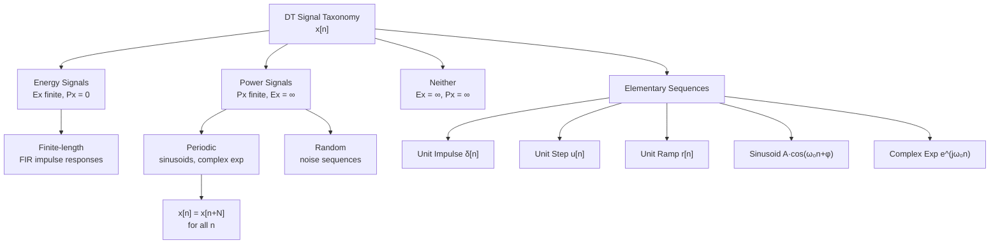

# 📶 Discrete-Time Signals

> [!abstract] TL;DR
> A discrete-time signal $x[n]$ is a sequence of numbers indexed by integers. Unlike CT signals, DT sinusoids are only periodic when $\omega_0/2\pi$ is rational — a crucial difference. The unit impulse $\delta[n]$ and unit step $u[n]$ are the foundational building blocks from which all DT sequences can be constructed via the sifting property.

## Intuition — analogy FIRST

Think of a CT signal as a smooth pen stroke on paper. A DT signal is what you get when you photograph that stroke with a digital camera: you get a grid of pixels — discrete samples at integer positions. Each pixel value is $x[n]$. You can reconstruct the original stroke from the pixels if you sampled densely enough (Nyquist), but the pixel grid is fundamentally different from the continuous curve — you can only ask "what is the value at pixel 3?" not "what is the value between pixels 3 and 4."

---

## How It Works



---

## Key Concepts / Details

### Elementary DT Sequences

**Unit Impulse (Kronecker Delta)**

$$\delta[n] = \begin{cases}1 & n = 0 \\ 0 & n \neq 0\end{cases}$$

Shifted version: $\delta[n-k] = 1$ only at $n = k$.

**Sifting Property** — the most important identity in DT signal processing:

$$x[n] = \sum_{k=-\infty}^{\infty} x[k]\,\delta[n-k]$$

Every signal is a weighted sum of shifted impulses. This directly motivates the convolution sum.

**Unit Step**

$$u[n] = \begin{cases}1 & n \geq 0 \\ 0 & n < 0\end{cases}$$

Relation to impulse: $u[n] = \sum_{k=0}^{\infty}\delta[n-k]$ and $\delta[n] = u[n] - u[n-1]$.

**Unit Ramp**

$$r[n] = n\cdot u[n] = \begin{cases}n & n \geq 0 \\ 0 & n < 0\end{cases}$$

**Real DT Sinusoid**

$$x[n] = A\cos(\omega_0 n + \phi)$$

**Complex Exponential**

$$x[n] = e^{j\omega_0 n} = \cos(\omega_0 n) + j\sin(\omega_0 n)$$

### Periodicity — The Critical DT Difference

A DT sinusoid $x[n] = A\cos(\omega_0 n + \phi)$ is periodic with period $N$ if $x[n+N] = x[n]$ for all $n$, which requires:

$$\omega_0 N = 2\pi m \quad \text{for some integer } m$$

$$\Rightarrow \quad \frac{\omega_0}{2\pi} = \frac{m}{N} \quad \text{(must be rational)}$$

> [!warning] Key Difference from CT
> A CT sinusoid $\cos(\omega_0 t)$ is **always** periodic. A DT sinusoid $\cos(\omega_0 n)$ is periodic **only if** $\omega_0/2\pi \in \mathbb{Q}$. For example, $\cos(\sqrt{2}\,n)$ is **not** periodic.

| $\omega_0$ | $\omega_0/2\pi$ | Periodic? | Period $N$ |
|-----------|----------------|-----------|-----------|
| $\pi/4$ | $1/8$ | Yes | 8 |
| $2\pi/3$ | $1/3$ | Yes | 3 |
| $1$ rad | $1/2\pi$ (irrational) | No | — |
| $\pi$ | $1/2$ | Yes | 2 |

Also note: DT frequency $\omega_0$ is $2\pi$-periodic — $e^{j\omega_0 n} = e^{j(\omega_0 + 2\pi)n}$, so distinct frequencies lie in $[-\pi, \pi)$.

### Energy and Power

**Energy Signal** — finite total energy:

$$E_x = \sum_{n=-\infty}^{\infty} |x[n]|^2 < \infty \quad \Rightarrow \quad P_x = 0$$

**Power Signal** — finite average power:

$$P_x = \lim_{N \to \infty} \frac{1}{2N+1} \sum_{n=-N}^{N} |x[n]|^2 < \infty \quad \Rightarrow \quad E_x = \infty$$

For a periodic sequence with period $N_0$: $P_x = \frac{1}{N_0}\sum_{n=0}^{N_0-1}|x[n]|^2$.

### Signal Transformations

| Operation | Formula | Effect |
|-----------|---------|--------|
| Time shift | $x[n-k]$ | Delay by $k$ samples (right shift if $k>0$) |
| Time reversal | $x[-n]$ | Flip about $n=0$ |
| Downsampling | $x[Mn]$ | Keep every $M$-th sample (compresses) |
| Upsampling | Insert $M-1$ zeros between samples | Expands; introduces spectral images |
| Amplitude scaling | $a \cdot x[n]$ | Scales values |

### Causal vs Non-Causal Sequences

- **Causal**: $x[n] = 0$ for $n < 0$ (e.g., $u[n]$, $a^n u[n]$)
- **Anti-causal**: $x[n] = 0$ for $n > 0$
- **Two-sided**: non-zero for both positive and negative $n$

### DTFT Preview

The DTFT of a DT sequence is $2\pi$-periodic in $\omega$:

$$X(e^{j\omega}) = \sum_{n=-\infty}^{\infty} x[n]\,e^{-j\omega n}, \qquad \omega \in [-\pi, \pi)$$

---

## Real-World Notes

- Digital audio samples (44.1 kHz CD, 48 kHz studio) are DT sequences $x[n]$ — each is a 16-bit or 24-bit integer value.
- Sensor readings from IoT devices (temperature, accelerometer) arrive as DT sequences with fixed sampling periods.
- The unit impulse $\delta[n]$ is exactly representable in a computer — it is a single 1 surrounded by 0s, making it ideal for testing filter implementations.
- Upsampling and downsampling are used in multirate DSP (e.g., audio resampling between 44.1 kHz and 48 kHz).
- DT frequency range $[-\pi, \pi)$ maps to physical frequency $[-f_s/2, f_s/2)$ after sampling.

---

## Common Pitfalls

- Confusing DT periodicity with CT periodicity — always check if $\omega_0/2\pi$ is rational before claiming a DT sequence is periodic.
- Using continuous-time intuition on DT: $x[n] = \delta(n)$ (Dirac) is wrong notation; use $\delta[n]$ (Kronecker).
- Forgetting that DT frequency $\omega$ is dimensionless (radians per sample), not radians per second.
- Downsampling by $M$ can cause aliasing in the frequency domain — this is not "free" compression.
- Energy vs power classification: $u[n]$ is a power signal (infinite energy), not an energy signal.

---

## Related Concepts

- [[CT_Signals]] — continuous-time analogues: $\delta(t)$, $u(t)$
- [[Sampling_Theorem]] — how CT signals become DT sequences
- [[DT_System_Properties]] — how DT systems process these signals
- [[DT_Convolution]] — using the sifting property to compute LTI output
- [[_MOC_DTFT]] — frequency domain of DT sequences

---

## Review Questions

1. Is the signal $x[n] = \cos(0.3\pi n) + \cos(0.4\pi n)$ periodic? If so, find the fundamental period.
2. Classify $x[n] = (0.9)^n u[n]$ as an energy signal or power signal and compute the relevant quantity.
3. Express the signal $x[n] = \{2, -1, 3\}$ (starting at $n=0$) as a weighted sum of shifted unit impulses.

---

## Sources

- Oppenheim & Schafer, *Discrete-Time Signal Processing*, 3rd ed., Ch. 2
- Proakis & Manolakis, *Digital Signal Processing*, 4th ed., Ch. 1
- McClellan, Schafer & Yoder, *DSP First*, Ch. 3

---

```python
import numpy as np
import matplotlib.pyplot as plt

# --- Elementary DT sequences ---
n = np.arange(-5, 16)

# Unit impulse
delta = (n == 0).astype(float)

# Unit step
u = (n >= 0).astype(float)

# DT sinusoid (periodic: omega0/2pi = 1/8, period N=8)
omega0 = np.pi / 4
sinusoid = np.cos(omega0 * n)

fig, axes = plt.subplots(3, 1, figsize=(10, 8))

axes[0].stem(n, delta, basefmt='k-', markerfmt='bo', linefmt='b-')
axes[0].set_title(r'Unit Impulse $\delta[n]$')
axes[0].set_xlabel('n'); axes[0].set_ylabel('Amplitude')
axes[0].grid(True, alpha=0.3)

axes[1].stem(n, u, basefmt='k-', markerfmt='ro', linefmt='r-')
axes[1].set_title(r'Unit Step $u[n]$')
axes[1].set_xlabel('n'); axes[1].set_ylabel('Amplitude')
axes[1].grid(True, alpha=0.3)

axes[2].stem(n, sinusoid, basefmt='k-', markerfmt='go', linefmt='g-')
axes[2].set_title(r'Sinusoid $\cos(\pi n/4)$, period $N=8$')
axes[2].set_xlabel('n'); axes[2].set_ylabel('Amplitude')
axes[2].grid(True, alpha=0.3)

plt.tight_layout()
plt.show()

# --- Sifting property demo ---
x = np.array([2.0, -1.0, 3.0])   # x[0]=2, x[1]=-1, x[2]=3
n_sig = np.arange(len(x))

# Reconstruct via sifting
n_full = np.arange(-2, 8)
reconstructed = np.zeros(len(n_full))
for k, xk in zip(n_sig, x):
    reconstructed += xk * (n_full == k).astype(float)
print("Sifting reconstruction:", reconstructed[2:5])  # Should be [2, -1, 3]
```

#signals-and-systems #dt-signals #beginner
