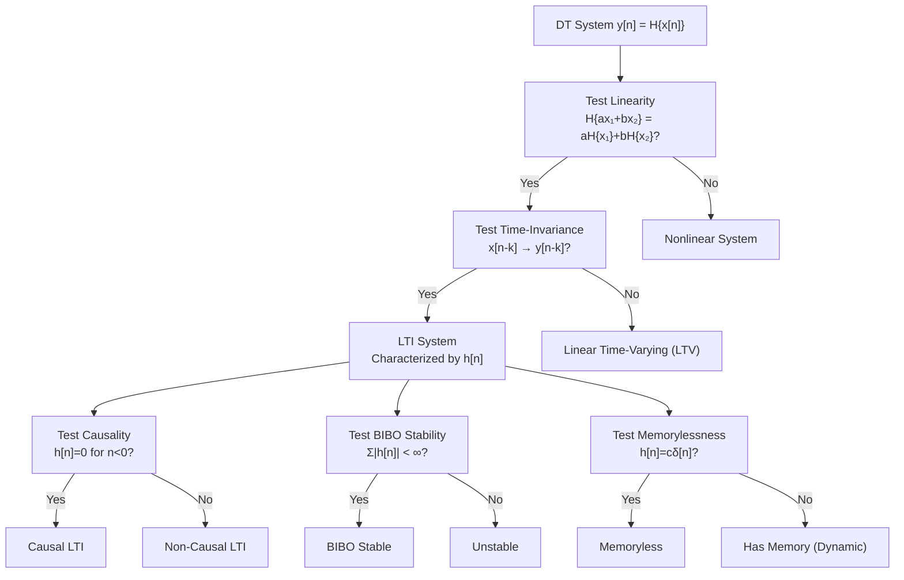

# ⚙️ Discrete-Time System Properties

> [!abstract] TL;DR
> A DT system maps an input sequence $x[n]$ to an output sequence $y[n] = \mathcal{H}\{x[n]\}$. The five key properties — linearity, time-invariance, causality, BIBO stability, and memorylessness — mirror those of CT systems but are evaluated on sequences. A system that is both linear and time-invariant (LTI) is completely characterized by its impulse response $h[n]$.

## Intuition — analogy FIRST

A DT system is like a recipe applied to each page in a book of measurements. Linearity means doubling every measurement doubles the result — no surprises. Time-invariance means the recipe gives the same result whether you apply it starting on page 1 or page 100 — the system doesn't care about the calendar. Causality means the recipe only uses the current and past pages — not future readings. Stability means a recipe that receives bounded ingredients always produces a bounded dish — it never explodes.

---

## How It Works



---

## Key Concepts / Details

### 1. Linearity

A system $\mathcal{H}$ is linear if it satisfies superposition (homogeneity + additivity):

$$\mathcal{H}\{a\,x_1[n] + b\,x_2[n]\} = a\,\mathcal{H}\{x_1[n]\} + b\,\mathcal{H}\{x_2[n]\}$$

**Test**: Set $x[n] = 0$. If $y[n] \neq 0$, the system is nonlinear (DC bias breaks linearity).

### 2. Time-Invariance (TI)

A system is time-invariant if a time shift in input produces an equal time shift in output:

$$x[n] \to y[n] \implies x[n-k] \to y[n-k] \quad \forall\, k \in \mathbb{Z}$$

**Test**: Compute $y_1[n] = \mathcal{H}\{x[n-k]\}$ and $y_2[n] = y[n-k]$ (shift output). If $y_1 \neq y_2$, the system is time-varying.

### 3. Causality

A system is causal if the output at time $n$ depends only on **current and past** inputs:

$$y[n] = f(x[n],\, x[n-1],\, x[n-2],\, \ldots)$$

For LTI systems: **causal $\iff$ $h[n] = 0$ for all $n < 0$**.

### 4. BIBO Stability

A system is BIBO (Bounded-Input Bounded-Output) stable if every bounded input produces a bounded output:

$$|x[n]| \leq M_x < \infty \quad \forall\, n \implies |y[n]| \leq M_y < \infty \quad \forall\, n$$

For LTI systems:

$$\text{BIBO stable} \iff \sum_{n=-\infty}^{\infty} |h[n]| < \infty \quad \text{(absolutely summable impulse response)}$$

### 5. Memorylessness

A system is memoryless if $y[n]$ depends only on $x[n]$ (the current sample):

$$y[n] = f(x[n])$$

For LTI: **memoryless $\iff$ $h[n] = c\,\delta[n]$** for some constant $c$.

---

### Canonical Examples

| System | Formula | Linear | TI | Causal | Stable | Memory |
|--------|---------|--------|----|---------|---------|----|
| Delay | $y[n]=x[n-k],\ k\geq 0$ | Yes | Yes | Yes | Yes | Yes |
| Accumulator | $y[n]=\sum_{k=-\infty}^{n}x[k]$ | Yes | Yes | Yes | **No** | Yes |
| Moving Average | $y[n]=\frac{1}{M}\sum_{k=0}^{M-1}x[n-k]$ | Yes | Yes | Yes | Yes | Yes |
| Squarer | $y[n]=x^2[n]$ | **No** | Yes | Yes | Yes | No |
| Modulator | $y[n]=n\cdot x[n]$ | Yes | **No** | Yes | Yes | No |
| Multiplier | $y[n]=x[n]\cdot u[n]$ | Yes | **No** | Yes | Yes | No |

**Accumulator stability proof:** $h[n] = u[n]$ so $\sum_{n=0}^{\infty}|h[n]| = \sum_{n=0}^{\infty} 1 = \infty$. **Not stable.**

**Moving average stability proof:** $h[n] = \frac{1}{M}$ for $0 \leq n \leq M-1$, else 0. $\sum|h[n]| = \frac{M}{M} = 1 < \infty$. **Stable.**

### CT vs DT Property Comparison

| Property | CT Condition | DT Condition |
|----------|-------------|-------------|
| BIBO Stable | $\int_{-\infty}^{\infty}|h(\tau)|d\tau < \infty$ | $\sum_{n=-\infty}^{\infty}|h[n]| < \infty$ |
| Causal | $h(t)=0,\,t<0$ | $h[n]=0,\,n<0$ |
| Memoryless | $h(t)=c\,\delta(t)$ | $h[n]=c\,\delta[n]$ |
| LTI output | $y(t) = x*h$ (integral) | $y[n] = x*h$ (sum) |

---

## Real-World Notes

- FIR (Finite Impulse Response) filters have finite-length $h[n]$, guaranteeing BIBO stability — preferred for audio equalizers.
- IIR filters (infinite impulse response) can be unstable if poles lie outside the unit circle — stability must always be verified.
- Non-causal filters appear in offline processing (audio mastering, MRI reconstruction) where future samples are available.
- The accumulator is the DT equivalent of an integrator — both are marginally stable at best (pole on unit circle / imaginary axis).
- Modulator $y[n] = n\cdot x[n]$ is time-varying — its behavior depends on when in time the signal arrives.

---

## Common Pitfalls

- Forgetting to check $y[n] = 0$ when $x[n] = 0$ as the first step in the linearity test — many "almost linear" systems fail here.
- Confusing causal systems with stable systems — a system can be causal and unstable (e.g., $h[n] = 2^n u[n]$).
- The modulator $y[n] = x[n]\cdot\cos(\omega_0 n)$ is LTI only if $\omega_0 = 0$; otherwise it is time-varying.
- Treating $h[n] = a^n u[n]$ with $|a| = 1$ as BIBO stable — the $\ell^1$ sum diverges, so it is **marginally stable** (not BIBO stable).
- Assuming that all causal LTI systems are stable — causality and stability are independent properties.

---

## Related Concepts

- [[CT_System_Properties]] — continuous-time counterpart; direct parallel
- [[DT_Signals]] — the input/output sequences being processed
- [[DT_Convolution]] — LTI system output via convolution sum
- [[Difference_Equations]] — LCCDE implementations of DT systems
- [[_MOC_Z_Transform]] — stability analysis via pole locations

---

## Review Questions

1. Is the system $y[n] = x[n]\cdot x[n-1]$ linear? Is it time-invariant? Justify each answer with the formal test.
2. Determine whether the system with impulse response $h[n] = (0.5)^n u[n] - (0.5)^{n-1} u[n-1]$ is BIBO stable.
3. Show that the accumulator $y[n] = \sum_{k=-\infty}^{n}x[k]$ is not BIBO stable by constructing a bounded input that produces an unbounded output.

---

## Sources

- Oppenheim & Schafer, *Discrete-Time Signal Processing*, 3rd ed., Ch. 2
- Proakis & Manolakis, *Digital Signal Processing*, 4th ed., Ch. 2
- Haykin & Van Veen, *Signals and Systems*, 2nd ed., Ch. 3

---

```python
import numpy as np

def test_linearity(H, x1, x2, a=2.0, b=3.0):
    """Test linearity: H{ax1 + bx2} == a*H{x1} + b*H{x2}"""
    lhs = H(a * x1 + b * x2)
    rhs = a * H(x1) + b * H(x2)
    return np.allclose(lhs, rhs)

def test_time_invariance(H, x, k=3):
    """Test TI: H{x[n-k]} == y[n-k]"""
    y_shifted_input = H(np.roll(x, k))
    y_shifted_output = np.roll(H(x), k)
    return np.allclose(y_shifted_input, y_shifted_output)

# --- Define systems ---
def delay(x, d=2):
    return np.roll(x, d)

def accumulator(x):
    return np.cumsum(x)

def squarer(x):
    return x ** 2

def modulator(x):
    n = np.arange(len(x))
    return n * x   # y[n] = n*x[n]

N = 20
x1 = np.random.randn(N)
x2 = np.random.randn(N)

systems = {
    "Delay (d=2)":      lambda x: delay(x, 2),
    "Accumulator":      accumulator,
    "Squarer y=x^2":    squarer,
    "Modulator y=n*x":  modulator,
}

print(f"{'System':<25} {'Linear':>8} {'Time-Inv':>10}")
print("-" * 45)
for name, H in systems.items():
    lin = test_linearity(H, x1, x2)
    ti  = test_time_invariance(H, x1)
    print(f"{name:<25} {str(lin):>8} {str(ti):>10}")

# --- BIBO stability check via impulse response ---
def check_bibo(h_func, N=200):
    n = np.arange(N)
    h = h_func(n)
    l1_norm = np.sum(np.abs(h))
    return l1_norm, l1_norm < np.inf and np.isfinite(l1_norm) and l1_norm < 1e6

impulse_responses = {
    "h[n] = (0.9)^n u[n]":  lambda n: (0.9**n),
    "h[n] = u[n] (accum)":  lambda n: np.ones(len(n)),
    "h[n] = (1/4) rect":    lambda n: (1/4) * ((n >= 0) & (n < 4)).astype(float),
}
print("\n--- BIBO Stability ---")
for name, hf in impulse_responses.items():
    norm, stable = check_bibo(hf)
    print(f"{name:<30}  ||h||_1 ≈ {norm:8.3f}  Stable: {stable}")
```

#signals-and-systems #dt-signals #intermediate
