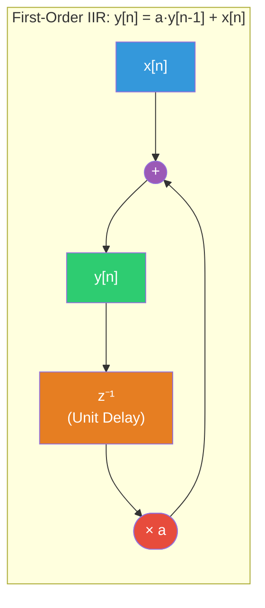
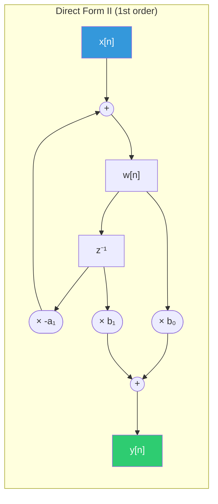

# 📐 Difference Equations

> [!abstract] TL;DR
> A Linear Constant-Coefficient Difference Equation (LCCDE) $\sum_{k=0}^{N} a_k y[n-k] = \sum_{k=0}^{M} b_k x[n-k]$ is the DT counterpart of a differential equation, describing recursive DT systems. Its complete solution is homogeneous + particular; stability requires all characteristic roots to lie inside the unit circle $|r| < 1$. Block diagram realizations using unit delays $z^{-1}$, multipliers, and adders implement these equations directly in hardware or software.

## Intuition — analogy FIRST

A difference equation is like compound interest: your balance next month ($y[n]$) depends on your current balance ($y[n-1]$) multiplied by a growth rate, plus any new deposit ($x[n]$). If the growth rate is $|a| < 1$, old deposits shrink away — a stable system. If $|a| > 1$, the balance explodes — unstable. The difference equation encodes this recursive feedback compactly, and solving it tells you the exact balance at any future time given initial conditions.

---

## How It Works



---

## Key Concepts / Details

### General LCCDE Form

$$\sum_{k=0}^{N} a_k\, y[n-k] = \sum_{k=0}^{M} b_k\, x[n-k]$$

Normalizing $a_0 = 1$:

$$y[n] = -\sum_{k=1}^{N} a_k\, y[n-k] + \sum_{k=0}^{M} b_k\, x[n-k]$$

- **$N$**: order of the system (highest delay in output)
- Left side: feedback (autoregressive) terms — these create the IIR behavior
- Right side: feedforward (moving average) terms — these create the FIR component

### IIR vs FIR

| Type | Condition | Impulse Response | Example |
|------|-----------|-----------------|---------|
| FIR (Non-recursive) | $a_k = 0$ for $k \geq 1$ | Finite-length | Moving average |
| IIR (Recursive) | Some $a_k \neq 0$ | Infinite-length | First-order IIR |

### Solving the LCCDE

**Step 1: Homogeneous Solution** — set input to zero ($x[n] = 0$):

Assume $y_h[n] = r^n$ and substitute:

$$\sum_{k=0}^{N} a_k\, r^{n-k} = 0 \implies r^n \sum_{k=0}^{N} a_k\, r^{-k} = 0$$

**Characteristic equation** (multiply through by $r^N$):

$$a_0 r^N + a_1 r^{N-1} + \cdots + a_N = 0$$

Roots $\{r_1, r_2, \ldots, r_N\}$ give the homogeneous solution:

$$y_h[n] = \sum_{i=1}^{N} C_i\, r_i^n$$

**Step 2: Particular Solution** — assume a solution with the same form as input:

| Input $x[n]$ | Assumed $y_p[n]$ |
|-------------|-----------------|
| $A\,u[n]$ (step) | $K\,u[n]$ |
| $A\,\cos(\omega_0 n)$ | $K_1\cos(\omega_0 n) + K_2\sin(\omega_0 n)$ |
| $A\,a^n u[n]$ | $K\,a^n u[n]$ (if $a$ is not a characteristic root) |

**Step 3: Complete Solution**

$$y[n] = y_h[n] + y_p[n]$$

Apply initial conditions to find $\{C_i\}$.

### First-Order Example

$$y[n] - a\,y[n-1] = x[n], \qquad |a| < 1$$

For input $x[n] = \delta[n]$ (impulse response):

- Characteristic equation: $r - a = 0 \implies r = a$
- Homogeneous: $y_h[n] = C\,a^n$
- For $n \geq 0$: $y[n] = a^n\,u[n]$ (with $C = 1$ from IC $y[-1] = 0$)

$$\boxed{h[n] = a^n\,u[n]}$$

Stability check: $\sum_{n=0}^{\infty} |a|^n = \frac{1}{1-|a|} < \infty$ iff $|a| < 1$. ✓

### Stability via Characteristic Roots

$$\text{BIBO stable} \iff |r_i| < 1 \quad \text{for all characteristic roots } r_i$$

| Root location | System behavior |
|--------------|----------------|
| $|r| < 1$ | Exponentially decaying — stable |
| $|r| = 1$ | Marginally stable (oscillates forever) |
| $|r| > 1$ | Exponentially growing — unstable |

### Block Diagram Representations

**Direct Form I** — implements the LCCDE directly: feedforward branch (input delay chain → weighted sum) followed by feedback branch (output delay chain → weighted sum fed back):

- Requires $N + M$ unit delays total
- Simple to derive from the equation

**Direct Form II** — combines delay chains, using only $\max(N, M)$ unit delays (minimum memory):

$$w[n] = x[n] - \sum_{k=1}^{N} a_k\, w[n-k]$$
$$y[n] = \sum_{k=0}^{M} b_k\, w[n-k]$$



---

## Real-World Notes

- First-order IIR $y[n] = a\,y[n-1] + (1-a)\,x[n]$ is a digital **exponential moving average** — used in trading algorithms, sensor smoothing, and audio envelope followers.
- Biquad (second-order) sections ($N = M = 2$) are the fundamental building blocks of all digital audio filters (EQ, reverb, crossovers).
- Fixed-point implementations of IIR difference equations must handle **limit cycles** — nonlinear oscillations caused by quantization that do not exist in the exact LCCDE.
- FIR filters (no feedback) always require solving a non-recursive equation — no initial conditions needed, inherently stable.
- Z-transform converts the LCCDE to an algebraic equation in $z$, making analysis (poles, zeros, frequency response) straightforward.

---

## Common Pitfalls

- Computing only the particular solution and forgetting the homogeneous solution — the transient is missing, making the solution wrong for finite initial conditions.
- Stability criterion $|r| < 1$ applies to DT; do not confuse with the CT condition $\text{Re}(s) < 0$.
- Direct Form I and II give the same input-output behavior but different internal state variables — they can differ in numerical precision with fixed-point arithmetic.
- Recursive implementation order matters: always compute $y[n]$ from $y[n-1]$, $y[n-2]$, etc. in increasing $n$; reversing the order gives wrong results.
- For non-zero initial conditions, the LCCDE is defined differently (unilateral Z-transform handles these naturally).

---

## Related Concepts

- [[DT_Convolution]] — non-recursive way to compute LTI output (equivalent to LCCDE for LTI systems)
- [[DT_System_Properties]] — BIBO stability links to characteristic root locations
- [[DT_Signals]] — the input/output sequences $x[n]$, $y[n]$
- [[_MOC_Z_Transform]] — transforms LCCDE to polynomial equation $Y(z) = H(z)X(z)$
- [[_MOC_Digital_Filters]] — FIR and IIR filter design via LCCDE

---

## Review Questions

1. Find the impulse response $h[n]$ of the system $y[n] - 0.5\,y[n-1] + 0.25\,y[n-2] = x[n]$. Is this system BIBO stable?
2. Implement the difference equation $y[n] = 0.9\,y[n-1] + 0.1\,x[n]$ as a Direct Form II block diagram with $z^{-1}$ elements, multipliers, and adders.
3. Given the LCCDE $y[n] = x[n] + x[n-1] + x[n-2]$ (no feedback), identify this as FIR or IIR, find its impulse response length, and compute its output for input $x[n] = u[n]$.

---

## Sources

- Oppenheim & Schafer, *Discrete-Time Signal Processing*, 3rd ed., Ch. 2 & 6
- Proakis & Manolakis, *Digital Signal Processing*, 4th ed., Ch. 9
- Lyons, *Understanding Digital Signal Processing*, 3rd ed., Ch. 6

---

```python
import numpy as np
import matplotlib.pyplot as plt
from scipy.signal import lfilter, impulse

# --- First-order IIR: y[n] = a*y[n-1] + x[n] ---
a = 0.8   # feedback coefficient (|a| < 1 → stable)

def diff_eq_manual(x, a, y_init=0.0):
    """Manually implement y[n] = a*y[n-1] + x[n] with initial condition."""
    N = len(x)
    y = np.zeros(N)
    y_prev = y_init
    for n in range(N):
        y[n] = a * y_prev + x[n]
        y_prev = y[n]
    return y

# Impulse response h[n] = a^n u[n]
N = 30
n = np.arange(N)
delta = (n == 0).astype(float)
h_manual = diff_eq_manual(delta, a)
h_exact  = a**n   # analytical: a^n for n >= 0

print(f"First-order IIR, a={a}")
print(f"L1 norm of h[n]: {np.sum(np.abs(h_exact[:200])):.4f}  (exact: {1/(1-a):.4f})")
print(f"BIBO stable: {abs(a) < 1}")

# scipy lfilter: coefficients b=[b0], a=[1, -a_coef] → H(z)=b0/(1-a_coef*z^-1)
b_coef = np.array([1.0])
a_coef = np.array([1.0, -a])          # denominator coefficients
h_scipy = lfilter(b_coef, a_coef, delta)

print(f"Manual vs scipy match: {np.allclose(h_manual, h_scipy)}")

# --- Stability comparison: |a| < 1, |a| = 1, |a| > 1 ---
fig, axes = plt.subplots(3, 1, figsize=(10, 9))
for idx, ai in enumerate([0.8, 1.0, 1.1]):
    h_i = lfilter([1.0], [1.0, -ai], delta)
    axes[idx].stem(n, h_i, basefmt='k-', markerfmt='bo', linefmt='b-')
    label = "Stable" if abs(ai) < 1 else ("Marginally stable" if abs(ai) == 1 else "UNSTABLE")
    axes[idx].set_title(f'a = {ai} → h[n] = ({ai})^n u[n]  [{label}]')
    axes[idx].set_xlabel('n'); axes[idx].set_ylabel('h[n]')
    axes[idx].grid(True, alpha=0.3)
plt.tight_layout()
plt.show()

# --- Second-order system: y[n] - 1.2y[n-1] + 0.4y[n-2] = x[n] ---
# Characteristic equation: r^2 - 1.2r + 0.4 = 0
b2 = np.array([1.0])
a2 = np.array([1.0, -1.2, 0.4])
roots = np.roots(a2)
print(f"\nSecond-order roots: {roots}")
print(f"Magnitudes: {np.abs(roots)}")
print(f"BIBO stable: {all(np.abs(roots) < 1)}")

h2 = lfilter(b2, a2, delta)
fig2, ax = plt.subplots(figsize=(10, 4))
ax.stem(n, h2, basefmt='k-', markerfmt='ro', linefmt='r-')
ax.set_title(f'Second-order IIR impulse response (roots: {np.round(roots,3)})')
ax.set_xlabel('n'); ax.set_ylabel('h[n]'); ax.grid(True, alpha=0.3)
plt.tight_layout()
plt.show()
```

#signals-and-systems #dt-signals #advanced
