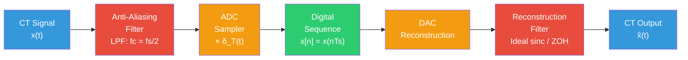

# 📡 Nyquist-Shannon Sampling Theorem

> [!abstract] TL;DR
> A bandlimited CT signal $x(t)$ with maximum frequency $B$ Hz can be perfectly reconstructed from its samples if and only if the sampling frequency $f_s > 2B$. Violating this causes aliasing — high-frequency components fold back and corrupt lower frequencies, creating an irreversible distortion. An anti-aliasing low-pass filter before the ADC prevents this.

## Intuition — analogy FIRST

Imagine watching a helicopter rotor on film. If the camera shoots at exactly the rotor speed, the blades appear frozen — an illusion. If slightly slower, the blades appear to spin backward. This is aliasing: the camera (sampler) cannot distinguish between the true blade position and a lower-frequency rotation. The Nyquist theorem tells you the minimum frame rate to avoid this illusion. You need at least two samples per cycle of the fastest motion to correctly capture it.

---

## How It Works



---

## Key Concepts / Details

### Ideal Sampling

Mathematically, ideal sampling multiplies $x(t)$ by an impulse train:

$$x_s(t) = x(t) \cdot \sum_{n=-\infty}^{\infty} \delta(t - nT_s) = \sum_{n=-\infty}^{\infty} x(nT_s)\,\delta(t - nT_s)$$

where $T_s = 1/f_s$ is the sampling period. The resulting values $x[n] = x(nT_s)$ are the DT sequence.

### Spectrum of the Sampled Signal

Taking the Fourier transform of $x_s(t)$:

$$X_s(j\omega) = \frac{1}{T_s} \sum_{k=-\infty}^{\infty} X\!\left(j(\omega - k\omega_s)\right), \qquad \omega_s = \frac{2\pi}{T_s} = 2\pi f_s$$

The spectrum is a **periodically replicated** version of $X(j\omega)$ with period $\omega_s$.

### Nyquist-Shannon Sampling Theorem

> [!theorem] Nyquist-Shannon
> If $x(t)$ is bandlimited to $B$ Hz (i.e., $X(j\omega) = 0$ for $|\omega| > 2\pi B$), then $x(t)$ is **completely determined** by its samples $x[n] = x(nT_s)$ provided:
> $$f_s > 2B$$
> The **Nyquist rate** is $f_{Nyquist} = 2B$. The **Nyquist frequency** is $f_s/2$.

**Why $f_s > 2B$?** The spectral copies in $X_s(j\omega)$ are centered at $k\omega_s$. Adjacent copies overlap if $\omega_s < 2 \cdot 2\pi B$, i.e., $f_s < 2B$. Overlap = aliasing.

### Aliasing

When $f_s < 2B$, spectral copies overlap and a high-frequency component at $f$ appears as a low-frequency alias at $|f - k f_s|$ for some integer $k$:

$$f_{alias} = \left| f - \text{round}\!\left(\frac{f}{f_s}\right) \cdot f_s \right|$$

| True frequency $f$ | $f_s$ | Aliased to |
|-------------------|-------|-----------|
| 900 Hz | 1000 Hz | 100 Hz |
| 600 Hz | 1000 Hz | 400 Hz |
| 300 Hz | 1000 Hz | 300 Hz (no alias) |

### Digital Frequency Mapping

The digital (DT) frequency $\omega$ (radians/sample) and the analog frequency $\Omega$ (radians/second) are related by:

$$\omega = \Omega \cdot T_s = \frac{\Omega}{f_s} = \frac{2\pi f}{f_s}$$

| Analog frequency $f$ | Digital frequency $\omega$ |
|---------------------|--------------------------|
| $0$ | $0$ |
| $f_s / 4$ | $\pi/2$ |
| $f_s / 2$ (Nyquist) | $\pi$ |
| $f_s$ | $2\pi \equiv 0$ (wraps) |

This is why DT frequency is confined to $[-\pi, \pi)$ — frequencies above the Nyquist fold back.

### Anti-Aliasing Filter (AAF)

A low-pass filter with cutoff $f_c = f_s/2$ applied **before** sampling ensures no energy above $f_s/2$ enters the sampler. This prevents aliasing at the cost of slightly attenuating near-Nyquist components.

$$H_{AAF}(j\omega) = \begin{cases}1 & |\omega| \leq \pi/T_s \\ 0 & |\omega| > \pi/T_s\end{cases}$$

### Reconstruction

**Ideal reconstruction** uses sinc interpolation:

$$x(t) = \sum_{n=-\infty}^{\infty} x[n] \cdot \text{sinc}\!\left(\frac{t - nT_s}{T_s}\right), \qquad \text{sinc}(x) = \frac{\sin(\pi x)}{\pi x}$$

This is impractical (infinite-length sinc). Practical alternatives:

| Method | Description | Quality |
|--------|-------------|---------|
| Zero-Order Hold (ZOH) | Hold last sample | Low |
| Linear interpolation | Straight line between samples | Medium |
| Polynomial spline | Smooth polynomial curve | Good |
| Oversampling + digital filter | Upsample then filter | Excellent |

---

## Real-World Notes

- CD audio: $f_s = 44.1\text{ kHz}$, capturing up to $22.05\text{ kHz}$ — just above human hearing limit ($\approx 20\text{ kHz}$). The AAF before ADC cuts at 20 kHz.
- Medical ECG: sampled at 500 Hz or 1 kHz. Heart rate signals are well below 250 Hz so no aliasing occurs.
- Radar: must sample faster than twice the maximum Doppler shift to avoid velocity ambiguity — same principle.
- Consumer WiFi chips internally oversample at high rates (e.g., 80 MHz) then digitally filter to avoid needing steep analog AAFs.
- Undersampling is intentionally used in RF bandpass sampling: if a signal is bandlimited to a narrow band around a high carrier, you can sample below the carrier frequency without aliasing, as long as $f_s > 2 \times \text{bandwidth}$.

---

## Common Pitfalls

- The theorem requires **strict** inequality $f_s > 2B$; sampling at exactly the Nyquist rate $f_s = 2B$ can fail (e.g., a cosine sampled at exactly its Nyquist rate with an unlucky phase gives all zeros).
- Forgetting that the AAF must be applied before ADC — digital filtering afterward cannot recover already-aliased content.
- Confusing $\omega$ (DT, rad/sample) with $\Omega$ (CT, rad/s) in formulas — always check units.
- Treating ZOH output as the "true" signal — it introduces a sinc-shaped frequency distortion that must be equalized.
- Aliasing is **irreversible** — once two frequencies fold onto the same alias, there is no way to separate them.

---

## Related Concepts

- [[DT_Signals]] — the DT sequence $x[n]$ that results from sampling
- [[CT_Signals]] — the continuous-time signal being sampled
- [[DT_System_Properties]] — properties of the digital systems that process $x[n]$
- [[_MOC_DTFT]] — frequency analysis of $x[n]$; shows $2\pi$-periodicity from sampling
- [[_MOC_Digital_Filters]] — AAF and reconstruction filter design

---

## Review Questions

1. A signal contains frequencies up to 4 kHz. What is the minimum sampling rate to avoid aliasing? If sampled at 6 kHz instead, where does a 4 kHz component alias to?
2. Why is ideal sinc interpolation impractical for reconstruction, and what is its frequency-domain interpretation?
3. Show mathematically that the DTFT of the sampled sequence $X(e^{j\omega})$ is a $2\pi$-periodic version of the CT spectrum $X(j\Omega)$.

---

## Sources

- Oppenheim & Willsky, *Signals and Systems*, 2nd ed., Ch. 7
- Proakis & Manolakis, *Digital Signal Processing*, 4th ed., Ch. 1
- Shannon, C.E., "Communication in the Presence of Noise," *Proc. IRE*, 1949

---

```python
import numpy as np
import matplotlib.pyplot as plt

# --- Aliasing demonstration ---
f_signal = 9.0   # Hz — true signal frequency
f_s_good = 25.0  # Hz — above Nyquist (2*9=18 Hz)
f_s_bad  = 8.0   # Hz — below Nyquist, aliasing occurs

t_cont = np.linspace(0, 1.0, 10000)
x_cont = np.cos(2 * np.pi * f_signal * t_cont)

# Good sampling
n_good = np.arange(0, f_s_good)
t_good = n_good / f_s_good
x_good = np.cos(2 * np.pi * f_signal * t_good)

# Bad sampling (aliased)
n_bad = np.arange(0, f_s_bad)
t_bad = n_bad / f_s_bad
x_bad = np.cos(2 * np.pi * f_signal * t_bad)

# Alias frequency: |f - round(f/fs)*fs|
f_alias = abs(f_signal - round(f_signal / f_s_bad) * f_s_bad)
print(f"True frequency: {f_signal} Hz")
print(f"Sampling rate:  {f_s_bad} Hz  (<= Nyquist)")
print(f"Alias appears at: {f_alias} Hz")

fig, axes = plt.subplots(2, 1, figsize=(10, 6))

axes[0].plot(t_cont, x_cont, 'b-', alpha=0.4, label='CT signal (9 Hz)')
axes[0].stem(t_good, x_good, basefmt='k-', markerfmt='go', linefmt='g-',
             label=f'Samples at fs={f_s_good} Hz (no alias)')
axes[0].set_title(f'Good Sampling: fs={f_s_good} Hz > 2×{f_signal} Hz')
axes[0].legend(); axes[0].grid(True, alpha=0.3)

axes[1].plot(t_cont, x_cont, 'b-', alpha=0.4, label='CT signal (9 Hz)')
axes[1].stem(t_bad, x_bad, basefmt='k-', markerfmt='ro', linefmt='r-',
             label=f'Samples at fs={f_s_bad} Hz (ALIASED → {f_alias} Hz)')
t_alias = np.linspace(0, 1.0, 10000)
axes[1].plot(t_alias, np.cos(2 * np.pi * f_alias * t_alias), 'r--',
             alpha=0.6, label=f'Alias: {f_alias} Hz')
axes[1].set_title(f'Aliasing: fs={f_s_bad} Hz < 2×{f_signal} Hz')
axes[1].legend(); axes[1].grid(True, alpha=0.3)

for ax in axes:
    ax.set_xlabel('Time (s)'); ax.set_ylabel('Amplitude')
plt.tight_layout()
plt.show()
```

#signals-and-systems #dt-signals #intermediate
