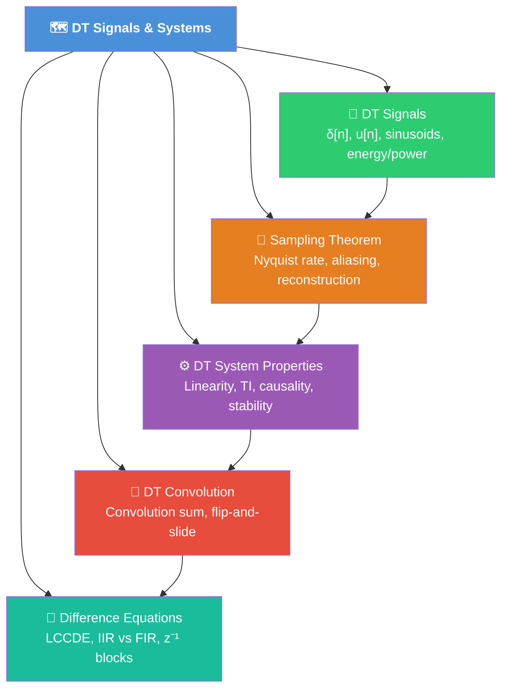

# 🗺️ MOC — Discrete-Time Signals and Systems

> [!abstract] Section Overview
> Discrete-time signals are sequences $x[n]$ defined at integer indices, arising naturally from sampling continuous-time signals or from digital computation. This section covers the basic DT signal building blocks (unit impulse sequence $\delta[n]$, unit step $u[n]$, complex exponential $e^{j\omega n}$), DT system properties (same LTI criteria as CT but for sequences), the Nyquist-Shannon sampling theorem that bridges CT and DT worlds, the convolution sum for LTI DT systems, and difference equations as the DT equivalent of differential equations. Mastery here is the bridge between analog and digital signal processing.

---

## Section Map

---

## Learning Path

> Follow this order for maximum comprehension. Each note builds on the previous.

| Step | Note | Why First |
|------|------|-----------|
| 1 | [[DT_Signals]] | Establish vocabulary: δ[n], u[n], periodicity |
| 2 | [[Sampling_Theorem]] | Bridge CT → DT; understand where sequences come from |
| 3 | [[DT_System_Properties]] | Learn to classify any DT system before computing output |
| 4 | [[DT_Convolution]] | Compute LTI output via convolution sum |
| 5 | [[Difference_Equations]] | Recursive/non-recursive DT system implementations |

---

## All Notes in This Section

| Note | Core Concept | Difficulty | Key Formula |
|------|-------------|------------|-------------|
| [[DT_Signals]] | DT sequences and their properties | Beginner | $x[n] = \sum_k x[k]\,\delta[n-k]$ |
| [[Sampling_Theorem]] | Nyquist-Shannon, aliasing | Intermediate | $f_s > 2B$ |
| [[DT_System_Properties]] | LTI classification for sequences | Intermediate | $\sum|h[n]| < \infty$ (BIBO) |
| [[DT_Convolution]] | Convolution sum for DT LTI | Intermediate | $y[n] = \sum_k x[k]\,h[n-k]$ |
| [[Difference_Equations]] | LCCDE, IIR/FIR, block diagrams | Advanced | $\sum a_k y[n-k] = \sum b_k x[n-k]$ |

---

## Key Questions for This Section

1. What makes DT sinusoidal periodicity fundamentally different from CT?
2. Why must $f_s > 2B$ to avoid aliasing, and what happens when this is violated?
3. How do you determine BIBO stability from an impulse response sequence?
4. Given $x[n]$ and $h[n]$ of finite lengths $L$ and $M$, what is the length of $y[n] = x*h$?
5. When is an LCCDE system IIR vs FIR, and how does this affect stability?

---

## Prerequisites (from Earlier Sections)

- [[CT_Signals]] — CT building blocks (δ(t), u(t), complex exponentials)
- [[CT_System_Properties]] — LTI property definitions to mirror in DT
- [[CT_Convolution]] — Convolution integral as the CT analogue

---

## Related Sections

| Section | Connection |
|---------|-----------|
| [[_MOC_CT_Signals_Systems]] | CT counterpart; DT mirrors every CT concept |
| [[_MOC_DTFT]] | Frequency analysis of DT signals (next section) |
| [[_MOC_Z_Transform]] | Generalizes DTFT; analyzes difference equations |
| [[_MOC_DFT_FFT]] | Practical frequency analysis via FFT |
| [[_MOC_Digital_Filters]] | FIR/IIR filter design using difference equations |

---

## Core Equations at a Glance

$$\delta[n] = \begin{cases}1 & n=0 \\ 0 & n \neq 0\end{cases}, \qquad u[n] = \begin{cases}1 & n \geq 0 \\ 0 & n < 0\end{cases}$$

$$x[n] = \sum_{k=-\infty}^{\infty} x[k]\,\delta[n-k] \quad \text{(sifting property)}$$

$$y[n] = (x * h)[n] = \sum_{k=-\infty}^{\infty} x[k]\,h[n-k]$$

$$f_s > 2B \quad \text{(Nyquist-Shannon sampling theorem)}$$

$$\omega = \Omega \cdot T_s \quad \text{(digital frequency from analog)}$$

---

#MOC #signals-and-systems #dt-signals
