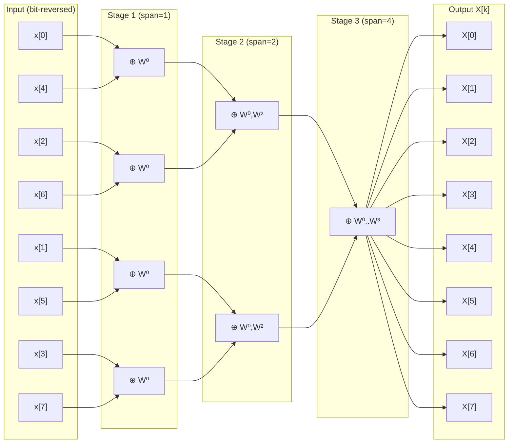

# 📊 DFT and FFT

> [!abstract] TL;DR
> The Discrete Fourier Transform (DFT) computes the spectrum of a finite-length N-point sequence by evaluating the Z-transform at N equally-spaced points on the unit circle. Linear convolution can be computed via DFT using zero-padding (to N ≥ L+M−1) followed by element-wise multiplication and inverse DFT. The Fast Fourier Transform (FFT) is not a different transform — it is a divide-and-conquer algorithm that computes the DFT in O(N log N) operations instead of O(N²), enabling real-time spectral analysis of audio, communications, and radar signals.

---

## Intuition — Analogy First

The DFT is like taking a **stroboscopic photograph** of a signal's frequency content: you illuminate the signal with N different "strobe lights" at equally-spaced frequencies ωk = 2πk/N, and each DFT coefficient X[k] measures how much the signal oscillates at that frequency. The FFT then provides a computational shortcut: instead of computing all N correlation integrals independently (N² operations), you recursively split the problem in half — even-indexed samples into one subproblem, odd-indexed into another — until you hit size-1 problems (trivially X[0] = x[0]). This halving continues log₂N times, giving N·log₂N operations total.

---

## How It Works — Radix-2 Butterfly (N=8)



Each butterfly node computes: $A' = A + W_N^k B$, $B' = A - W_N^k B$ where $W_N = e^{-j2\pi/N}$.

---

## Key Concepts / Details

### DFT Definition

For a length-N sequence x[n], n = 0, 1, ..., N−1:

$$X[k] = \sum_{n=0}^{N-1} x[n] \, W_N^{kn}, \quad k = 0, 1, \ldots, N-1$$

where the **twiddle factor** is:
$$W_N = e^{-j2\pi/N}$$

**Inverse DFT (IDFT)**:
$$x[n] = \frac{1}{N} \sum_{k=0}^{N-1} X[k] \, W_N^{-kn}, \quad n = 0, 1, \ldots, N-1$$

The DFT evaluates X(z) at N points equally spaced on the unit circle:
$$X[k] = X(z)\big|_{z = e^{j2\pi k/N}} = X(e^{j\omega})\big|_{\omega = 2\pi k/N}$$

---

### Frequency Axis and Resolution

| Quantity | Formula | Notes |
|---|---|---|
| DFT bin spacing | $\Delta f = f_s / N$ | Also called frequency resolution |
| Bin k corresponds to | $f_k = k \cdot f_s / N$ | For k = 0, ..., N/2 (positive freqs.) |
| Max unambiguous freq | $f_s / 2$ (Nyquist) | Bins k > N/2 are negative frequencies |
| Total observation time | $T = N / f_s$ | Longer window → finer frequency resolution |

> [!warning] Resolution vs. Interpolation
> Zero-padding from N to 2N halves Δf in the output but does **not** improve true frequency resolution (which is set by T = N/f_s). Zero-padding interpolates the spectrum between existing bins — it reveals the shape of the spectrum but cannot separate two closely-spaced tones that overlap within the window.

---

### Circular (Cyclic) Nature of the DFT

The DFT implicitly assumes x[n] is **periodic with period N**. As a result:
- Time-domain shift: x[n−m mod N] ↔ W_N^(km) · X[k]
- Convolution: circular convolution in time ↔ element-wise multiplication of DFTs

**Circular convolution of length N**:
$$(x_1 \circledast x_2)[n] = \sum_{m=0}^{N-1} x_1[m] \, x_2[(n-m) \bmod N]$$

Circular convolution of N-point sequences ≠ linear convolution unless N ≥ L + M − 1 (see below).

---

### Linear Convolution via DFT (Zero-Padding)

To convolve x[n] (length L) with h[n] (length M):

1. Choose $N \geq L + M - 1$ (next power of 2 for efficiency)
2. Zero-pad both: $\tilde{x}[n] = x[n]$ for n < L, 0 otherwise; similarly $\tilde{h}[n]$
3. Compute X = FFT(x̃, N) and H = FFT(h̃, N)
4. Y = X ⊙ H (element-wise product)
5. y = IFFT(Y), keep first L+M−1 samples

**Why zero-padding works**: with N ≥ L+M−1, the circular convolution modulo-N wrap-around never overlaps valid data, so circular = linear.

---

### FFT Algorithm: Radix-2 Cooley-Tukey (DIT)

**Decimation-In-Time (DIT)** splits x[n] into even-indexed and odd-indexed subsequences:

$$X[k] = \underbrace{\sum_{n=0}^{N/2-1} x[2n] W_N^{2nk}}_{G[k] = \text{even DFT}} + W_N^k \underbrace{\sum_{n=0}^{N/2-1} x[2n+1] W_N^{2nk}}_{H[k] = \text{odd DFT}}$$

Since $W_N^{2nk} = W_{N/2}^{nk}$:
$$X[k] = G[k] + W_N^k H[k], \quad k = 0, \ldots, \tfrac{N}{2}-1$$
$$X[k + \tfrac{N}{2}] = G[k] - W_N^k H[k], \quad k = 0, \ldots, \tfrac{N}{2}-1$$

This is the **butterfly operation**. Applied recursively log₂N times:

| N | Direct DFT (multiplications) | FFT (multiplications) | Speedup |
|---|---|---|---|
| 16 | 256 | 32 | 8× |
| 256 | 65,536 | 1,024 | 64× |
| 1,024 | 1,048,576 | 5,120 | 205× |
| 1,048,576 | 10¹² | 10,485,760 | ~100,000× |

**Bit-reversal permutation**: the input must be reordered by reversing the binary representation of each index before the butterfly stages. For N=8: index 3 (011₂) maps to position 6 (110₂).

---

### Practical FFT Applications

**Power Spectral Density (PSD)**:
$$\hat{S}_{xx}(f_k) = \frac{1}{N f_s} |X[k]|^2$$

Average multiple FFT frames (Welch's method) to reduce variance.

**Short-Time Fourier Transform (STFT)**:
$$\text{STFT}(m, k) = \sum_{n=0}^{N-1} x[n + mH] \, w[n] \, W_N^{kn}$$

where w[n] is an analysis window, H is the hop size, and m is the frame index. STFT produces a **time-frequency spectrogram** — essential for audio, speech, and seismic analysis.

**Overlap-Add for long convolution**: break a long input signal into length-L blocks, convolve each block with h[n] via FFT (of length N ≥ L+M−1), then overlap-add successive output blocks. Complexity: O(N_total log N) vs O(N_total · M) for direct convolution.

---

## Python: FFT with Frequency Axis Construction

```python
import numpy as np
import matplotlib.pyplot as plt

# ── Synthesise a test signal ──────────────────────────────────────────────
fs = 1000          # sampling rate (Hz)
T  = 1.0           # duration (seconds)
N  = int(fs * T)   # number of samples
t  = np.arange(N) / fs

# Signal: two sinusoids at 50 Hz and 200 Hz plus noise
x = (1.5 * np.sin(2*np.pi*50*t) +
     0.8 * np.sin(2*np.pi*200*t) +
     0.3 * np.random.randn(N))

# ── Compute FFT ───────────────────────────────────────────────────────────
X = np.fft.fft(x)          # complex spectrum, length N
X_mag = np.abs(X)           # magnitude |X[k]|
X_phase = np.angle(X)       # phase angle

# Frequency axis: bins 0..N/2-1 are positive, N/2..N-1 are negative
freqs = np.fft.fftfreq(N, d=1/fs)   # in Hz, range [-fs/2, +fs/2)

# For one-sided plot, keep only k = 0..N/2
half = N // 2
freqs_pos = freqs[:half]
X_onesided = (2 / N) * X_mag[:half]   # multiply by 2 to conserve power (except DC, Nyquist)
X_onesided[0] /= 2   # DC: do not double

# ── Zero-padding example (interpolated spectrum) ──────────────────────────
N_pad = 4 * N
X_padded = np.fft.fft(x, n=N_pad)
freqs_pad = np.fft.fftfreq(N_pad, d=1/fs)[:N_pad//2]
X_pad_mag = (2/N_pad) * np.abs(X_padded[:N_pad//2])

# ── Circular vs Linear convolution ───────────────────────────────────────
h  = np.array([1.0, 0.5, 0.25])   # short FIR filter
L, M = len(x), len(h)
N_conv = int(2**np.ceil(np.log2(L + M - 1)))  # next power of 2 >= L+M-1

X_fft = np.fft.fft(x, n=N_conv)
H_fft = np.fft.fft(h, n=N_conv)
y_fft = np.real(np.fft.ifft(X_fft * H_fft))[:L+M-1]

y_direct = np.convolve(x, h)   # reference
print(f"Max error (FFT vs direct convolution): {np.max(np.abs(y_fft - y_direct)):.2e}")
# Should be ~1e-12 (floating point only)

# ── Plot ──────────────────────────────────────────────────────────────────
fig, axes = plt.subplots(3, 1, figsize=(10, 10))

axes[0].plot(t[:200], x[:200])
axes[0].set_title('Time-domain signal (first 200 ms)')
axes[0].set_xlabel('Time (s)'); axes[0].grid(True)

axes[1].plot(freqs_pos, X_onesided, label='N-point FFT')
axes[1].plot(freqs_pad, X_pad_mag, '--', alpha=0.7, label=f'{N_pad}-point (zero-padded)')
axes[1].set_title('One-sided Amplitude Spectrum')
axes[1].set_xlabel('Frequency (Hz)'); axes[1].set_ylabel('Amplitude')
axes[1].set_xlim([0, 300]); axes[1].legend(); axes[1].grid(True)

# STFT spectrogram
from scipy.signal import spectrogram
f_spec, t_spec, Sxx = spectrogram(x, fs=fs, window='hann',
                                   nperseg=128, noverlap=64)
axes[2].pcolormesh(t_spec, f_spec, 10*np.log10(Sxx + 1e-12), shading='gouraud', cmap='inferno')
axes[2].set_title('STFT Spectrogram (Hann window, N=128)')
axes[2].set_xlabel('Time (s)'); axes[2].set_ylabel('Frequency (Hz)')
axes[2].set_ylim([0, 400])

plt.tight_layout()
plt.savefig('dft_fft_demo.png', dpi=150)
plt.show()
```

---

## Real-World Notes

- Every MP3/AAC codec uses an FFT-based Modified Discrete Cosine Transform (MDCT) to transform audio blocks into the frequency domain for perceptual quantisation.
- 5G NR and LTE use OFDM: the base station transmits N subcarriers by running an N-point IDFT, converting frequency-domain data symbols into time-domain samples for transmission.
- Radar signal processing uses range-FFT (across fast time) and Doppler-FFT (across slow time) to produce a range-velocity map.
- Scientific computing: NumPy's `np.fft.fft` uses FFTPACK (or FFTW on some builds), achieving near-optimal performance for any N with small prime factors (not just powers of 2).
- GPU-accelerated FFTs (cuFFT) are a critical component in deep learning — convolutional layers are sometimes implemented as FFT-based multiplications for large kernels.

---

## Common Pitfalls

- **Confusing DFT index k with continuous frequency**: X[k] corresponds to f_k = k·fs/N Hz (or ωk = 2πk/N rad/sample), not k rad/s. Always construct the frequency axis explicitly.
- **Forgetting to normalise amplitude**: the raw |X[k]| is N times the true amplitude. For a real sinusoid of amplitude A, the one-sided DFT magnitude at the correct bin is A·N/2. Divide by N (or N/2 for one-sided) to get physical units.
- **Circular vs linear convolution**: multiplying two N-point DFTs gives circular convolution. If the zero-padding condition N ≥ L+M−1 is not met, time-domain aliasing wraps output samples back into earlier positions.
- **DC and Nyquist bins in one-sided spectrum**: when doubling the one-sided spectrum for a real signal, the DC bin (k=0) and the Nyquist bin (k=N/2) should NOT be doubled — they are unique.
- **Spectral leakage from rectangular window**: if the signal frequency is not exactly at a DFT bin (non-integer number of cycles in the window), energy leaks to adjacent bins. Apply a window function (Hann, Hamming) before the FFT to suppress leakage.

---

## Related Concepts

- [[Z_Transform]] — DFT is Z-transform sampled at N points on unit circle
- [[DTFT_and_Sampling]] — DTFT is the continuous-frequency limit; DFT samples it
- [[Digital_Filter_Design]] — Overlap-add uses FFT for efficient long-sequence convolution
- [[Fourier_Transform]] — Continuous-time analog; DFT is its discrete, finite-length counterpart
- [[Windowing_and_Spectral_Analysis]] — Window functions for reduced leakage

---

## Review Questions

1. A real signal is sampled at fs = 44,100 Hz. You compute a 1024-point FFT. What is the frequency resolution Δf? What frequency does bin k=100 correspond to? How many seconds of signal does one FFT frame represent?
2. You want to convolve a 500-sample signal x[n] with a 64-tap FIR filter h[n]. What is the minimum FFT size N you should use to ensure circular convolution equals linear convolution? What is the length of the output y[n]?
3. Explain why zero-padding a 64-point DFT to 256 points gives a smoother-looking spectrum but cannot resolve two sinusoids at 98 Hz and 102 Hz when sampled at 1000 Hz for only 64 ms. What observation duration T would you need to resolve them?

---

## Sources

- Oppenheim & Schafer, *Discrete-Time Signal Processing*, 3rd ed., Chapters 8–9
- Cooley & Tukey, "An Algorithm for the Machine Calculation of Complex Fourier Series," *Math. Comp.*, 1965
- Proakis & Manolakis, *Digital Signal Processing*, 4th ed., Chapter 6–7
- NumPy FFT documentation: `numpy.fft.fft`, `numpy.fft.fftfreq`

#signals-and-systems #dft #fft #spectral-analysis #circular-convolution #stft
