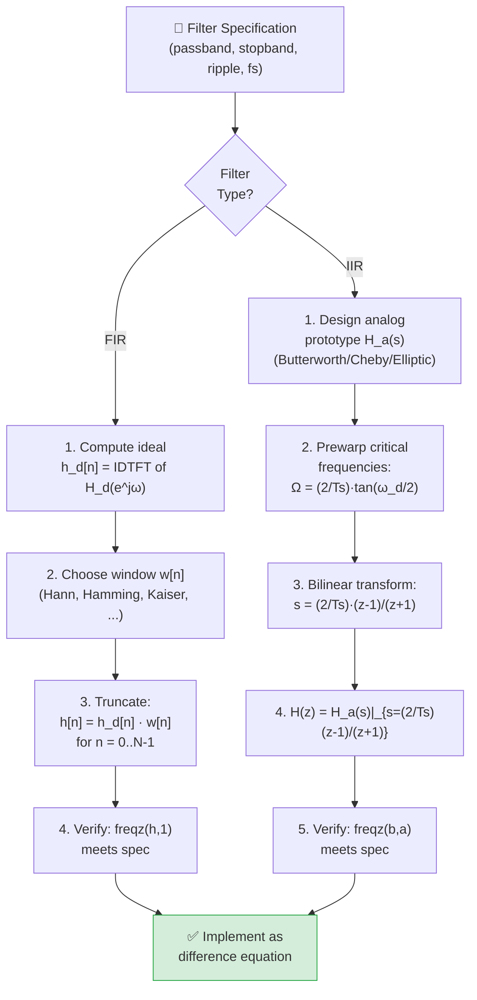

# 🔧 Digital Filter Design

> [!abstract] TL;DR
> Digital filters split into two families: FIR filters have a finite impulse response, are always stable, and can achieve exact linear phase; IIR filters have infinite impulse response, are more computationally efficient, but can be unstable and have nonlinear phase. FIR design typically uses the windowing method applied to an ideal frequency response. IIR design maps a proven analog (CT) prototype (Butterworth, Chebyshev, Elliptic) to discrete time using the bilinear transform s = (2/Tₛ)(z−1)/(z+1), which introduces frequency warping that must be pre-compensated.

---

## Intuition — Analogy First

Think of filter design as **sculpting a frequency response**. For FIR filters, you start with a perfect sculpture (the ideal brick-wall response), then you truncate it with a window function — like trimming a clay model with a knife of different sharpness. A rectangular knife gives sharp edges but ugly ringing (Gibbs phenomenon); a Blackman knife rounds the edges beautifully but smears the transition. For IIR filters, you instead inherit a proven analog sculpture (Butterworth's maximally flat response), then warp it through a mathematical lens (bilinear transform) into the digital world. The warping distorts straight frequency lines into curves, so you pre-bend the lens first (frequency prewarping).

---

## How It Works — Filter Design Pipeline



---

## Key Concepts / Details

### Part 1: FIR Filters

An FIR filter has an impulse response h[n] of finite length N:
$$H(z) = \sum_{n=0}^{N-1} h[n] z^{-n} = h[0] + h[1]z^{-1} + \cdots + h[N-1]z^{-(N-1)}$$

H(z) has **N−1 zeros** and **no poles** (except at z=0, which is trivial). Therefore FIR filters are **always stable**.

#### Linear Phase Property

If h[n] is symmetric: h[n] = h[N−1−n] for all n, then:
$$H(e^{j\omega}) = e^{-j\omega(N-1)/2} \cdot A(\omega)$$

where A(ω) is a real function. The phase is linear: ∠H(e^(jω)) = −ω(N−1)/2. This means **constant group delay** of (N−1)/2 samples — all frequency components are delayed by the same amount, preserving waveshape.

| FIR Type | N | h[n] Symmetry | H(0) | H(π) |
|---|---|---|---|---|
| Type I | Odd | Even (symmetric) | Non-zero | Non-zero |
| Type II | Even | Even (symmetric) | Non-zero | Zero (forced) |
| Type III | Odd | Odd (anti-symmetric) | Zero (forced) | Zero (forced) |
| Type IV | Even | Odd (anti-symmetric) | Zero (forced) | Non-zero |

Type I and II are used for lowpass/bandpass. Type III/IV are used for differentiators and Hilbert transformers.

---

#### Windowing Design Method

**Step 1**: Specify the ideal frequency response H_d(e^(jω)). For a lowpass filter with cutoff ωc:
$$h_d[n] = \frac{\sin(\omega_c n)}{\pi n}, \quad n \neq 0; \quad h_d[0] = \frac{\omega_c}{\pi}$$

**Step 2**: Select a window w[n] of length N:

| Window | Transition Width | Peak Sidelobe (dB) | Min Stopband Atten. (dB) |
|---|---|---|---|
| Rectangular | 0.9/N·(2π) | −13 | 21 |
| Hann | 3.1/N·(2π) | −31 | 44 |
| Hamming | 3.3/N·(2π) | −41 | 53 |
| Blackman | 5.5/N·(2π) | −57 | 74 |
| Kaiser (β=8.6) | 5.8/N·(2π) | −69 | 80 |

**Kaiser window** is the gold standard: β controls the sidelobe level, and N can be calculated from the specification:
$$N \approx \frac{A_s - 7.95}{2.285 \cdot \Delta\omega}$$

where $A_s$ = stopband attenuation in dB, $\Delta\omega$ = transition bandwidth in rad/sample.

**Step 3**: Apply window:
$$h[n] = h_d[n - (N-1)/2] \cdot w[n], \quad n = 0, 1, \ldots, N-1$$

The delay of (N−1)/2 samples centers the symmetric h_d around n=0, making h[n] causal.

---

### Part 2: IIR Filters

An IIR filter has H(z) with poles at nonzero locations. It requires an all-poles denominator (at minimum) and yields h[n] of infinite duration. Typical orders: 4th–12th order IIR achieves what requires 50–100 taps of FIR.

#### Analog Prototype Families

| Prototype | Magnitude Response | Phase | Notes |
|---|---|---|---|
| **Butterworth** | Maximally flat in passband, monotone | Moderate nonlinear | Easiest to design; no ripple anywhere |
| **Chebyshev Type I** | Equiripple in passband, monotone stopband | More nonlinear | Steeper rolloff than Butterworth for same order |
| **Chebyshev Type II** | Monotone passband, equiripple stopband | More nonlinear | Flat passband, prescribed stopband floor |
| **Elliptic (Cauer)** | Equiripple passband AND stopband | Most nonlinear | Minimum order for given spec; sharpest transition |

Nth-order Butterworth analog lowpass:
$$|H_a(j\Omega)|^2 = \frac{1}{1 + (\Omega/\Omega_c)^{2N}}$$

Poles on a circle of radius Ωc in the left half s-plane, equally spaced by π/N.

---

#### Bilinear Transform

The bilinear transform maps the entire s-plane to the z-plane **without aliasing**:
$$s = \frac{2}{T_s} \cdot \frac{z-1}{z+1}, \qquad z = \frac{1 + (T_s/2)s}{1 - (T_s/2)s}$$

**Frequency warping relationship**: the analog frequency Ω and digital frequency ω are related by:
$$\Omega = \frac{2}{T_s} \tan\!\left(\frac{\omega}{2}\right)$$

The entire jΩ axis (−∞ to +∞) compresses onto one revolution of the unit circle. Frequencies near 0 are nearly unwarped; frequencies near π (Nyquist) are severely compressed.

**Prewarping**: To ensure the digital filter's critical frequency ω_d is exact, prewarp before designing the analog prototype:
$$\Omega_c = \frac{2}{T_s} \tan\!\left(\frac{\omega_d}{2}\right)$$

Design H_a(s) at this prewarped Ωc, then apply bilinear transform.

---

### Part 3: FIR vs IIR Comparison

| Property | FIR | IIR |
|---|---|---|
| **Stability** | Always stable (no poles) | Can be unstable; must verify poles inside unit circle |
| **Phase** | Exact linear phase with symmetric h[n] | Inherently nonlinear phase |
| **Order / Cost** | High order (50–1000 taps) | Low order (4–12 typical) |
| **Design method** | Windowing, equiripple (Parks-McClellan) | Bilinear transform from analog prototype |
| **Delay** | Large, predictable (N−1)/2 samples | Small but variable (group delay) |
| **Initialization** | No transients from initial conditions | Has transient from initial conditions |
| **Best use case** | Audio, communications, linear phase critical | Control systems, audio eq where phase less critical |

---

## Python: FIR and IIR Design with scipy

```python
import numpy as np
import matplotlib.pyplot as plt
from scipy import signal

fs = 8000           # Sampling rate (Hz)
f_cutoff = 1000     # Desired cutoff frequency (Hz)
omega_c = 2 * np.pi * f_cutoff / fs   # Digital cutoff (rad/sample)

# ── FIR Design via windowing ─────────────────────────────────────────────
N_fir = 61   # Filter order (must be odd for Type I, linear phase lowpass)
h_fir = signal.firwin(N_fir, cutoff=f_cutoff, window='hamming', fs=fs)

# ── IIR Butterworth Design via bilinear transform ────────────────────────
N_iir = 5   # Butterworth order
b_iir, a_iir = signal.butter(N_iir, Wn=f_cutoff, btype='low', fs=fs)

# ── Compare frequency responses ──────────────────────────────────────────
w_fir, H_fir = signal.freqz(h_fir, 1,       worN=1024, fs=fs)
w_iir, H_iir = signal.freqz(b_iir, a_iir,   worN=1024, fs=fs)

fig, axes = plt.subplots(2, 2, figsize=(12, 8))

for ax, H, label, style in zip(axes[0], [H_fir, H_iir],
                                ['FIR (Hamming, N=61)', 'IIR Butterworth N=5'],
                                [w_fir, w_iir]):
    ax.plot(style, 20*np.log10(np.abs(H) + 1e-12))
    ax.axvline(f_cutoff, color='r', ls='--', label=f'fc={f_cutoff}Hz')
    ax.set_ylim([-80, 5]); ax.set_ylabel('dB'); ax.grid(True)
    ax.set_title(f'Magnitude Response — {label}')
    ax.legend()

# Phase / group delay
for ax, H, label, style in zip(axes[1], [H_fir, H_iir],
                                ['FIR (linear phase)', 'IIR (nonlinear phase)'],
                                [w_fir, w_iir]):
    gd = -np.diff(np.unwrap(np.angle(H))) / np.diff(style * 2*np.pi/fs)
    ax.plot(style[:-1], gd)
    ax.set_ylabel('Samples'); ax.set_xlabel('Frequency (Hz)')
    ax.set_title(f'Group Delay — {label}'); ax.grid(True)

plt.tight_layout()
plt.savefig('filter_comparison.png', dpi=150)
plt.show()

# ── IIR Chebyshev Type I ─────────────────────────────────────────────────
b_cheby, a_cheby = signal.cheby1(N=5, rp=1, Wn=f_cutoff, btype='low', fs=fs)
# rp=1 means 1 dB passband ripple

# ── IIR Elliptic ──────────────────────────────────────────────────────────
b_ellip, a_ellip = signal.ellip(N=4, rp=1, rs=60, Wn=f_cutoff, btype='low', fs=fs)
# rp=1 dB passband ripple, rs=60 dB stopband attenuation

# Verify IIR stability: poles inside unit circle?
poles_butter = np.roots(a_iir)
print(f"Butterworth pole magnitudes: {np.abs(poles_butter).round(4)}")
print(f"All poles inside unit circle: {np.all(np.abs(poles_butter) < 1)}")
```

---

## Real-World Notes

- FIR filters are the default choice in **audio processing** (equalisers, crossovers) because linear phase avoids transient smearing that is perceptible to listeners.
- IIR filters dominate **embedded/real-time control** (e.g., anti-aliasing, sensor smoothing on microcontrollers) where a 4th-order Butterworth implemented as two biquad sections costs far fewer operations than a 64-tap FIR.
- The **Kaiser window** is the standard choice for communications FIR design because β gives direct control over the stopband attenuation specification.
- Elliptic filters achieve the lowest order for a given transition specification, but their highly nonlinear group delay makes them unsuitable for data channels without an equaliser.
- Modern audio DSPs implement IIR filters in **biquad (second-order section, SOS)** form to avoid numerical instability of high-order direct-form implementations. `scipy.signal.sosfilt` uses this.

---

## Common Pitfalls

- **Not prewarping the critical frequency** for IIR design: applying bilinear transform without prewarping places the cutoff at the wrong digital frequency, especially near Nyquist.
- **FIR length must be odd for Type I** (symmetric, lowpass): an even-length symmetric FIR is Type II and has a forced zero at ω=π — it cannot be a highpass filter.
- **Direct-form IIR instability for high orders**: numerically, high-order IIR in direct form (b, a) is ill-conditioned. Always use second-order sections (`signal.butter(..., output='sos')` and `signal.sosfilt`).
- **Hamming window does not produce exactly zero at stopband nulls** — Blackman or Kaiser should be used when stopband attenuation > 53 dB is required.
- **Bilinear transform cannot be used for differentiators**: because bilinear maps all of s-plane onto the unit circle, it cannot represent the ideal H(e^(jω)) ∝ jω response of a differentiator beyond ω = π/2.

---

## Related Concepts

- [[Z_Transform]] — H(z) representation and pole-zero analysis
- [[Inverse_Z_Transform]] — Finding h[n] from H(z) via PFE
- [[DFT_and_FFT]] — Frequency analysis of filter output; overlap-add method for efficient FIR filtering
- [[Laplace_Transform]] — Analog prototype H_a(s) used in IIR design
- [[Sampling_and_Reconstruction]] — Nyquist constraint determines filter cutoff specifications

---

## Review Questions

1. Design a Type I FIR lowpass filter with cutoff ωc = π/4 rad/sample and length N=15 using a Hamming window. Write the formula for h_d[n] and state the window coefficients formula. What is the group delay in samples?
2. A 4th-order Butterworth analog lowpass prototype has poles at s = Ωc·e^(jπ(2k+N+1)/(2N)) for k=0,...,N−1 on the left half-plane. For Ωc = 1, list the four pole locations in Cartesian form and verify they all satisfy Re(pₖ) < 0.
3. You apply the bilinear transform (Tₛ=1) to obtain a digital lowpass filter with desired cutoff at ω_d = π/3. What analog cutoff frequency Ωc must you design the prototype at (prewarped frequency)? What happens to the frequency response near ω = π if you skip prewarping?

---

## Sources

- Proakis & Manolakis, *Digital Signal Processing*, 4th ed., Chapters 8–10
- Oppenheim & Schafer, *Discrete-Time Signal Processing*, 3rd ed., Chapters 7–8
- Parks & Burrus, *Digital Filter Design*, Wiley, 1987
- scipy.signal documentation: `firwin`, `butter`, `cheby1`, `ellip`, `sosfilt`

#signals-and-systems #digital-filters #FIR #IIR #bilinear-transform #window-method #butterworth
