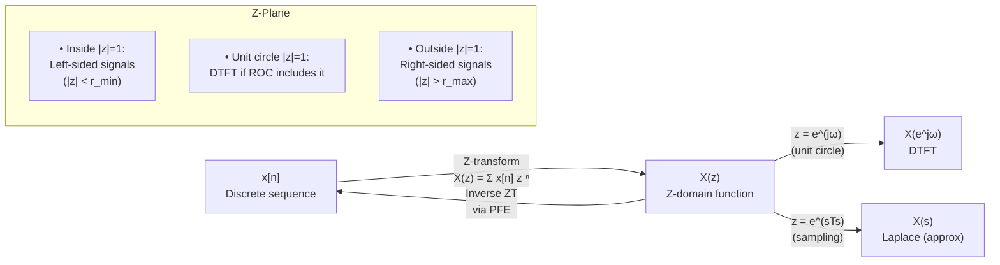

# 📐 Z-Transform

> [!abstract] TL;DR
> The Z-transform maps a discrete-time sequence x[n] to a function X(z) of the complex variable z, converting difference equations into polynomial algebra. The Region of Convergence (ROC) — the set of z for which the sum converges — determines whether the inverse corresponds to a causal, anti-causal, or two-sided signal. When the unit circle lies inside the ROC, the DTFT exists and equals X(z) evaluated at z = e^(jω).

---

## Intuition — Analogy First

Think of the Z-transform as a **weighted generating function**. Each sample x[n] gets multiplied by z^(−n), which is a complex "discount factor." For |z| > 1, z^(−n) shrinks as n grows, making the sum converge even if x[n] grows slowly. For |z| < 1, z^(−n) grows as n grows, making convergence harder. The unit circle |z| = 1 is the boundary where z^(−n) has magnitude 1 for all n — this is exactly the DTFT. Think of the z-plane as a generalization of the frequency axis: the unit circle is "pure frequency," everything else is frequency plus exponential growth/decay.

---

## How It Works



---

## Key Concepts / Details

### Definition

**Bilateral (two-sided) Z-transform:**
$$X(z) = \sum_{n=-\infty}^{\infty} x[n] \, z^{-n}, \qquad z \in \mathbb{C}$$

**Unilateral Z-transform** (for causal signals and systems with initial conditions):
$$X(z) = \sum_{n=0}^{\infty} x[n] \, z^{-n}$$

The complex variable z can be written in polar form:
$$z = r e^{j\omega}, \quad r = |z|, \quad \omega = \angle z$$

So X(z) = ∑ x[n] r^(−n) e^(−jωn) — a weighted DTFT of x[n] with exponential window r^(−n).

---

### Region of Convergence (ROC)

The ROC is the set of z values for which ∑|x[n] z^{−n}| < ∞.

| Signal Type | ROC Shape | Example |
|---|---|---|
| Finite-length (N samples) | All z except possibly z=0 or z=∞ | Rectangular window |
| Right-sided (x[n]=0, n<N₀) | $|z| > r_{max}$ (exterior of disk) | Causal: x[n] = aⁿu[n] |
| Left-sided (x[n]=0, n>N₀) | $|z| < r_{min}$ (interior of disk) | Anti-causal: x[n] = −aⁿu[−n−1] |
| Two-sided | $r_{min} < |z| < r_{max}$ (annulus) | x[n] = aⁿu[n] + bⁿu[−n−1] |

> [!important] Stability and ROC
> A causal DT LTI system is stable if and only if the ROC of H(z) includes the unit circle |z|=1, equivalently if all poles lie strictly inside the unit circle.

---

### Relation to the DTFT

When the unit circle is inside the ROC:
$$X(e^{j\omega}) = X(z)\big|_{z=e^{j\omega}} = \sum_{n=-\infty}^{\infty} x[n] e^{-j\omega n}$$

---

### Relation to the Laplace Transform

If x_c(t) is sampled at rate f_s = 1/T_s to yield x[n] = x_c(nT_s):
$$z = e^{sT_s}$$

The right half of the s-plane (Re(s) > 0) maps to the exterior of the unit circle; the left half maps to the interior; the jω-axis maps to the unit circle. The mapping is periodic with period j·2π/T_s (aliasing in the z-plane).

---

### Standard Z-Transform Pairs

| Sequence x[n] | Z-transform X(z) | ROC |
|---|---|---|
| $\delta[n]$ | $1$ | All z |
| $\delta[n-k]$, k>0 | $z^{-k}$ | All z except z=0 |
| $u[n]$ | $\dfrac{1}{1-z^{-1}} = \dfrac{z}{z-1}$ | $|z|>1$ |
| $-u[-n-1]$ | $\dfrac{1}{1-z^{-1}}$ | $|z|<1$ |
| $a^n u[n]$ | $\dfrac{1}{1-az^{-1}} = \dfrac{z}{z-a}$ | $|z|>|a|$ |
| $-a^n u[-n-1]$ | $\dfrac{1}{1-az^{-1}}$ | $|z|<|a|$ |
| $n \cdot a^n u[n]$ | $\dfrac{az^{-1}}{(1-az^{-1})^2}$ | $|z|>|a|$ |
| $\cos(\omega_0 n) u[n]$ | $\dfrac{1 - \cos(\omega_0)z^{-1}}{1 - 2\cos(\omega_0)z^{-1} + z^{-2}}$ | $|z|>1$ |
| $\sin(\omega_0 n) u[n]$ | $\dfrac{\sin(\omega_0)z^{-1}}{1 - 2\cos(\omega_0)z^{-1} + z^{-2}}$ | $|z|>1$ |
| $r^n \cos(\omega_0 n) u[n]$ | $\dfrac{1 - r\cos(\omega_0)z^{-1}}{1 - 2r\cos(\omega_0)z^{-1} + r^2 z^{-2}}$ | $|z|>r$ |

---

### Poles and Zeros in the z-Plane

For a rational Z-transform:
$$X(z) = \frac{B(z)}{A(z)} = K \frac{\prod_{k=1}^{M}(1-c_k z^{-1})}{\prod_{k=1}^{N}(1-d_k z^{-1})}$$

- **Zeros**: values of z where X(z) = 0 (roots of numerator)
- **Poles**: values of z where X(z) = ∞ (roots of denominator)
- The ROC cannot contain any poles
- Poles close to the unit circle → frequency response peaks there; zeros on the unit circle → nulls in the frequency response

---

## Python: Z-Transform Concepts with scipy

```python
import numpy as np
import matplotlib.pyplot as plt
from scipy import signal

# Define H(z) = z / (z - 0.5) = 1 / (1 - 0.5*z^-1)
# Numerator and denominator in powers of z^-1
b = [1, 0]       # numerator:  z   -> coefficients of z^0 and z^-1 for b(z)
a = [1, -0.5]    # denominator: z - 0.5 -> in z^-1 form: [1, -0.5]

# Pole-zero plot
zeros, poles, gain = signal.tf2zpk(b, a)
print(f"Zeros: {zeros}")   # [0.0]
print(f"Poles: {poles}")   # [0.5]

# Frequency response (DTFT on unit circle)
w, H = signal.freqz(b, a, worN=512)
omega = w  # in radians/sample

fig, axes = plt.subplots(1, 2, figsize=(12, 4))
# Pole-zero plot
ax = axes[0]
theta = np.linspace(0, 2*np.pi, 200)
ax.plot(np.cos(theta), np.sin(theta), 'b--', lw=0.8, label='Unit circle')
ax.plot(poles.real, poles.imag, 'rx', ms=10, mew=2, label='Poles')
ax.plot(zeros.real, zeros.imag, 'go', ms=8, mfc='none', mew=2, label='Zeros')
ax.set_title('z-Plane: Poles and Zeros')
ax.legend(); ax.grid(True); ax.set_aspect('equal')

# Magnitude response
axes[1].plot(omega / np.pi, 20 * np.log10(np.abs(H) + 1e-12))
axes[1].set_xlabel('Normalized frequency (×π rad/sample)')
axes[1].set_ylabel('Magnitude (dB)')
axes[1].set_title('Frequency Response |H(e^jω)|')
axes[1].grid(True)
plt.tight_layout()
plt.show()
```

---

## Real-World Notes

- Every IIR digital filter is described by its pole and zero locations in the z-plane; stability requires all poles strictly inside the unit circle.
- The Z-transform underlies digital audio processing — every EQ, reverb, and compressor is a pole-zero system.
- In control systems (digital PID controllers), the Z-transform replaces the Laplace transform for discrete-time plant models.
- OFDM in 4G/5G modems relies on the circular convolution property of the Z-transform (implemented via FFT).
- Speech synthesis (Linear Predictive Coding, LPC) models the vocal tract as an all-pole Z-transform.

---

## Common Pitfalls

- **Forgetting the ROC** is not optional. Two different signals can share the same X(z) expression but different ROCs, giving entirely different inverse transforms.
- **z^(−1) vs z^(+1) convention**: most DSP texts write X(z) = ∑x[n]z^(−n); some control texts use z^(+n). Always check which convention is in use.
- **Confusing |z|>1 with stability**: a causal system is stable only if poles are inside the unit circle, not just that the ROC is |z|>r for some r<1.
- **The Laplace-to-z mapping z=e^(sTs) is not the bilinear transform** — it introduces aliasing and is used only conceptually, not for filter design.
- **Finite-length sequence ROC**: if x[n] is nonzero only for n≥0, there is a term z^0, so z=0 may or may not be in the ROC depending on positive-time terms.

---

## Related Concepts

- [[Z_Transform_Properties]] — Linearity, shift, convolution properties
- [[Inverse_Z_Transform]] — PFE and long division methods
- [[DTFT_and_Sampling]] — DTFT is Z-transform on the unit circle
- [[Laplace_Transform]] — Continuous-time analog; z = e^(sTs)
- [[DT_LTI_Systems]] — H(z) = Y(z)/X(z) transfer function

---

## Review Questions

1. The signal x[n] = (0.8)^n u[n] + (1.2)^n u[−n−1] has the Z-transform X(z) = 1/(1−0.8z⁻¹) − 1/(1−1.2z⁻¹). What is the ROC, and does the DTFT of x[n] exist? Explain using pole locations.
2. A causal DT LTI system has H(z) = (1 − z⁻¹)/(1 − 0.9z⁻¹). Find the poles and zeros, sketch the pole-zero plot, and determine whether the system is stable.
3. Why does multiplying x[n] by aⁿ shift the ROC? If x[n] has ROC |z| > 2, what is the ROC of aⁿx[n] for |a| = 0.5?

---

## Sources

- Oppenheim & Schafer, *Discrete-Time Signal Processing*, 3rd ed., Chapters 3–4
- Proakis & Manolakis, *Digital Signal Processing*, 4th ed., Chapter 3
- McClellan, Schafer & Yoder, *DSP First*, 2nd ed., Chapter 9

#signals-and-systems #z-transform #ROC #digital-signal-processing
