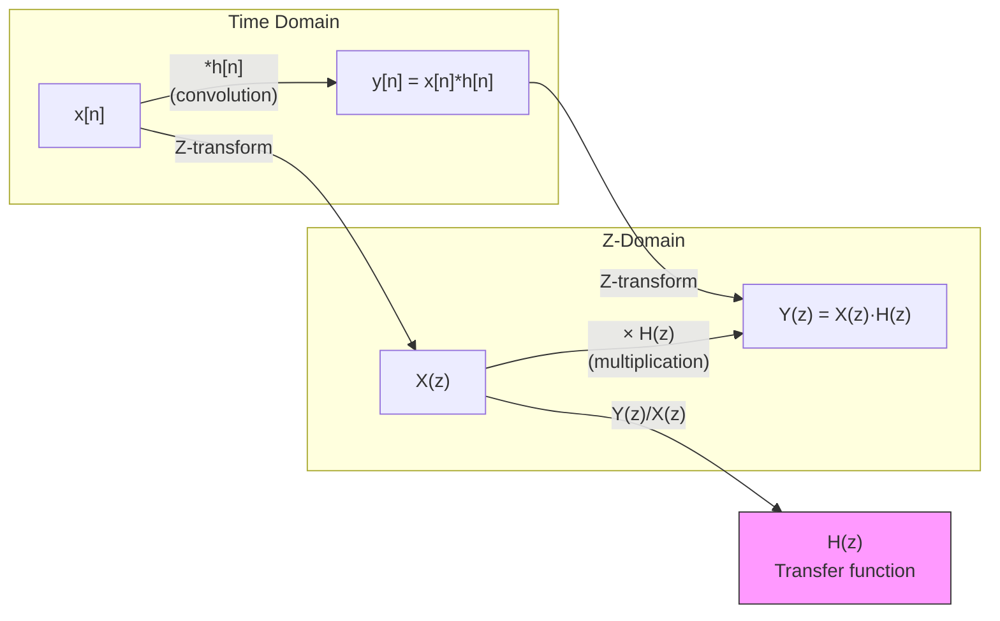

# ⚙️ Z-Transform Properties

> [!abstract] TL;DR
> Z-transform properties are algebraic rules that translate operations on x[n] into operations on X(z), making it possible to analyze and design DT LTI systems without solving difference equations directly. The most important property is the convolution theorem: convolution in time equals multiplication in the z-domain, which is why every digital filter is described by H(z) = Y(z)/X(z). All properties mirror their Laplace counterparts with z replacing e^s.

---

## Intuition — Analogy First

Imagine z^(−1) as a **unit delay operator** — multiplying X(z) by z^(−1) delays x[n] by one sample. This makes the shift property almost tautological. The deeper insight is that multiplication of polynomials in z^(−1) corresponds exactly to the convolution of coefficient sequences — this is why polynomials in z^(−1) are called **transfer functions**, and why "multiplying filters" means "cascading them."

---

## How It Works — Convolution ↔ Multiplication



The cascade of two LTI systems H₁(z) and H₂(z) has transfer function H(z) = H₁(z)·H₂(z). This is **algebraic multiplication**, not polynomial long division. This is the foundational insight of Z-transform filter theory.

---

## Key Concepts / Details

### Complete Property Table

| Property | Time Domain x[n] | Z-Domain X(z) | ROC |
|---|---|---|---|
| **Linearity** | $a_1 x_1[n] + a_2 x_2[n]$ | $a_1 X_1(z) + a_2 X_2(z)$ | At least $R_1 \cap R_2$ |
| **Time shift** | $x[n-k]$ | $z^{-k} X(z)$ | Same R, except possible changes at z=0,∞ |
| **Time reversal** | $x[-n]$ | $X(z^{-1})$ | $R^{-1} = \{z : z^{-1} \in R\}$ |
| **z-domain scaling** | $a^n x[n]$ | $X(z/a)$ | $|a| \cdot R$ (ROC scaled by |a|) |
| **Conjugation** | $x^*[n]$ | $X^*(z^*)$ | Same R |
| **z-differentiation** | $n \cdot x[n]$ | $-z \dfrac{dX}{dz}$ | Same R |
| **Convolution** | $x_1[n] * x_2[n]$ | $X_1(z) \cdot X_2(z)$ | At least $R_1 \cap R_2$ |
| **Correlation** | $r_{x_1 x_2}[n] = x_1[n]*x_2^*[-n]$ | $X_1(z) X_2^*(1/z^*)$ | Includes $R_1 \cap R_2^{-1}$ |
| **Accumulation** | $\sum_{k=-\infty}^{n} x[k]$ | $\dfrac{X(z)}{1-z^{-1}}$ | $R \cap \{|z|>1\}$ |
| **Initial value** | $x[0]$ | $\lim_{z\to\infty} X(z)$ | Causal x[n] |
| **Final value** | $\lim_{n\to\infty} x[n]$ | $\lim_{z\to 1}(z-1)X(z)$ | Poles inside unit circle |
| **Parseval's theorem** | $\sum_{n} |x[n]|^2$ | $\dfrac{1}{2\pi j}\oint X(z)X^*(1/z^*)z^{-1}dz$ | Unit circle in R |

---

### Property Derivations (Selected)

**Time Shift:**
$$\mathcal{Z}\{x[n-k]\} = \sum_{n=-\infty}^{\infty} x[n-k] z^{-n}$$
Let m = n − k:
$$= \sum_{m=-\infty}^{\infty} x[m] z^{-(m+k)} = z^{-k} \sum_{m} x[m] z^{-m} = z^{-k} X(z)$$

> [!note] Unilateral Z-transform shift
> For the unilateral Z-transform, the shift becomes:
> $$\mathcal{Z}_u\{x[n-1]\} = z^{-1}X(z) + x[-1]$$
> $$\mathcal{Z}_u\{x[n-k]\} = z^{-k}X(z) + \sum_{m=1}^{k} x[-m]z^{-(k-m)}$$
> This is critical for solving difference equations with non-zero initial conditions.

**z-Differentiation:**
$$X(z) = \sum_n x[n] z^{-n} \implies \frac{dX}{dz} = \sum_n x[n](-n)z^{-n-1} = -z^{-1}\sum_n n \cdot x[n] z^{-n}$$
$$\therefore \quad n \cdot x[n] \longleftrightarrow -z \frac{dX(z)}{dz}$$

**Example:** n·u[n]:  
$$X(z) = \frac{1}{1-z^{-1}}, \quad -z\frac{d}{dz}\left(\frac{1}{1-z^{-1}}\right) = -z \cdot \frac{-z^{-2}}{(1-z^{-1})^2} \cdot (-1) = \frac{z^{-1}}{(1-z^{-1})^2}$$

This matches the table entry n·u[n] ↔ z^(−1)/(1−z^(−1))².

---

### Final Value Theorem — When It Applies

$$\lim_{n\to\infty} x[n] = \lim_{z\to 1} (z-1) X(z)$$

**Conditions**: (z−1)X(z) must have all poles strictly inside the unit circle. If X(z) has a pole at z=1 (meaning x[n] is a ramp or growing signal), the theorem fails. If poles are on the unit circle other than z=1, it also fails.

**Example**: X(z) = z/((z−1)(z−0.5)):
- (z−1)X(z) = z/(z−0.5)
- lim_{z→1} z/(z−0.5) = 1/(1−0.5) = 2
- So x[∞] = 2. Verify: x[n] = 2u[n] − 2·(0.5)ⁿu[n] → 2 as n→∞. ✓

---

### Using z-Scaling for Exponentially-Modulated Signals

If X(z) = ∑x[n]z^(−n) with ROC R, then:
$$a^n x[n] \longleftrightarrow X\!\left(\frac{z}{a}\right), \quad \text{ROC: } |a| \cdot R$$

**Example**: Given u[n] ↔ 1/(1−z^(−1)) with |z|>1, find Z{(0.8)ⁿ u[n]}:
$$X(z/0.8) = \frac{1}{1-(z/0.8)^{-1}} = \frac{1}{1-0.8z^{-1}}, \quad |z/0.8|>1 \implies |z|>0.8$$

---

## Python: Convolution Theorem Example

```python
import numpy as np
from scipy import signal

# Two FIR filters in cascade
h1 = np.array([1, -0.5, 0.25])   # H1(z) = 1 - 0.5z^-1 + 0.25z^-2
h2 = np.array([1,  0.8])          # H2(z) = 1 + 0.8z^-1

# Time-domain cascade: convolve impulse responses
h_cascade_time = np.convolve(h1, h2)
print("Cascade h[n] (time-domain):", h_cascade_time)

# Z-domain equivalent: multiply polynomials
# For FIR, this is just polynomial multiplication = convolution
# np.polymul multiplies polynomial coefficient arrays
h_cascade_zdomain = np.polymul(h1, h2)
print("Cascade H(z) coefficients (z-domain):", h_cascade_zdomain)

# They should be identical (convolution theorem for FIR)
assert np.allclose(h_cascade_time, h_cascade_zdomain)
print("Convolution theorem verified: time-domain and z-domain cascades match.")

# Demonstrate time-shift property: delay h1 by 2 samples
h1_delayed = np.zeros(len(h1) + 2)
h1_delayed[2:] = h1   # Insert 2 leading zeros = multiply by z^-2

# Z-domain: multiply by z^-2 -> prepend 2 zeros to coefficient array
# np.append([0, 0], h1)  # This represents z^-2 * H1(z)
h1_shifted_z = np.append([0, 0], h1)
print("Shifted h[n-2]:", h1_shifted_z)
print("Same as delayed h1:", np.allclose(h1_delayed, h1_shifted_z))  # True
```

---

## Real-World Notes

- The time-shift property is the foundation of the **difference equation** representation: every term y[n−k] becomes z^(−k)·Y(z), so a difference equation becomes an algebraic equation in z.
- The convolution theorem means **filter cascading** corresponds to multiplying transfer functions H₁(z)·H₂(z) — the order doesn't matter (commutativity of convolution).
- The z-differentiation property is used to find Z-transforms of ramp-like sequences, which appear in discrete PID controllers.
- The final value theorem is used in digital control systems to predict steady-state tracking error without simulating the full response.
- The initial value theorem can verify partial fraction expansion results: if x[0] is known, check that lim_{z→∞} X(z) gives the same value.

---

## Common Pitfalls

- **Time-shift ROC modification**: z^(−k)X(z) can introduce or remove poles/zeros at z=0 or z=∞, changing the ROC boundaries. Always note this.
- **Time reversal inverts the ROC**: if R is |z|>2, then X(z^(−1)) has ROC |z|<1/2. Many students forget to invert ROC bounds.
- **Final value theorem: always check pole conditions first**. Applying it blindly to an unstable system gives a finite number that has no physical meaning.
- **Linearity ROC is the intersection**: if X₁(z) is valid for |z|>0.5 and X₂(z) for |z|>2, the sum is valid for |z|>2 (not the union).
- **z-scaling changes the ROC multiplicatively, not additively**: if ROC is |z|>3 and |a|=2, scaled ROC is |z|>6.

---

## Related Concepts

- [[Z_Transform]] — Definition and transform pairs
- [[Inverse_Z_Transform]] — Using these properties in reverse to invert X(z)
- [[Laplace_Transform_Properties]] — Parallel properties in continuous time
- [[DT_LTI_Systems]] — H(z) = Y(z)/X(z) derived via convolution property

---

## Review Questions

1. A system is described by y[n] − 0.6y[n−1] = x[n] + 0.3x[n−1]. Apply the Z-transform (with the time-shift property) to find H(z) = Y(z)/X(z). Identify poles and zeros.
2. Use the z-differentiation property to find the Z-transform of x[n] = n²·u[n]. (Hint: apply the property twice.)
3. Can you apply the final value theorem to find lim_{n→∞} x[n] if X(z) = z/(z²−1)? Explain why or why not, and identify any problematic poles.

---

## Sources

- Oppenheim & Schafer, *Discrete-Time Signal Processing*, 3rd ed., Chapter 3
- Proakis & Manolakis, *Digital Signal Processing*, 4th ed., Chapter 3
- Haykin & Van Veen, *Signals and Systems*, 2nd ed., Chapter 9

#signals-and-systems #z-transform #properties #convolution-theorem #digital-signal-processing
