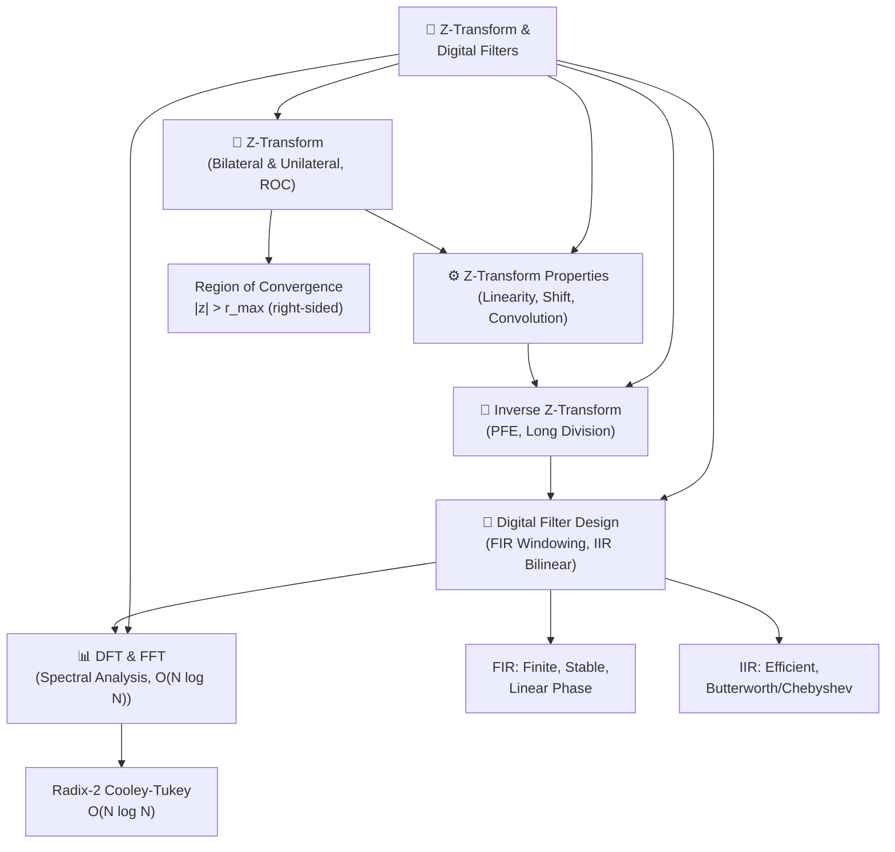

# 🗺️ MOC — Z-Transform & Digital Filters

> [!abstract] Section Overview
> The Z-transform is the discrete-time analog of the Laplace transform — it converts difference equations to polynomial algebra, defines transfer functions H(z) for DT LTI systems, and provides a frequency-domain tool via the DTFT evaluated on the unit circle |z|=1. This section covers the Z-transform and its ROC, properties parallel to Laplace, inverse Z-transform via partial fractions, digital filter design (FIR windowing and IIR bilinear transform), and the DFT/FFT for practical spectral analysis of finite-length sequences. This section bridges continuous-time theory to practical DSP implementation.

---

## 🧭 Section Mind Map

---

## 📚 Learning Path

Follow this sequence for maximum retention:

1. **[[Z_Transform]]** — Understand z as a complex variable, the ROC concept, and core transform pairs. The ROC determines causality/stability.
2. **[[Z_Transform_Properties]]** — Master the property table. The convolution ↔ multiplication duality is the engine of all filter analysis.
3. **[[Inverse_Z_Transform]]** — Partial fractions are the workhorse. Practice the PFE procedure until it is automatic.
4. **[[Digital_Filter_Design]]** — Apply Z-transform theory to design real FIR and IIR filters using scipy.
5. **[[DFT_and_FFT]]** — Connect Z-transform theory to the FFT algorithm used in every practical DSP system.

> [!tip] Prerequisites
> Before starting, review [[Laplace_Transform]], [[DTFT_and_Sampling]], and [[DT_LTI_Systems_Difference_Equations]].

---

## 📋 All Notes in This Section

| # | Note | Topic | Difficulty | Key Takeaway |
|---|------|--------|------------|--------------|
| 1 | [[Z_Transform]] | Z-transform pairs, ROC | Intermediate | ROC determines causal vs. anti-causal; unit circle ↔ DTFT |
| 2 | [[Z_Transform_Properties]] | Shift, scaling, convolution | Intermediate | Convolution in time = multiplication in z |
| 3 | [[Inverse_Z_Transform]] | PFE, long division | Intermediate | ROC choice selects causal or anti-causal inverse |
| 4 | [[Digital_Filter_Design]] | FIR windowing, IIR bilinear | Advanced | Bilinear transform maps s-plane to z-plane exactly |
| 5 | [[DFT_and_FFT]] | DFT, FFT algorithm | Intermediate | FFT is O(N log N) via divide-and-conquer butterfly |

---

## ❓ Key Questions This Section Answers

- Why does the Z-transform exist, and how is it related to the DTFT and the Laplace transform?
- What is the Region of Convergence and why does it determine system causality and stability?
- How do you invert a Z-transform given a rational X(z)?
- What is the difference between FIR and IIR filters, and when do you choose each?
- Why does the bilinear transform introduce frequency warping, and how do you pre-compensate?
- How does the FFT reduce DFT complexity from O(N²) to O(N log N)?
- What is circular convolution, and how do you use zero-padding to achieve linear convolution?

---

## 🔗 Related Sections

| Section | Connection |
|---------|-----------|
| [[_MOC_Laplace_CT_Systems]] | Z-transform mirrors Laplace; z = e^(sT_s) maps s-plane to z-plane |
| [[_MOC_DTFT_Sampling]] | DTFT is Z-transform evaluated on the unit circle |
| [[_MOC_DT_LTI_Systems]] | H(z) = Y(z)/X(z) is the transfer function of any DT LTI system |
| [[_MOC_Fourier_Series_Transform]] | DFT is the discrete, finite-length analog of the Fourier transform |

---

## 🏆 Mastery Checklist

- [ ] Can derive ROC for any given signal type (causal, anti-causal, two-sided)
- [ ] Can apply all properties in the property table without looking them up
- [ ] Can perform PFE inversion for distinct and repeated poles
- [ ] Can design an FIR lowpass filter with a specified window using `scipy.signal.firwin`
- [ ] Can design an IIR Butterworth filter using bilinear transform via `scipy.signal.butter`
- [ ] Can compute the FFT of a signal, construct the frequency axis, and interpret the spectrum
- [ ] Understands when to use zero-padding and why it interpolates (not improves) frequency resolution

---

#MOC #signals-and-systems #z-transform #digital-filters #dft #fft
