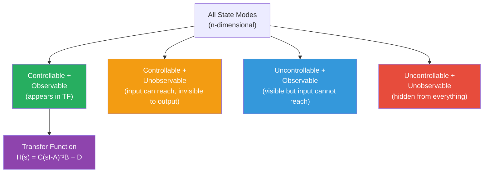

# 🔍 Controllability and Observability

> [!abstract] TL;DR
> Controllability asks "can the input reach every state?" — checked via rank of $\mathcal{W}_c = [B \mid AB \mid \cdots \mid A^{n-1}B]$. Observability asks "can we reconstruct every state from output alone?" — checked via rank of $\mathcal{W}_o = [C^\top \mid A^\top C^\top \mid \cdots \mid (A^\top)^{n-1}C^\top]^\top$. Together they determine which part of the system is visible in the transfer function (Kalman decomposition).

## Intuition — analogy FIRST

Imagine a building with secret rooms. **Controllability** asks: can the building's HVAC system (input) push air into every room, including the secret ones? If some rooms are sealed off from all vents, they are **uncontrollable** — you can never change their temperature no matter what you do with the thermostat. **Observability** asks: can the sensors (output) detect activity in every room? If the secret rooms have no sensors, they are **unobservable** — a fire could be burning in there and your dashboard would show nothing. A transfer function (what you can see from the outside) only "sees" the rooms that are both wired to the HVAC and equipped with sensors.

---

## How It Works



---

## Key Concepts / Details

### 1. Controllability

> [!definition]
> System $(A, B)$ is **controllable** if for any initial state $x_0 \in \mathbb{R}^n$ and any target state $x_1 \in \mathbb{R}^n$, there exists a finite time $T > 0$ and an input $u(t)$ defined on $[0, T]$ that drives $x(T) = x_1$.

**Controllability matrix:**

$$\mathcal{W}_c = \begin{bmatrix}B & AB & A^2B & \cdots & A^{n-1}B\end{bmatrix} \in \mathbb{R}^{n \times nm}$$

$$\boxed{\text{System is controllable} \iff \text{rank}(\mathcal{W}_c) = n}$$

**Physical interpretation:** The columns of $\mathcal{W}_c$ span the subspace of states reachable from the origin. If $\text{rank}(\mathcal{W}_c) < n$, some directions in state space can never be reached.

**Why Cayley-Hamilton limits us to n−1 powers of A:** By Cayley-Hamilton, $A^n = -(a_{n-1}A^{n-1} + \cdots + a_0I)$, so $A^n B$ is a linear combination of earlier columns — adding more columns beyond $A^{n-1}B$ adds nothing new.

**PBH (Popov-Belevitch-Hautus) test for controllability:**

$$\text{System controllable} \iff \text{rank}\begin{bmatrix}\lambda_i I - A & B\end{bmatrix} = n \quad \forall\,\lambda_i \in \text{eig}(A)$$

The PBH test reveals which specific eigenvalues are uncontrollable.

#### 2×2 Controllability Example

$$A = \begin{bmatrix}0 & 1\\-2 & -3\end{bmatrix}, \quad B = \begin{bmatrix}0\\1\end{bmatrix}$$

$$\mathcal{W}_c = [B \mid AB] = \begin{bmatrix}0 & 1\\1 & -3\end{bmatrix}, \quad \det(\mathcal{W}_c) = -3 \neq 0 \implies \text{rank} = 2 \implies \text{Controllable}$$

**Uncontrollable example:**

$$A = \begin{bmatrix}-1 & 0\\0 & -2\end{bmatrix}, \quad B = \begin{bmatrix}1\\0\end{bmatrix}$$

$$\mathcal{W}_c = \begin{bmatrix}1 & -1\\0 & 0\end{bmatrix}, \quad \text{rank} = 1 < 2 \implies \text{Uncontrollable}$$

Mode $e^{-2t}$ (second state) is unreachable — input only affects the first state.

---

### 2. Observability

> [!definition]
> System $(A, C)$ is **observable** if for any unknown initial state $x_0$, there exists a finite time $T > 0$ such that knowledge of $y(t)$ on $[0, T]$ (with $u=0$) uniquely determines $x_0$.

**Observability matrix:**

$$\mathcal{W}_o = \begin{bmatrix}C\\CA\\CA^2\\\vdots\\CA^{n-1}\end{bmatrix} \in \mathbb{R}^{np \times n}$$

$$\boxed{\text{System is observable} \iff \text{rank}(\mathcal{W}_o) = n}$$

**PBH test for observability:**

$$\text{System observable} \iff \text{rank}\begin{bmatrix}\lambda_i I - A\\C\end{bmatrix} = n \quad \forall\,\lambda_i \in \text{eig}(A)$$

**Duality:** Observability of $(A, C)$ is equivalent to controllability of $(A^\top, C^\top)$. This duality lets us reuse controllability tools for observability analysis.

#### 3×3 Observability Example

$$A = \begin{bmatrix}-1 & 0 & 0\\0 & -2 & 0\\0 & 0 & -3\end{bmatrix}, \quad C = \begin{bmatrix}1 & 1 & 0\end{bmatrix}$$

$$\mathcal{W}_o = \begin{bmatrix}C\\CA\\CA^2\end{bmatrix} = \begin{bmatrix}1 & 1 & 0\\-1 & -2 & 0\\1 & 4 & 0\end{bmatrix}$$

Third column is all zeros → $\text{rank}(\mathcal{W}_o) = 2 < 3$ → **unobservable** (mode $e^{-3t}$ is invisible to output).

---

### 3. Kalman Decomposition

Any state-space system can be transformed into **Kalman canonical form** via a state transformation $\bar{x} = Tx$:

$$\bar{A} = \begin{bmatrix}A_{co} & A_{12} & A_{13} & A_{14}\\0 & A_{\bar{c}o} & 0 & A_{24}\\0 & 0 & A_{c\bar{o}} & A_{34}\\0 & 0 & 0 & A_{\bar{c}\bar{o}}\end{bmatrix}$$

| Subsystem | Controllable? | Observable? | In TF? |
|-----------|:---:|:---:|:---:|
| $A_{co}$ | Yes | Yes | **Yes** |
| $A_{\bar{c}o}$ | No | Yes | No |
| $A_{c\bar{o}}$ | Yes | No | No |
| $A_{\bar{c}\bar{o}}$ | No | No | No |

**Key implication:** $H(s) = C(sI-A)^{-1}B + D$ only reflects the controllable AND observable subsystem. This is why pole-zero cancellations in a TF correspond to uncontrollable or unobservable modes — those modes are still there in state-space, just invisible to the TF.

---

### Python: Checking Controllability and Observability

```python
import numpy as np
import control  # pip install control

A = np.array([[0,  1],
              [-2, -3]])
B = np.array([[0], [1]])
C = np.array([[1, 0]])
D = np.array([[0]])

sys = control.ss(A, B, C, D)

# Controllability
Wc = control.ctrb(A, B)  # Controllability matrix
rank_c = np.linalg.matrix_rank(Wc)
print(f"Controllability matrix rank: {rank_c} (n={A.shape[0]})")
print("Controllable:", rank_c == A.shape[0])

# Observability
Wo = control.obsv(A, C)  # Observability matrix
rank_o = np.linalg.matrix_rank(Wo)
print(f"Observability matrix rank: {rank_o}")
print("Observable:", rank_o == A.shape[0])

# Gramian-based (alternative, better numerically)
# Controllability Gramian Wc_gram satisfies: A*Wc + Wc*A' + B*B' = 0
# System is controllable iff Wc_gram > 0 (positive definite)
from scipy.linalg import solve_lyapunov
Wc_gram = solve_lyapunov(A, -B @ B.T)
print("Controllability Gramian eigenvalues:", np.linalg.eigvals(Wc_gram))

# PBH test
eigvals = np.linalg.eigvals(A)
for lam in eigvals:
    PBH = np.hstack([lam * np.eye(2) - A, B])
    print(f"  PBH rank at λ={lam:.2f}: {np.linalg.matrix_rank(PBH)}")
```

---

## Real-World Notes

- **Pole-zero cancellation danger**: If you cancel a pole-zero pair in a TF to simplify design, you may be hiding an uncontrollable or unobservable mode. That mode can be unstable and will appear in the actual system response even though the TF looks fine.
- **Sensor placement**: Observability analysis tells you where to place sensors. A badly placed IMU on a drone may leave attitude modes unobservable.
- **Actuator placement**: Controllability analysis guides actuator placement in structural engineering — poorly placed actuators leave some vibration modes uncontrollable.
- **Minimal realization**: A system is a minimal realization (smallest possible order) iff it is both controllable and observable.
- **Kalman filter requires observability**: The Kalman filter can estimate states only from the observable subspace; unobservable states must be handled separately or constrained.

---

## Common Pitfalls

- **Confusing stability with controllability**: A stable uncontrollable system is fine in steady-state but cannot be driven away from its natural trajectory. These are orthogonal concepts.
- **Rank deficiency vs near-deficiency**: Numerical rank testing needs a threshold. Use `np.linalg.matrix_rank(Wc, tol=1e-10)` rather than checking if determinant is exactly zero.
- **High-order numerical issues**: The controllability matrix $\mathcal{W}_c$ is notoriously ill-conditioned for high-order systems. Use Gramian-based methods or `control.gram` for numerical checks.
- **MIMO systems**: For $m > 1$ inputs, $\mathcal{W}_c$ has $nm$ columns; rank can be $n$ even if individual input channels are uncontrollable — check PBH per channel for more insight.
- **Observable ≠ identifiable**: Observability is a structural (zero-input) property. For noisy systems with unknown parameters, you also need system identifiability — a stronger condition.

---

## Related Concepts

- [[State_Space_Basics]] — The (A, B, C, D) structure that controllability/observability analyze
- [[State_Transition_Matrix]] — Gramians involve integrals of $e^{At}$
- [[State_Feedback_Control]] — Pole placement requires full controllability; observer design requires full observability

---

## Review Questions

1. For $A = \begin{bmatrix}-1 & 1\\0 & -2\end{bmatrix}$, $B = \begin{bmatrix}0\\1\end{bmatrix}$, $C = \begin{bmatrix}1 & 0\end{bmatrix}$: compute $\mathcal{W}_c$ and $\mathcal{W}_o$, determine controllability and observability, and verify using the PBH test.
2. A transfer function $H(s) = (s+1)/[(s+1)(s+3)]$ has a pole-zero cancellation at $s=-1$. Explain what this implies about the controllability and observability of any state-space realization of this TF.
3. Explain why only the controllable-and-observable subsystem appears in the transfer function. Use the Kalman decomposition structure of $\bar{A}$ to show that $B$ cannot "excite" the uncontrollable block and $C$ cannot "see" the unobservable block.

---

## Sources

- Kailath, *Linear Systems*, Prentice Hall, Chapter 6
- Chen, *Linear System Theory and Design*, Oxford University Press, Chapter 6
- Ogata, *Modern Control Engineering*, 5th ed., Chapter 9
- Antsaklis & Michel, *A Linear Systems Primer*

#signals-and-systems #state-space #controllability #observability #kalman-decomposition #PBH-test
