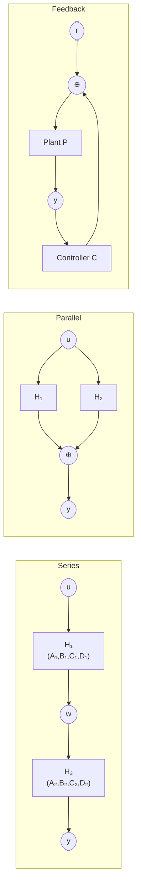

# 🔗 Interconnected Systems

> [!abstract] TL;DR
> Systems are rarely isolated — they interconnect as series (cascade), parallel, and feedback configurations. Each interconnection has an exact state-space realization formed by stacking or coupling the subsystem matrices. Mason's gain formula provides a systematic graph-theoretic way to compute transfer functions of complex signal flow graphs. Algebraic loops (when $D \neq 0$ in feedback) require careful handling to avoid ill-posed systems.

## Intuition — analogy FIRST

Think of a **hi-fi audio system**: the microphone (H₁) feeds an amplifier (H₂) which feeds a speaker (H₃). That is a series connection — the overall gain is the product of individual gains. Add a graphic equalizer in parallel with the amplifier and you have a parallel connection. Connect the speaker output back through a microphone to suppress feedback noise and you have a feedback system. Each connection rule tells you exactly how to assemble the (A, B, C, D) blocks without re-deriving everything from scratch.

---

## How It Works



---

## Key Concepts / Details

### 1. Series (Cascade) Connection: $H = H_2 H_1$

Output of $H_1$ feeds input of $H_2$: $w = C_1 x_1 + D_1 u$, then $H_2$ takes $w$ as input.

**Combined state-space:**

$$A_{series} = \begin{bmatrix}A_1 & 0\\B_2 C_1 & A_2\end{bmatrix}, \quad B_{series} = \begin{bmatrix}B_1\\B_2 D_1\end{bmatrix}$$

$$C_{series} = \begin{bmatrix}D_2 C_1 & C_2\end{bmatrix}, \quad D_{series} = D_2 D_1$$

**Transfer function:** $H(s) = H_2(s)\,H_1(s)$ (note order: $H_2$ acts on output of $H_1$, so $H_2$ is leftmost in matrix multiplication).

**Dimension check:** if $H_1$ has $n_1$ states and $H_2$ has $n_2$ states, the combined system has $n_1 + n_2$ states.

---

### 2. Parallel Connection: $H = H_1 + H_2$

Both subsystems share the same input; outputs are summed.

$$A_{par} = \begin{bmatrix}A_1 & 0\\0 & A_2\end{bmatrix}, \quad B_{par} = \begin{bmatrix}B_1\\B_2\end{bmatrix}$$

$$C_{par} = \begin{bmatrix}C_1 & C_2\end{bmatrix}, \quad D_{par} = D_1 + D_2$$

**Transfer function:** $H(s) = H_1(s) + H_2(s)$. Poles are the union of poles of $H_1$ and $H_2$; common poles may appear to cancel if numerators sum to zero.

---

### 3. Feedback Connection

**Negative unity feedback** with plant $P(s)$ and controller $C(s)$:

$$H_{cl}(s) = \frac{P(s)\,C(s)}{1 + P(s)\,C(s)}$$

More generally with output feedback gain $F$:

$$H_{cl}(s) = \frac{P(s)}{1 + P(s)F}$$

**State-space for negative feedback (scalar D, D₁·D₂ ≠ 1):**

Let $\Delta = (I + D_P D_C)^{-1}$ (well-posedness condition).

$$A_{cl} = \begin{bmatrix}A_P - B_P\Delta D_C C_P & -B_P\Delta C_C\\B_C\Delta C_P & A_C - B_C D_P\Delta C_C\end{bmatrix}$$

This is the output of `control.feedback(sys_P, sys_C)`.

**Closed-loop stability**: the closed-loop system is stable iff all roots of $1 + P(s)C(s) = 0$ have $\text{Re}\{s\} < 0$.

**Small Gain Theorem (robust stability)**: if $\|P\|_\infty \cdot \|C\|_\infty < 1$, the closed-loop is stable for all perturbations with $H_\infty$ norm ≤ 1.

---

### 4. Signal Flow Graphs and Mason's Gain Formula

A **signal flow graph** (SFG) represents a linear system as a directed graph:
- **Nodes**: signal variables ($x_i$)
- **Branches**: gains $a_{ij}$ (directed from $x_j$ to $x_i$)
- **Source node**: input; **sink node**: output

**Mason's Gain Formula:**

$$H = \frac{\sum_k P_k \Delta_k}{\Delta}$$

where:
- $P_k$ = gain of the $k$-th forward path (input → output)
- $\Delta = 1 - \sum L_i + \sum L_i L_j - \cdots$ (graph determinant; $L_i$ = loop gain of $i$-th loop; sum of non-touching loop pair gains; etc.)
- $\Delta_k$ = graph determinant with all loops touching forward path $k$ removed

**Worked example** — three-loop SFG:

Consider forward paths $P_1 = abcd$, $P_2 = aed$; loops $L_1 = fg$ (touching $P_1$ only), $L_2 = hi$ (touching both), $L_3 = jk$ (non-touching with $L_1$):

$$\Delta = 1 - (L_1 + L_2 + L_3) + (L_1 L_3)$$

$$\Delta_1 = 1 - L_3 \quad (\text{remove loops touching } P_1: L_1, L_2)$$
$$\Delta_2 = 1 - L_1 L_3/L_1 = \text{(loops not touching }P_2\text{)}$$

$$H = \frac{P_1 \Delta_1 + P_2 \Delta_2}{\Delta}$$

**Mason's rule reduces to standard results:**
- Series: one forward path, no loops → $H = P_1$
- Parallel: two forward paths, no loops → $H = P_1 + P_2$
- Single-loop feedback: one path $P$, one loop $-PF$ → $H = P/(1+PF)$ ✓

---

### 5. Block Diagram Reduction Rules

| Operation | Rule |
|-----------|------|
| Two blocks in series | Replace with $G_1 G_2$ |
| Two blocks in parallel | Replace with $G_1 + G_2$ |
| Negative feedback | $G/(1+GH)$ |
| Move branch point past a block $G$ | Insert $1/G$ in moved branch |
| Move summing junction past a block $G$ | Insert $G$ in moved branch |

**Algebraic loops** occur when a direct path exists from output to input through $D \neq 0$ blocks in a feedback loop. Well-posedness requires $(I + D_P D_C)$ invertible.

---

### Python: Interconnections with python-control

```python
import numpy as np
import control

# Define two subsystems
A1 = np.array([[-1]])
B1 = np.array([[1]])
C1 = np.array([[2]])
D1 = np.array([[0]])

A2 = np.array([[-3]])
B2 = np.array([[1]])
C2 = np.array([[1]])
D2 = np.array([[0]])

sys1 = control.ss(A1, B1, C1, D1)
sys2 = control.ss(A2, B2, C2, D2)

# Series: H = sys2 * sys1 (sys1 feeds into sys2)
sys_series = control.series(sys1, sys2)
print("Series TF:", control.ss2tf(sys_series))
# Expected: 2 / (s+1)(s+3) = 2 / (s^2+4s+3)

# Parallel: H = sys1 + sys2
sys_par = control.parallel(sys1, sys2)
print("Parallel TF:", control.ss2tf(sys_par))
# Expected: (2(s+3) + (s+1)) / ((s+1)(s+3)) = (3s+7)/(s^2+4s+3)

# Feedback: plant=sys1, controller=sys2, negative feedback
sys_fb = control.feedback(sys1, sys2)
print("Feedback TF:", control.ss2tf(sys_fb))
# Expected: 2/(s+1) / (1 + 2/(s+1)) = 2/(s+3)

# Check stability of feedback system
poles_fb = control.poles(sys_fb)
print("Feedback closed-loop poles:", poles_fb)
# Expected: [-3.] (stable)

# Frequency response of series system
omega = np.logspace(-1, 2, 500)
mag, phase, omega = control.bode(sys_series, omega, plot=True)
```

---

## Real-World Notes

- **Cascade amplifiers**: Each transistor stage in an RF amplifier chain is a series connection; the overall gain is the product, and poles accumulate — bandwidth shrinks with each stage.
- **Active noise cancellation**: A parallel path with inverted sign cancels a disturbance — the physical feedforward path and the electronic cancellation path run in parallel.
- **PID + plant in feedback**: The most common industrial feedback loop; Mason's rule quickly gives the closed-loop TF from the block diagram without state-space manipulation.
- **Algebraic loops in Simulink**: A Simulink model with a direct feedthrough block (D ≠ 0) in a feedback loop raises an "algebraic loop" warning — Simulink adds a small delay or solves the linear system at each step.
- **Structured uncertainty**: Small gain theorem is used in robust control ($H_\infty$ design) to certify stability of a feedback loop when the plant has uncertain perturbations.

---

## Common Pitfalls

- **Algebraic loops with D ≠ 0**: If $D_P \cdot D_C \neq 0$ in a feedback loop, $(I + D_P D_C)$ must be invertible; otherwise the loop is ill-posed (infinite instantaneous gain). Always check before forming the feedback connection.
- **Order of multiplication in series TF**: $H = H_2 H_1$ (not $H_1 H_2$); the rightmost block acts on the input first. Easy to flip accidentally.
- **Hidden cancellations**: A series connection may exhibit pole-zero cancellations if a pole of $H_1$ coincides with a zero of $H_2$. The cancelled mode is still present in the state-space — don't discard it without understanding its stability.
- **Parallel poles merge**: The parallel connection has poles that are the union of both systems' poles. A marginally stable mode in either subsystem survives even if the other subsystem is well-damped.
- **Mason's rule sign convention**: Loops in the graph determinant $\Delta$ appear with a minus sign for single loops; failing to track signs carefully leads to wrong transfer functions.

---

## Related Concepts

- [[State_Space_Basics]] — The (A, B, C, D) building blocks for each subsystem
- [[State_Feedback_Control]] — Feedback connection with controller as one subsystem, plant as another
- [[Controllability_Observability]] — Interconnections can create hidden uncontrollable/unobservable modes via pole-zero cancellations

---

## Review Questions

1. Two systems $H_1(s) = 1/(s+1)$ and $H_2(s) = (s+1)/(s+2)$ are connected in series. (a) Write the combined state-space (A, B, C, D). (b) Compute the overall TF and identify the pole-zero cancellation. (c) What does this cancellation imply about the series state-space realization?
2. Use Mason's gain formula on a SFG with two forward paths $P_1 = 2$ and $P_2 = 3$, two touching loops $L_1 = -0.5$ and $L_2 = -0.4$, and one non-touching loop pair $L_3 = -0.1$ (touching $P_2$ only). Compute the overall gain $H$.
3. A plant $P(s) = 1/(s-1)$ (unstable) is placed in negative feedback with $C(s) = K$ (proportional control). For what values of K is the closed-loop stable? Verify using the characteristic equation $1 + KC = 0$.

---

## Sources

- Oppenheim & Willsky, *Signals and Systems*, 2nd ed., Chapter 11
- Franklin, Powell & Emami-Naeini, *Feedback Control of Dynamic Systems*, 8th ed., Chapter 3
- Kuo, *Automatic Control Systems*, 8th ed., Chapter 2 (signal flow graphs)
- python-control documentation: `control.series`, `control.parallel`, `control.feedback`

#signals-and-systems #state-space #interconnected-systems #masons-rule #block-diagram #feedback #series #parallel
