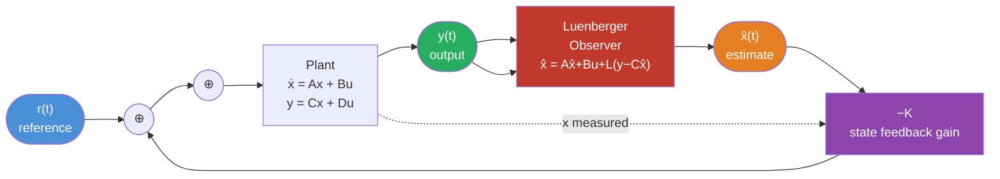

# 🎛️ State Feedback Control

> [!abstract] TL;DR
> State feedback $u = -Kx + r$ lets us place the closed-loop poles of $A_{cl} = A - BK$ anywhere we want (if the system is controllable). When we cannot measure all states directly, a Luenberger observer reconstructs $\hat{x}$ from output, and by the **separation principle** the controller and observer can be designed independently. LQR provides an optimal gain K by trading off state regulation against control effort.

## Intuition — analogy FIRST

Imagine driving a car using only the speedometer (output feedback). You'd over- or under-correct because you can't see position. Now imagine you have a co-pilot who tracks both your position and speed in real time and feeds that back to your steering (state feedback). You can now place the "poles" of your driving — meaning how aggressively and how smoothly you respond to deviations. The Luenberger observer is the co-pilot who estimates your exact state even from noisy instruments. LQR is the optimal co-pilot who minimizes the total cost of wandering plus the effort of steering.

---

## How It Works



---

## Key Concepts / Details

### 1. State Feedback Law

Apply the control input:

$$u(t) = -Kx(t) + r(t)$$

where $K \in \mathbb{R}^{m \times n}$ is the feedback gain matrix and $r(t)$ is the reference input.

Substitute into $\dot{x} = Ax + Bu$:

$$\dot{x} = Ax + B(-Kx + r) = (A - BK)x + Br$$

**Closed-loop system matrix:** $A_{cl} = A - BK$

The eigenvalues of $A_{cl}$ (the closed-loop poles) can be placed **anywhere in the complex plane** (for SISO: any symmetric-about-real-axis set; for MIMO: any multiset) **if and only if $(A, B)$ is controllable**.

---

### 2. Pole Placement — Ackermann's Formula (SISO)

**Goal**: choose K so that $\det(\lambda I - A_{cl}) = \phi_{des}(\lambda)$, a desired characteristic polynomial.

**Ackermann's formula:**

$$K = e_n^\top \mathcal{W}_c^{-1} \phi_{des}(A)$$

where $e_n^\top = [0\ 0\ \cdots\ 0\ 1]$ is the last standard basis row vector, $\mathcal{W}_c$ is the controllability matrix, and $\phi_{des}(A)$ is the desired polynomial evaluated at A (by Cayley-Hamilton).

**Worked 2×2 example**: place poles at $s = -3 \pm 2j$

$$A = \begin{bmatrix}0 & 1\\-2 & -3\end{bmatrix}, \quad B = \begin{bmatrix}0\\1\end{bmatrix}$$

Desired char. polynomial: $\phi_{des}(s) = (s+3-2j)(s+3+2j) = s^2 + 6s + 13$

$$\phi_{des}(A) = A^2 + 6A + 13I = \begin{bmatrix}-2 & -3\\6 & 7\end{bmatrix} + \begin{bmatrix}0 & 6\\-12 & -18\end{bmatrix} + \begin{bmatrix}13 & 0\\0 & 13\end{bmatrix} = \begin{bmatrix}11 & 3\\-6 & 2\end{bmatrix}$$

$$\mathcal{W}_c^{-1} = \begin{bmatrix}0 & 1\\1 & -3\end{bmatrix}^{-1} = \begin{bmatrix}3 & 1\\1 & 0\end{bmatrix}$$

$$K = [0\ 1]\begin{bmatrix}3 & 1\\1 & 0\end{bmatrix}\begin{bmatrix}11 & 3\\-6 & 2\end{bmatrix} = [1\ 0]\begin{bmatrix}11 & 3\\-6 & 2\end{bmatrix} = [11\ 3]$$

Verify: $A_{cl} = A - BK = \begin{bmatrix}0 & 1\\-13 & -6\end{bmatrix}$, char. poly = $s^2+6s+13$ ✓

---

### 3. Full-State Observer (Luenberger Observer)

When states cannot be measured directly, estimate $\hat{x}$ from the known input $u$ and measured output $y$:

$$\dot{\hat{x}} = A\hat{x} + Bu + L(y - C\hat{x})$$

The correction term $L(y - C\hat{x})$ drives the estimate toward the true state. Define estimation error $e = x - \hat{x}$:

$$\dot{e} = \dot{x} - \dot{\hat{x}} = (A - LC)e$$

Observer error dynamics: eigenvalues of $A - LC$ determine how fast $e \to 0$.

**Design rule of thumb**: place observer poles **3–5× faster** (more negative real parts) than closed-loop controller poles, so the observer converges before it affects controller performance.

**Duality**: designing $L$ so that $A - LC$ has desired eigenvalues is equivalent to placing poles of $(A^\top, C^\top)$ — the same pole-placement algorithm applies.

---

### 4. Separation Principle

> [!theorem] Separation Principle
> If both (A, B) is controllable and (A, C) is observable, the state feedback controller and the Luenberger observer can be designed **independently**. The combined controller/observer system has eigenvalues = {eigenvalues of $A - BK$} ∪ {eigenvalues of $A - LC$}.

This simplifies MIMO controller design enormously: solve two smaller pole-placement problems rather than one large coupled one.

---

### 5. LQR — Linear Quadratic Regulator

**Optimal control problem**: find $K$ to minimize the infinite-horizon cost:

$$J = \int_0^\infty \left(x(t)^\top Q\, x(t) + u(t)^\top R\, u(t)\right)dt, \quad Q \geq 0,\; R > 0$$

**Solution**: $u^* = -Kx$ where:

$$\boxed{K = R^{-1}B^\top P}$$

and $P$ is the unique positive semi-definite solution to the **Algebraic Riccati Equation (ARE)**:

$$A^\top P + PA - PBR^{-1}B^\top P + Q = 0$$

**Tuning intuition:**

| Q large (state penalty) | R large (input penalty) |
|-------------------------|-------------------------|
| Drive states to zero aggressively | Use gentle control action |
| Faster poles | Slower poles, smaller gains |
| More control effort | Less control effort |

**LQR always produces a stable closed-loop** if $(A, B)$ is controllable and $(A, Q^{1/2})$ is observable — this is a key advantage over pure pole placement.

---

### 6. Integral Action (Eliminating Steady-State Error)

Augment the state with the integral of the tracking error $e(t) = r - y$:

$$\dot{x}_I = r - y = r - Cx$$

Augmented state: $x_{aug} = [x^\top,\; x_I]^\top$

$$\dot{x}_{aug} = \underbrace{\begin{bmatrix}A & 0\\-C & 0\end{bmatrix}}_{A_{aug}}x_{aug} + \underbrace{\begin{bmatrix}B\\0\end{bmatrix}}_{B_{aug}}u + \begin{bmatrix}0\\1\end{bmatrix}r$$

Apply pole placement or LQR to $(A_{aug}, B_{aug})$; the extra integrator state gives type-1 tracking (zero steady-state error for step references).

---

### Python: Pole Placement and LQR

```python
import numpy as np
import control

A = np.array([[0,  1],
              [-2, -3]])
B = np.array([[0], [1]])
C = np.array([[1, 0]])
D = np.array([[0]])

# --- Pole Placement (Ackermann) ---
desired_poles = [-3 + 2j, -3 - 2j]
K = control.place(A, B, desired_poles)
print("State feedback gain K:", K)

A_cl = A - B @ K
print("Closed-loop eigenvalues:", np.linalg.eigvals(A_cl))

# --- Luenberger Observer ---
# Place observer poles 4x faster
obs_poles = [-12 + 8j, -12 - 8j]
L = control.place(A.T, C.T, obs_poles).T
print("Observer gain L:\n", L)
print("Observer eigenvalues:", np.linalg.eigvals(A - L @ C))

# --- LQR ---
Q = np.diag([10.0, 1.0])   # penalize position more than velocity
R = np.array([[1.0]])       # moderate control effort penalty
K_lqr, S, E = control.lqr(A, B, Q, R)
print("LQR gain K:", K_lqr)
print("LQR closed-loop poles:", E)

# Closed-loop step response with LQR
sys_cl = control.ss(A - B @ K_lqr, B, C, D)
t, y = control.step_response(sys_cl)
import matplotlib.pyplot as plt
plt.plot(t, y.flatten())
plt.title("Closed-Loop Step Response (LQR)")
plt.xlabel("t (s)")
plt.ylabel("y(t)")
plt.grid(True)
plt.show()
```

---

## Real-World Notes

- **Drone attitude control**: LQR is the standard first-pass design for quadrotor attitude loops; Q penalizes angle errors, R penalizes motor torque commands.
- **Industrial servo drives**: Luenberger observers for velocity estimation avoid noisy numerical differentiation of encoder position signals.
- **Chemical process control**: Integral action in state-space controllers handles unknown disturbances (e.g., feed concentration changes) that would otherwise cause offset.
- **Automotive cruise control**: State feedback with observer is used in adaptive cruise systems where vehicle speed and headway distance are states, throttle/brake is the input.
- **Satellite attitude control**: Reaction wheel desaturation uses LQR with carefully tuned Q/R to balance attitude precision against wheel momentum buildup.

---

## Common Pitfalls

- **Observer poles too fast**: Placing observer poles very far left amplifies measurement noise — the gain $L$ grows large and the observer over-reacts to sensor noise. Use Kalman filter (LQE) for noisy systems.
- **Observer poles too slow**: If observer poles are near or slower than plant poles, $e(t) \to 0$ too slowly and the controller acts on a stale estimate, degrading performance.
- **Pole placement for MIMO**: For $m > 1$ inputs, `control.place` (Ackermann) fails; use `scipy.signal.place_poles` with the Kautsky-Nichols-Van Dooren method.
- **LQR without integral action**: LQR minimizes regulation (drive to zero) but does NOT track references or reject constant disturbances — always add integrators for tracking tasks.
- **Ignoring input saturation**: State feedback designs assume unlimited input; real actuators saturate. Anti-windup schemes are needed when the integrator state charges up against a saturated actuator.

---

## Related Concepts

- [[State_Space_Basics]] — The (A, B, C, D) system being controlled
- [[Controllability_Observability]] — Prerequisites for pole placement and observer design
- [[State_Transition_Matrix]] — Closed-loop $e^{A_{cl}t}$ governs transient response

---

## Review Questions

1. Design a state feedback gain K for $A = \begin{bmatrix}0&1\\-6&-5\end{bmatrix}$, $B = \begin{bmatrix}0\\1\end{bmatrix}$ to place closed-loop poles at $s = -2 \pm j$. Verify by computing eigenvalues of $A_{cl}$.
2. For the same system, design a Luenberger observer with $C = [1\ 0]$ placing observer poles at $s = -8 \pm 4j$. Write out the full observer+controller system equations.
3. Explain why LQR guarantees stability (under controllability/observability conditions) while naive Ackermann pole placement does not. What does the Riccati equation buy us?

---

## Sources

- Ogata, *Modern Control Engineering*, 5th ed., Chapters 10–11
- Brogan, *Modern Control Theory*, 3rd ed., Chapter 7
- Sontag, *Mathematical Control Theory*, Springer, Chapter 5
- python-control documentation: `control.lqr`, `control.place`

#signals-and-systems #state-space #pole-placement #LQR #luenberger-observer #separation-principle #riccati
