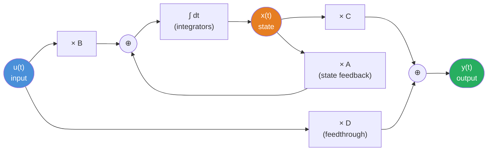

# 📐 State-Space Basics

> [!abstract] TL;DR
> State-space form rewrites any Nth-order LTI system as N coupled first-order equations organized in matrix form: ẋ = Ax + Bu (dynamics) and y = Cx + Du (readout). The state vector x captures all the system's memory — eliminating it gives back the classical transfer function H(s) = C(sI − A)⁻¹B + D.

## Intuition — analogy FIRST

Think of a **train journey tracker**. The transfer function approach only tells you "where does the train end up given a departure schedule?" — it sees input and output but nothing in between. State-space is like installing GPS on every car: the state vector x(t) tells you exactly where every car is and how fast it is moving at every instant. The A matrix says "how does each car's position affect its own and others' velocities," B says "how does the engine (input) affect velocities," C says "which cars does the observation camera see," and D is whether the camera feed is wired directly to the engine (feedthrough).

---

## How It Works



---

## Key Concepts / Details

### CT State-Space Equations

$$\dot{x}(t) = A\,x(t) + B\,u(t)$$
$$y(t) = C\,x(t) + D\,u(t)$$

| Symbol | Name | Dimensions |
|--------|------|------------|
| $x(t)$ | State vector | $n \times 1$ |
| $u(t)$ | Input vector | $m \times 1$ |
| $y(t)$ | Output vector | $p \times 1$ |
| $A$ | System matrix | $n \times n$ |
| $B$ | Input matrix | $n \times m$ |
| $C$ | Output matrix | $p \times n$ |
| $D$ | Feedthrough matrix | $p \times m$ |

$n$ is the **order** of the system (number of state variables = number of integrators).

### Physical Meaning of State Variables

The state vector x contains the **minimum information needed to predict future behavior** given future inputs.

| Physical Domain | State Variables |
|-----------------|-----------------|
| RLC circuit | Capacitor voltages $v_C$, inductor currents $i_L$ |
| Mechanical system | Positions $q_i$, velocities $\dot{q}_i$ |
| Thermal system | Temperatures $T_i$ |
| Hydraulic system | Tank heights $h_i$, flow rates |

### Converting Nth-Order ODE → State Space (Phase Variable / Companion Form)

**Worked example**: $\ddot{y} + 3\dot{y} + 2y = u$

Define state variables as successive derivatives of the output:
$$x_1 = y, \quad x_2 = \dot{y}$$

Then:
$$\dot{x}_1 = x_2$$
$$\dot{x}_2 = \ddot{y} = -2x_1 - 3x_2 + u$$

In matrix form:
$$\underbrace{\begin{bmatrix}\dot{x}_1\\\dot{x}_2\end{bmatrix}}_{\dot{x}} = \underbrace{\begin{bmatrix}0 & 1\\-2 & -3\end{bmatrix}}_{A}\underbrace{\begin{bmatrix}x_1\\x_2\end{bmatrix}}_{x} + \underbrace{\begin{bmatrix}0\\1\end{bmatrix}}_{B}u$$

$$y = \underbrace{\begin{bmatrix}1 & 0\end{bmatrix}}_{C}x + \underbrace{[0]}_{D}u$$

**General companion form** for $y^{(n)} + a_{n-1}y^{(n-1)} + \cdots + a_0 y = u$:

$$A = \begin{bmatrix}0 & 1 & 0 & \cdots & 0\\0 & 0 & 1 & \cdots & 0\\\vdots & & & \ddots & \vdots\\-a_0 & -a_1 & -a_2 & \cdots & -a_{n-1}\end{bmatrix}, \quad B = \begin{bmatrix}0\\0\\\vdots\\1\end{bmatrix}$$

### Transfer Function from State-Space

Taking the Laplace transform of the state equations (with zero initial conditions):

$$sX(s) = AX(s) + BU(s) \implies X(s) = (sI - A)^{-1}BU(s)$$

$$\boxed{H(s) = C(sI - A)^{-1}B + D}$$

The poles of $H(s)$ are the **eigenvalues of A** (roots of $\det(sI-A) = 0$).

### DT State-Space

$$x[n+1] = A\,x[n] + B\,u[n]$$
$$y[n] = C\,x[n] + D\,u[n]$$

DT transfer function: $H(z) = C(zI - A)^{-1}B + D$.

### Python: Define and Simulate a State-Space System

```python
import numpy as np
from scipy import signal
import matplotlib.pyplot as plt

# Example: ÿ + 3ẏ + 2y = u  →  poles at s = -1, -2
A = np.array([[0, 1],
              [-2, -3]])
B = np.array([[0],
              [1]])
C = np.array([[1, 0]])
D = np.array([[0]])

sys = signal.StateSpace(A, B, C, D)

# Step response
t, y = signal.step(sys)
plt.plot(t, y)
plt.xlabel('Time (s)')
plt.ylabel('y(t)')
plt.title('Step Response')
plt.grid(True)
plt.show()

# Transfer function from state-space
sys_tf = sys.to_tf()
print("Numerator:", sys_tf.num)   # [1]
print("Denominator:", sys_tf.den) # [1, 3, 2]

# Eigenvalues (= poles)
eigs = np.linalg.eigvals(A)
print("Eigenvalues of A:", eigs)  # [-1., -2.]
```

---

## Real-World Notes

- **RLC circuits**: For a series RLC, $x = [v_C, i_L]^\top$; A depends on R, L, C values; eigenmodes are the natural frequencies.
- **Robot arms**: A 2-DOF manipulator has 4 state variables (2 angles + 2 angular velocities); A is linearized around an operating point.
- **Aircraft dynamics**: The 6-DOF flight dynamics model has 12 state variables (position, velocity, attitude, angular rates); commercial autopilots use LQR on this model.
- **Digital filters**: Every IIR filter can be written in DT state-space; the Direct Form II transposed structure is a specific choice of state variables.
- **Non-uniqueness in practice**: Control software packages (MATLAB, python-control) often internally convert to a balanced realization for numerical stability.

---

## Common Pitfalls

- **State-space is NOT unique**: Many different (A, B, C, D) quadruples realize the same transfer function. Any invertible state transformation $\bar{x} = Tx$ gives an equivalent system with $\bar{A} = TAT^{-1}$, $\bar{B} = TB$, $\bar{C} = CT^{-1}$, $\bar{D} = D$.
- **Poles vs eigenvalues**: The poles of H(s) are a subset of the eigenvalues of A; eigenvalues of A that are NOT poles indicate uncontrollable or unobservable modes (pole-zero cancellation in H(s)).
- **D matrix in physical systems**: Most physical systems have $D = 0$ (no instantaneous feedthrough from input to output), but D ≠ 0 causes algebraic loops in some feedback configurations.
- **Order of system**: n equals the number of independent energy storage elements (C, L in circuits; masses/springs in mechanics), NOT the number of equations in the original ODE.
- **Companion form is numerically poor**: For high-order systems, use balanced or observable canonical forms instead; companion form can be ill-conditioned.

---

## Related Concepts

- [[State_Transition_Matrix]] — Computing $e^{At}$ to solve the state equation
- [[Controllability_Observability]] — Whether A/B/C structure allows full control and measurement
- [[State_Feedback_Control]] — Using $u = -Kx$ to reshape eigenvalues of A
- [[Interconnected_Systems]] — How to combine (A₁,B₁,C₁,D₁) blocks algebraically

---

## Review Questions

1. A system has the ODE $y''' + 6y'' + 11\dot{y} + 6y = 2u$. Write the companion-form state-space matrices A, B, C, D and verify the transfer function $H(s) = 2/(s^3+6s^2+11s+6)$.
2. Given a state-space system with $A = \begin{bmatrix}-1 & 0\\0 & -2\end{bmatrix}$, $B = \begin{bmatrix}1\\1\end{bmatrix}$, $C = \begin{bmatrix}1 & 1\end{bmatrix}$, $D = [0]$, compute $H(s)$ and identify the poles.
3. Why can two different state-space realizations (different A, B, C, D) produce identical transfer functions? What mathematical relationship connects them?

---

## Sources

- Oppenheim & Willsky, *Signals and Systems*, 2nd ed., Chapter 11
- Ogata, *Modern Control Engineering*, 5th ed., Chapter 9
- Chen, *Linear System Theory and Design*, Oxford University Press
- Brogan, *Modern Control Theory*, 3rd ed.

#signals-and-systems #state-space #control-theory #LTI #ODE #companion-form
