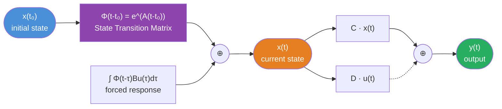

# ⚡ State Transition Matrix

> [!abstract] TL;DR
> The state transition matrix $\Phi(t) = e^{At}$ is the matrix-valued generalization of the scalar exponential $e^{at}$. It maps any initial state $x(t_0)$ forward in time and, combined with a convolution integral over the input, gives the complete system response. Computing $e^{At}$ via diagonalization or Laplace inversion unlocks stability analysis through the eigenvalues of A.

## Intuition — analogy FIRST

For a scalar system $\dot{x} = ax$, the solution is $x(t) = e^{a(t-t_0)}x(t_0)$. The exponential "transitions" the state from $t_0$ to $t$. For a matrix system $\dot{x} = Ax$, the same idea holds but $e^{At}$ is now an $n \times n$ matrix — each column tells you where each basis state vector ends up at time $t$. Think of $e^{At}$ as a **flow map**: it describes the "current" of state trajectories, sweeping every initial point forward in time according to the vector field defined by A.

---

## How It Works



---

## Key Concepts / Details

### Definition via Power Series

The matrix exponential is defined by the Taylor series:

$$e^{At} = \sum_{k=0}^{\infty} \frac{(At)^k}{k!} = I + At + \frac{A^2t^2}{2!} + \frac{A^3t^3}{3!} + \cdots$$

This series always converges for any finite $t$ and any matrix $A$.

### Properties of $\Phi(t) = e^{At}$

| Property | Formula | Meaning |
|----------|---------|---------|
| Initial value | $\Phi(0) = I$ | State doesn't move at $t=0$ |
| Differential equation | $\dot{\Phi}(t) = A\Phi(t)$ | Φ satisfies the state equation |
| Semigroup | $\Phi(t_1 + t_2) = \Phi(t_1)\Phi(t_2)$ | Time shift composes multiplicatively |
| Inverse | $\Phi(-t) = \Phi(t)^{-1}$ | Φ is always invertible |
| Transpose | $\Phi(t)^\top = e^{A^\top t}$ | Transpose of exponential = exponential of transpose |

### Complete CT Response Formula

$$\boxed{x(t) = \underbrace{e^{A(t-t_0)}x(t_0)}_{\text{zero-input (homogeneous)}} + \underbrace{\int_{t_0}^{t} e^{A(t-\tau)}Bu(\tau)\,d\tau}_{\text{zero-state (particular)}}}$$

$$y(t) = Cx(t) + Du(t)$$

The zero-state response is a **matrix convolution** — it reduces to the scalar convolution $y = h * u$ for SISO systems when we extract the impulse response $h(t) = Ce^{At}B\,\mathbf{1}(t) + D\delta(t)$.

### Computing $e^{At}$ — Method 1: Diagonalization

If A has n linearly independent eigenvectors (diagonalizable):

$$A = P\Lambda P^{-1}, \quad \Lambda = \text{diag}(\lambda_1, \lambda_2, \ldots, \lambda_n)$$

$$e^{At} = P\,e^{\Lambda t}\,P^{-1} = P\begin{bmatrix}e^{\lambda_1 t} & & \\& \ddots & \\& & e^{\lambda_n t}\end{bmatrix}P^{-1}$$

**Worked example** for $A = \begin{bmatrix}-1 & 0\\0 & -2\end{bmatrix}$ (already diagonal):
$$e^{At} = \begin{bmatrix}e^{-t} & 0\\0 & e^{-2t}\end{bmatrix}$$

**Worked example** for $A = \begin{bmatrix}0 & 1\\-2 & -3\end{bmatrix}$:

Eigenvalues: $\det(\lambda I - A) = \lambda^2 + 3\lambda + 2 = 0 \Rightarrow \lambda_1 = -1,\, \lambda_2 = -2$

Eigenvectors: $v_1 = \begin{bmatrix}1\\-1\end{bmatrix}$, $v_2 = \begin{bmatrix}1\\-2\end{bmatrix}$, so $P = \begin{bmatrix}1 & 1\\-1 & -2\end{bmatrix}$, $P^{-1} = \begin{bmatrix}2 & 1\\-1 & -1\end{bmatrix}$

$$e^{At} = \begin{bmatrix}1 & 1\\-1 & -2\end{bmatrix}\begin{bmatrix}e^{-t} & 0\\0 & e^{-2t}\end{bmatrix}\begin{bmatrix}2 & 1\\-1 & -1\end{bmatrix} = \begin{bmatrix}2e^{-t}-e^{-2t} & e^{-t}-e^{-2t}\\-2e^{-t}+2e^{-2t} & -e^{-t}+2e^{-2t}\end{bmatrix}$$

### Computing $e^{At}$ — Method 2: Laplace Inversion

$$e^{At} = \mathcal{L}^{-1}\{(sI - A)^{-1}\}$$

This is especially convenient when A is small and $(sI-A)^{-1}$ is easy to invert analytically.

For the example above:
$$(sI-A)^{-1} = \frac{1}{(s+1)(s+2)}\begin{bmatrix}s+3 & 1\\-2 & s\end{bmatrix}$$

Partial fractions on each entry and inverse Laplace transform recovers the same $e^{At}$.

### Stability via Eigenvalues of A

| Domain | Stability Condition |
|--------|---------------------|
| CT (asymptotic stability) | All eigenvalues satisfy $\text{Re}\{\lambda_i\} < 0$ |
| CT (marginally stable) | All $\text{Re}\{\lambda_i\} \leq 0$ with non-repeated $j\omega$ eigenvalues |
| DT (asymptotic stability) | All eigenvalues satisfy $|\lambda_i| < 1$ |
| DT (marginally stable) | All $|\lambda_i| \leq 1$ with non-repeated eigenvalues on unit circle |

The growth/decay rate of each mode is $e^{\lambda_i t}$, so eigenvalues with $\text{Re}\{\lambda_i\} < 0$ give decaying modes.

### DT Analog

For DT state-space $x[n+1] = Ax[n] + Bu[n]$, iterate the recursion:

$$x[n] = A^n x[0] + \sum_{k=0}^{n-1} A^{n-1-k}B\,u[k]$$

The matrix $A^n$ plays the role of $e^{At}$ — it is the DT state transition matrix. Computing $A^n$ uses the same diagonalization: $A^n = P\Lambda^n P^{-1}$.

### Python: scipy.linalg.expm

```python
import numpy as np
from scipy.linalg import expm
import matplotlib.pyplot as plt

A = np.array([[0, 1],
              [-2, -3]])
B = np.array([[0], [1]])
C = np.array([[1, 0]])

# Compute matrix exponential at t=1
Phi_1 = expm(A * 1.0)
print("e^(A*1):\n", Phi_1)

# Simulate zero-input response from x0 = [1, 0]
x0 = np.array([1.0, 0.0])
t_span = np.linspace(0, 5, 500)
x_traj = np.array([expm(A * t) @ x0 for t in t_span])  # zero-input response
y_traj = (C @ x_traj.T).flatten()

plt.plot(t_span, y_traj)
plt.title("Zero-Input Response from x₀ = [1, 0]ᵀ")
plt.xlabel("t")
plt.ylabel("y(t)")
plt.grid(True)
plt.show()

# Verify: e^(A*0) = I
print("Phi(0) = I?", np.allclose(expm(A * 0), np.eye(2)))

# Eigenvalues
lam = np.linalg.eigvals(A)
print("Eigenvalues:", lam)  # [-1. -2.] — both negative → stable
```

---

## Real-World Notes

- **Numerical computation**: `scipy.linalg.expm` uses the Pade approximation with scaling and squaring — far more numerically stable than summing the power series directly.
- **Kalman filter**: The discrete-time version of the Kalman filter integrates $A^n$ and the zero-state sum to propagate the state estimate covariance.
- **Rocket attitude control**: The rotation kinematics form a bilinear (non-LTI) system, but linearized around a trajectory, $e^{At}$ governs error dynamics.
- **Quantum mechanics**: The matrix exponential $e^{-iHt/\hbar}$ is the quantum time-evolution operator — an exact parallel to $e^{At}$ in classical state-space.
- **Repeated eigenvalues**: When A has repeated eigenvalues, $e^{At}$ contains terms like $te^{\lambda t}$ (Jordan block contribution), computed via Jordan canonical form.

---

## Common Pitfalls

- **NOT element-wise**: $e^{At}$ is NOT the matrix whose entries are $e^{a_{ij}t}$. It must be computed via diagonalization, Jordan form, or the power series.
- **Stability check**: Checking that $e^{At} \to 0$ as $t \to \infty$ is equivalent to checking $\text{Re}\{\lambda_i(A)\} < 0$, NOT checking that all entries of A are negative.
- **Non-commuting case**: $e^{(A+B)t} \neq e^{At}e^{Bt}$ in general unless A and B commute ($AB = BA$). This matters when combining subsystems.
- **Jordan blocks**: If A is not diagonalizable (repeated eigenvalues with deficient eigenvectors), you must use Jordan canonical form, not simple diagonalization.
- **DT power $A^n$**: For large $n$, computing $A^n$ iteratively is numerically poor; use diagonalization or Schur decomposition instead.

---

## Related Concepts

- [[State_Space_Basics]] — The state equations that $\Phi(t)$ solves
- [[Controllability_Observability]] — Gramians use $e^{At}$ in their integrals
- [[State_Feedback_Control]] — Pole placement reshapes eigenvalues of A, which directly reshapes $e^{At}$

---

## Review Questions

1. For $A = \begin{bmatrix}0 & 1\\-1 & -2\end{bmatrix}$ (double eigenvalue at $\lambda = -1$), write the Jordan form and compute $e^{At}$ analytically. Show it contains a $te^{-t}$ term.
2. Verify the semigroup property: compute $e^{A \cdot 1} \cdot e^{A \cdot 2}$ and $e^{A \cdot 3}$ numerically for the example $A = \begin{bmatrix}-1 & 0\\0 & -2\end{bmatrix}$. Are they equal?
3. A system has eigenvalues $\lambda_1 = -1 + 2j$ and $\lambda_2 = -1 - 2j$. Describe qualitatively the shape of the zero-input response trajectory in the state plane.

---

## Sources

- Ogata, *Modern Control Engineering*, 5th ed., Chapter 9
- Chen, *Linear System Theory and Design*, Oxford University Press, Chapter 4
- Brogan, *Modern Control Theory*, 3rd ed., Chapter 5
- SciPy documentation: `scipy.linalg.expm`

#signals-and-systems #state-space #matrix-exponential #state-transition-matrix #stability
