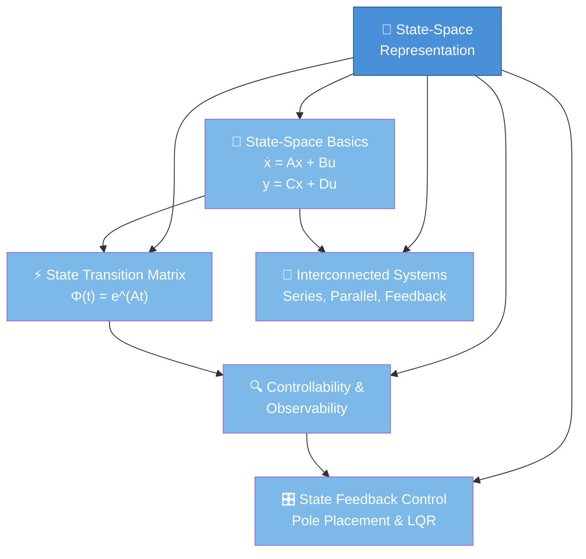

# 🗺️ State-Space Representation — Section Map of Content

> [!abstract] TL;DR
> State-space representation is a powerful general framework that describes any LTI system using a set of first-order differential (or difference) equations organized in matrix form. Instead of a single Nth-order equation, we track N "state variables" that capture the system's memory. This representation supports MIMO systems, provides direct access to internal system states (not just input/output), enables modern control design, and unifies CT and DT systems under one mathematical framework. This section covers the state equations, state transition matrix for computing responses, controllability and observability (two fundamental system properties), and state feedback control design via pole placement.

---

## 🧭 Section Overview

The **state-space** approach is the backbone of modern control theory and system analysis. Unlike the classical transfer-function approach (which is strictly SISO and frequency-domain), state-space works seamlessly for:

- **MIMO** systems (multiple inputs, multiple outputs)
- Systems with **internal state** (capacitor charge, rotor velocity)
- **Modern control design** (pole placement, LQR, Kalman filters)
- **Numerical simulation** via first-order ODE solvers
- Both **continuous-time** (CT) and **discrete-time** (DT) domains

---

## 🗺️ Concept Map

---

## 📚 Learning Path

Follow this sequence for maximum understanding:

1. **[[State_Space_Basics]]** — Master the state equations, matrix meanings, and how to convert an ODE to state-space form. This is the foundation for everything else.
2. **[[State_Transition_Matrix]]** — Learn how to compute the matrix exponential e^(At) and use it to find the complete system response from any initial state and input.
3. **[[Controllability_Observability]]** — Understand the two fundamental structural properties of a state-space system and the Kalman decomposition.
4. **[[State_Feedback_Control]]** — Design controllers and observers using pole placement, Ackermann's formula, and LQR.
5. **[[Interconnected_Systems]]** — Combine subsystems (series, parallel, feedback) and analyze stability of interconnections.

---

## 📋 All Notes in This Section

| # | File | Topic | Difficulty | Status |
|---|------|--------|------------|--------|
| 1 | [[State_Space_Basics]] | State equations, ODE conversion, TF derivation | Intermediate | ✅ |
| 2 | [[State_Transition_Matrix]] | Matrix exponential, complete response formula | Intermediate | ✅ |
| 3 | [[Controllability_Observability]] | Controllability/observability matrices, Kalman decomposition | Advanced | ✅ |
| 4 | [[State_Feedback_Control]] | Pole placement, Luenberger observer, LQR | Advanced | ✅ |
| 5 | [[Interconnected_Systems]] | Series, parallel, feedback, Mason's rule | Intermediate | ✅ |

---

## ❓ Key Questions This Section Answers

1. How do we represent a system with internal memory (states) in matrix form?
2. How do we compute the response of a state-space system from any initial condition?
3. Can every state be driven to any target state by some input? (Controllability)
4. Can we always reconstruct the internal state from only the output? (Observability)
5. How do we design a feedback controller to place closed-loop poles wherever we want?
6. What is the LQR optimal controller and why is it preferred in practice?
7. How do interconnected subsystems compose in state-space form?

---

## 🔑 Core Equations at a Glance

| Concept | Equation |
|---------|----------|
| CT State equation | $\dot{x}(t) = Ax(t) + Bu(t)$ |
| CT Output equation | $y(t) = Cx(t) + Du(t)$ |
| State transition matrix | $\Phi(t) = e^{At}$ |
| Complete CT response | $x(t) = e^{A(t-t_0)}x(t_0) + \int_{t_0}^{t} e^{A(t-\tau)}Bu(\tau)\,d\tau$ |
| Transfer function | $H(s) = C(sI-A)^{-1}B + D$ |
| Controllability matrix | $\mathcal{W}_c = [B \mid AB \mid \cdots \mid A^{n-1}B]$ |
| Observability matrix | $\mathcal{W}_o = [C^\top \mid A^\top C^\top \mid \cdots \mid (A^\top)^{n-1}C^\top]^\top$ |
| State feedback | $u(t) = -Kx(t) + r(t)$, closed-loop: $A_{cl} = A - BK$ |
| Luenberger observer | $\dot{\hat{x}} = A\hat{x} + Bu + L(y - C\hat{x})$ |

---

## 🔗 Related Sections

- [[_MOC_Signals_and_Systems_Master]] — Master vault index
- Section 01: Signals and Basic Operations (signal definitions used in state-space)
- Section 02: LTI Systems and Convolution (transfer function connects to state-space TF)
- Section 03: Laplace Transform (used to derive TF from state-space via $(sI-A)^{-1}$)
- Section 04: Fourier Analysis (frequency-domain interpretation of eigenvalues)
- Section 05: Z-Transform (DT state-space connects to Z-domain TF)

---

## 🏷️ Tags

#MOC #signals-and-systems #state-space #control-theory #LTI #MIMO #pole-placement #LQR
