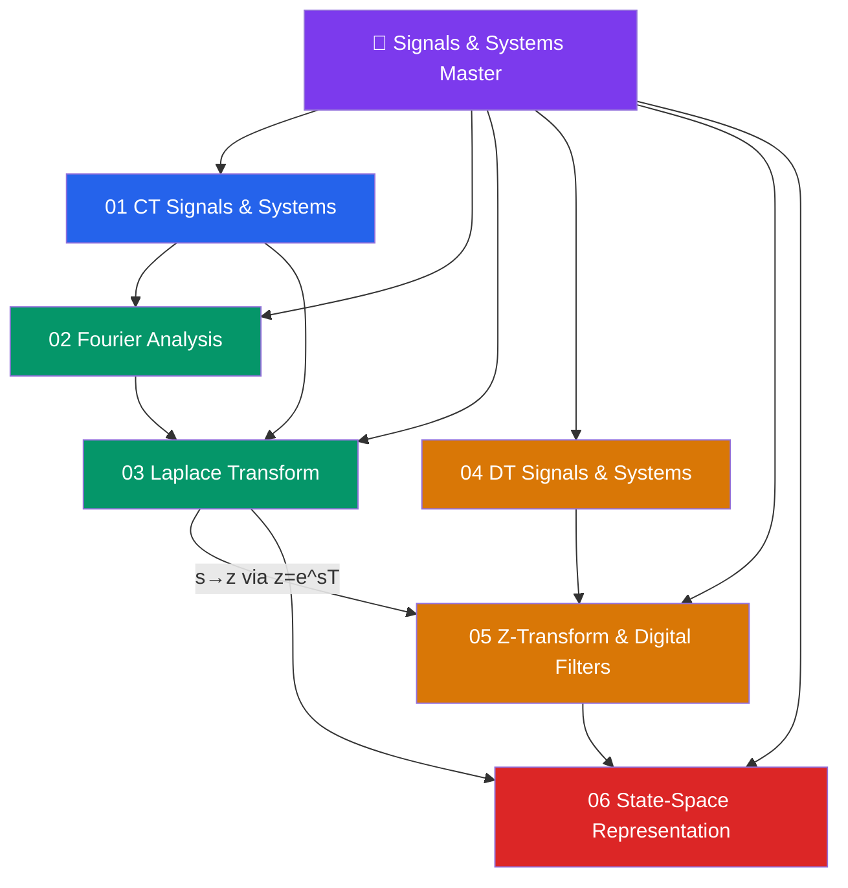

# 📡 Signals and Systems — Master Map of Content

> [!abstract] About This Vault
> A rigorous Signals and Systems reference: **37 notes across 6 sections**, covering the full arc from continuous-time signal building blocks and LTI system analysis through Fourier and Laplace transforms, discrete-time signals and the Nyquist theorem, Z-transforms and digital filter design, and state-space representation with modern control design. Every note pairs an intuition-first analogy with precise mathematics, Mermaid diagrams, Python code examples, trade-off tables, and review questions. Designed for electrical engineers, signal processing practitioners, and control systems engineers who need both theoretical grounding and practical implementation skills. Start at the section matching your immediate goal, or follow one of the four learning paths below.

## Vault Architecture

## Sections at a Glance

| # | Section | Notes | Entry Point | Difficulty |
|---|---------|-------|-------------|------------|
| 01 | CT Signals and Systems | 5 | [[_MOC_CT_Signals_Systems]] | Beginner |
| 02 | Fourier Analysis | 5 | [[_MOC_Fourier_Analysis]] | Beginner → Intermediate |
| 03 | Laplace Transform | 5 | [[_MOC_Laplace_Transform]] | Intermediate |
| 04 | DT Signals and Systems | 5 | [[_MOC_DT_Signals_Systems]] | Beginner → Intermediate |
| 05 | Z-Transform & Digital Filters | 5 | [[_MOC_Z_Transform_Filters]] | Intermediate → Advanced |
| 06 | State-Space Representation | 5 | [[_MOC_State_Space]] | Advanced |

---

## Learning Paths

### Path 1 — Signals and Systems Foundations (ECE Core)

> Best for: undergraduate ECE students building the canonical signals and systems course sequence.

**CT Signals → Fourier → Laplace → DT Signals → Z-Transform**

[[_MOC_CT_Signals_Systems]] → [[CT_Signals]] → [[System_Properties]] → [[CT_Convolution]] → [[_MOC_Fourier_Analysis]] → [[Fourier_Series]] → [[Fourier_Transform]] → [[Fourier_Properties]] → [[_MOC_Laplace_Transform]] → [[Laplace_Transform]] → [[Transfer_Functions]] → [[Stability_Frequency_Response]] → [[_MOC_DT_Signals_Systems]] → [[Sampling_Theorem]] → [[DT_Convolution]] → [[_MOC_Z_Transform_Filters]] → [[Z_Transform]] → [[Inverse_Z_Transform]]

---

### Path 2 — Digital Signal Processing (DSP Practitioner)

> Best for: engineers implementing filtering, spectral analysis, or audio/communications DSP in software.

**Sampling → DT Systems → Z-Transform → Digital Filters → FFT**

[[Sampling_Theorem]] → [[DT_Signals]] → [[DT_System_Properties]] → [[Difference_Equations]] → [[Z_Transform]] → [[Z_Transform_Properties]] → [[Inverse_Z_Transform]] → [[Digital_Filter_Design]] → [[DFT_and_FFT]] → [[Fourier_Transform]] → [[Fourier_Properties]]

---

### Path 3 — Control Systems Engineer

> Best for: engineers designing feedback controllers, state estimators, and automated systems.

**CT Systems → Laplace → Frequency Response → State Space → Control Design**

[[System_Properties]] → [[Impulse_Response]] → [[_MOC_Laplace_Transform]] → [[Transfer_Functions]] → [[Stability_Frequency_Response]] → [[Laplace_Properties]] → [[_MOC_State_Space]] → [[State_Space_Basics]] → [[State_Transition_Matrix]] → [[Controllability_Observability]] → [[State_Feedback_Control]] → [[Interconnected_Systems]]

---

### Path 4 — Communications Engineer

> Best for: engineers working with modulation, channel analysis, or RF systems.

**Fourier → Spectrum → Sampling → Filters → DFT**

[[Fourier_Transform]] → [[Fourier_Series]] → [[Fourier_Properties]] → [[Frequency_Spectrum]] → [[Fourier_Applications]] → [[Sampling_Theorem]] → [[Digital_Filter_Design]] → [[DFT_and_FFT]] → [[Stability_Frequency_Response]]

---

## Cross-Vault Links

This vault provides the mathematical machinery underlying several other domains:

- **Computer Architecture vault** — [[_MOC_Computer_Architecture_Master]] — Digital logic, clock signals, and ADC/DAC interfaces in hardware all depend on Nyquist sampling and discrete-time signal principles.
- **Quantitative Finance vault** — [[_MOC_QuantFinance_Master]] — Time-series filtering, spectral analysis of price data, and Kalman filter state estimation (a direct application of state-space theory) are central to quantitative analysis.
- **AI-ML vault** — [[_MOC_AI_ML_Master]] — Convolutional neural networks perform learned 2D convolutions; audio/speech models process Fourier-transformed spectrograms; the mathematical convolution here is the same operation.
- **Physics vault** — Fourier analysis is the backbone of quantum mechanics (momentum ↔ position duality), wave optics, and thermodynamics (heat equation solutions via FS).
- **Networking vault** — [[_MOC_Networking_Master]] — Channel capacity (Shannon), signal bandwidth, and modulation schemes in wireless/wireline communications are direct applications of Fourier and sampling theory.

---

## Section MOC Index

- [[_MOC_CT_Signals_Systems]] — Elementary CT signals (δ(t), u(t), exponentials), LTI system properties (linearity, time-invariance, causality, stability), impulse response, and the convolution integral — the complete foundation for everything that follows.
- [[_MOC_Fourier_Analysis]] — Fourier Series for periodic signals, the Continuous-Time Fourier Transform (CTFT) for aperiodic signals, all key properties (shifting, scaling, duality, Parseval), spectral analysis, and applications in filtering and AM modulation.
- [[_MOC_Laplace_Transform]] — The complex-frequency generalization of the CTFT: bilateral/unilateral transforms, ROC, properties, transfer functions H(s), partial fraction inversion, Bode plots, and stability via pole locations in the s-plane.
- [[_MOC_DT_Signals_Systems]] — Discrete-time sequences (δ[n], u[n], DT sinusoids), LTI DT system properties, the Nyquist-Shannon sampling theorem (the bridge from CT to DT), the convolution sum, and difference equations as the digital counterpart to ODEs.
- [[_MOC_Z_Transform_Filters]] — The Z-transform as the DT analog of Laplace: ROC, transform pairs, properties, inverse via partial fractions and long division, FIR/IIR digital filter design (windowing and bilinear transform), and the DFT/FFT for practical spectral analysis.
- [[_MOC_State_Space]] — Matrix-form system description enabling MIMO analysis: state and output equations, matrix exponential (state transition matrix), controllability and observability conditions, state feedback pole placement, LQR, Luenberger observers, and interconnected system analysis.

#MOC #SignalsAndSystems #MasterMOC
