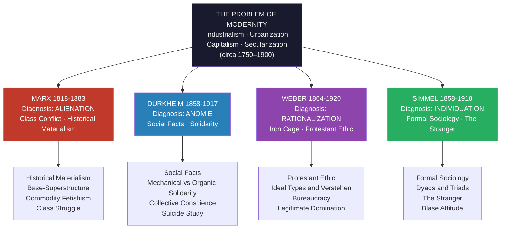

# Classical Sociological Theory

> [!abstract] TL;DR
> The four founding theorists — Marx, Durkheim, Weber, and Simmel — each diagnosed a different central wound that industrial modernity inflicted on human life: alienation from one's own labor (Marx), normlessness that severs individuals from society (Durkheim), imprisonment inside bureaucratic rationality without meaning (Weber), and the fragmentation of the self under the pressure of metropolitan social forms (Simmel). Together they established the core tensions — structure vs. agency, macro vs. micro, explanation vs. interpretation — that still organize sociological debate today.

---

## Intuition

**Analogy:** Imagine four doctors examining the same patient — industrial modernity — and each writing a different diagnosis. The first doctor looks at the patient's hands and says the problem is that the worker no longer recognizes herself in what she makes — her creative energy has been turned into something alien and hostile. The second doctor measures the patient's nervous system and says the problem is that the old norms governing behavior have dissolved faster than new ones have formed — the patient is adrift. The third doctor reads the patient's schedule and says the problem is that every hour is now governed by impersonal rules and efficiency calculations, leaving no room for meaning. The fourth doctor watches the patient's eyes dart through a crowded city and says the problem is that the individual is being overwhelmed by a thousand social forms competing for her attention, forcing a protective numbness.

Same patient, four diagnoses. Classical sociological theory is, in large part, the record of that debate — and the realization that all four doctors were partly right.

---

## How It Works



---

## Key Concepts

### Secondary Level

**What is sociology?** Sociology is the systematic study of human society: how people organize themselves collectively, how social structures shape individual behavior, and how societies change over time. It emerged as a formal discipline in the 19th century precisely because industrialization was transforming European society so rapidly that traditional frameworks — theology, political philosophy — could not keep pace.

**The four founders at a glance:**

| Theorist | Nationality | Core Question | Central Concept | Vision of Solution |
|---|---|---|---|---|
| Karl Marx (1818–1883) | German | Who benefits from social arrangements? | Alienation, Class | Revolution, communism |
| Emile Durkheim (1858–1917) | French | What holds society together? | Social facts, Anomie | Organic solidarity, new guilds |
| Max Weber (1864–1920) | German | How do people give meaning to action? | Rationalization | No solution — tragic irony |
| Georg Simmel (1858–1918) | German | How do social forms shape individuals? | Formal sociology | Individual negotiation |

**Key terms every student needs:**

- **Alienation** — feeling estranged from one's own activity, product, or fellow human beings
- **Anomie** — normlessness; a state where social rules are unclear or absent, leaving individuals without guidance
- **Rationalization** — the historical trend toward replacing tradition and emotion with calculation, efficiency, and formal rules
- **Social fact** — any aspect of social life that shapes individual behavior but exists independently of individuals (laws, norms, beliefs, institutions)
- **Solidarity** — the bonds that hold a community together

---

### Undergraduate Level

#### Marx: Alienation, Historical Materialism, and Class Conflict

**Historical materialism** is Marx's philosophy of history: societies change not through ideas or great men but through changes in material conditions — specifically, through the forces of production (technology, labor power) and the relations of production (who owns what). Every epoch has a dominant mode of production (slavery, feudalism, capitalism) with its characteristic class conflict. History is the history of class struggle.

**Base and superstructure**: The economic base (forces + relations of production) determines the superstructure — law, politics, religion, philosophy, culture, and ideology. The ruling class controls not only the economy but also the dominant ideas: "The ideas of the ruling class are in every epoch the ruling ideas." Ideology functions as false consciousness that obscures real class interests.

**Alienation (Entfremdung)**: Under capitalism, the worker is alienated from:
1. The **product** of labor — it confronts her as something alien and hostile; she does not own it
2. The **act of production** — work is not self-expression but a means of survival; labor is compelled, not chosen
3. Her **species-being (Gattungswesen)** — humans are distinguished by conscious, creative production; capitalism reduces this to mere animal subsistence labor
4. **Other people** — when all human relationships are mediated by the cash nexus, genuine solidarity is replaced by competition

**Commodity fetishism**: Commodities in a capitalist market appear to have an autonomous "life" — prices rise and fall as if by natural law. This mystifies the social labor (human relationships) that actually produced the commodity. The real social relations between producers are hidden behind apparent relations between things. This is not mere confusion but a structural feature of how capitalism works.

**Class conflict**: Bourgeoisie (owners of means of production) vs proletariat (who sell their labor). Surplus value — the difference between what workers are paid and what they produce — is the source of profit and the mechanism of exploitation. The contradiction between the increasingly social character of production (factory workers, global supply chains) and the private appropriation of profit must, Marx argued, eventually resolve in revolution.

---

#### Durkheim: Social Facts, Solidarity, and Anomie

**Social facts** are Durkheim's answer to the question of what sociology studies that no other discipline studies. A social fact is a way of acting, thinking, or feeling that is:
- **External** to the individual (exists before the individual is born; persists after death)
- **Coercive** (the individual who violates it faces sanctions — legal, moral, social)
- **General** across a society (shared, not idiosyncratic)

Examples: the French language, the Catholic Church's doctrine, the legal prohibition on murder, the social convention that funerals require muted dress. Durkheim insisted these must be treated as "things" — studied empirically, explained by other social facts, not by individual psychology.

**Mechanical vs Organic Solidarity**: In *The Division of Labor in Society* (1893), Durkheim traced the transition from traditional to modern society through changes in social cohesion:

| Type | Based on | Social Bonds | Law Type | Collective Conscience | Example |
|---|---|---|---|---|---|
| **Mechanical** | Similarity — members share the same values, beliefs, ways of life | Strong, segmental | Repressive (punishment reinforces moral order) | Strong, all-encompassing | Medieval village; tribal societies |
| **Organic** | Difference — members depend on each other's specialized functions | Weak moral unity, strong functional interdependence | Restitutive (restore disturbed relations) | Weak, individualistic | Modern industrial societies |

Durkheim worried that modernity was dissolving mechanical solidarity faster than organic solidarity could form — producing anomie.

**Anomie**: Literally "without norms." Anomie describes a state where the social regulation of human desires has broken down. Durkheim argued that human desires are inherently insatiable; only society can impose limits. When society fails to regulate — whether through rapid economic expansion, industrial crises, or divorce — suicide rates rise. Anomie is a pathology of modernization.

**The Suicide Study (1897)**: Durkheim's methodological tour de force. He used official statistics across European countries to demonstrate that suicide rates — an apparently individual act — vary systematically with social variables: religion (Protestants commit suicide more than Catholics; Catholics more than Jews), marital status, urban/rural residence, economic cycle. His argument: individual psychological states cannot explain patterned variations in suicide rates; only social facts can.

**The four types of suicide:**

| Type | Social Integration | Moral Regulation | Example Population |
|---|---|---|---|
| **Egoistic** | Too low | Normal | Protestant individualists; intellectuals |
| **Altruistic** | Too high | Normal | Soldiers dying for unit honor; religious martyrs |
| **Anomic** | Normal | Too low | Newly divorced; newly rich or newly bankrupt |
| **Fatalistic** | Normal | Too high | Prisoners; slaves (barely theorized by Durkheim) |

The pattern is an **inverted U on each axis**: moderate integration and regulation protect against suicide; extremes in either direction increase risk.

---

#### Weber: Rationalization, the Iron Cage, and the Protestant Ethic

**Rationalization** is Weber's master concept for modernity. The historical trajectory of Western civilization has been toward increasing formal rationality: the replacement of tradition, emotion, and charisma with calculable rules, efficiency, and impersonal procedures. This process operates in law (codified statute replacing customary law), music (equal temperament replacing modal tuning), science (systematic empirical method replacing revelation), the economy (double-entry bookkeeping, actuarial calculation), and above all in **bureaucracy**.

**The Iron Cage (Stahlhartes Gehäuse)**: Weber's most celebrated — and most pessimistic — image. Rationalization was originally driven by meaning: the Protestant entrepreneur sought to demonstrate election by disciplined labor. But when the religious meaning evaporated (secularization), the capitalist machine remained and now runs on its own. The bureaucratic, rational-legal apparatus that was supposed to serve human purposes ends up imprisoning humans in a "cage of steel" where specialists without spirit, sensual human beings without heart exercise functions that produce nothing but more rationalization.

**The Protestant Ethic and the Spirit of Capitalism (1905)**: Weber's most influential work. His question: why did modern rational capitalism develop in Western Europe specifically? His answer: the Calvinist doctrine of predestination (you cannot know or earn salvation) combined with the concept of **calling** (Beruf — all worldly work as vocation) created the psychological pressure to demonstrate election through worldly success and systematic, ascetic accumulation. This "Protestant ethic" — not Protestantism's content, but its psychological consequences — produced the "spirit of capitalism." Weber explicitly disclaimed that Protestantism caused capitalism; he argued for an "elective affinity" between religious ethic and economic mentality.

**Ideal types (Idealtypen)**: Weber's methodological concept. An ideal type is a one-sided accentuation of certain features of reality for analytical purposes. It is not an average and not a normative ideal. "Bureaucracy," "charismatic authority," "the Protestant ethic" — these are all ideal types, conceptual tools that allow comparison. Real phenomena are always approximations to ideal types, never identical with them.

**Verstehen (interpretive understanding)**: The sociologist must understand the **subjective meaning** that social actors attach to their actions. This distinguishes sociology from natural science, which only needs causal explanation. There are two levels: *aktuelles Verstehen* (direct, immediate understanding of an action) and *erklärendes Verstehen* (motivational understanding — why did this person do this in this context?).

**Three Types of Legitimate Domination**:

| Type | Basis of Legitimacy | Administrative Staff | Example |
|---|---|---|---|
| **Traditional** | Sacred custom and precedent | Personal retainers, household staff | Patrimonialism, feudalism |
| **Charismatic** | Extraordinary personal qualities | Disciples bound personally to leader | Religious prophets, revolutionary leaders |
| **Rational-legal** | Impersonal rules and law | Trained professional bureaucrats | Modern states, corporations |

**Bureaucracy**: For Weber, the most technically efficient form of administration ever devised — and the most dehumanizing. Characteristics: formal hierarchy of offices, written rules and procedures, impersonal application, separation of office from the officeholder, appointment based on technical qualifications, fixed salaries, career progression. Bureaucracy is the administrative apparatus of rational-legal domination.

**Wertfreiheit (value-freedom)**: Weber insisted that the social scientist must rigorously distinguish empirical claims from value judgments. Science cannot tell us what ends to pursue; it can only analyze the means-ends relationship. This is a *methodological* position, not ethical indifference — Weber was deeply politically engaged.

---

#### Simmel: Formal Sociology and the Metropolis

Georg Simmel is the most neglected of the four founders and perhaps the most prescient for understanding contemporary life.

**Formal sociology**: Simmel argued that society consists of recurring **social forms** — patterns of interaction like conflict, exchange, domination, secrecy, sociability — that persist across different social contents. The form of a love relationship and the form of a commercial transaction may share structural properties (gift-giving, reciprocity, exclusivity) even though their content is utterly different. Sociology should study these forms.

**Dyads and Triads**: Simmel's analysis of group size remains classic:
- A **dyad** (two-person group) is inherently fragile — the departure of either member ends the relationship; neither can be "outvoted"; the group depends entirely on both individuals
- A **triad** (three-person group) introduces qualitatively new possibilities: coalition formation, mediation, third-party arbitration, majority rule, the divisive "divide and conquer" strategy. Society in the full sense only begins with the triad

**The Stranger**: One of Simmel's most influential essays (1908). The "stranger" is not simply a newcomer — it is a figure who is simultaneously *near* and *far*: physically present in a community, economically integrated, but not organically belonging to it. This position grants the stranger a distinctive **objectivity** — free from the partialities and biases of insiders — but also a particular kind of social isolation. The figure anticipates modern cosmopolitanism, immigration, and diaspora.

**The Blasé Attitude**: In *The Metropolis and Mental Life* (1903), Simmel analyzes the characteristic psychology of urban life. The city bombards the individual with intensified sensory and social stimulation. The nervous system protects itself by developing the **blasé attitude** — a leveling of all differences, a dulling of responsiveness, an apparent indifference to value. This is not a moral failing but an adaptive response to the over-stimulation of modern urban life.

**Money and modernity**: In *The Philosophy of Money* (1900), Simmel argues that money — as a universal medium of exchange — transforms all qualitative relationships into quantitative ones. Everything becomes calculable, comparable, exchangeable. The "all-pervading money economy" is Simmel's version of disenchantment.

---

### Graduate Level

#### The Macro–Micro Problem

Classical theory established the central tension in all subsequent sociology: the relationship between **social structures** (macro) and **individual agency** (micro).

- **Marx** and **Durkheim** are fundamentally **macro-structural**: social structures (class position, social facts) explain individual consciousness and behavior. The individual is largely an effect of larger forces.
- **Simmel** is fundamentally **micro-interactional**: focus is on face-to-face interaction and the forms that emerge from it.
- **Weber** is the most sophisticated bridger: insists that sociology must interpret *subjective meaning* (micro) while analyzing large-scale structural processes (macro). His concept of "social action" — action oriented to others — is the basic unit.

This tension generates the 20th century's major theoretical syntheses: Parsons' structural functionalism attempts to integrate system and action; Berger and Luckmann's social constructionism bridges meaning and structure; Giddens' structuration theory explicitly addresses how structures are produced and reproduced through action.

#### Commodity Fetishism and Reification

Marx's concept of commodity fetishism was extended by the Hungarian Marxist György Lukács into **reification** (*Verdinglichung*): the process by which human relationships and activities take on the appearance of objective "thing-like" properties — natural, immutable, independent of human will. For Lukács, reification is the characteristic form of consciousness under capitalism: workers experience their own situation as natural and inevitable rather than as a product of contingent social relations. The Frankfurt School (Horkheimer, Adorno, Marcuse) drew heavily on both Marx's fetishism and Weber's rationalization to develop their critique of the "culture industry" and "one-dimensional society."

#### Legitimate Domination and Political Sociology

Weber's typology of domination was explicitly designed to answer the question: why do the dominated comply? Each type requires not only force but *legitimacy* — a belief in the rightfulness of the order. Traditional domination relies on the belief that things have always been this way and should remain so. Charismatic domination is inherently unstable and tends toward **routinization** — the followers institutionalize the charismatic message to preserve it, thereby transforming it into either tradition or rational-legal authority. This provides the framework for analyzing revolutionary movements, leadership succession, and the bureaucratization of churches, parties, and corporations.

#### The Reception of Classical Theory

The classical tradition was absorbed into 20th-century sociology in three major streams:

1. **Structural functionalism** (Parsons, Merton): synthesized Durkheim and Weber; focused on the functional prerequisites of social systems; dominant in American sociology 1940s–1960s
2. **Conflict theory** (Mills, Dahrendorf, Rex): drew on Marx and Weber; focused on power, inequality, and coercion rather than consensus
3. **Interpretive sociology** (Symbolic Interactionism — Mead, Blumer; Phenomenological sociology — Schutz; Ethnomethodology — Garfinkel): drew on Weber's Verstehen and Simmel's micro-sociology; studied how meaning is constructed in interaction

Each stream can be read as a selective retrieval and extension of the classical canon — which is precisely what makes the canon so generative.

#### Each Theorist's Tragedy

A distinctive feature of classical theory is that none of the four theorists thought modernity's problems were easily solvable:

- **Marx**: Revolution was necessary and inevitable — but 20th-century attempts at communist revolution produced states that Marx himself could not have recognized or endorsed.
- **Durkheim**: New forms of organic solidarity (professional associations, the state as a moral entity) could re-integrate modern society — but anomie has arguably intensified with late capitalism and social media.
- **Weber**: The iron cage closes further with every decade of bureaucratization and technological rationalization; there is no "solution" — only the heroic cultivation of meaningful values in the face of a disenchanted world.
- **Simmel**: The individual can find freedom by negotiating the tension between objective culture (the accumulated products of human creativity) and subjective culture (individual experience) — but objective culture grows faster than any individual can absorb.

---

## Python Demo

```python
import numpy as np
import matplotlib.pyplot as plt

# ---------------------------------------------------------------
# Durkheim's Four Suicide Types as a 2-D parameter space.
# Axes: social integration (x) and moral regulation (y).
# Suicide risk is modeled as highest at both extremes of each axis,
# lowest near the midpoint — reproducing the inverted-U shape
# Durkheim identified empirically across European countries.
# ---------------------------------------------------------------

N = 200
integration = np.linspace(0, 1, N)   # 0 = isolated individual, 1 = fully absorbed in group
regulation   = np.linspace(0, 1, N)  # 0 = total normlessness, 1 = completely constrained
I, R = np.meshgrid(integration, regulation)

# Quadratic penalty away from the optimal midpoint on each axis.
# At the optimum (0.5, 0.5), risk is zero; at the corners, risk is highest.
OPTIMAL = 0.5
suicide_risk = 100 * ((I - OPTIMAL)**2 + (R - OPTIMAL)**2)

fig, axes = plt.subplots(1, 2, figsize=(13, 5))
fig.suptitle("Durkheim's Theory of Suicide: Social Integration vs Moral Regulation",
             fontsize=12, fontweight="bold")

# --- Left panel: 2-D contour heat map ---
ax1 = axes[0]
cf = ax1.contourf(I, R, suicide_risk, levels=30, cmap="RdYlGn_r")
plt.colorbar(cf, ax=ax1, label="Relative suicide risk (arbitrary units)")
ax1.set_xlabel("Social Integration  (low → isolated → high → absorbed)", fontsize=9)
ax1.set_ylabel("Moral Regulation  (low → normless → high → constrained)", fontsize=9)
ax1.set_title("2-D Parameter Space", fontsize=10)

# Annotate the four extreme suicide types
type_labels = [
    (0.08, 0.50, "EGOISTIC\n(low integration)"),
    (0.92, 0.50, "ALTRUISTIC\n(high integration)"),
    (0.50, 0.08, "ANOMIC\n(low regulation)"),
    (0.50, 0.92, "FATALISTIC\n(high regulation)"),
]
for xv, yv, txt in type_labels:
    ax1.text(xv, yv, txt, ha="center", va="center", fontsize=7.5,
             bbox=dict(boxstyle="round,pad=0.3", facecolor="white", alpha=0.80))

ax1.plot(OPTIMAL, OPTIMAL, "w*", markersize=14)
ax1.text(OPTIMAL + 0.04, OPTIMAL + 0.07, "Optimal zone\n(lowest risk)",
         color="white", fontsize=7.5, ha="left")

# --- Right panel: marginal inverted-U curves ---
ax2 = axes[1]
mid = N // 2
risk_vs_integration = suicide_risk[mid, :]  # regulation held at midpoint
risk_vs_regulation  = suicide_risk[:, mid]  # integration held at midpoint

ax2.plot(integration, risk_vs_integration, color="steelblue", linewidth=2.5,
         label="Risk vs Integration\n(regulation fixed at 0.5)")
ax2.plot(regulation, risk_vs_regulation, color="tomato", linewidth=2.5,
         linestyle="--", label="Risk vs Regulation\n(integration fixed at 0.5)")

ax2.set_xlabel("Dimension value  (0 = low, 1 = high)", fontsize=9)
ax2.set_ylabel("Relative suicide risk", fontsize=9)
ax2.set_title("Inverted-U Pattern per Dimension", fontsize=10)
ax2.legend(fontsize=8)
ax2.grid(True, alpha=0.3)

# Annotate type labels on marginal curves
for xpos, label, color in [
    (0.05, "Egoistic", "steelblue"),
    (0.93, "Altruistic", "steelblue"),
    (0.05, "Anomic", "tomato"),
    (0.93, "Fatalistic", "tomato"),
]:
    idx = int(xpos * (N - 1))
    y_i = risk_vs_integration[idx]
    y_r = risk_vs_regulation[idx]
    y = y_i if color == "steelblue" else y_r
    ax2.annotate(label, xy=(xpos, y), xytext=(xpos, y + 1.8),
                 fontsize=7.5, color=color, ha="center")

plt.tight_layout()
plt.savefig("durkheim_anomie_model.png", dpi=110, bbox_inches="tight")
plt.show()

print("Durkheim's insight: both extremes of integration and regulation elevate suicide risk.")
print("The optimal society maintains moderate bonds — neither isolating nor suffocating the individual.")
print("This transforms suicide from a private psychological act into a sociological indicator.")
```

---

## Real-World Applications

> **Alienation in the gig economy (Marx):** Platform workers (Uber, DoorDash, Amazon Flex) are disconnected from the product of their labor, set in competition with each other, and experience their working conditions as governed by an opaque algorithm rather than a human employer. Marx's analysis of piece-work and the fragmentation of craft labor maps directly onto algorithmic labor management — the algorithm is the foreman who never sleeps and whose authority is never questioned because it appears "objective."

> **Anomie and social media (Durkheim):** Robert Putnam's *Bowling Alone* (2000) documented the collapse of civic associations in America — exactly the intermediate institutions Durkheim saw as essential to social integration. Social media platforms offer simulated integration (followers, likes, communities) without the normative regulation of face-to-face community. The resulting anomic pattern — rising rates of depression, suicide, and nihilism, especially among adolescents — is precisely what Durkheim's theory predicts.

> **Bureaucratic rationalization in healthcare (Weber):** Modern healthcare systems exemplify Weber's iron cage: physicians spend more time on EHR documentation and billing codes (formal rationality) than on patient care (substantive rationality). The original purpose of the administrative system — improving care — is displaced by the system's own imperatives. Weber would recognize this as the victory of means over ends.

> **The stranger and immigration (Simmel):** Simmel's "stranger" concept is deployed by contemporary sociologists to analyze the structural position of first-generation immigrants, guest workers, and transnational professionals — people who are economically integrated but socially distant, who bring outsider objectivity but face persistent exclusion. The figure of the stranger anticipates debates about multiculturalism, cosmopolitanism, and diaspora identity.

---

## Common Pitfalls

- **Treating Marx as purely economic determinism** — Marx's "base determines superstructure" is a tendency, not a mechanical law. Engels later clarified that the economic base determines only "in the last instance" and that there is complex reciprocal interaction. Reducing Marxism to economic reductionism misses the sophistication of the argument.

- **Confusing anomie with alienation** — These are different diagnoses from different traditions. Anomie (Durkheim) is about the breakdown of social norms regulating behavior — a social-structural problem. Alienation (Marx) is about the worker's estrangement from her own activity under capitalism — an economic-existential problem. Both involve social disintegration, but the mechanisms and remedies differ fundamentally.

- **Reading Weber's iron cage as pure pessimism** — Weber did not argue that rationalization makes meaningful life impossible; he argued that it makes it harder and that meaning must now be consciously cultivated through value commitment (what he called the "ethic of conviction"). He was a tragic realist, not a nihilist.

- **Mistaking ideal types for empirical descriptions** — When Weber says "bureaucracy" has these six features, he is constructing an analytical tool, not describing any real organization. Real bureaucracies always deviate from the ideal type; that is precisely the point — the deviation tells you something sociologically interesting.

- **Forgetting Simmel** — Undergraduate sociology curricula often reduce classical theory to "Marx, Durkheim, Weber." Simmel's micro-sociology is foundational for symbolic interactionism, urban sociology, the sociology of money, and network analysis. Neglecting him produces an artificially macro-structural picture of the classical canon.

- **Treating the theorists as monoliths** — Each produced a body of work that evolved, contradicted itself, and was context-dependent. "Marx" on alienation in the 1844 Manuscripts is not the same as "Marx" in Capital. "Weber" on value-freedom is not the same as Weber the political combatant. Read them in context, not as ideological brands.

---

## Related Concepts

- [[_MOC_Sociological_Theory_and_Foundations|↑ Sociological Theory and Foundations MOC]] — Section entry point and concept map for this theoretical cluster
- [[Socialism_Marxism_and_Communism]] — Extends Marx's class analysis and historical materialism into political programs; essential for understanding the political legacy of the theory
- [[Classical_Political_Philosophy]] — The ancient Greek tradition (Plato, Aristotle) that preceded classical sociology; provides the vocabulary of justice, polis, and civic virtue that the sociologists were responding to
- [[Social_Influence_and_Conformity]] — Milgram, Asch, and Zimbardo are empirical social psychology — but they operationalize Durkheim's insight that social facts coerce individuals in ways they often cannot resist
- [[Group_Dynamics]] — Simmel's analysis of dyads and triads is the direct precursor of small-group research; groupthink and group polarization are empirical realizations of formal sociology's predictions about group structure

---

## Review Questions

### Secondary

1. Explain in your own words why Marx thought workers under capitalism would feel "alienated." Give one modern example.
2. What is anomie? Why did Durkheim think it was a danger specific to modern industrial societies rather than to traditional ones?
3. Weber said modernity was creating an "iron cage." What did he mean, and can you think of a situation in your own life where a rule or system felt more like a cage than a tool?

### Undergraduate

1. Compare Marx's and Durkheim's accounts of the relationship between the individual and society. For Marx, how does the economic structure shape consciousness? For Durkheim, how do social facts constrain individual behavior? Where do these approaches agree, and where do they fundamentally diverge?
2. Weber's *Protestant Ethic* thesis has been called one of the most controversial arguments in social science. State the argument precisely, distinguish it from the claim that "Protestantism caused capitalism," and identify one empirical objection that has been raised against it.
3. Apply Simmel's concepts of the "stranger" and the "blasé attitude" to social media. In what sense are social media users simultaneously near and far? Does the platform economy produce its own version of the blasé attitude?

### Graduate

1. The macro–micro problem is often called the central theoretical problem of sociology. Using specific arguments from Marx, Durkheim, Weber, and Simmel, show how each theorist positions the relationship between social structure and individual agency. Which contemporary theoretical framework (structuration theory, social constructionism, field theory) do you find most successful in resolving the tension, and why?
2. Durkheim insisted that sociology must treat social facts as "things" and explain them through other social facts rather than through individual psychology. Weber insisted that sociology must interpret the subjective meaning of social action. Are these methodological programs incompatible? Can a single research program satisfy both requirements — and if so, how?
3. Marx, Durkheim, and Weber all diagnosed modernity as producing a distinctive pathology (alienation, anomie, the iron cage). Evaluate: which diagnosis has the greatest explanatory power for the 21st century, and what would updating that diagnosis require given changes in digital capitalism, social media, and globalization?

---

## Sources

- Karl Marx, *Economic and Philosophic Manuscripts of 1844*
- Karl Marx, *Capital, Volume I* (1867), especially "The Fetishism of Commodities"
- Emile Durkheim, *The Division of Labor in Society* (1893)
- Emile Durkheim, *The Rules of Sociological Method* (1895)
- Emile Durkheim, *Suicide: A Study in Sociology* (1897)
- Max Weber, *The Protestant Ethic and the Spirit of Capitalism* (1905)
- Max Weber, *Economy and Society* (1922), especially on bureaucracy and domination
- Georg Simmel, "The Stranger" (1908), in *On Individuality and Social Forms*
- Georg Simmel, "The Metropolis and Mental Life" (1903)
- Anthony Giddens, *Capitalism and Modern Social Theory* (1971) — the single best comparative guide to Marx, Durkheim, and Weber
- Robert Nisbet, *The Sociological Tradition* (1966) — essential for understanding the conservative and liberal strands within classical theory

---

#Sociology #SociologicalTheory #ClassicalTheory #Marx #Durkheim #Weber #Simmel #Modernity #Alienation #Anomie #Rationalization
