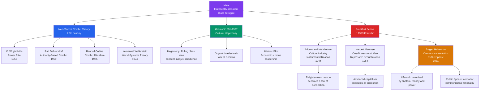

> [!abstract] TL;DR
> Conflict theory holds that society is organized around perpetual competition over scarce resources and power, with dominant groups maintaining their position through both force and ideology; critical theory extends this to ask how power reproduces itself through culture, reason, and everyday "common sense" — not just through police and prisons. Together, from C. Wright Mills' power elite to Gramsci's hegemony, Adorno's culture industry, and Habermas's colonized lifeworld, they form the intellectual backbone of the radical tradition in sociology: the claim that domination is most durable when it is invisible.

---

## Intuition

**Analogy:** Imagine a landlord who owns not just the apartment building but also the local newspaper, the school board, and the civic association that writes the neighbourhood bylaws. The tenants technically rent freely. No one holds a gun to their heads at lease-signing. But "what a fair rent is," "what makes a good neighbourhood," and "what kind of people cause property values to fall" are all questions that get answered in the newspaper, taught in the school, and codified in the bylaws — all of which the landlord's worldview quietly shapes. The building stays profitable not because guards patrol every corridor but because everyone accepts, as common sense, that the landlord's rules are just.

Conflict theory says that society is that building writ large. Critical theory asks the deeper question: how did those rules get installed as "common sense" in the first place, and what kind of thinking could dislodge them?

---

## How It Works

The conflict tradition begins with a basic claim: social order is not consensus (as functionalism argues) but a temporary equilibrium imposed by whichever group currently controls the most resources and legitimacy. The central analytic task is to trace *how* that control is maintained — through coercion when necessary, but more efficiently through ideology, culture, and the colonization of everyday life.



---

## Key Concepts

### Secondary Level

**What Is Conflict Theory?**

Where functionalism asks "how does society hold together?", conflict theory asks "who benefits from the way society is organized, and who pays the cost?" The founding premise is that social arrangements — legal systems, educational curricula, cultural values, media representations — are not neutral. They tend to reflect and reproduce the interests of those who hold power. History moves not through shared consensus but through conflict between groups with incompatible interests.

**C. Wright Mills: The Power Elite (1956)**

Mills was an American sociologist writing against the postwar fantasy of pluralist democracy — the idea that power in America was dispersed among competing interest groups with no single bloc in charge. His empirical claim in *The Power Elite* was stark: three overlapping institutional hierarchies — the corporate economy, the political executive, and the military establishment — had fused into an interlocking directorate of roughly 300-400 individuals who moved between boardrooms, cabinet offices, and Pentagon committees. They shared prep schools, golf clubs, and marriage networks. They did not need to conspire because they shared the same formation, the same class interests, and the same worldview.

Mills' concept remains the standard sociological toolkit for analyzing elite reproduction: not a secret cabal, but a structural convergence of institutional positions that gives a small group decisive agenda-setting power.

**What Is the Frankfurt School?**

The Institut für Sozialforschung (Institute for Social Research), founded in Frankfurt in 1923, was the institutional home of **critical theory**. The founding question was: why did the German working class support fascism rather than revolution? Their answer went beyond economics into culture, psychology, and the structure of reason itself. Led by Max Horkheimer and Theodor Adorno (and including Herbert Marcuse and, in the second generation, Jürgen Habermas), the Frankfurt School produced the most sophisticated Marxist cultural theory of the 20th century.

**Gramsci's Hegemony in Plain Terms**

Antonio Gramsci, writing in Mussolini's prisons (1929-1935), asked why Italian workers had not revolted despite real economic grievances. His answer: **cultural hegemony**. The ruling class does not just own factories — it owns the terms in which "normal," "natural," and "inevitable" are defined. Workers who accept low wages as just the way markets work, who regard upward mobility as personal responsibility, and who view the state as a neutral arbiter rather than a class instrument are exhibiting hegemonic consent. They are not deceived — they have genuinely internalised a worldview that serves interests other than their own. This is more powerful than coercion because it does not require a visible oppressor.

---

### Undergraduate Level

**Ralf Dahrendorf: Authority as the Axis of Conflict (1959)**

Where Marx rooted conflict in ownership of the means of production, Dahrendorf (*Class and Class Conflict in Industrial Society*, 1959) shifted the axis to **authority relations**. Any organisation — a factory, a church, a bureaucracy, a school — has those who command and those who obey. This authority structure generates two quasi-groups: those who benefit from the status quo and those who do not. Under the right conditions of organisation and mobilisation, quasi-groups crystallise into actual conflict groups and fight over authority distributions.

Dahrendorf's reformulation was significant for two reasons. First, it severed conflict theory from economic determinism: conflicts over racial hierarchy, gender authority, or bureaucratic control are not derivative of class conflict — they have their own independent dynamics. Second, it predicted ongoing conflict under socialism, where the party nomenclature would generate its own authority structure and thus its own dominated class — which was borne out by Soviet history.

**Randall Collins: Conflict as Interaction Ritual (1975, 2004)**

Collins (*Conflict Sociology*, 1975; *Interaction Ritual Chains*, 2004) produced a micro-sociological conflict theory. Social life consists of *interaction ritual chains*: face-to-face encounters in which people exchange **emotional energy (EE)** and **cultural capital**. Those who control the most interaction rituals — who set agendas, interrupt, occupy physical space, and receive deference — accumulate emotional energy and social confidence. Those who are structurally denied access to high-EE interactions are drained.

Collins' key contribution: stratification is not just structural (who owns what) but micro-interactional (who gets the floor, who is deferred to, whose emotional needs are centered). The class system reproduces itself through ten thousand daily interactions, each slightly draining or energising its participants according to their position.

**Culture Industry: Adorno and Horkheimer (1944)**

In *Dialectic of Enlightenment* (1944), Adorno and Horkheimer made their most provocative argument: the Enlightenment, which promised human liberation through reason, had inverted into its opposite. **Instrumental reason** — reason oriented toward efficient means rather than genuinely questioning ends — had become the dominant cognitive mode. Applied to culture, this produced the **culture industry**: the mass production of art, music, film, and entertainment as standardised commodities.

The culture industry does not repress culture. It absorbs it. Every genuine artistic impulse is transformed into a product format: the jazz riff becomes the advertising jingle, the protest lyric becomes the brand identity. By gratifying surface desires without challenging underlying social arrangements, mass culture pacifies workers and makes capitalism appear natural and permanent. The culture industry manufactures **false needs** — for the new car, the fashion season, the celebrity gossip cycle — and sells their satisfaction while real needs (for meaningful work, genuine community, and self-determination) remain unmet.

**Herbert Marcuse: One-Dimensional Man (1964)**

Marcuse's *One-Dimensional Man* extends the Frankfurt diagnosis into the 1960s. Advanced industrial capitalism had produced a "one-dimensional society" by its very success: it satisfied material needs well enough, and integrated opposition thoroughly enough, that systemic critique became psychologically nearly impossible.

The key mechanism was **repressive desublimation**: classical bourgeois society repressed sexuality and channelled libidinal energy into labour and cultural sublimation — producing both productive discipline and, as a byproduct, avant-garde art that harboured utopian possibilities. Advanced capitalism reversed this by liberating sexuality in commodified form: sexual images in advertising, pornography, the sexual revolution marketed as a consumer lifestyle. What appeared as liberation was actually a more efficient form of social control — desire was satisfied at a low level, and the surplus energy that might have fuelled genuine social critique was expended instead.

For Marcuse, the classical revolutionary subject (the organised proletariat) had been integrated. The new agents of refusal were the excluded: racial minorities, the unemployed, students, and anti-colonial movements in the Global South. This analysis made *One-Dimensional Man* the theoretical bible of the New Left.

**Wallerstein's World-Systems Theory (1974)**

Immanuel Wallerstein (*The Modern World-System*, Vol. 1, 1974) applied conflict theory to the global scale. The capitalist world-economy is a single system with a structured division of labour:

| Zone | Function | Examples | Mechanism |
|------|----------|----------|-----------|
| **Core** | High-tech, capital-intensive manufacturing; finance; extraction of surplus from periphery | USA, Germany, Japan | Strong states; high wages; diversified economies |
| **Semi-periphery** | Mix of core and periphery activities; political buffer zone | Brazil, India, China (rising), Mexico | Intermediate wages; some industrial capacity |
| **Periphery** | Raw material extraction; labour-intensive low-wage production | Much of Sub-Saharan Africa, parts of Southeast Asia | Weak states; monocultures; export dependency |

The key claim, building on dependency theory (Frank, Cardoso), is that **underdevelopment is not a developmental lag** — it is not that peripheral countries are "earlier" on the same path as core countries. Rather, periphery poverty is structurally produced by the very integration of these countries into the world market as commodity exporters. Unequal exchange: peripheral countries trade labour-intensive raw materials for core-country capital-intensive manufactured goods, systematically transferring surplus value from periphery to core. Development requires breaking this structural position, not merely growing within it.

**Gramsci in Depth: Hegemony, Organic Intellectuals, and War of Position**

Gramsci's *Prison Notebooks* (1929-1935) introduced three closely related concepts:

*Organic intellectuals*: every social class generates its own intellectuals who articulate and defend its worldview. The bourgeoisie produces economists, lawyers, journalists, business school professors, and policy-makers who elaborate a theoretical framework in which capitalist relations of production appear natural, efficient, and just. The working class requires its own organic intellectuals — teachers, trade union organisers, community journalists — who speak from within the class and articulate an alternative common sense. These are different from "traditional intellectuals" (clergy, literary humanists) who appear to float above class interests while actually serving hegemonic functions.

*War of position versus war of manoeuvre*: Lenin's Bolshevik strategy was a "war of manoeuvre" — a direct assault on a state apparatus that stood above a thin, underdeveloped civil society. This worked in Russia, where the tsar's regime lacked deep civil society legitimacy. In the advanced capitalist West — with dense networks of schools, churches, voluntary associations, trade unions, free press, and parliamentary democracy — a frontal assault would fail. Instead, the Left must first build **counter-hegemony**: establishing a new common sense in civil society before it is possible to meaningfully transform state power. The long march through institutions.

*Historic bloc*: hegemony is not simply a ruling-class ideology passively accepted by the dominated. It is an active articulation — a "historic bloc" — of economic forces, political alliances, and moral-intellectual frameworks that together secure the consent of subordinate groups by incorporating some of their genuine interests. A hegemonic order offers real concessions (wages, welfare, rights) in exchange for acceptance of its fundamental premises. Crises of hegemony occur when this incorporation fails — when the ruling class can no longer satisfy enough interests to maintain consent — producing what Gramsci called the "interregnum" in which "a great variety of morbid symptoms appear." (The phrase is routinely cited to explain contemporary far-right populism.)

---

### Graduate Level

**Habermas: Communicative Action and the Colonization of the Lifeworld**

Jürgen Habermas marks the decisive theoretical break within the Frankfurt School tradition. Where Adorno and Horkheimer concluded that reason itself had become irredeemably instrumental — leaving no standpoint from which critique could be conducted — Habermas argued in *The Theory of Communicative Action* (1981) that this was wrong. There is a second form of rationality embedded in the very structure of language: **communicative rationality**, oriented not toward control but toward mutual understanding.

*Two types of action*:

| Type | Orientation | Coordinating Medium | Examples |
|------|------------|--------------------|---------| 
| **Strategic action** | Success; manipulate others toward predetermined ends | Money, power | Market transactions, bureaucratic commands |
| **Communicative action** | Mutual understanding; intersubjective agreement | Language (raising validity claims) | Conversation, deliberation, argument |

*Lifeworld vs. System*: The **lifeworld** is the background horizon of shared understandings — culture, norms, personal identity — reproduced through communicative action. The **system** consists of the two differentiated subsystems (capitalist economy and administrative state) that coordinate action through money and power rather than language. Modern societies develop when these subsystems become functionally differentiated from the lifeworld — which is a genuine achievement of modernity. The pathology occurs when systems **colonize** the lifeworld: when market logic and bureaucratic rationality penetrate domains that can only be adequately reproduced through communicative action — family relations, education, therapy, cultural life, democratic politics. When "what this relationship means" becomes "what this relationship costs," pathology follows.

*The Public Sphere*: In *The Structural Transformation of the Public Sphere* (1962), Habermas traced the emergence and subsequent erosion of a bourgeois public sphere — the network of coffee houses, literary journals, and parliamentary arenas in which private persons came together to exercise public reason. This was the institutional site for communicative rationality in politics. Its structural transformation in the 20th century — from bourgeois literary public sphere to mass media and welfare-state bureaucracy — represented the colonization of public discourse by system imperatives: political communication becomes public relations, citizens become audiences, argument becomes manipulation. The normative ideal of the public sphere — in which the force of the better argument, not the argument of superior force, prevails — remains, for Habermas, the immanent standard by which actually existing democracies can be criticized.

This shift from class struggle to communicative democracy marks the transition from Marxism to post-Marxism: the revolutionary subject disappears; emancipation is redefined as the expansion of communicative rationality against systemic colonization.

**Nancy Fraser's Critique of Habermas**

Nancy Fraser (*Rethinking the Public Sphere*, 1990) made four decisive criticisms of Habermas's public sphere ideal:

1. The bourgeois public sphere was never truly open — it systematically excluded women, the propertyless, and racial minorities while claiming universality.
2. A single public sphere is not necessarily better than a multiplicity of **subaltern counterpublics** — Fraser's term for alternative discursive arenas (feminist zines, Black nationalist organisations, LGBTQ+ institutions) where members of subordinated groups formulate oppositional interpretations of their identities, interests, and needs.
3. **Weak** publics (opinion-formation only) must be distinguished from **strong** publics (opinion- and will-formation, with decision-making power). Without structural transformation linking public deliberation to binding political decisions, the public sphere is a theatre of legitimation rather than a site of power.
4. Fraser's later work adds: the public sphere framework focuses on recognition (cultural politics) while neglecting redistribution (economic inequality). A critical theory adequate to contemporary capitalism must integrate both dimensions.

**Intersectionality as Critical Theory's Expansion**

Kimberlé Crenshaw's **intersectionality** (1989) — originally a legal framework, subsequently a sociological one — argues that systems of oppression (race, gender, class, sexuality, disability) do not operate in parallel but intersect and mutually constitute each other. A Black woman's experience of workplace discrimination is not the sum of "Black discrimination" plus "female discrimination" — it is a qualitatively distinct intersection that neither category alone captures. Conflict theory and critical theory, insofar as they privilege class as the master category, systematically misread social reality for those situated at multiple intersections. This critique reshapes critical theory's political project: emancipation cannot be reduced to a single-axis (class) program.

---

## Python Demo

This agent-based model simulates Gramsci's hegemony. `N` agents are assigned class positions (ruling, middle, working). At each step, agents update their "hegemonic belief" — the degree to which they accept the ruling class worldview as natural and just — via two mechanisms: (1) social influence weighted by class position, since ruling-class agents exert disproportionate ideological pull, and (2) coercion, a random shock pushing resistant agents upward. Three scenarios vary the class composition to show how the proportion of ruling-class agents affects equilibrium consent levels. A fourth panel shows a pure-coercion regime for comparison.

```python
import numpy as np
import matplotlib.pyplot as plt

rng = np.random.default_rng(42)

# ─── Configuration ─────────────────────────────────────────────────────────────
N = 300       # total agents
STEPS = 120   # simulation time steps

# Three class compositions to compare: (ruling_frac, middle_frac, working_frac)
SCENARIOS = [
    ("High inequality (10/20/70)", 0.10, 0.20, 0.70),
    ("Moderate (15/35/50)",        0.15, 0.35, 0.50),
    ("Low inequality (20/50/30)",  0.20, 0.50, 0.30),
]

# Ideological influence weight per agent by class:
# ruling class agents anchor the weighted "common sense" more strongly
INFLUENCE = [3.5, 1.2, 0.6]   # [ruling, middle, working]

# Intrinsic resistance to hegemonic belief update, by class
RESISTANCE = [0.00, 0.12, 0.28]

ALPHA = 0.10           # social pull coefficient
COERCION_PROB = 0.04   # probability per step that a resistant agent is coerced


def build_population(ruling_f, middle_f, working_f, n, seed):
    counts = (np.array([ruling_f, middle_f, working_f]) * n).astype(int)
    counts[2] = n - counts[0] - counts[1]   # fix rounding in working class
    classes = np.repeat([0, 1, 2], counts)
    seed.shuffle(classes)
    # Ruling class starts fully hegemonic; others start with low-to-moderate alignment
    beliefs = np.where(classes == 0, 1.0, seed.uniform(0.05, 0.50, n))
    return classes, beliefs


def run_hegemony(ruling_f, middle_f, working_f, n, steps, coercion_prob):
    classes, beliefs = build_population(ruling_f, middle_f, working_f, n, np.random.default_rng(42))
    inf_w = np.array([INFLUENCE[c] for c in classes])
    res_w = np.array([RESISTANCE[c] for c in classes])
    history = np.zeros((steps + 1, 3))

    for cls in range(3):
        mask = classes == cls
        history[0, cls] = beliefs[mask].mean() if mask.any() else 0.0

    prng = np.random.default_rng(99)
    for t in range(steps):
        # Weighted ideological centre of gravity: ruling-class agents pull harder
        hegemon = (beliefs * inf_w).sum() / inf_w.sum()

        delta_social = ALPHA * (hegemon - beliefs) * (1.0 - res_w)

        # Coercion: random shock pushing low-belief agents upward
        coerced = (prng.random(n) < coercion_prob) & (beliefs < 0.45)
        delta_coerce = np.where(coerced, 0.25 * (1.0 - beliefs), 0.0)

        beliefs = np.clip(beliefs + delta_social + delta_coerce, 0.0, 1.0)

        for cls in range(3):
            mask = classes == cls
            history[t + 1, cls] = beliefs[mask].mean() if mask.any() else 0.0

    return history


def run_pure_coercion(n, steps):
    """Brute-force coercion with no ideological consent-building."""
    classes, beliefs = build_population(0.10, 0.20, 0.70, n, np.random.default_rng(42))
    history = np.zeros((steps + 1, 3))
    for cls in range(3):
        mask = classes == cls
        history[0, cls] = beliefs[mask].mean() if mask.any() else 0.0

    prng = np.random.default_rng(99)
    for t in range(steps):
        coerced = (prng.random(n) < 0.22) & (beliefs < 0.80)
        beliefs = np.clip(
            beliefs + np.where(coerced, 0.30 * (1.0 - beliefs), 0.0),
            0.0, 1.0
        )
        for cls in range(3):
            mask = classes == cls
            history[t + 1, cls] = beliefs[mask].mean() if mask.any() else 0.0

    return history


# ─── Run ───────────────────────────────────────────────────────────────────────
scenario_results = [
    (label, run_hegemony(rf, mf, wf, N, STEPS, COERCION_PROB))
    for label, rf, mf, wf in SCENARIOS
]
coercion_hist = run_pure_coercion(N, STEPS)

# ─── Plot ──────────────────────────────────────────────────────────────────────
CLASS_LABELS = ["Ruling class", "Middle class", "Working class"]
CLASS_COLORS = ["#dc2626", "#d97706", "#2563eb"]
steps_x = np.arange(STEPS + 1)

fig, axes = plt.subplots(2, 2, figsize=(13, 9), sharey=True)
axes_flat = axes.flatten()

for ax, (label, hist) in zip(axes_flat[:3], scenario_results):
    for k in range(3):
        ax.plot(steps_x, hist[:, k], color=CLASS_COLORS[k],
                label=CLASS_LABELS[k], lw=2)
    ax.axhline(0.5, color="gray", ls=":", lw=1, label="50% consent")
    ax.set_title(f"Gramscian Hegemony — {label}", fontsize=10)
    ax.set_xlabel("Simulation steps")
    ax.set_ylabel("Mean hegemonic belief\n(0 = counter-hegemonic, 1 = fully aligned)")
    ax.set_ylim(0, 1.05)
    ax.legend(fontsize=8)
    ax.grid(alpha=0.3)

# Panel 4: pure coercion comparison
ax4 = axes_flat[3]
for k in range(3):
    ax4.plot(steps_x, coercion_hist[:, k], color=CLASS_COLORS[k],
             label=CLASS_LABELS[k], lw=2, ls="--")
ax4.axhline(0.5, color="gray", ls=":", lw=1)
ax4.set_title("Pure Coercion Regime\n(High repression, no consent-building | 10/20/70)", fontsize=10)
ax4.set_xlabel("Simulation steps")
ax4.set_ylabel("Mean hegemonic belief")
ax4.set_ylim(0, 1.05)
ax4.legend(fontsize=8)
ax4.grid(alpha=0.3)

fig.suptitle(
    "Gramsci's Hegemony: Agent-Based Simulation\n"
    "Social influence weighted by class position vs brute coercion",
    fontsize=13, fontweight="bold"
)
plt.tight_layout()
plt.savefig("gramsci_hegemony_abm.png", dpi=120, bbox_inches="tight")
plt.show()

# ─── Summary table ─────────────────────────────────────────────────────────────
print(f"\n{'Scenario':<32} {'Ruling':>9} {'Middle':>9} {'Working':>9}  (final mean belief t=120)")
print("-" * 65)
for label, hist in scenario_results:
    print(f"{label:<32} {hist[-1, 0]:>9.3f} {hist[-1, 1]:>9.3f} {hist[-1, 2]:>9.3f}")
print(f"{'Pure coercion (10/20/70)':<32} {coercion_hist[-1, 0]:>9.3f} "
      f"{coercion_hist[-1, 1]:>9.3f} {coercion_hist[-1, 2]:>9.3f}")

print(
    "\nGramscian finding: hegemonic consent-building achieves HIGHER and more\n"
    "stable working-class alignment than pure coercion, because ideological\n"
    "'common sense' is internalised, not externally imposed under visible threat.\n"
    "Crucially, societies with a larger middle class reach working-class consent\n"
    "faster — the middle class acts as the ideological transmission belt."
)
```

---

## Real-World Applications

**The Culture Industry in the Streaming Era**

Adorno's claim was about 1940s Hollywood; its structural logic maps directly onto algorithmic media. Netflix, TikTok, and Spotify recommendation systems optimise for engagement — which systematically rewards emotionally activating, genre-confirming, expectation-satisfying content over formally challenging, dissonant, or ideologically disruptive material. The culture industry thesis does not require a conspiracy: it is an emergent structural property of systems that maximise time-on-platform by gratifying existing preferences rather than expanding horizons. The result is not censorship but the systematic marginalisation of content that would require the audience to think against themselves.

**World-Systems Theory and the Global South**

Wallerstein's core/periphery structure remains the most powerful macro-structural explanation for why colonial-era income gaps have not closed despite decades of "development" policy. Sub-Saharan Africa's structural position as a raw-material exporter — oil, cocoa, coltan, coffee — means that industrialisation in the core lowers the relative price of peripheral exports while raising the price of manufactured imports. Structural adjustment programmes (SAPs) imposed by the IMF in the 1980s accelerated this trajectory: requiring peripheral states to cut government spending, privatise state enterprises, and liberalise capital flows strengthened the structural position of core financial capital while undermining the state capacity required to shift toward higher-value production. The dependency dynamic is not ideological but built into the terms of trade.

**Habermas and the European Public Sphere**

The European Union is the most ambitious attempt to institutionalise a transnational public sphere in history — supranational deliberative institutions (European Parliament, European Court of Justice) are meant to extend communicative rationality beyond the nation-state. Habermas has been among the EU's most consistent intellectual defenders on exactly these grounds: the EU represents a "postnational constellation" in which the system imperatives of transnational capital are subjected to democratic-deliberative accountability. His critics (and the Brexit vote, the AfD, the Rassemblement National) suggest instead that the EU represents precisely the *colonization* of domestic political lifeworlds by technocratic-economic system imperatives — monetary union and fiscal rules imposed without democratic consent, displacing the communicative arenas in which citizens actually exercise political will.

**Neoliberal Think-Tanks as Organic Intellectuals of Capital**

The Mont Pelerin Society (founded 1947 by Hayek), the Heritage Foundation, the Adam Smith Institute, and the network of policy institutes that diffused neoliberal economics from the 1970s onward are textbook Gramscian organic intellectuals of capital. Their explicit strategy — articulated in Lewis Powell's confidential 1971 memorandum to the US Chamber of Commerce — was to wage the "war of position": build counter-hegemony through think-tanks, law schools, economics departments, and eventually media outlets until market fundamentalism became hegemonic common sense. By the 1980s, "TINA" (There Is No Alternative, Thatcher's formulation) had achieved genuine hegemonic status: the claim that markets are the natural and efficient allocators of resources was taught in schools, repeated in newspapers, and internalised by voters who reliably voted against their material interests.

**Counter-Hegemonic Movements: Occupy, BLM, and the Limits of Position Warfare**

Gramscian counter-hegemony requires building an alternative common sense before contesting state power. Occupy Wall Street (2011) succeeded in shifting the discursive common sense ("the 1%" became a standard rhetorical term) while failing to build the organisational infrastructure for sustained war of position — it lacked organic intellectuals capable of translating moral energy into institutional presence. Black Lives Matter, by contrast, has been more successful at the level of counter-hegemonic discourse construction: it has placed structural racism on the agenda of school curricula, corporate diversity programmes, and mainstream political parties — textbook war of position. The limits of this approach are also apparent: hegemonic shifts in discourse do not automatically translate into redistributive material change, which requires transforming the historic bloc's economic foundations, not merely its moral-intellectual leadership.

---

## Common Pitfalls

- **Conflict theory is not just the opposite of functionalism.** Functionalism says institutions exist because they serve social needs; conflict theory says they exist because powerful groups benefit from them. But this is not a simple inversion — the same institution (say, a public school system) can simultaneously perform genuine integrative functions AND reproduce class inequalities. The analytical task is to hold both in view, not to replace one monocausalism with another.

- **Vulgar Marxism: treating culture as a direct reflection of the economic base.** Neither Gramsci, nor Adorno, nor Habermas accepted that ideology is purely "derived" from class position. Culture has **relative autonomy** — it can lag behind economic shifts, accelerate them, or actively reshape them. Any conflict analysis that treats ideas as mere "superstructure" is a pre-Gramscian anachronism.

- **Conflating Frankfurt School pessimism with an empirical theory.** Adorno and Horkheimer's culture industry thesis is partly a philosophical argument about the immanent logic of commodity production, not a falsifiable empirical proposition. Taking it as the latter — and then producing counterexamples of challenging art that survived commodification — misses that it is making a structural tendency claim, not a universally deterministic one. Habermas explicitly criticised this pessimism as "performatively self-contradictory": critical theory that declares all rationality to be domination simultaneously undermines the rational standards on which its own critique rests.

- **Ignoring Habermas's decisive break from Adorno.** Post-1981, Habermas is not simply "more Frankfurt School." His turn to communicative rationality, deliberative democracy, and post-national constitutionalism represents a fundamental departure from the tradition — he rejects the "totalization of critique," accepts the separation of system and lifeworld as a genuine achievement of modernity, and is broadly supportive of liberal democratic institutions. Treating him as continuous with the Adorno-Marcuse pessimist tradition badly misreads the theoretical landscape.

- **World-systems theory versus dependency theory: confusing two distinct frameworks.** Dependency theory (André Gunder Frank, Fernando Henrique Cardoso) argues that underdevelopment is actively produced by core-periphery integration. Wallerstein's world-systems theory accepts this but adds two things: the semi-periphery as a distinct structural position, and the claim that the world-economy is a single unit of analysis — not an aggregation of national economies. The distinction matters for explaining why some dependent countries (South Korea, Taiwan) successfully escaped the periphery through state-led industrial policy while others did not.

- **Hegemony is not false consciousness.** Gramsci explicitly rejected the notion that workers are simply duped. Hegemony works by incorporating *genuine interests* — real material concessions, real cultural recognition — into a framework that also naturalises ruling-class dominance. Workers who accept the system are not irrational; their acceptance reflects real benefits they receive and real vulnerabilities they face. Treating hegemony as false consciousness both patronizes subordinate groups and misunderstands the mechanism.

---

## Related Concepts

- [[_MOC_Sociological_Theory_and_Foundations|↑ Sociological Theory and Foundations MOC]] — Section entry point and concept map for this theoretical cluster
- [[Socialism_Marxism_and_Communism]] — conflict theory's intellectual foundation; historical materialism, surplus value, and the base/superstructure model that conflict sociology extends, critiques, and diversifies; Gramsci and Althusser's ISA theory both treated in depth there
- [[Contemporary_Political_Ideologies]] — populism and nationalism as ideological formations that critical theory must explain: Gramscian counter-hegemony, the organic intellectuals of the new right, and the political compass on which conflict-derived ideologies (socialism, eco-socialism, anarchism) are mapped
- [[Global_Order_and_Hegemony]] — international relations hegemony (Kindleberger, Gramsci-in-IR via Nye and Cox) and world-systems theory converge here; Wallerstein's core/periphery maps directly onto hegemonic stability theory's structure
- [[Social_Influence_and_Conformity]] — Gramsci's hegemony operates through the classic mechanisms of social conformity: dominant ideology becomes "common sense," internalised through the same normative and informational influence channels that Asch and Milgram studied in laboratory settings
- [[Attitudes_and_Persuasion]] — the culture industry and hegemony function through attitude formation and change; Adorno's F-scale (Authoritarian Personality, 1950) bridged critical theory and empirical attitude research; the ELM's peripheral route maps onto hegemonic consent
- [[Group_Dynamics]] — class consciousness as a group dynamics problem: the collective action dilemma at the core of why the proletariat does not act in its common interest; Mills' power elite is sustained by dense in-group cohesion among elite social networks
- [[Media_Propaganda_and_Political_Communication]] — Adorno's culture industry is the structural theory of which propaganda techniques are the applied practice; agenda-setting, framing, and filter bubbles are the contemporary instantiation of the culture industry thesis
- [[Globalization_and_Its_Discontents]] — Wallerstein's world-systems theory provides the structural baseline against which globalization's distributional effects can be assessed; the backlash against globalization is a crisis of hegemony in the Gramscian sense
- [[Political_Psychology_and_Ideology]] — why people internalise ideologies that do not serve their material interests: the authoritarian personality (Adorno), false consciousness, motivated social cognition, and system justification theory
- [[Development_Economics_and_Political_Development]] — dependency and world-systems theory argue that conventional development economics mistakes the symptom (underdevelopment) for an independent cause; the IMF/World Bank structural adjustment programmes are analysed here as mechanisms of core-periphery reproduction

---

## Review Questions

### Secondary

1. Gramsci argued that the ruling class maintains power more through "consent" than through force. Give a specific, concrete example from contemporary life — an institution, a media practice, or a cultural norm — that illustrates how consent is manufactured without visible coercion. What would Gramsci say would be needed to challenge it?

2. C. Wright Mills claimed that American democracy was controlled by a "power elite" of roughly 300-400 individuals who moved interchangeably between corporate, military, and political positions. Does this view conflict with the idea that elections give citizens real power? How might someone who believes in pluralist democracy respond to Mills, and what evidence would settle the debate?

### Undergraduate

1. Adorno and Horkheimer argued that the "culture industry" manufactures false needs and pacifies the working class. Marcuse extended this to argue that advanced capitalism achieves "repressive desublimation" — apparent liberation that functions as deeper control. Evaluate these claims against the contemporary streaming and social media environment: which aspects of the thesis are empirically supported, and where does it overreach? Does the evidence of genuine subversion within commercial media (hip-hop, queer cinema, anti-establishment social media) refute or merely qualify the thesis?

2. Wallerstein's world-systems theory holds that peripheral underdevelopment is structurally produced by core-periphery integration, not by internal cultural or institutional deficits. South Korea, Taiwan, and more recently China appear to have escaped the periphery through state-led industrial policy. Does this falsify world-systems theory, or does it confirm it by showing the conditions under which structural position can be altered? What would Wallerstein say about whether these cases represent genuine escapes from the world-system or merely a shift from peripheral to semi-peripheral positions?

3. Compare Dahrendorf's authority-based conflict theory with Collins' interaction ritual chain approach. Both reject class ownership as the primary axis of conflict, but they locate the mechanism at different levels of social analysis. Which better explains: (a) workplace dynamics in a contemporary knowledge economy, and (b) the persistence of racial stratification in a society with formal legal equality? What does each framework miss that the other captures?

### Graduate

1. Habermas argues that Adorno and Horkheimer's *Dialectic of Enlightenment* is performatively self-contradictory: a total critique of reason that must use reason to make its critique undermines the normative standards on which the critique depends. Assess this argument. Does Habermas's turn to communicative rationality successfully rescue critical theory's emancipatory project, or does it trade the radical critique of capitalism for a reformist democratic theory that the system can accommodate? What would Adorno reply?

2. Nancy Fraser argues that the Habermasian public sphere framework is inadequate for three reasons: it was never actually accessible to all; subaltern counterpublics are necessary for democratic emancipation; and the framework focuses on recognition while neglecting redistribution. Develop Fraser's critique in relation to a specific contemporary case — the climate justice movement, the Black Lives Matter movement, or the transnational feminist movement — and assess how far Habermas's later work on postnational constitutionalism addresses or fails to address her objections.

3. Gramsci's "war of position" strategy requires building counter-hegemony through civil society before contesting state power. The neoliberal right successfully executed this strategy between 1947 (Mont Pelerin Society) and 1979 (Thatcher/Reagan). Two contemporary left movements — Podemos in Spain (2014-) and the Sanders movement in the US (2016-2020) — attempted variants of this strategy and achieved partial successes before stalling. Using Gramsci's categories of organic intellectuals, historic bloc, and interregnum, analyse what the neoliberal right achieved that the contemporary left has not, and identify the structural conditions that would need to change for a successful counter-hegemonic war of position in a digital media environment.

---

## Sources

- C. Wright Mills, *The Power Elite*, Oxford University Press, 1956
- Ralf Dahrendorf, *Class and Class Conflict in Industrial Society*, Stanford University Press, 1959
- Antonio Gramsci, *Selections from the Prison Notebooks*, ed. Hoare and Nowell Smith, Lawrence & Wishart, 1971 (written 1929-1935)
- Max Horkheimer and Theodor Adorno, *Dialectic of Enlightenment*, Stanford University Press, 2002 (orig. 1944)
- Herbert Marcuse, *One-Dimensional Man*, Beacon Press, 1964
- Jürgen Habermas, *The Theory of Communicative Action* (2 vols.), Beacon Press, 1984/1987 (orig. 1981)
- Jürgen Habermas, *The Structural Transformation of the Public Sphere*, MIT Press, 1989 (orig. 1962)
- Immanuel Wallerstein, *The Modern World-System*, Vol. 1, Academic Press, 1974
- Randall Collins, *Conflict Sociology: Toward an Explanatory Science*, Academic Press, 1975
- Nancy Fraser, "Rethinking the Public Sphere," *Social Text*, No. 25/26, 1990
- Kimberlé Crenshaw, "Mapping the Margins: Intersectionality, Identity Politics, and Violence Against Women of Color," *Stanford Law Review*, Vol. 43, No. 6, 1991
- [Frankfurt School — Stanford Encyclopedia of Philosophy](https://plato.stanford.edu/entries/critical-theory/)
- [Gramsci's Hegemony — Britannica](https://www.britannica.com/topic/hegemony-political-science)
- [World-Systems Theory — Sociology Guide, Wallerstein Overview](https://www.britannica.com/topic/world-systems-theory)

---

#Sociology #SociologicalTheory #ConflictTheory #CriticalTheory #Gramsci #FrankfurtSchool #Habermas #Wallerstein #NeoMarxism #CulturalHegemony
