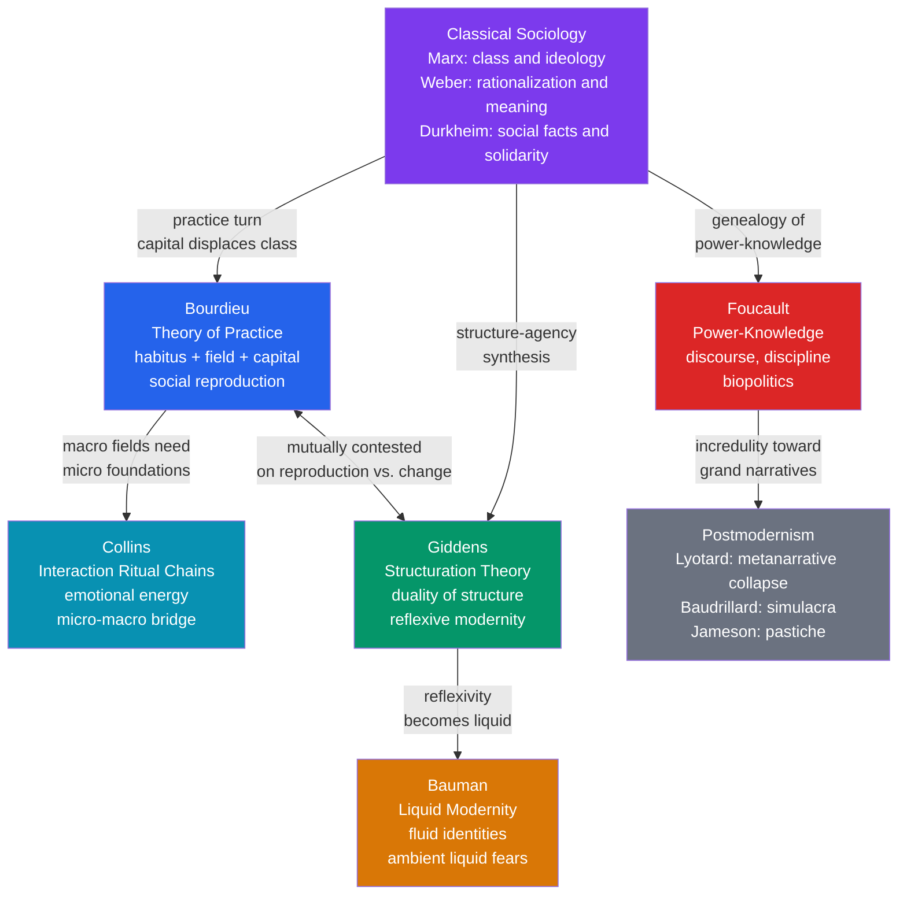

# Contemporary Sociological Theory

> [!abstract] TL;DR
> Contemporary sociological theory — anchored by Bourdieu's theory of practice (habitus, field, capital), Giddens' structuration (duality of structure, reflexive modernity), Foucault's genealogy (power-knowledge, discipline, biopolitics), and the postmodern turn (Lyotard, Baudrillard, Bauman) — dismantled both crude Marxist determinism and ahistorical functionalism by showing that structure and agency, discourse and practice, constraint and freedom are not opposites but mutually constitutive processes that reproduce social inequality and subjectivity in every ordinary interaction.

---

## Intuition

**Analogy:** Official poker rules versus the feel of a veteran player at the table.

The rules of poker are fixed (structure). But a seasoned professional develops a bodily feel for the game — when to bluff, how to read an opponent's posture, which table to join — that no rulebook explicitly teaches. That feel is Pierre Bourdieu's *habitus*: a system of durable dispositions absorbed through years of practice that generates strategies without conscious calculation. A professional player does not consult the rules before each bet; the rules live inside their body, shaping every choice automatically.

Now extend the analogy. The feel for the game that wins tournaments was partly learned at a table where the player already had chips to risk. Players who start with few chips develop defensive strategies — appropriate to their position but also self-limiting — and those strategies persist even when conditions change. Bourdieu calls this *hysteresis*: the mismatch between a habitus formed under earlier conditions and a field that has subsequently shifted.

Anthony Giddens adds a second layer: every time players sit down and play, they reproduce the rules. The rules exist because players enact them. That is the *duality of structure* — structure is both the medium and the outcome of action.

Michel Foucault steps back further and asks: who invented the casino? What power relations decided which games are played in which rooms, under what surveillance, and whose knowledge of odds counts as legitimate? The casino is not a neutral container; it is a machine that produces disciplined players, docile bodies, and particular kinds of subjects. The architecture, the cameras, the dealer's uniform — all are instruments of power-knowledge.

Jean Baudrillard observes that in the hypermodern casino, the chips have long since ceased to represent real money. Players respond to representations of representations. The game is a simulation of a simulation. Welcome to liquid modernity.

---

## How It Works



---

## Key Concepts

### Secondary Level

**What does contemporary sociological theory try to explain?**

Classical sociology — Marx, Weber, Durkheim — bequeathed three enduring questions: How does the economic organization of society shape everything else? How do meaning and culture interact with rational calculation? How do individuals relate to the social norms that feel external and constraining yet also constitute who they are? Contemporary theory picks up these questions but rejects the grand, teleological answers. There is no single engine of history (class struggle), no inevitable iron cage (rationalization), no organic equilibrium (functionalism). Instead, society is reproduced through practice, discourse, and interaction — always contested, always contingent, never fully determined.

**Bourdieu's three-concept engine**

Pierre Bourdieu (1930–2002) proposed three interlocking concepts as a replacement for both structuralism (too deterministic) and rational-choice theory (too voluntarist):

| Concept | Plain definition | Example |
|---------|-----------------|---------|
| **Habitus** | The system of durable, transposable dispositions — ways of perceiving, thinking, and acting — that an agent acquires through socialization in a particular social position | A working-class child who feels "out of place" at an elite university; a doctor who intuitively assesses a patient before the chart is opened |
| **Field** | A structured social space with its own logic, stakes, and positions; agents compete for the field-specific prizes using field-specific capitals | The academic field, the artistic field, the economic field, the political field |
| **Capital** | Resources that confer advantage within a field; four main types: economic (money, assets), cultural (educational credentials, legitimate cultural knowledge), social (networks, connections), symbolic (honor, prestige) | A prestigious degree (cultural capital) converts to social capital via alumni networks, which converts to economic capital via better jobs |

The key mechanism is **conversion**: different forms of capital are convertible into each other, but not at equal rates. The dominant class maintains dominance by possessing multiple forms simultaneously and by controlling which forms count as legitimate within the most powerful fields.

**Giddens: structure and agency are not opposites**

Anthony Giddens (b. 1938) resolved the classical structure-agency debate by collapsing the binary. In his *Constitution of Society* (1984), structure is not a cage that constrains free agents from outside; it is the very set of rules and resources that agents draw on in acting — and in drawing on them, reproduce. A native English speaker is "constrained" by grammar but also "enabled" by it; every sentence they speak reproduces English as a language.

This is the **duality of structure**: structures are both the medium and the outcome of the practices they recursively organize.

**Foucault: power operates through knowledge, not just force**

Michel Foucault (1926–1984) argued that modern power is not primarily possessed by a sovereign who can take life. Modern power is *productive* — it produces subjects, bodies, populations, truths. Power and knowledge are so intertwined that Foucault wrote them as a single compound: *pouvoir-savoir* (power-knowledge). The psychiatric diagnosis does not merely describe madness — it constitutes the category "madness" and produces the subject "the madman." The prison does not merely punish criminals — it produces the category "the delinquent" as an object of ongoing surveillance, management, and normalization.

**Postmodernism in two sentences**

Jean-Francois Lyotard (*The Postmodern Condition*, 1979): the grand narratives — Enlightenment progress, Marxist emancipation, Christian salvation — that once legitimized knowledge and politics have lost their credibility. We are left with local, pragmatic "language games" without any external ground.

Jean Baudrillard (*Simulacra and Simulation*, 1981): signs no longer represent a prior reality — they have become self-referential. The copy precedes the original. The map generates the territory. Images of war are more real than the war; media coverage of politics has replaced politics as the thing itself.

---

### Undergraduate Level

**Bourdieu: symbolic violence and misrecognition**

Bourdieu's most provocative contribution is the concept of **symbolic violence**: the imposition of schemes of perception and appreciation that are experienced as legitimate precisely because they are not experienced as violence. Working-class students who fail in elite educational systems typically attribute their failure to lack of intelligence or effort — they misrecognize what is actually a systematic disadvantage embedded in the cultural capital the school arbitrarily valorizes.

**Misrecognition** (*méconnaissance*) is not false consciousness — it is not an error that correct information could fix. It is the condition of possibility of the social game: if everyone recognized the arbitrary nature of the stakes, no one would play. The game only functions because its arbitrariness is masked, and the habitus does the masking by making the arbitrary seem natural.

**Field analysis: three fields in detail**

| Field | Dominant capital | Specific prize (illusio) | Key mechanism |
|-------|-----------------|--------------------------|---------------|
| Academic field | Cultural (credentials, theoretical authority) | Scientific consecration — being recognized as the legitimate voice | Citation counts, journal hierarchies, peer review as legitimation ritual |
| Economic field | Economic (financial assets) | Profit, market share | Price competition, financial speculation, labor exploitation |
| Political field | Political capital (delegated social trust) | State power, legislative authority | Electoral competition, party organization, media presence |

Each field has its own **doxa**: the unquestioned presuppositions that practitioners must accept to play the game at all. To challenge the doxa is to engage in *heresy* — a move only possible for agents with enough capital to risk it.

**Giddens: ontological security and disembedding**

Giddens argues that routine, day-to-day interaction is not merely habitual — it is the mechanism through which agents maintain **ontological security**: the basic confidence that the world will continue to be recognizable, that identity is coherent, that others can be trusted. Severe disruptions to routine (grief, displacement, chronic uncertainty) threaten this ontological security and produce anxiety at a foundational level.

In *The Consequences of Modernity* (1990), Giddens diagnoses modernity as a set of **disembedding mechanisms** — devices that lift social relations out of local contexts and rearrange them across time and space. Two key mechanisms:
- **Symbolic tokens**: money is the paradigm case; it allows transactions between strangers across global distances by creating abstract trust in the medium
- **Expert systems**: we trust aeroplane engineers, physicians, and architects without being able to verify their claims; we have to act on faith in their credentials

In late modernity, these expert systems are themselves subject to **reflexivity**: knowledge about society feeds back into society and transforms it. Social scientific findings about class, race, or mental illness change how people understand themselves and others, which changes the phenomena themselves.

**Foucault: from sovereign power to disciplinary society**

Foucault traces a historical shift in *Discipline and Punish* (1975):
- **Sovereign power** (pre-modern): the right to kill; punishment is spectacular, on the body of the condemned, public. The scaffold is the site of power
- **Disciplinary power** (modern): the right to manage and normalize; punishment is individualized, continuous, aimed at the mind and soul. The prison, school, hospital, and barracks are all sites of the same disciplinary technology

The key diagram is Jeremy Bentham's **Panopticon**: a circular prison in which a central tower can observe every cell but occupants cannot see whether they are being watched. The power effect is achieved not by constant observation but by the *possibility* of constant observation — inmates internalize the gaze and discipline themselves. Foucault's point is that modern society is organized panoptically: we police ourselves because we have internalized the mechanisms of surveillance.

**Biopower**: in *The History of Sexuality* (1976), Foucault extends his analysis from individual bodies to populations. **Biopower** is power exercised over life itself — the management of populations through medicine, demography, urban planning, sexual regulation, public health, and statistics. The modern state does not primarily threaten death; it manages birth rates, infant mortality, life expectancy, hygiene, and sexual productivity. This is the biopolitical administration of the population as a resource.

**Lyotard and the legitimation crisis**

Lyotard's *The Postmodern Condition* was originally a report on the status of knowledge commissioned by the Quebec government. His core argument: knowledge in modern societies has been legitimized by two grand narratives — the narrative of Enlightenment emancipation (knowledge frees humanity) and the Hegelian-Marxist narrative of speculative progress (history tends toward the absolute, or the classless society). Both have become incredible after Auschwitz, the Gulag, and the collapse of revolutionary communist states.

What remains are **language games** — local, pragmatic, performative knowledge practices with no external ground. Scientific knowledge is not more "true" in any absolute sense; it is legitimized by its **performativity**: it produces results (technological efficiency, predictive power), and those results are valued by the institutions that fund research.

**Baudrillard: orders of simulacra**

Baudrillard proposes four successive orders of the sign:
1. Signs that are a faithful copy of the real (the map represents the territory)
2. Signs that pervert and mask the real (ideology; the map distorts the territory)
3. Signs that mask the absence of a profound reality (the map where the territory has already changed)
4. Pure simulation: the sign bears no relation to any reality (the simulacrum — the copy without an original)

Contemporary consumer society and mass media, Baudrillard argues, operate in the fourth order. The Gulf War was not hidden but preceded by its own media simulation — the war was planned and executed in the image of its own televisual representation. *The Gulf War Did Not Take Place* (1991) was his deliberately provocative expression of this thesis.

---

### Graduate Level

**Bourdieu's reflexive sociology: the sociologist in the field**

Bourdieu's mature methodological project — *Homo Academicus* (1984), *An Invitation to Reflexive Sociology* (with Wacquant, 1992) — turned the tools of field analysis on sociology itself. Sociologists occupy a position in the academic field. Their theoretical preferences, the problems they choose, their political commitments — these are all products of their habitus and their position in the academic field. A reflexive sociology does not try to escape this positioning; it tries to objectify it. The sociologist must conduct a sociology of their own sociology.

This is a stronger demand than the usual methodological reflexivity of qualitative researchers ("I acknowledge my positionality"). Bourdieu means a systematic structural analysis: what is the structure of the academic field, and where does the sociologist stand within it? Which intellectual choices are rewarded, and by which gatekeepers?

**Critical debate: Archer vs. Giddens on temporal order**

Margaret Archer (*Realist Social Theory*, 1995) developed the most incisive critique of structuration theory: Giddens' duality of structure conflates the analytical distinction between structure and agency and thereby makes it impossible to study how they interact over time. Structure and agency are not simultaneous — they are analytically separable and temporally sequential. In Archer's **morphogenetic cycle**:

1. **Structural conditioning** (T1): prior structures predate individuals, shape their situations and interests, cannot simply be "chosen away"
2. **Socio-cultural interaction** (T2-T3): agents interact, form projects, cooperate and conflict
3. **Structural elaboration or reproduction** (T4): structures are reproduced or transformed by that interaction; the result is a new set of structural conditions for the next cycle

Archer's critique: Giddens cannot explain structural persistence or transformation because he has no account of the temporal gap between the structural conditions agents face and the practices through which they respond. Agents always encounter structures that pre-exist them; they cannot have made all the rules they live under.

**Foucault's later work: governmentality and technologies of the self**

In his late lectures at the College de France (*The Birth of Biopolitics*, 1978-79; *The Hermeneutics of the Subject*, 1981-82), Foucault developed two extensions of his power analytics:

**Governmentality** (*gouvernementalité*): a concept that bridges the government of states and the government of the self. Modern liberal governance does not primarily rule by prohibition and force; it creates subjects who are capable of governing themselves in accordance with norms — productive, healthy, self-improving, risk-managing subjects. Neoliberal governmentality extends this: the market is not just an economic mechanism but a principle of subjectivation. The "entrepreneur of the self" is the subject produced by neoliberal power.

**Technologies of the self**: ancient practices (Stoic exercises, Socratic examination, Christian confession) through which individuals constitute themselves as ethical subjects. Foucault was working toward a history of how humans have understood themselves as subjects of desire, truth, and ethics — a genealogy of the modern ethical self.

**Feminist intersections: Butler's performativity and Connell's masculinities**

Judith Butler (*Gender Trouble*, 1990) extended Foucault's analysis of subject constitution to gender. Gender is not an expression of a prior biological or psychological essence; it is a performance — a set of repeated acts, stylizations of the body, citations of norms — that produces the illusion of a stable gendered core. The "original" gender identity that performance supposedly expresses is itself produced by the performance. Gender is therefore vulnerable to subversion through parody and drag — performances that make the imitative structure of gender visible.

Raewyn Connell (*Masculinities*, 1995) hybridized Bourdieu's field analysis with feminist theory to argue that gender relations constitute a structure with its own capital (emphasized femininity, hegemonic masculinity) and its own field logic. **Hegemonic masculinity** is not a statistical average male but the culturally dominant form that legitimizes the subordination of women and non-hegemonic men — reproduced through interaction rituals in workplaces, schools, and media without requiring any central author.

**Collins' interaction ritual chains: the micro-macro link**

Randall Collins (*Interaction Ritual Chains*, 2004) argues that all macro-level social structures — classes, organizations, religions, cultural movements — are ultimately assemblages of micro-level interaction rituals. An **interaction ritual** requires four ingredients: bodily co-presence, a barrier to outsiders, a mutual focus of attention, and a shared emotional mood. When these combine successfully, they produce:
- **Emotional energy** (EE): a feeling of confidence, enthusiasm, and initiative; the most fundamental motivational resource in social life
- **Solidarity**: a sense of group membership and obligation
- **Symbols**: charged objects, words, or images that represent the group

Agents are motivated to seek high-EE interactions and avoid low-EE ones. Class structure, for Collins, is partly a matter of differential access to EE-producing rituals: elites interact in high-EE rituals (confident, high-status exchanges) that reproduce their initiative and confidence; the dominated interact in low-EE rituals that reproduce passivity and deference.

The link to Bourdieu: Collins provides the micro-interactional mechanism through which habitus is reproduced round by round. The "feel for the game" is recharged or drained through chains of concrete interactions — it is not a static psychological property but a dynamic state maintained by social participation.

**Bauman's liquid modernity: the sociological diagnosis of precarity**

Zygmunt Bauman (*Liquid Modernity*, 2000; *Liquid Love*, 2003; *Liquid Fear*, 2006) offers the most widely read sociological account of the human condition in late capitalism. **Solid modernity** — Fordist production, stable careers, fixed class identities, national belonging, long-term collective projects — has dissolved into **liquid modernity**: a world of flexibility, fluidity, short-termism, and the privatization of ambivalence.

Four dimensions of liquidity:

| Dimension | Solid form | Liquid form |
|-----------|-----------|------------|
| Identity | Given by class, nation, religion | Permanently renegotiated project; biographical narrative constructed individually |
| Work | Long-term employment; career trajectories | Portfolio careers; precarious gig work; no long-term commitment from employer or employee |
| Community | Stable, geographically grounded, obligations long-term | "Cloakroom communities" — gatherings around shared spectacles; dispersed as fast as assembled |
| Fear | Concrete, identifiable enemies (the class enemy, the foreign power) | Ambient, diffuse, without clear object or solution; liquid fears (terrorism, climate, contagion, economic collapse) |

Bauman's critique of Giddens: reflexive modernity is not democratically available. The freedom to construct one's own biography requires resources. Those who lack economic capital face liquid modernity not as liberation but as permanent insecurity — "individualization by default" rather than "individualization by design."

---

## Python Demo

```python
import numpy as np
import matplotlib.pyplot as plt
import matplotlib.gridspec as gridspec

# Simulate Bourdieu's field dynamics:
# - Agents have varying capital endowments (bimodal: two class positions)
# - Habitus guides investment strategy proportional to existing capital
# - Field competition is partially zero-sum: those with more capital and
#   better strategy accumulate more; those with less fall further behind
# - Track how the initial capital distribution reproduces and amplifies over rounds

np.random.seed(42)

N_AGENTS = 120
N_ROUNDS = 30

# Bimodal initial distribution: working class (mean 0.25) and dominant class (mean 0.70)
lower_class_capital = np.random.normal(loc=0.25, scale=0.08, size=N_AGENTS // 2)
upper_class_capital = np.random.normal(loc=0.70, scale=0.08, size=N_AGENTS // 2)
total_capital = np.clip(
    np.concatenate([lower_class_capital, upper_class_capital]), 0.01, 0.99
)

# Track class membership for annotation
class_labels = np.array([0] * (N_AGENTS // 2) + [1] * (N_AGENTS // 2))


def gini(x):
    """Gini coefficient: 0 = perfect equality, 1 = perfect inequality."""
    x = np.sort(x)
    n = len(x)
    return (2 * np.sum(np.arange(1, n + 1) * x) / (n * np.sum(x))) - (n + 1) / n


def field_round(capital, noise_std=0.04):
    """
    One round of field competition.

    Habitus principle: agents invest proportionally to their existing capital.
    High-capital agents are habituated to bold, long-term strategies (they have
    the 'feel for the game' and the safety net to take risks).
    Low-capital agents play defensively; their conservative strategies are rational
    for their position but also self-limiting.

    Field is partially zero-sum: winners gain at the expense of those below the median.
    """
    # Habitus-guided investment strategy: noisy version of existing capital
    investment = np.clip(capital + np.random.normal(0, noise_std, len(capital)), 0, 1)

    # Payoff: investment quality * existing capital (rich bet more and win more)
    payoff = investment * capital

    # Redistribution: those above median payoff gain; those below lose a fraction
    median_payoff = np.median(payoff)
    delta = 0.07 * (payoff - median_payoff)

    return np.clip(capital + delta, 0.01, 0.99)


# Run simulation
snapshots = {0: total_capital.copy()}
gini_history = [gini(total_capital)]

for r in range(1, N_ROUNDS + 1):
    total_capital = field_round(total_capital)
    gini_history.append(gini(total_capital))
    if r in (10, 20, 30):
        snapshots[r] = total_capital.copy()


# Visualize
fig = plt.figure(figsize=(15, 10))
gs = gridspec.GridSpec(2, 3, figure=fig, hspace=0.50, wspace=0.35)

rounds_to_plot = [0, 10, 30]
colors = ["#4a9eff", "#7c3aed", "#dc2626"]
titles = [
    "Round 0: Initial Distribution\n(Two-class starting point)",
    "Round 10: Mid-Game\n(Divergence underway)",
    "Round 30: Reproduced Inequality\n(Bourdieu's hysteresis at work)",
]

for col, (rnd, color, title) in enumerate(zip(rounds_to_plot, colors, titles)):
    ax = fig.add_subplot(gs[0, col])
    data = snapshots[rnd]
    ax.hist(data, bins=20, color=color, edgecolor="white", alpha=0.85)
    ax.axvline(np.mean(data), color="k", ls="--", lw=1.3,
               label=f"Mean = {np.mean(data):.2f}")
    ax.set_xlim(0, 1)
    ax.set_title(title, fontsize=9.5, fontweight="bold")
    ax.set_xlabel("Total Capital (0=none, 1=maximum)", fontsize=9)
    ax.set_ylabel("Number of Agents", fontsize=9)
    ax.legend(fontsize=8)
    lower_avg = data[class_labels == 0].mean()
    upper_avg = data[class_labels == 1].mean()
    ax.text(
        0.03, ax.get_ylim()[1] * 0.78,
        f"Lower class avg: {lower_avg:.2f}\nUpper class avg: {upper_avg:.2f}",
        fontsize=7.8, color="#374151",
    )

# Gini coefficient trajectory
ax_gini = fig.add_subplot(gs[1, :])
ax_gini.plot(range(N_ROUNDS + 1), gini_history, color="#dc2626", lw=2.5)
ax_gini.fill_between(range(N_ROUNDS + 1), gini_history, alpha=0.15, color="#dc2626")
ax_gini.axhline(
    gini_history[0], color="gray", ls=":", lw=1.5,
    label=f"Starting Gini = {gini_history[0]:.3f}"
)
ax_gini.set_xlabel("Field Round", fontsize=11)
ax_gini.set_ylabel("Gini Coefficient", fontsize=11)
ax_gini.set_title(
    "Rising Inequality: Gini Coefficient Over 30 Field Rounds\n"
    "Habitus-guided strategies amplify initial capital differences — "
    "the field reproduces the class structure",
    fontsize=11, fontweight="bold",
)
ax_gini.legend(fontsize=9)
ax_gini.set_xlim(0, N_ROUNDS)
ax_gini.set_ylim(0, max(gini_history) * 1.25)

plt.suptitle(
    "Bourdieu's Field Simulation: Capital Reproduction in a Structured Social Space",
    fontsize=13, fontweight="bold", y=1.01,
)
plt.savefig("bourdieu_field_simulation.png", dpi=150, bbox_inches="tight")
plt.show()
```

**What the output shows:** The initial bimodal distribution — two class positions — becomes more polarized over 30 rounds. The Gini coefficient rises monotonically. This illustrates Bourdieu's central finding in *Distinction* (1979): the field does not randomize capital — it systematically rewards those who already have it, because their habitus generates the strategies that the field rewards. No individual agent is acting maliciously; the reproduction of inequality is a structural effect of individually rational, habitus-guided strategies.

---

## Real-World Applications

> **French educational system and Bourdieu.** In *Reproduction in Education, Society, and Culture* (1977, with Jean-Claude Passeron), Bourdieu and Passeron showed that the French *grandes ecoles* and *baccalaureat* system reproduced class privilege under a meritocratic ideology. Working-class children who failed exams were told they lacked ability; in reality, the assessment criteria privileged the cultural capital — aesthetic taste, linguistic facility, familiarity with elite cultural references — that upper-class families transmitted through socialization. The meritocracy was simultaneously real (it did assess something) and a mystification (what it assessed was not ability but inherited cultural capital). This analysis is now standard in educational sociology globally and underpins policy debates about standardized testing, university admissions, and cultural curricula.

> **Foucault and contemporary surveillance.** Foucault's Panopticon has become the reference concept for analyzing digital surveillance. Shoshana Zuboff's *Surveillance Capitalism* (2019) applies a Foucauldian logic to data extraction by platforms: behavioral data is not merely observed but used to produce behavioral predictions sold to advertisers — a power-knowledge nexus in which the subject is simultaneously the raw material, the product, and the target. China's Social Credit System is the most literal application of panoptic logic at population scale: a techno-administrative system that ranks citizens on the basis of monitored behavior and rewards/punishes compliance with state-defined norms. See also [[Technology_AI_and_Politics]] for the political science analysis of this regime.

> **Giddens' Third Way and New Labour.** Giddens' concept of reflexive modernity and his diagnosis that "old" class-based left-right politics no longer fits a society of individualized biographies directly informed Tony Blair's New Labour platform and the "Third Way" political project (*The Third Way*, 1998). The sociological thesis that class solidarities had dissolved into individualized risk portfolios was used to justify the abandonment of traditional labor movement commitments. Critics (Bourdieu among them) argued this was ideology masquerading as sociology: class inequality had not dissolved — it had been rendered invisible by a discourse that pathologized its effects as individual biographical failure.

> **Collins and religious revivals.** Collins' interaction ritual chain theory explains why religious revivals are not primarily about theological content. Billy Graham's stadium crusades, Pentecostal services in the Global South, and large-format evangelical megachurches are above all high-EE interaction rituals: large co-presence, powerful shared music (entrainment), mutual focus, and collective emotional arousal that produces intense feelings of solidarity and symbolic charging. The theology sustains the ritual; the ritual sustains the theology. This analysis applies equally to political rallies, music concerts, and sporting events — all are interaction rituals that produce the emotional energy that keeps communities together.

> **Bauman's liquid modernity and gig economy precarity.** The structural shift from stable employment to platform-mediated gig work (Uber, Deliveroo, TaskRabbit) is the economic instantiation of liquid modernity: workers bear all the risk, have no long-term commitment from the employer, and must continuously market their "brand" as individual entrepreneurs. Bauman's insight is that this structure — presented in mainstream discourse as freedom and flexibility — generates permanent insecurity and the privatization of what are in reality structural, political problems. The precarious worker blames themselves for not being "entrepreneurial enough" — a form of misrecognition that Bourdieu would recognize immediately.

---

## Common Pitfalls

- **Treating habitus as equivalent to "culture" or "habit"** — habitus is not the rules of a culture (that would be Parsonian norms) and it is not merely personal habit. It is a system of structured, structuring dispositions that generates strategies across different fields without direct calculation. It is both structured (by the social conditions of its acquisition) and structuring (it generates new practices). The key is its generative character: it is not a fixed script but a principle of improvisation within limits.

- **Reading structuration theory as saying agents freely choose their structures** — Giddens does not deny constraint. Structural properties can be "more or less binding" and can operate as "unacknowledged conditions" and "unintended consequences" of action. The duality of structure is not the claim that we are free — it is the claim that freedom and constraint are produced by the same practices. Archer's criticism is that Giddens thereby underestimates the weight of pre-existing conditions that agents did not make.

- **Using Foucault to argue power is "everywhere therefore nowhere"** — the common misreading of Foucault is that because he shows power to be dispersed, capillary, and productive, there is no domination, no exploitation, no state repression. But Foucault explicitly argues otherwise in his interviews and late work. Dispersion does not mean equality; it means that resistance must be equally dispersed and local. His genealogical method is meant to denaturalize power — to show that things could be otherwise — which is a precondition for resistance, not an alibi for passivity.

- **Conflating postmodernism with relativism in a naive sense** — Lyotard's critique of metanarratives is not the claim that no one can say anything true about anything. It is the more specific claim that grand universal narratives that legitimize knowledge by reference to a final telos — emancipation, progress, absolute knowledge — have collapsed. Local, pragmatic knowledge claims remain possible; what has dissolved is the dream of a view from nowhere that grounds them all.

- **Reading Baudrillard as empirical sociology** — Baudrillard's claim that "the Gulf War did not take place" is a philosophical provocation about the relationship between media representation and reality, not a literal denial that people died. Reading it as empirical claim misses both the point and the mode of argumentation. The challenge is to distinguish the provocative aphorism from the substantive theoretical claim underneath it.

- **Assuming Bourdieu's field analysis applies symmetrically across all fields** — the degree of field autonomy (the extent to which a field is governed by its own logic rather than subordinated to economic and political capital) varies enormously. Art and science have historically achieved high autonomy from direct market pressure; journalism and politics have lower autonomy. Applying field analysis without attending to the specific degree of autonomy generates category errors.

---

## Related Concepts

- [[_MOC_Sociological_Theory_and_Foundations|↑ Sociological Theory and Foundations MOC]] — Section entry point and concept map for this theoretical cluster

- [[Socialism_Marxism_and_Communism]] — the direct theoretical inheritance that contemporary theory responds to; Bourdieu retains the analysis of class but replaces economic determinism with multi-dimensional capital theory; Foucault's genealogy is a systematic critique of Marxist teleology and class essentialism

- [[Contemporary_Political_Ideologies]] — contemporary ideology analysis (nationalism, populism, fascism) maps onto Bourdieu's field analysis of the political field and Foucault's genealogy of how ideological subjects are produced; Laclau and Mouffe's post-Marxist theory of hegemony is a direct synthesis of Gramsci, Derrida, and Lacan

- [[Technology_AI_and_Politics]] — surveillance capitalism (Zuboff) applies Foucault's panoptic analysis and biopolitics to digital platform architectures; China's Social Credit System is the most complete empirical realization of Foucauldian disciplinary power at population scale

- [[Group_Dynamics]] — Collins' interaction ritual chains provide a micro-sociological account of how group solidarity, emotional energy, and symbolic capital are produced and reproduced through face-to-face interaction; group polarization (Myers and Lamm) maps onto field dynamics in which homogeneous capital positions reinforce each other

- [[Prejudice_and_Discrimination]] — Bourdieu's symbolic violence and misrecognition explain how racial and class-based discrimination is reproduced through legitimate institutional structures (education, hiring, housing) without requiring individual conscious prejudice; habitus embeds group-based dispositions that produce discrimination as a structural effect

- [[Social_Influence_and_Conformity]] — the Milgram obedience findings are a micro-experimental demonstration of Foucault's disciplinary power; the internalization of the experimenter's authority is the small-scale version of the panoptic internalization of the normalizing gaze; Bourdieu's habitus is the mechanism through which social norms become self-enforcing dispositions

- [[Globalization_and_Its_Discontents]] — Bauman's liquid modernity thesis is the cultural-sociological companion to economic globalization analyses; the dissolution of solid class identities and national welfare states under neoliberal globalization produces the liquid biographical insecurity that Bauman diagnoses

---

## Review Questions

### Secondary

1. Bourdieu argues that the French school system is simultaneously meritocratic and a mechanism for reproducing class inequality. How is this possible? What is "misrecognition," and why does it matter for understanding inequality?

2. Anthony Giddens says that structure and agency are not opposites — they are "two sides of the same coin." Using an everyday example (language, a workplace, a family), explain what the "duality of structure" means. In what sense does speaking a sentence both use and reproduce grammar?

3. Foucault claims that modern power is "productive" rather than merely repressive. What does he mean? Give one example of how a modern institution (a school, a hospital, a prison) produces subjects rather than simply constraining them.

### Undergraduate

1. Compare Bourdieu's concept of habitus with Giddens' concept of practical consciousness. Both describe how agents navigate social life without explicit calculation. Where do the two concepts agree, and where do they lead to different empirical predictions? Use the example of a first-generation university student to illustrate the difference.

2. Foucault distinguishes between sovereign power (the right to kill), disciplinary power (the management and normalization of individual bodies), and biopower (the regulation of populations). Using a contemporary example — public health responses to a pandemic, predictive policing, social media content moderation — analyze which modality of power is operating, and whether more than one applies simultaneously.

3. Lyotard argues that postmodern knowledge is legitimized by "performativity" (what works, what produces results) rather than truth. Baudrillard argues we are living in pure simulation. Are these two analyses compatible or in tension? Which has greater explanatory power for understanding contemporary misinformation and media ecosystems, and why?

### Graduate

1. Margaret Archer argues that Anthony Giddens' duality of structure collapses the analytical distinction between structure and agency, making it impossible to explain structural persistence or transformation over time. Reconstruct Archer's morphogenetic critique in detail. Does Giddens' concept of "structural properties" as "virtual" resources avoid Archer's objection, or does it merely rephrase the problem? How would Bourdieu's field analysis — with its insistence on historically constituted positions that pre-exist individual agents — fare against the same critique?

2. Foucault's concept of biopower has been applied to mass data collection, biosurveillance, and algorithmic governance in the 21st century. Identify two specific ways in which digital platform capitalism extends Foucauldian biopower and two ways in which it represents a genuinely novel form of power that exceeds Foucault's analytic framework. What theoretical resources might sociology need to develop to account for the algorithmic production of behavioral prediction as a form of power-knowledge?

3. Zygmunt Bauman argues that liquid modernity produces "individualization by default" for the poor — the structural dissolution of collective solidarities is experienced not as freedom but as permanent risk and private shame. Randall Collins would predict that under liquid modernity, low-EE interaction ritual chains would produce widespread passivity, depression, and political disengagement among the precariat. Assess these two diagnoses against each other. What would they jointly predict about the conditions under which precarious workers might develop collective political agency? What historical cases would test these predictions?

---

## Sources

- [Bourdieu, Pierre — Distinction: A Social Critique of the Judgement of Taste (1984 English translation overview, Stanford Encyclopedia)](https://plato.stanford.edu/entries/bourdieu/)
- [Giddens, Anthony — The Constitution of Society: Summary (Theory, Culture and Society)](https://journals.sagepub.com/doi/10.1177/026327690007002002)
- [Foucault, Michel — Discipline and Punish, Panopticism chapter (original text excerpt, MIT)](https://web.mit.edu/allanmc/www/foucault1.pdf)
- [Lyotard, Jean-Francois — The Postmodern Condition: Overview (Stanford Encyclopedia of Philosophy)](https://plato.stanford.edu/entries/postmodernism/)
- [Bauman, Zygmunt — Liquid Modernity (book review summary, British Journal of Sociology)](https://onlinelibrary.wiley.com/doi/10.1111/j.1468-4446.2000.00261.x)
- [Collins, Randall — Interaction Ritual Chains (Princeton UP, 2004 — overview)](https://press.princeton.edu/books/paperback/9780691123899/interaction-ritual-chains)
- [Archer, Margaret — Realist Social Theory: The Morphogenetic Approach, Cambridge UP 1995](https://www.cambridge.org/core/books/realist-social-theory/2FAD2DE8A1EC3B0A1DEF53A5DFCA99C5)
- [Zuboff, Shoshana — Surveillance Capitalism and the Challenge to Human Nature (Harvard Business Review, 2019)](https://hbr.org/2019/01/the-age-of-surveillance-capitalism)

---

#Sociology #SociologicalTheory #ContemporaryTheory #Bourdieu #Giddens #Foucault #Postmodernism #Bauman #Collins
