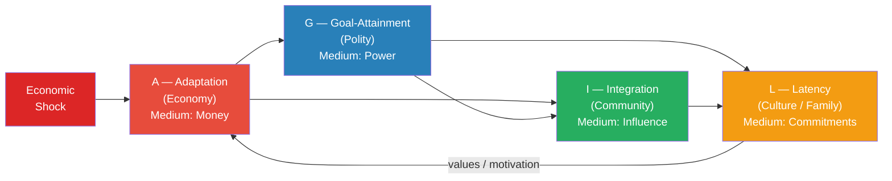

# Functionalism and Systems Theory

> [!abstract] TL;DR
> Functionalism explains social institutions by asking **what they do for the whole system**. Spencer saw society as an organism; Durkheim showed that even apparently harmful phenomena (crime) serve social functions; Parsons constructed the most elaborate functional architecture — the **AGIL schema** — arguing that every viable social system must solve four problems: Adaptation, Goal-attainment, Integration, and Latency. Merton refined the programme by introducing latent functions and dysfunction. Luhmann radically transformed it: modern society is not an integrated organism but a set of **operationally closed autopoietic subsystems**, each reproducing itself through its own code, coupling only structurally with others. The tradition's central weakness — a conservative bias that naturalises the status quo — drove decades of conflict-theory critique and eventually forced functionalism to either adapt or retreat.

---

## Intuition

**Analogy:** Think of a city's infrastructure systems — electricity, water, sewage, roads, and telecommunications all running in parallel. Each network is built, operated, and maintained by different agencies using completely different technologies. Yet the city "works" only when they all function simultaneously. A major power outage does not just turn off the lights: it also kills the water pumps, disrupts traffic signals, disables telecommunications, and shuts down sewage treatment. One subsystem's failure cascades through all the others.

Spencer saw society exactly this way — as a body in which specialised organs (economy, government, church, family) each perform specific vital functions. Remove any one organ and the whole organism sickens. The early functionalists asked: *why does this institution exist?* and answered by pointing to what the institution *does* for social survival. Parsons formalised this into a rigorous theoretical architecture. Luhmann took it to its logical conclusion — and found that the organism metaphor was too simplistic: modern society has no centre, no brain, no integrating organ, only a set of self-referential systems that cannot directly communicate with each other, only observe each other from the outside.

---

## How It Works



The diagram shows Parsons' AGIL system as a cycle. An economic shock enters the Adaptation subsystem and propagates through Goal-attainment, Integration, and Latency, with a feedback loop from culture and family back to the economy through values and motivational commitments. Whether the system returns to equilibrium or tips into dysfunction depends on the strength of each link relative to the self-restoring capacity of each subsystem — exactly what the Python demo below models.

---

## Key Concepts

### Secondary Level

**The Organic Analogy — Spencer (1820–1903)**

Herbert Spencer was the first systematic sociological functionalist. Drawing on evolutionary biology, Spencer argued that society resembles a biological organism in three ways:

1. **Growth**: as societies evolve, they increase in mass and structural complexity
2. **Differentiation**: as they grow, previously unified functions split into specialised organs
3. **Interdependence**: each specialised part becomes dependent on the others; destroy one and the whole is threatened

Spencer saw this as a natural law of social evolution — from simple homogeneous societies (small hunter-gatherer bands) toward complex heterogeneous ones (industrial nation-states). Social institutions should be understood as organs that evolved because they performed functions necessary for social survival. The church, the state, the market, and the family each occupy a necessary niche in the social body.

**Critical limitation Spencer acknowledged:** unlike a biological organism, society has no central nervous system, no single coordinating brain. Spencer drew a political conclusion from this: since society has no centre that could coordinate everything, central planning must fail. The market is the spontaneous order that coordinates a headless organism — making Spencer the founding theorist of what we would now call market liberalism.

---

**Durkheim's Functional Analysis — The Rules of Sociological Method (1895)**

Emile Durkheim (1858–1917) gave functionalism its first rigorous methodological framework. He insisted on two critical distinctions:

1. **Cause versus function.** To explain *why* an institution exists (historical cause) and to explain *what it does* for social health (function) are two different questions requiring two different answers. Both are needed.

2. **The "normality" criterion.** A social fact is "normal" if it is widespread in societies of the same type at the same stage of development. Crime, for example: every society has crime. Therefore crime is *normal* — not in the moral sense, but in the statistical-functional sense. Its function? Crime defines the boundary of normality, mobilises collective moral sentiment, and reinforces social solidarity through the collective reaction to punishment. A society without crime would have no shared moral boundary.

In *The Division of Labour in Society* (1893), Durkheim argued that in traditional societies solidarity derives from **similarity** — mechanical solidarity, in which everyone does the same thing, believes the same things, shares the same identity. Industrial societies can only hold together through **difference** — organic solidarity, in which specialisation creates mutual dependence. Anomie — normlessness — occurs when social change outpaces the development of new moral norms to regulate newly differentiated relationships.

---

**Merton's Concepts: Manifest and Latent Functions**

Robert K. Merton (1910–2003) introduced the most practically useful refinements to classical functionalism:

| Concept | Definition | Example |
|---------|-----------|---------|
| **Manifest function** | Intended, recognised purpose of an institution | Education transmits knowledge and credentials |
| **Latent function** | Unintended, unrecognised consequence | Education reproduces class inequality; creates marriage markets |
| **Dysfunction** | Consequence that disrupts social integration | Education produces credential inflation; generates student-debt crisis |
| **Functional alternative** | A different structure that could perform the same function | MOOCs performing a credentialing function previously monopolised by universities |

**Why this matters:** before Merton, functionalism implied that every existing institution is necessary and irreplaceable. Merton's concepts allow for reform: if an institution has serious dysfunctions, a functional alternative can perform the same role more efficiently. This made functionalism compatible with social policy without requiring wholesale rejection of existing social order.

---

### Undergraduate Level

**Parsons' AGIL Schema in Depth**

Talcott Parsons (1902–1979) at Harvard constructed the most architecturally ambitious version of functionalism. His starting point: any social system — from a two-person relationship to a nation-state to the entire world — must solve **four functional problems** to survive. These are not just useful categories but *necessary* conditions of systemic existence:

| Letter | Function | Societal Subsystem | Symbolic Medium |
|--------|----------|--------------------|-----------------|
| **A** | **Adaptation** — secure resources from the environment and distribute them | Economy | Money |
| **G** | **Goal-Attainment** — define and pursue collective goals | Polity (government) | Power |
| **I** | **Integration** — regulate inter-unit relations; maintain solidarity | Societal Community (law, associations) | Influence |
| **L** | **Latency / Pattern Maintenance** — maintain motivational commitments; transmit values | Fiduciary system (family, schools, religion, media) | Value Commitments |

The AGIL schema applies **recursively**: not just the whole society, but each subsystem also has its own A, G, I, and L sub-functions. The economy has an adaptive function (commodity markets), a goal function (firms as goal-seeking units), an integrative function (labour markets connecting firms and workers), and a latent function (the entrepreneurial work ethic). This self-similar nesting is one of Parsons' most distinctive — and most criticised — features.

---

**Symbolic Media of Interchange**

Each functional subsystem communicates with the others through specialised **symbolic generalised media** — a concept Parsons borrowed from monetary theory and extended to all subsystems:

- **Money** (A): generalised medium for economic value; it works for anyone regardless of personal relationship
- **Power** (G): medium for getting things done when authoritative decision is needed; backed ultimately by coercion
- **Influence** (I): persuasion through appeals to shared norms; solidarity-based
- **Value Commitments** (L): appeal to shared values and identity; the most fundamental medium because it motivates participation in all other subsystems

When these media are "inflated" — for example, money used to buy political decisions, violating its domain — or "deflated" — power loses legitimacy and becomes raw force — the system enters crisis. This is Parsons' account of corruption, authoritarianism, and anomie as **media pathologies**.

---

**Pattern Variables: The Five Dilemmas of Social Action**

Before constructing AGIL, Parsons identified five binary dimensions on which any social interaction can be located. These **pattern variables** characterise the normative expectations governing a role:

| Variable | Traditional Pole | Modern Pole | Example contrast |
|----------|-----------------|-------------|-----------------|
| Affectivity vs Affective Neutrality | Express emotions freely | Suppress affect | Friendship vs Medical consultation |
| Collective vs Self-orientation | Act for the group | Act for the self | Soldier vs Entrepreneur |
| Particularism vs Universalism | Judge by specific relationship | Apply general rules | Parent vs Judge |
| Ascription vs Achievement | Status by birth | Status by performance | Aristocracy vs Meritocracy |
| Diffuseness vs Specificity | Broad, open obligations | Narrow, contractually defined obligations | Family role vs Contractor |

Parsons argued that modernisation is the systematic shift from the left column to the right column. Modern professional institutions must be affectively neutral, universalistic, achievement-oriented, and specific — hence the surgeon who operates on strangers using technical expertise governed by professional norms, not personal affection. When modern roles exhibit pattern variables from the traditional column (a judge judging particularistically, a doctor motivated by personal loyalty rather than clinical need), the institution malfunctions.

---

**Merton's Full Refinement and the Problem of Dysfunction**

Merton challenged three implicit "postulates" embedded in pre-1949 functionalism:

- **Functional unity** (Parsons' implicit assumption): everything in society serves a function for the whole. But many institutions serve *some* parts of society while *harming* others. Religion may provide solidarity for believers while excluding minorities. The assumption of unity prevents seeing this.

- **Universal functionalism** (Malinowski's version): every custom and institution fulfils a vital function and must be maintained. Merton's concept of **dysfunction** breaks this: some institutions are net-dysfunctional — their disruptive consequences exceed their integrative ones.

- **Functional indispensability**: this particular institution is the only possible way to perform its function. Merton's **functional alternatives** break this assumption. Organised crime, for example, performs *economic* functions — employment, capital allocation, consumer goods distribution — in communities where legal markets fail to reach. Understanding this does not endorse it; it explains persistence despite prohibition.

The concept of the **net functional balance** — weighing manifest functions + latent functions against dysfunctions — allows empirical, reformist analysis of institutions without teleological circularity.

---

**Core Critiques of Functionalism**

Functionalism dominated Anglo-American sociology from roughly 1945 to 1965. Its decline was driven by four sustained critiques:

1. **Conservative bias** (C. Wright Mills, Alvin Gouldner, Ralf Dahrendorf). By explaining every institution in terms of its function for social stability, functionalism naturalises the status quo. Davis and Moore (1945) argued that social inequality is *functionally necessary* — differential rewards attract talent to important social positions. Critics pointed out that this was a doctrine conveniently compatible with post-war American social order. Functionalism was conservative sociology in scientific costume.

2. **Teleological reasoning** (David Lockwood). X exists because it performs function Y. But Y is a *consequence* of X, not its cause. Explaining a cause by its effects is backwards causation. Merton's separation of historical explanation from functional explanation partially addresses this, but the shadow of teleology haunts the whole tradition.

3. **Problem of change** (Dahrendorf). A framework built around equilibrium and integration struggles to explain *conflict* and *change* — the most striking features of actual societies. Functionalism tends to see change as *adaptation* (the system adjusting back to equilibrium), which misses discontinuous, revolutionary transformation.

4. **Problem of agency** (methodological individualists, phenomenologists). Functionalism treats social systems as if they had *needs* and *purposes*, but only individual people have needs and purposes. The language of "social systems requiring integration" anthropomorphises an abstraction and risks explaining human behaviour by reference to system needs that no individual actually holds.

---

**Neo-Functionalism: Jeffrey Alexander's Revision (1980s)**

Jeffrey Alexander (1947–) attempted to revive a chastened functionalism by absorbing the critiques. Neo-functionalism accepted:

- Social conflict is normal, not a sign of dysfunction
- Culture has **autonomous** explanatory weight: it is not merely the L subsystem serving the other three — it has its own semiotic logic
- Micro-macro linkage: the connection between individual action and social structure must be theorised explicitly, not assumed
- Change is endogenous: systems generate change, not just restore equilibrium

Alexander's neo-functionalism converges with Habermas's critical theory in emphasising culture's autonomous role but differs sharply in refusing to subordinate social theory to normative philosophy. Where Habermas asks "what should communicative rationality look like?", Alexander asks "how do cultural performances actually reproduce or challenge social structures?"

---

### Graduate Level

**Luhmann's Autopoietic Systems Theory**

Niklas Luhmann (1927–1998) produced the most radical and technically rigorous systems sociology. Starting from Parsons but combining him with biological autopoiesis theory (Maturana and Varela), cybernetics (Wiener), and Spencer-Brown's calculus of forms, Luhmann produced a complete alternative to Parsonian functionalism on three decisive moves:

**1. Society = Communication, Not Actors**

Parsons' AGIL schema takes actors in roles as the basic units of society. Luhmann disagrees: the basic unit is **communication** — a three-sided selection of information, utterance, and understanding. Society is the totality of all communications. Human beings are part of the *environment* of social systems, not their components. This is deliberately paradoxical: people are not "in" society; society is the ongoing event of communication among them. This move avoids the "anthropological" fallacy of grounding social theory in human consciousness, which Luhmann argues is a psychic system — not a social system — and therefore cannot be the building block of sociology.

**2. Operational Closure / Autopoiesis**

Each functional subsystem — economy, politics, law, science, religion, art, intimate relationships — is **operationally closed**: it produces and reproduces its elements using only its own operations.

| Subsystem | Binary Code | Primary Medium | Key Structural Coupling |
|-----------|-------------|---------------|------------------------|
| Economy | Payment / Non-payment | Money | Law (property, contract) |
| Politics | Govern / Not-govern | Power | Law (constitutions) |
| Law | Legal / Illegal | — | Politics, economy |
| Science | True / False | — | Education (universities) |
| Religion | Immanent / Transcendent | — | Morality |
| Art | Beautiful / Ugly (fitting / not fitting) | — | Education |
| Intimate relationships | Love / Indifference | — | Family (legal institution) |

The economy operates via the code *payment / non-payment* and the medium *money*. It cannot directly communicate with the legal system using legal code. The legal system operates via the code *legal / illegal*. It can *observe* economic events but can only produce legal communications *about* those events — it cannot import economic operations. **Structural coupling** is the mechanism by which closed systems respond to each other without merging: property law and contract law allow the economy to generate stable expectations, while taxes and fiscal policy allow politics to respond to economic events. But these couplings are always *translations*, never direct imports.

**3. Complexity Reduction as the Central Function**

The world presents infinite complexity; no system can respond to all possible inputs. Every social system's function is to **reduce complexity** — to make decisions possible by closing off alternatives. The economy reduces complexity through prices; the legal system through legally binding decisions; science through the acceptance or rejection of truth claims. This makes each subsystem necessary and irreplaceable — not because society "needs" it in a teleological sense, but because no other subsystem can perform the same complexity reduction using the same code.

The consequence: functional differentiation produces a society with **no apex and no centre**. There is no position from which the whole can be observed and steered. This has profound political implications: the modern state cannot steer the economy because the economy is autopoietically closed to direct political commands. It can only create incentive structures that the economy *selects* in its own terms (payment / non-payment). Command economies fail, in Luhmann's framework, not because they are morally wrong but because they violate operational closure — they attempt to import political code into an economic system that can only process money.

---

**The Habermas–Luhmann Confrontation**

The 1971 debate *Theorie der Gesellschaft oder Sozialtechnologie?* is the central confrontation in postwar German social theory.

Habermas's core charge: Luhmann's systems theory is **ideology in scientific form**. By presenting functional differentiation as a necessary evolutionary achievement, it legitimises the modern social order and disarms normative critique. If the legal system is just a code (legal/illegal) with no human subject behind it, on what basis do we say that apartheid law was wrong? Luhmann would say the legal system observed apartheid as legal within South African law; the question of its wrongness is a *moral communication* generated by another subsystem (ethics, religion) that the legal system may or may not structurally couple with. For Habermas, this is abdication: social theory must connect structural analysis to a normative foundation grounded in **communicative rationality** — the normative potential embedded in the structure of language itself.

Luhmann's reply: Habermas smuggles in a normative preference for communicative consensus under the guise of immanent critique. "Communicative rationality" is a social fiction that ignores the strategic and power-laden character of all actual communication. Habermas's public sphere is not an empirically observable entity; it is a counter-factual ideal that no actual communication ever achieves. The systems theorist observes what actually happens — functional differentiation and operational closure — and resists projecting normative ideals onto social reality as if they were descriptions.

Both positions have empirical implications that remain contested.

---

**Contemporary Extensions**

- **Margaret Archer's Morphogenetic Approach** (*Realist Social Theory*, 1995): uses systems-theory vocabulary while insisting on the analytical separability of structure, culture, and agency — against both Parsons' conflation and Luhmann's evacuation of agency. Morphogenesis (structure-elaborating) and morphostasis (structure-maintaining) replace equilibrium as the key conceptual pair.

- **World-Systems Theory** (Wallerstein): applies functional differentiation at the global level, but replaces Luhmann's code-based differentiation with a Marxist-inflected core-periphery structure; economic functional differentiation is always politically structured by power asymmetries between states.

- **Quantitative Social Systems** (Watts, Barabasi): network science operationalises structural coupling — studying how failures propagate through social, economic, and infrastructure networks. The cascade dynamics that Parsons described theoretically are now measurable using graph-theoretic tools; the Python demo below is a simplified linear version of this research programme.

- **Alexander's Cultural Sociology / Strong Programme**: treats culture not as L-subsystem but as an autonomous domain with its own semiotic logic — performances, rituals, codes, narratives — that requires interpretation, not merely functional analysis. Civil society's binary codes (sacred/profane, pure/impure) organise political conflict in ways that AGIL cannot capture.

---

## Python Demo

```python
"""
Parsons' AGIL Schema — 4-Compartment Dynamical System

Each subsystem state x[i] represents deviation from equilibrium:
  x < 0  → dysfunction (below functional minimum)
  x = 0  → equilibrium
  x > 0  → over-activation

ODE:  dx/dt = M @ x
  M[i,i] = -restore   (self-restoring homeostatic tendency)
  M[i,j] = coupling   (each subsystem pulls others toward its current state)

Linear stability analysis:
  Eigenvalues of M for all-to-all symmetric coupling:
    lambda_uniform = 3*coupling - restore   (all-subsystems-move-together mode)
    lambda_diff    = -(coupling + restore)  (differential modes, always stable)

  If lambda_uniform < 0  (restore > 3*coupling):
      system is globally stable -> perturbations decay (Parsons' integrated society)
  If lambda_uniform > 0  (restore < 3*coupling):
      system is unstable -> perturbations amplify (Merton's dysfunctional scenario)

States are clipped to [-1, 1]:
  -1 = fully dysfunctional (subsystem has collapsed)
   1 = fully overactivated
"""

import numpy as np
import matplotlib.pyplot as plt

SUBSYSTEMS = [
    "A: Adaptation (Economy)",
    "G: Goal-Attainment (Polity)",
    "I: Integration (Community)",
    "L: Latency (Culture)",
]
COLORS = ["#e74c3c", "#2980b9", "#27ae60", "#f39c12"]


def build_coupling_matrix(restore: float, coupling: float, n: int = 4) -> np.ndarray:
    """
    Off-diagonal entries = coupling  (cross-subsystem influence, positive)
    Diagonal entries     = -restore  (self-restoring homeostasis, negative)
    """
    return coupling * (np.ones((n, n)) - np.eye(n)) - restore * np.eye(n)


def simulate_agil(
    restore: float,
    coupling: float,
    shock_magnitude: float = 0.5,
    T: float = 30.0,
    dt: float = 0.05,
) -> tuple[np.ndarray, np.ndarray]:
    """Euler-integrate the AGIL system with an initial shock to subsystem A."""
    M = build_coupling_matrix(restore, coupling)
    steps = int(T / dt)
    t = np.linspace(0, T, steps)
    x = np.zeros((steps, 4))
    x[0, 0] = -shock_magnitude  # Economic disruption at t=0; all others at equilibrium

    for k in range(steps - 1):
        x[k + 1] = np.clip(x[k] + dt * (M @ x[k]), -1.0, 1.0)
    return t, x


def dominant_eigenvalue(restore: float, coupling: float) -> float:
    """Analytic result for symmetric all-to-all coupling (n=4)."""
    return 3.0 * coupling - restore


# Scenario parameters: (title, subtitle, restore, coupling)
SCENARIOS = [
    {
        "title": "Functional Adaptation",
        "subtitle": "(restore > 3 x coupling  ->  lambda_max < 0,  stable)",
        "restore": 0.40,
        "coupling": 0.08,
    },
    {
        "title": "Systemic Dysfunction",
        "subtitle": "(restore < 3 x coupling  ->  lambda_max > 0,  unstable)",
        "restore": 0.10,
        "coupling": 0.20,
    },
]

fig, axes = plt.subplots(1, 2, figsize=(14, 5))

for ax, scenario in zip(axes, SCENARIOS):
    r, c = scenario["restore"], scenario["coupling"]
    t, x = simulate_agil(restore=r, coupling=c)
    lam = dominant_eigenvalue(r, c)

    for i, (name, col) in enumerate(zip(SUBSYSTEMS, COLORS)):
        ax.plot(t, x[:, i], label=name, color=col, lw=2)

    ax.axhline(0, color="black", lw=0.8, ls="--", alpha=0.4)
    ax.fill_between(t, -1, 0, color="#ffcccc", alpha=0.12, label="Dysfunction zone")
    stability_label = "stable" if lam < 0 else "unstable"
    ax.annotate(
        f"lambda_max = {lam:+.3f}  ({stability_label})\nrestore={r},  coupling={c}",
        xy=(0.03, 0.97),
        xycoords="axes fraction",
        va="top",
        fontsize=8.5,
        bbox=dict(boxstyle="round", facecolor="wheat", alpha=0.85),
    )
    ax.set_title(
        f"{scenario['title']}\n{scenario['subtitle']}",
        fontsize=10,
        fontweight="bold",
    )
    ax.set_xlabel("Normalised social process time")
    ax.set_ylabel("Deviation from equilibrium")
    ax.legend(fontsize=7.5, loc="lower right")
    ax.grid(True, alpha=0.3)

fig.suptitle(
    "Parsons' AGIL Schema — Economic Shock Propagation\n"
    "Initial shock: A (Economy) = -0.5 at t = 0;  all other subsystems at equilibrium",
    fontsize=12,
    fontweight="bold",
)
plt.tight_layout()
plt.savefig("agil_dynamics.png", dpi=150, bbox_inches="tight")
plt.show()
print("Saved: agil_dynamics.png")
```

**Reading the output:**

- *Left panel* (stable, `restore=0.40, coupling=0.08`): after the economic shock, all four subsystems disturb from equilibrium, but the restoring force exceeds the cross-coupling amplification (`lambda_max = -0.16`). All subsystems decay back toward 0. This is Parsons' vision of functional integration — perturbations are absorbed.

- *Right panel* (unstable, `restore=0.10, coupling=0.20`): the economic shock cascades through polity, community, and culture. With a positive dominant eigenvalue (`lambda_max = +0.50`), the "all-fall-together" mode grows exponentially; the system saturates at the dysfunction floor (−1.0). All four subsystems collapse together. This models a structural crisis scenario — Weimar Germany's 1920s hyperinflation cascading from economic collapse to political delegitimation, community fragmentation, and value dissolution within a decade.

---

## Real-World Applications

**Post-2008 Financial Crisis as AGIL Perturbation**

The 2008 subprime mortgage crisis is a textbook AGIL case. The initial shock was to the **A subsystem** (economy): credit markets froze, banks collapsed, unemployment rose sharply.

- **G (Polity)** responded through TARP bailouts, stimulus packages, and quantitative easing. Where political systems were strong (USA, Germany), G effectively buffered the A shock. Where they were weak (Greece, Spain), political dysfunction amplified the economic crisis into prolonged austerity.
- **I (Integration)** suffered: institutional trust collapsed (Occupy Wall Street), social cohesion declined in hard-hit regions, and populist movements emerged on both left and right as influence networks disintegrated.
- **L (Latency)** destabilised lastingly: the "homeownership is virtuous" value complex that had underpinned American middle-class culture since the 1950s lost credibility. Millennial cultural values explicitly rejected homeownership, long-term employment loyalty, and formal institutional trust — a cultural shift at the L level that persists a generation later.

The recovery was partial: A and G largely stabilised by 2012, but I and L showed permanent shifts — consistent with the unstable scenario in the Python demo, which predicts that "downstream" subsystems (I, L) take longer to recover or do not recover at all when the initial shock exceeds a threshold.

---

**Luhmann on Structural Decoupling: The 2008 Crisis Revisited**

From a Luhmannian perspective, the 2008 crisis was a failure of **structural coupling** between the economic and legal-political subsystems. Financial derivatives (CDOs, credit default swaps) had evolved faster than the legal-regulatory system could track. The financial economy had decoupled from political oversight: instruments whose systemic risk profile was opaque to regulatory code were circulating as legal commodities. The crisis was not a failure of integration (Parsons' diagnosis) but a failure of translation — the legal and political systems could not generate communications about financial events fast enough to constrain them.

The policy response — Dodd-Frank, Basel III — attempted to re-establish structural coupling through new legal forms. Whether it succeeded is contested; critics argue that financial innovation continues to outrun regulatory vocabulary, generating new forms of structural decoupling.

---

**Durkheim's Organic Solidarity in Global Supply Chains**

Durkheim argued that the division of labour creates organic solidarity through interdependence. Globalisation is the world-scale intensification of this process: each region specialises (comparative advantage), creating a global network of mutual dependence. The COVID-19 pandemic (2020–2021) provided a natural experiment: when supply chains were disrupted — mask shortages, semiconductor scarcity, pharmaceutical supply failures — the degree of global organic solidarity became visible through its absence. The dysfunction Durkheim called *anomie* appeared in vaccine nationalism, PPE hoarding, and the absence of binding global health governance — new functions had arisen (global supply coordination, pandemic response) but no adequate normative regulation yet existed to manage them.

---

## Common Pitfalls

- **Equating "function" with "purpose" or "intent."** Institutions do not have intentions. When functionalists say "the family performs the L function," they mean this is the observable consequence for the system, not that anyone designed the family with this purpose. Conflating the two produces creationist fallacies in social theory and obscures how institutions change.

- **The "if it exists, it must be functional" fallacy.** This is the pre-Mertonian error that Merton's dysfunctions directly address. Slavery existed for centuries; it served functions for slaveholders and plantation economies. That it existed, and that it served *some* functions, does not imply it was net-beneficial for society. Net functional balance requires weighing functions *and* dysfunctions — a calculation that frequently indicts existing institutions.

- **Treating Parsons' AGIL as an empirically falsifiable theory.** AGIL is a conceptual schema for organising thought about society, not a predictive model. Confusing the two leads to either uncritical acceptance or premature dismissal. Its value is heuristic — it prompts questions about functional interdependence, not answers about specific causal mechanisms.

- **Misreading Luhmann as saying "humans don't matter."** Luhmann's claim is that human *consciousness* is a psychic system, not a social-system operation. This is an *analytical* distinction, not a claim that humans are irrelevant. Humans generate communications, but the social systems that form around communications have their own dynamics that cannot be reduced to the intentions of individual participants.

- **Presenting conflict theory and functionalism as mutually exclusive.** The question is not "does society have conflict or integration?" — it has both. The question is which process is primary in explaining a specific phenomenon. Functionalism asks "what maintains this pattern?"; conflict theory asks "who benefits from this pattern and who is harmed?" Most mature sociological analyses use both questions.

---

## Related Concepts

- [[_MOC_Sociological_Theory_and_Foundations|↑ Sociological Theory and Foundations MOC]] — Section entry point and concept map for this theoretical cluster
- [[Group_Dynamics]] — Parsons' I (Integration) subsystem operates through the exact mechanisms group dynamics studies: conformity pressure, leadership, and ingroup solidarity; the AGIL model of integration failure maps directly onto groupthink and group polarisation as pathologies of collective decision-making
- [[Social_Influence_and_Conformity]] — Parsons' pattern variables describe the normative expectations that social influence enforces; Durkheim's collective conscience is the macro-level version of the conformity pressure studied in social psychology
- [[Organizational_Psychology]] — Formal organisations instantiate the G and A subsystems of Parsons' schema; their pathologies — bureaucratic rigidity, goal displacement — are Mertonian dysfunctions of the institutionalised functions they were created to perform
- [[Socialism_Marxism_and_Communism]] — Functionalism's primary theoretical opponent in 20th-century sociology; Marx asks "who benefits and who is exploited?" while Parsons asks "what function does this serve?"; conflict theory began as a direct critique of Parsonian functionalism in the 1950s–60s, led by Dahrendorf and Mills
- [[Liberalism_and_Its_Variants]] — Functionalism is often read as the sociological theory most compatible with liberal capitalism: existing institutions are functionally necessary, change should be incremental, and consensus is the empirical norm; critics charge that Parsons naturalised post-war American liberalism as universal social science
- [[State_Formation_and_Political_Development]] — The G (Goal-Attainment) subsystem is, at the societal level, the state; state formation is the historical process by which the G function became institutionalised as a specialised political apparatus distinct from kinship, religion, and economy
- [[International_Relations_Theories]] — Luhmann's world-society theory (one global functional differentiation, no world-state, operational closure preventing any single actor from steering the whole) is the most radical IR application of systems theory; his framework predicts the structural limits of international governance
- [[Systems_Genetics_and_Gene_Networks]] — Systems biology uses the same language of functional differentiation, self-organisation, and emergent properties as Luhmann; regulatory gene networks exhibit operational closure analogous to social subsystems — the genome "codes" for protein production just as the economy "codes" through money

---

## Review Questions

### Secondary

1. Spencer compared society to a living organism. List two ways in which society *does* resemble an organism according to Spencer, and one important way it does *not* — and explain what political conclusion Spencer drew from that key difference.

2. Using Merton's concepts of manifest and latent functions and dysfunction, analyse *one* of the following: (a) professional sports leagues, (b) school uniforms, (c) university fraternities. Identify at least one manifest function, one latent function, and one dysfunction, with concrete examples for each.

### Undergraduate

1. Parsons argued that modern institutions must be universalistic, achievement-oriented, affectively neutral, and specific. Using his pattern-variable framework, compare (a) the doctor-patient relationship and (b) the parent-child relationship across all five dimensions. What does this analysis reveal about the functional requirements of professional versus familial roles, and what happens when the two sets of expectations intrude on each other?

2. The "functional indispensability postulate" holds that a given institution is the only possible structure that can perform its function. Merton challenges this with the concept of functional alternatives. Apply this debate to the institution of formal schooling: identify the functions schooling performs, name at least two functional alternatives for each, and assess whether any of these alternatives could plausibly replace formal schooling at scale without generating equivalent dysfunctions.

3. Ralf Dahrendorf argued that functionalism "cannot account for the ubiquity of conflict, constraint, and change in society." Using specific historical examples, evaluate this critique. Does Merton's introduction of dysfunction and Alexander's neo-functionalism adequately address it, or does the conservative bias remain structural to the functionalist programme?

### Graduate

1. Luhmann's claim that "there is no outside position from which modern society can be steered" follows from the premise of operational closure. Reconstruct the argument — from operational closure to structural coupling to the impossibility of central steering. Then evaluate it against two empirical cases where states appear to have successfully steered economic outcomes (developmental states in East Asia, post-war Scandinavian corporatism). Does the evidence refute Luhmann, or does it illustrate the limits of steering rather than refute operational closure?

2. Habermas charges that Luhmann's systems theory is "ideology" because it legitimises functional differentiation by presenting it as a necessary evolutionary achievement, thereby disarming normative critique. Reconstruct the Habermasian critique and the Luhmannian counter-argument with precision. Which position is more defensible given the trajectory of early 21st-century capitalism — the proliferation of platform monopolies, the algorithmic shaping of political communication, and the apparent incapacity of states to regulate globally operational functional systems?

3. The 2020 COVID-19 pandemic disrupted all four AGIL subsystems simultaneously. Using Parsons' schema, trace the functional interdependencies that made the pandemic a systemic crisis rather than merely a health crisis. Then re-analyse the same event using Luhmann's functional differentiation framework. Which framework better explains (a) why some states recovered faster than others, and (b) the long-run cultural changes in attitudes toward work, institutions, and solidarity that persist into the mid-2020s?

---

## Sources

- Talcott Parsons, *The Social System* (1951)
- Talcott Parsons and Neil Smelser, *Economy and Society* (1956)
- Talcott Parsons, *The Structure of Social Action* (1937)
- Robert K. Merton, *Social Theory and Social Structure* (1949; enlarged 1968)
- Emile Durkheim, *The Division of Labour in Society* (1893)
- Emile Durkheim, *The Rules of Sociological Method* (1895)
- Herbert Spencer, *Principles of Sociology* (1876–1896)
- Niklas Luhmann, *Social Systems* (1984; English trans. 1995)
- Niklas Luhmann, *The Differentiation of Society* (1982)
- Jurgen Habermas and Niklas Luhmann, *Theorie der Gesellschaft oder Sozialtechnologie?* (1971)
- Jeffrey C. Alexander, *Neofunctionalism and After* (1998)
- Ralf Dahrendorf, *Class and Class Conflict in Industrial Society* (1959)
- C. Wright Mills, *The Sociological Imagination* (1959)
- Margaret Archer, *Realist Social Theory: The Morphogenetic Approach* (1995)
- Kingsley Davis and Wilbert Moore, "Some Principles of Stratification," *American Sociological Review* 10:2 (1945)
- [Structural Functionalism — Stanford Encyclopedia of Philosophy](https://plato.stanford.edu/entries/social-institutions/)
- [Niklas Luhmann — Internet Encyclopedia of Philosophy](https://iep.utm.edu/luhmann/)

---

#Sociology #SociologicalTheory #Functionalism #SystemsTheory #Parsons #Luhmann #Merton #Durkheim
