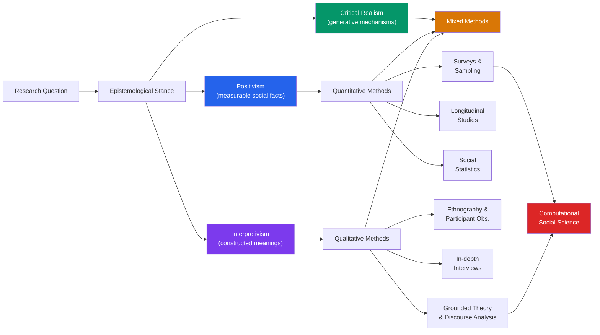

> [!abstract] TL;DR
> Sociological research methods are the systematic tools through which sociologists produce warranted claims about social life — spanning quantitative surveys and regression models, qualitative ethnography and grounded theory, and emerging computational approaches that mine digital trace data at scale. Method choice is inseparable from epistemological stance: positivism demands measurement; interpretivism demands meaning; critical realism demands mechanism. No method is neutral, and every design decision — who to sample, how to ask, where to observe — encodes assumptions about what social reality is and how it can be known.

---

## Intuition

**Analogy:** Imagine you want to understand why some neighborhoods are more violent than others. You could count police reports (quantitative — measurable but strips away context). You could move into a neighborhood for a year and observe daily life (qualitative — rich but hard to generalize). You could scrape Twitter geotagged data and run network analysis (computational — massive scale but what do people *mean* by what they post?). Each lens reveals something the others miss, and each distorts something the others catch.

This is the fundamental tension of sociological method: **social reality is simultaneously measurable and meaningful**. Durkheim counted suicide rates and found social structure in a private act. Goffman watched people in public spaces and found that all interaction is performance. Neither was wrong — they were looking at different levels of the same phenomenon.

---

## How It Works



---

## Key Concepts

### Secondary Level

#### Quantitative Methods: Surveys and Sampling

A **survey** asks a structured set of questions to a sample drawn from a target population. The goal is to estimate population parameters (proportions, means, relationships) from a manageable subset.

**Sampling designs** differ in how they select that subset:

| Design | Mechanism | Strength | Weakness |
|--------|-----------|----------|----------|
| **Simple Random Sampling (SRS)** | Each unit has equal probability of selection | Unbiased; straightforward inference | Misses rare subgroups; logistically demanding |
| **Stratified Sampling** | Population divided into strata (age, race, region); SRS within each | Ensures representation; lower variance for group comparisons | Requires prior knowledge of strata |
| **Cluster Sampling** | Population divided into clusters (schools, villages); random sample of clusters | Cost-effective for geographically dispersed populations | Higher variance than SRS; intracluster correlation inflates standard errors |
| **Systematic Sampling** | Every *k*th unit from a list | Simple; approximates SRS if list is random | Periodic patterns in the list can introduce bias |
| **Convenience Sampling** | Whoever is accessible (campus quad, Amazon MTurk) | Fast and cheap | Severe selection bias; WEIRD problem |

**Response bias** enters through: question wording (leading questions, double-barreled questions), ordering effects (earlier questions prime later answers), social desirability (respondents report the socially acceptable answer rather than the true one).

**Likert scales** (Strongly Agree → Strongly Disagree, typically 5 or 7 points) operationalize attitudes as ordinal variables. A common error is treating Likert items as interval-level (equal spacing assumed) rather than ordinal — this affects which statistics are valid.

**Longitudinal designs** track the same units over time:
- **Panel study**: same individuals resurveyed repeatedly (e.g., the British Household Panel Survey)
- **Cohort study**: follows a birth or entry cohort (e.g., all people born in 1980)
- **Trend study**: different samples from the same population at different times

Longitudinal data enables causal inference beyond cross-sectional snapshots but suffers from **attrition bias**: those who drop out are rarely random, and their absence distorts estimates over time.

**Basic social statistics** used in survey analysis:
- Proportions and cross-tabulations (chi-square test for independence)
- Correlation and regression (predicting outcomes from predictors — see [[OLS_Estimation]])
- Confidence intervals: a 95% CI means that 95% of intervals constructed this way would contain the true parameter — it is not a probability statement about the particular interval

---

### Undergraduate Level

#### Qualitative Methods

Qualitative research seeks to understand **meaning, process, and context** that numbers cannot capture. It is appropriate when the research question is "how?" or "why?" rather than "how many?" or "to what degree?"

**In-depth interviews** are semi-structured conversations guided by a topic guide but allowing flexible follow-up. They are appropriate for sensitive topics (stigma, trauma, deviance) where standardized survey questions would foreclose honest answers. Key technique: **active listening** — the interviewer withholds their own reactions to keep respondents talking.

**Focus groups** assemble 6–10 participants to discuss a topic together. The group dynamic itself is data: agreements, disagreements, topic avoidance, and the social construction of consensus can be observed in real time. Developed in marketing research; widely used in political sociology and health research.

**Ethnography and participant observation** involve the researcher immersing themselves in a social setting — Goffman's hospitals (1961), Bourdieu's Kabylia (1972), Venkatesh's Chicago housing projects (2000). The researcher becomes a social instrument. Two key analytical lenses:
- **Goffman's dramaturgical approach**: social interaction as performance; people manage impressions on a "front stage" while behaving differently "backstage." Micro-level interaction order is its own domain, not reducible to macro structures.
- **Bourdieu's field theory**: agents possess **capital** (economic, cultural, social, symbolic), operate within **fields** (structured social spaces), and act via **habitus** (durable dispositions acquired through socialization). Crucially, researchers themselves occupy positions in academic fields — **reflexivity** demands the researcher account for how their position shapes what they see.

**Grounded theory** (Glaser and Strauss, 1967) generates theory inductively from data rather than testing a priori hypotheses. The process: open coding (label concepts in raw data) → axial coding (relate categories to each other) → selective coding (identify a core category) → theoretical saturation (collect data until new cases add nothing). The researcher samples theoretically — seeking cases that will develop, challenge, or saturate emerging categories (**theoretical sampling**), not for statistical representativeness.

**Content analysis** systematically codes text, images, or media for predefined or emergent categories. Can be quantitative (word frequency, category counts — used in Durkheim's suicide analysis of coroner reports) or qualitative (latent meaning behind surface content).

**Discourse analysis** examines how language constructs social reality — categories of identity, legitimacy, and power are produced through speech and text. Foucauldian discourse analysis asks: what can and cannot be said in a given historical moment? Whose voices are authorized?

#### Epistemological Stances

The choice of method is grounded in a philosophy of social knowledge:

| Stance | Core Claim | Methodological Implication |
|--------|-----------|---------------------------|
| **Positivism** (Comte, Durkheim) | Social facts exist independently of individuals and can be measured objectively | Quantitative methods; deductive testing; value-free science |
| **Interpretivism** (Weber, Schutz) | Social reality is constituted by meaning; *Verstehen* (interpretive understanding) is the method of social science | Qualitative methods; focus on subjective meaning; context-bound explanation |
| **Critical Realism** (Bhaskar, 1975) | Structures and generative mechanisms exist independently of our knowledge of them, but are not directly observable; empirical events are their contingent realizations | Mixed methods; retroductive logic (from event to mechanism); rejects both naive empiricism and pure constructivism |

Critical realism is particularly influential in contemporary sociology because it resolves the sterile quantitative/qualitative debate: social structures (class, gender, race) are real, have causal powers, but are activated differently in different contexts — hence the need for both statistical patterns and ethnographic mechanisms.

#### Research Ethics

All social research in institutional settings is governed by **Institutional Review Boards (IRBs)** or ethics committees, whose modern form originates from catastrophic violations:
- **Milgram obedience experiments (1963–1974)**: participants deceived into believing they were administering lethal shocks to confederates. Produced landmark findings on obedience to authority (see [[Social_Influence_and_Conformity]]) but involved deception and psychological harm.
- **Stanford Prison Experiment (1971, Zimbardo)**: guards and prisoners in a simulated prison rapidly adopted brutal and submissive roles; study abandoned after six days. Later replicated findings questioned — guards were coached. Illustrates how researchers' involvement shapes outcomes.
- **Rosenhan (1973, "On Being Sane in Insane Places")**: eight sane confederates faked a single symptom and were admitted to psychiatric hospitals; all were diagnosed with schizophrenia and held for weeks. Exposed diagnostic unreliability and the totalizing power of institutional labels.

Core ethical principles:
- **Informed consent**: participants understand the purpose, risks, and their right to withdraw *before* participating — cannot be bypassed for convenience
- **Confidentiality and anonymity**: data must be stored securely; identifiers removed from publications; special protections for vulnerable populations
- **Minimizing harm**: no lasting psychological, social, or physical damage; deception only when no alternative, followed by full debriefing
- **Power dynamics**: researchers — especially from elite institutions — hold structural power over participants; this is not neutralized by a consent form. Feminist and postcolonial methodologists argue that ethical research requires attending to who benefits from knowledge production

#### Mixed Methods

Mixed methods combine quantitative and qualitative approaches within a single study. Three common designs:
- **Explanatory sequential**: collect quantitative data → use results to design qualitative follow-up (explain *why* a statistical pattern exists)
- **Exploratory sequential**: qualitative first → develop constructs, survey items, or hypotheses → test quantitatively
- **Concurrent triangulation**: collect both simultaneously; compare to test whether findings converge

---

### Graduate Level

#### Causal Inference in Sociological Research

Establishing causation is harder in sociology than in laboratory sciences — you cannot randomly assign people to socioeconomic class or race. The **potential outcomes framework** (see [[Potential_Outcomes_Framework]]) formalizes this: the causal effect of treatment D on outcome Y for individual *i* is Y_i(1) − Y_i(0), but only one of these is ever observed.

Strategies sociologists use to approximate causal identification:
- **Natural experiments**: exogenous variation in treatment assignment created by policy changes, geographic discontinuities, or historical accidents — see [[Difference_in_Differences]]
- **Propensity score matching**: match treated and untreated units on observed covariates to approximate a comparison group
- **Panel data with fixed effects**: control for all time-invariant unit-level confounders by using within-unit variation over time

**Survey experiments** (question-order, wording, or vignette experiments embedded in surveys) allow causal inference about attitude formation at the price of some realism.

#### Computational Social Science

The digitization of social life has created unprecedented data sources: social media posts, mobile phone records, administrative databases, satellite imagery, digitized historical archives. Computational social science (CSS) analyzes these at scale.

Key methods:
- **Digital trace data analysis**: passively generated records of online behavior — who follows whom (network analysis), what people search for (search trends as social barometers), when and where people move (mobility data)
- **NLP for text analysis**: topic modeling (LDA, BERTopic) to discover latent themes in corpora; sentiment analysis; named entity recognition to extract actors from news articles; stance detection to measure polarization. See [[Text_Classification]] and [[TF_IDF_Classical]] for NLP foundations
- **Network analysis**: social structure as graphs — nodes are actors, edges are relations. Measures: degree centrality (who is connected to the most people), betweenness centrality (who bridges otherwise disconnected groups), clustering coefficient (how tightly knit is a neighborhood?)
- **Agent-based modeling (ABM)**: simulate individuals with simple rules; observe emergent macro-level phenomena (segregation, opinion polarization, norm diffusion)

**Key tension in CSS**: volume versus validity. Digital trace data covers millions of users but is not a sample of the population — it is a convenience sample of people who use specific platforms, and their behavior online is not identical to their behavior offline. The same response bias and selection problems that afflict surveys appear in amplified form in digital data.

#### Reflexivity and Positionality

Graduate-level methods training increasingly emphasizes **reflexivity**: the researcher's social position — gender, race, class, institution, prior theoretical commitments — is not a contaminant to be eliminated but a resource to be analyzed. What can a White sociologist see in a Black community that a Black sociologist cannot, and vice versa? What can an insider see that an outsider cannot?

**Bourdieu's reflexive sociology** demands that sociologists apply their tools to their own field: academic sociology is itself a field with stakes, capital, and struggles for distinction. The concepts we use are not neutral descriptions but weapons in theoretical struggles.

---

## Python Demo

```python
# Sampling bias demo: compare SRS, stratified, and convenience sampling
# on a synthetic population with two groups that differ in income.
# Shows how method choice determines whether estimates are unbiased.

import numpy as np
import matplotlib.pyplot as plt
from scipy import stats

np.random.seed(42)

# Population: 10,000 people, two groups
N      = 10_000
prop_A = 0.60   # Group A: hourly/service workers (60% of population)
prop_B = 0.40   # Group B: office/knowledge workers (40% of population)

group_A = np.random.normal(50, 10, int(N * prop_A))   # mean income $50k
group_B = np.random.normal(80, 12, int(N * prop_B))   # mean income $80k
population = np.concatenate([group_A, group_B])
true_mean  = population.mean()   # ~$62k

n_sample = 300   # each survey draws 300 respondents
n_sim    = 2000  # run 2000 simulated surveys per method

srs_means, strat_means, conv_means = [], [], []

for _ in range(n_sim):
    # 1. Simple Random Sampling: each person equally likely
    idx = np.random.choice(N, size=n_sample, replace=False)
    srs_means.append(population[idx].mean())

    # 2. Stratified Sampling: enforce true group proportions
    n_A = int(n_sample * prop_A)
    n_B = n_sample - n_A
    s_A = np.random.choice(group_A, size=n_A, replace=False)
    s_B = np.random.choice(group_B, size=n_B, replace=False)
    strat_means.append(np.concatenate([s_A, s_B]).mean())

    # 3. Convenience Sampling: online survey over-samples Group B
    # (Group B has more internet access / more likely to complete online surveys)
    n_A_c = int(n_sample * 0.15)   # only 15% from Group A
    n_B_c = n_sample - n_A_c       # 85% from Group B
    c_A = np.random.choice(group_A, size=n_A_c, replace=False)
    c_B = np.random.choice(group_B, size=n_B_c, replace=False)
    conv_means.append(np.concatenate([c_A, c_B]).mean())

# Print summary table
method_data = [
    ("Simple Random", np.array(srs_means)),
    ("Stratified",    np.array(strat_means)),
    ("Convenience",   np.array(conv_means)),
]

print(f"True population mean: ${true_mean:.1f}k\n")
print(f"{'Method':<16} {'Est. Mean':>10} {'Bias':>10} {'Std Dev':>10}")
print("-" * 50)
for name, arr in method_data:
    bias = arr.mean() - true_mean
    print(f"{name:<16} ${arr.mean():>8.1f}k  {bias:>+9.1f}k  {arr.std():>9.3f}k")

# Plot distribution of estimated means across simulations
fig, axes = plt.subplots(1, 3, figsize=(14, 5), sharey=True)
specs = [
    ("Simple Random\nSampling",  srs_means,   "#2563eb"),
    ("Stratified\nSampling",     strat_means, "#059669"),
    ("Convenience\nSampling",    conv_means,  "#dc2626"),
]

for ax, (label, data, color) in zip(axes, specs):
    arr = np.array(data)
    ax.hist(arr, bins=40, color=color, alpha=0.75, edgecolor="white")
    ax.axvline(true_mean,  color="black", lw=2.5, ls="--", label=f"True mu={true_mean:.1f}k")
    ax.axvline(arr.mean(), color=color,   lw=2.5, ls="-",  label=f"Est. mu={arr.mean():.1f}k")
    ax.set_title(
        f"{label}\nBias={arr.mean()-true_mean:+.1f}k | SD={arr.std():.2f}k",
        fontsize=10,
    )
    ax.set_xlabel("Estimated Mean Income ($k)")
    ax.legend(fontsize=8)

axes[0].set_ylabel("Frequency across 2000 simulations")
plt.suptitle(
    "Sampling Method Comparison\n"
    "Population: 60% Group A (mu=$50k) + 40% Group B (mu=$80k) → True Mean ~$62k",
    fontsize=11, fontweight="bold",
)
plt.tight_layout()
plt.savefig("sampling_bias_comparison.png", dpi=150, bbox_inches="tight")
plt.show()
```

**What the output shows:**
- **SRS** centers on $62k — unbiased. Variability reflects sampling uncertainty alone.
- **Stratified** centers on $62k with *narrower* spread — enforcing known group proportions reduces variance.
- **Convenience** centers near $74k — a persistent $12k upward bias because Group B is over-represented. No sample size increase can fix a biased sampling frame; only redesigning who is sampled can.

This is the methodological lesson: **precision** (tight distribution) and **accuracy** (centered on the truth) are independent. A large convenience sample is precisely wrong.

---

## Real-World Applications

> **Example — Pew Research Center:** Pew uses address-based sampling (ABS) to reach households without internet, layered with online panels for cost efficiency. Their weighting algorithms apply post-stratification adjustments for age, education, race, and geography — a form of statistical stratification applied after data collection to correct for known frame deficiencies. When Pew publishes that "65% of Americans trust the Supreme Court," that number reflects sampling design choices that took six weeks to engineer.

> **Example — Ethnography in organizational sociology:** Michèle Lamont's *Money, Morals, and Manners* (1992) interviewed 160 upper-middle-class men in France and the US about what they respected and looked down upon. She found that Americans drew mainly **moral boundaries** ("he's a good person"), while the French drew **cultural boundaries** ("he's uncultured"). No survey could have discovered this; the finding required open-ended interviews that let respondents define the categories themselves.

> **Example — Computational social science:** The Oxford Internet Institute's study of social media and adolescent mental health (Orben & Przybylski, 2019) analyzed 355,000 teenagers and found that the association between screen time and wellbeing was smaller in effect size than wearing glasses or eating potatoes. The study used specification curve analysis — systematically varying every reasonable modeling choice — to show that prior alarming findings were artifacts of selective reporting of one analysis out of hundreds of defensible options.

> **Example — Rosenhan as natural audit study:** Rosenhan's 1973 pseudopatient study can be read as an early example of an **audit study**: sending fictitious but controlled actors into a real social institution to measure its responses. Modern audit studies send identical resumes with Black-sounding versus White-sounding names to employers, or send matched testers to apartment viewings, to measure discrimination that self-reported surveys cannot capture.

---

## Common Pitfalls

- **Operationalization mismatch** — Measuring "social trust" by asking "Do you trust most people?" conflates institutional trust, interpersonal trust, and generalized social attitudes into a single item. Construct validity requires that your measure actually captures the theoretical concept, not a convenient proxy for it.

- **Ecological fallacy** — Drawing conclusions about individuals from group-level data. Finding that countries with higher GDP have lower suicide rates does not mean that rich individuals are less suicidal. Durkheim was careful about this; many who cite him are not.

- **Reflexivity omission** — Ignoring how the researcher's presence changes what is observed (the Hawthorne effect in surveys; observer effect in ethnography). In participant observation, key data is often *the researcher's own discomfort* with what they are witnessing — treating this as contamination rather than data is a missed opportunity.

- **Sample generalizability overreach** — Social science has a well-documented WEIRD problem: most samples are Western, Educated, Industrialized, Rich, and Democratic. Findings about conformity, cognition, or economic behavior from US university students may not replicate in rural China or urban Ghana. See [[Cognitive_Biases]] for how this affects judgment research.

- **Treating absence of quantification as absence of rigor** — Qualitative research has its own standards of quality: **transferability** (can the reader judge applicability to their context?), **dependability** (is the research process transparent and auditable?), **credibility** (do member checks with participants confirm interpretations?), **confirmability** (could another researcher trace the logic chain from data to conclusion?). These are not lesser standards than reliability and validity — they are different standards for a different epistemic goal.

- **p-hacking and the replication crisis in sociology** — The same replication crisis that hit psychology has hit sociology: many classic findings (the "broken windows" theory, some of Milgram's specific claims) have failed to replicate cleanly. Pre-registration of hypotheses before data collection is the main structural fix.

---

## Related Concepts

- [[_MOC_Sociological_Theory_and_Foundations|↑ Sociological Theory and Foundations MOC]] — Section entry point and concept map for this theoretical cluster
- [[Research_Methods_Psychology]] — The closest methodological parallel; psychology shares the experiment/survey/observation toolkit but prioritizes internal validity over ecological validity in ways sociology resists
- [[Social_Influence_and_Conformity]] — Milgram and Zimbardo as primary methodological case studies in the ethics of deception-based research
- [[Cognitive_Biases]] — The same biases that affect research participants also affect researchers; WEIRD sampling limits generalizability of bias findings
- [[OLS_Estimation]] — The statistical engine of quantitative social research; regression coefficients are the primary output of most survey-based sociological studies
- [[Potential_Outcomes_Framework]] — The formal causal inference framework that underpins survey experiments, natural experiments, and audit studies in sociology
- [[Difference_in_Differences]] — The dominant quasi-experimental design in sociological studies of policy effects (minimum wage, incarceration, neighborhood effects)
- [[Text_Classification]] — NLP foundation for computational social science tasks — sentiment, ideology detection, protest event coding
- [[TF_IDF_Classical]] — Classical text representation used in content analysis before deep learning; baseline for computational content analysis

---

## Review Questions

### Secondary

1. You want to know what percentage of high-school students in your city have experienced bullying. You survey 200 students from the two schools nearest to your house. What type of sampling is this? Name two ways the result could be biased relative to the true city-wide figure.
2. A survey asks: "Don't you agree that social media is damaging young people's mental health?" What is wrong with this question, and how would you rewrite it?
3. What is the difference between a longitudinal study and a cross-sectional study? Give one research question that would require longitudinal data.

### Undergraduate

1. Goffman and Bourdieu both studied social interaction but reached different conclusions. Briefly explain the analytical lens each would apply to the following observation: a first-generation college student stays silent in a seminar when asked their opinion. What would each see?
2. A researcher interviews 30 people who experienced homelessness and stops collecting new interviews when the same themes keep recurring. What is this stopping rule called, and what epistemological assumption does it encode about how knowledge accumulates?
3. A sociologist publishes a study finding that neighborhoods with more green space have lower rates of depression (r = −0.43, p < .001, n = 500 neighborhoods). The media headline reads: "Parks Prevent Depression." List three alternative explanations for this correlation and describe a research design that would provide stronger causal evidence.

### Graduate

1. Roy Bhaskar argues that social structures have causal powers that are not reducible to empirical regularities. What does this mean, and how does it justify using qualitative methods even when quantitative data are available? Use a substantive example (e.g., racial capitalism, gender norms) to illustrate.
2. You are designing a study to measure the effect of incarceration on labor market outcomes for formerly incarcerated people. What is the fundamental identification problem? Compare the assumptions required by (a) OLS regression with controls, (b) an instrumental variables design, and (c) a matched comparison using propensity score matching. Which assumptions are most credible and why?
3. A team scrapes 50 million tweets to study political polarization. They find that the average political sentiment has become more extreme over five years. Identify three distinct methodological threats to the validity of this conclusion (sampling, measurement, and causal) and propose a specific design fix for each.

---

## Sources

- Bryman, A. (2016). *Social Research Methods* (5th ed.). Oxford University Press.
- Bhaskar, R. (1975). *A Realist Theory of Science*. Leeds Books.
- Goffman, E. (1959). *The Presentation of Self in Everyday Life*. Anchor Books.
- Bourdieu, P. (1977). *Outline of a Theory of Practice*. Cambridge University Press.
- Glaser, B. & Strauss, A. (1967). *The Discovery of Grounded Theory*. Aldine.
- Rosenhan, D.L. (1973). "On Being Sane in Insane Places." *Science*, 179(4070), 250–258.
- Orben, A. & Przybylski, A.K. (2019). "The association between adolescent well-being and digital technology use." *Nature Human Behaviour*, 3, 173–182.
- Salganik, M.J. (2018). *Bit by Bit: Social Research in the Digital Age*. Princeton University Press. [Open access: https://www.bitbybitbook.com/]
- Lamont, M. (1992). *Money, Morals, and Manners*. University of Chicago Press.
- Milgram, S. (1963). "Behavioral Study of Obedience." *Journal of Abnormal and Social Psychology*, 67(4), 371–378.

---

#Sociology #SociologicalTheory #ResearchMethods #Methodology
