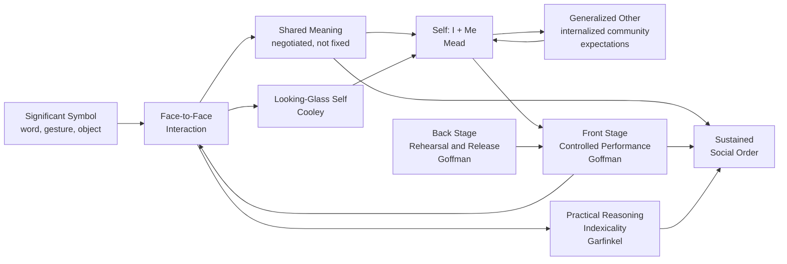

# Symbolic Interactionism and Microsociology

> [!abstract] TL;DR
> Symbolic interactionism is the sociological tradition holding that social life is built from the meanings people attach to symbols — language, gestures, objects — and that those meanings are produced, negotiated, and revised through face-to-face interaction. Where macro-sociology asks about institutions and structures, microsociology asks what is actually happening when two human beings talk, posture, judge, and perform for each other. The answer, across Mead, Cooley, Blumer, Goffman, Garfinkel, Sacks, and Becker, is that social reality is not given — it is *accomplished*, moment-by-moment, through coordinated symbolic action.

---

## Intuition — analogy FIRST

Imagine you are getting dressed for a job interview. You choose clothes that signal "competent and serious," rehearse answers that present you in the best light, and suppress the nervous laugh you always get when stressed. The authentic you — who wears hoodies and rambles — stays backstage. On the interview floor, a performance takes place.

Now recognize that every social situation works this way. At dinner with your parents you run a different script. With close friends, a third. At a police checkpoint, a fourth. You never stop performing; you only change the audience and costume. The question symbolic interactionists ask is not "which performance is the real you?" but: *how does the constant work of performance produce a coherent self at all, and how does it produce a shared social world?*

Erving Goffman saw everyday life as theater — front stage, back stage, scripts, props, and ensemble cast. George Herbert Mead had arrived at a complementary answer a generation earlier: the self is not present at birth but built from the outside in — we learn who we are by learning how others see us, then internalizing that external gaze until it becomes an inner voice. Harold Garfinkel added a third layer: the smooth performance of ordinary social life rests on a vast backstage of shared, unspoken assumptions — assumptions so deep that we only discover them when someone violates them.

---

## How It Works

Symbolic interactionism treats social reality as a dynamic accomplishment rather than a fixed structure. Three core moves define the tradition:

1. **Meaning is not intrinsic** — objects and gestures do not carry fixed meanings; meaning is assigned through social process and renegotiated continuously.
2. **The self is social** — self-concept is constructed through interaction, role-taking, and the internalization of others' perspectives.
3. **Interaction is the site of analysis** — the micro-encounter, not the macro-institution, is where social life is made, contested, and reproduced.



---

## Key Concepts

### Secondary Level

**What is a symbol?**
A symbol is anything — a word, a hand gesture, a uniform, a flag — whose meaning is socially shared rather than biologically fixed. The thumbs-up gesture means "good" in most Western contexts but is offensive in parts of the Middle East. The meaning does not live in the thumb — it lives in the interpretive community that uses it. Language is the paradigmatic symbolic system: "tree" has no tree-shaped property; English speakers have agreed to attach that sound to that concept. Because meaning is shared and learned, it can also change, be contested, and vary across groups.

**George Herbert Mead: the self is built from the outside in**
Mead (1863–1931) argued that the self has two inseparable components:
- The **I** — the impulsive, spontaneous, immediate self; the part that acts before it reflects; the source of novelty and creativity in social life
- The **Me** — the social self; the internalized perspectives of others looking back at us; the conscience, the editor, the self-censor

The **Me** is constructed through **role-taking**: children first imitate specific individuals (the **play stage** — playing "mommy" or "teacher"), then learn to coordinate multiple simultaneous roles (the **game stage** — playing shortstop requires knowing every other position at once), and finally internalize the perspective of the whole community — the **generalized other** — the imagined judgment of society at large. When you feel embarrassed in an empty room, the Me is operating: you are seeing yourself through the eyes of the generalized other.

**Significant symbols** are gestures or words that call out the same response in the person producing them as in the person receiving them. When you say "fire," both you and your listener flinch — the symbol coordinates perspectives. Language is the system of significant symbols that makes complex self-reflection, and therefore complex society, possible.

**Charles Cooley: the looking-glass self**
Cooley (1864–1929) proposed that self-concept is a reflection of how we think others see us — a three-step mirror:
1. We imagine how we appear to others
2. We imagine their judgment of that appearance
3. We develop a self-feeling — pride or shame — based on that imagined judgment

This makes the self irreducibly social: there is no pre-social authentic self waiting to be discovered independent of others' reactions. The self is a mirror image, and mirrors need someone standing in front of them. Social media, by making the imagined audience explicit and quantified (likes, views, follower counts), has industrialized the looking-glass process.

**Herbert Blumer's three premises**
Blumer (1900–1987) distilled Mead into three axioms that define the research programme:
1. Human beings act toward things on the basis of the *meanings* those things have for them
2. Those meanings arise out of *social interaction* with others — not from the things themselves, nor from individual psychology
3. Meanings are handled in and modified through an *interpretive process* whenever a person encounters a situation

Consequence for method: social science cannot treat behavior as mechanical stimulus-response. It must enter the interpretive process — which is why symbolic interactionists use ethnography, participant observation, and in-depth interviews rather than surveys and laboratory experiments.

### Undergraduate Level

**Goffman's dramaturgical theory**
Erving Goffman (1922–1982) extended symbolic interactionism by theorizing everyday interaction as a theatrical performance. His framework from *The Presentation of Self in Everyday Life* (1959):

| Concept | Definition | Example |
|---|---|---|
| **Front stage** | Region where performance takes place before an audience | Doctor's consulting room; formal dining room |
| **Back stage** | Region hidden from audience where performers relax, rehearse, and drop the act | Hospital break room; restaurant kitchen |
| **Props / setting** | Physical objects that support the performance | Medical diplomas on the wall; expensive office furniture |
| **Impression management** | Active work of controlling information others receive about oneself | Choosing words, dress, timing, and emotional display |
| **Performance team** | Performers who cooperate to maintain a shared front | Waiting staff coordinating before a customer approaches |

**Face-work**: In *Interaction Ritual* (1967), Goffman introduced "face" — the positive social image a person claims during interaction — and "face-work" — the actions taken to maintain one's own face and honor others'. Face threats are ubiquitous (an interruption, a fumbled response, a misread status signal), and social interaction involves a constant collaborative project of face maintenance. Tact, politeness norms, and the white lie all serve the interaction order by smoothing over face threats.

**Stigma**: In *Stigma: Notes on the Management of Spoiled Identity* (1963), Goffman analyzed deeply discrediting attributes — physical disability, mental illness, criminal record, stigmatized sexual or racial identity — that create a gap between a person's **virtual social identity** (what others assume based on social categories) and **actual social identity** (who the person is). Stigma management strategies include:

| Strategy | Mechanism | Example |
|---|---|---|
| **Passing** | Concealing the stigma entirely | Hiding a psychiatric history on a job application |
| **Covering** | Acknowledging but minimizing the stigma | Wheelchair user deflecting medical questions |
| **In-group affiliation** | Building community and identity around the stigmatized category | Deaf pride, recovery communities |
| **Disclosure management** | Carefully controlling who knows, when, and how | Coming out selectively to trusted people first |

**Total institutions**: In *Asylums* (1961), Goffman described places — prisons, psychiatric hospitals, military boot camps, boarding schools, monasteries — that strip individuals of prior social identities through **mortification** (removal of clothing, personal name, possessions, autonomy) and rebuild them according to institutional requirements. The process is a sociological demonstration that personal identity is more fragile and more socially constructed than we normally believe.

**Garfinkel and ethnomethodology**
Harold Garfinkel (1917–2011) asked: how do ordinary people produce the sense that the social world is orderly, shared, and obvious? His answer: through **practical reasoning** — continuous, taken-for-granted interpretive work that makes social reality appear natural.

| Concept | Definition |
|---|---|
| **Indexicality** | The meaning of any expression depends on its context (index). "I'll do it later" means something different from a contractor, a doctor, and a child. Language never carries meaning independently of situation. |
| **Reflexivity** | Social accounts do not merely describe social reality — they constitute it. A police report, a medical diagnosis, a meeting minute: these accounts *produce* the social facts they appear to merely record. |
| **Practical reasoning** | The methods ordinary members use to make sense of situations — not formal logic, but ad hoc, context-sensitive, pragmatically adequate reasoning. |
| **Accountability** | Actions are performed so as to be recognizable and justifiable to others — social actors continuously make their conduct "reportable" as sensible. |

**Breaching experiments** were Garfinkel's signature methodology. Students were instructed to violate mundane conversational conventions: to ask what "How are you?" really meant; to act like boarders in their own homes; to refuse to accept casual assertions without demanding elaboration. The result — anger, confusion, immediate attempts to restore normality, often by attributing the violator's behavior to illness or hostility — revealed that ordinary social life depends on a vast substructure of unspoken shared assumptions that participants normally never examine.

**Labeling theory (Becker)**
Howard Becker (*Outsiders*, 1963) proposed that deviance is not a property of the act but a consequence of the application of rules and sanctions by others:

> "Deviance is not a quality of the act the person commits, but rather a consequence of the application by others of rules and sanctions to an 'offender.'"

| Concept | Definition |
|---|---|
| **Primary deviance** | Rule-breaking that has not yet been publicly labeled — most people engage in this without consequence |
| **Secondary deviance** | The adoption of a deviant self-concept and career *following* public labeling — the label becomes self-fulfilling |
| **Deviant career** | The staged trajectory through which labeled individuals come to organize their lives around the deviant identity |
| **Moral entrepreneurs** | Activists, legislators, or professionals who campaign to define certain behaviors as deviant (temperance movement, war on drugs) |

The policy implication is direct: labeling individuals as "criminal" or "deviant" may increase the very behavior it targets by transforming primary into secondary deviance. This became the theoretical foundation for diversion programs, restorative justice, and decriminalization movements.

### Graduate Level

**Conversation analysis (Sacks, Schegloff, Jefferson)**
Harvey Sacks (1935–1975), Emanuel Schegloff, and Gail Jefferson developed conversation analysis (CA) from Garfinkel's programme. CA analyzes naturally occurring talk with fine-grained transcription notation (the Jefferson system), revealing that conversation operates through highly ordered machinery:

- **Turn-taking system**: talk is organized through *transition relevance places* (TRPs) — syntactic and prosodic moments where speaker transition is relevant. Current speaker can self-select next speaker, current speaker can continue, or next speaker self-selects. Gaps and overlaps at TRPs are managed systematically and are not random.
- **Adjacency pairs**: two-part exchanges where the first pair part makes conditionally relevant a specific second pair part (greeting → greeting; question → answer; invitation → acceptance/declination). The absence of the relevant second pair part is *noticeably absent* — it requires explanation and creates inference.
- **Preference organization**: not all response options are structurally equivalent. *Preferred* responses (acceptances, agreements, confirmations) are typically immediate, minimal, and unmarked. *Dispreferred* responses (rejections, disagreements, denials) are characteristically delayed, prefaced, hedged, and accompanied by accounts.
- **Repair sequences**: errors and misunderstandings are corrected through a systematic organization. Self-initiation is preferred over other-initiation; self-correction is preferred over other-correction. The preference for self-repair is a structural fact about conversation, not a cultural nicety.

The CA contribution is simultaneously methodological (grounding SI's claims about social order in empirical sequential structure) and theoretical (demonstrating that the interaction order has formal properties independent of participants' intentions or macro-social identities).

**Mead's I/Me dialectic and cognitive science**
Mead's framework anticipates contemporary debates in social neuroscience. The "I" — impulsive, present-oriented, creative — resembles the narrative or experiential self studied in consciousness research. The "Me" — the internalized perspective of others, the regulatory self — anticipates **theory of mind** (ToM): the capacity to model others' mental states and deploy those models in self-regulation. Mead argued that this capacity develops through language acquisition and symbolic play, not through biological maturation alone. Empirical support comes from developmental data (ToM failures in early childhood, cultural variation in ToM tasks) and from autism research, which treats impaired ToM as a core feature — directly implicating the social-interactionist construction of the self in neurodevelopmental variation.

**Goffman's interaction order and the micro-macro problem**
Goffman's late work elaborated the **interaction order** as a relatively autonomous social domain with its own norms, distinct from macro-level structures and irreducible to them. The interaction order is reproduced through **interaction rituals** — focused encounters with mutual attentiveness that generate **emotional energy** (collective effervescence, in Durkheim's original term). Randall Collins extended this into **interaction ritual chains** theory: emotional energy flows forward from encounter to encounter, producing the chains of micro-interaction that cumulate into what macro-sociology sees as structure, inequality, and culture.

This positions Goffman against both structural functionalism (which would read the performance as role-fulfillment dictated by macro-structure) and rational choice theory (which would explain it through strategic calculation). For Goffman, interaction has emergent properties — face, the interaction order, emotional energy — not derivable from either structural position or individual utility functions.

**Critique and post-Goffmanian developments**
Symbolic interactionism has faced persistent criticisms:
- **Neglect of power and structure**: micro-interaction occurs within macro-structural constraints (race, class, gender, colonialism) that SI brackets or treats as background. Goffman's own *Stigma* acknowledges structural sources of stigma while analyzing only their interactional management.
- **Idealism**: treating meaning-making as if it floats free of material conditions; ignoring how access to "scripts" is structurally distributed.
- **Limited generalizability**: ethnographic cases studies may not scale.

Subsequent scholarship has worked to bridge the gap: Arlie Hochschild (*The Managed Heart*, 1983) showed how emotion work — performing feeling states as labor — is structurally distributed by gender and class. Patricia Yancey Martin analyzed how organizations "practice gender" through microsituational interactions that cumulate into gendered institutions. These moves reconnect the interactionist tradition's deep insight — that social reality is accomplished in interaction — with macro-structural critique.

---

## Python Demo

```python
import numpy as np
import matplotlib.pyplot as plt

# ── Configuration ─────────────────────────────────────────────────────────────
# Models Goffman's impression management at population scale.
# Each agent has a 'true_self' score and a 'front_stage' score (public performance).
# Front-stage drifts toward the prevailing social norm (conformity pressure).
# Agents whose discrepancy exceeds a threshold risk a 'backstage leak' — detection
# of inauthenticity that results in permanent stigma and reputational collapse.
# Shows: (1) norm convergence, (2) stigma spread, (3) reputation equilibrium,
#         (4) final distribution of true vs performed identities.

np.random.seed(42)
N             = 80     # agents
T             = 120    # time steps
CONFORMITY    = 0.08   # rate front-stage drifts toward social norm per step
LEAK_PROB     = 0.04   # per-step probability a backstage leak is detected
STIGMA_THRESH = 0.35   # discrepancy magnitude above which a leak triggers stigma

# ── Initialise ────────────────────────────────────────────────────────────────
true_self   = np.random.uniform(0.1, 0.9, N)
front_stage = np.clip(true_self + np.random.normal(0, 0.15, N), 0, 1)
stigmatized = np.zeros(N, dtype=bool)

norm_history  = []
stigma_history = []
rep_history   = []

# ── Simulation loop ───────────────────────────────────────────────────────────
for t in range(T):
    active = ~stigmatized

    # Social norm = mean front-stage of non-stigmatized agents
    norm = front_stage[active].mean() if active.any() else 0.5
    norm_history.append(norm)

    # Impression management: front-stage converges toward social norm
    front_stage[active] += CONFORMITY * (norm - front_stage[active])
    front_stage = np.clip(front_stage, 0, 1)

    # Backstage leak: high discrepancy + random detection event -> stigma
    discrepancy = np.abs(true_self - front_stage)
    at_risk = (~stigmatized) & (discrepancy > STIGMA_THRESH)
    detected = at_risk & (np.random.rand(N) < LEAK_PROB)
    stigmatized |= detected

    # Reputation: front-stage signal for active agents; 0 for stigmatized
    rep_history.append(front_stage[~stigmatized].mean() if (~stigmatized).any() else 0)
    stigma_history.append(stigmatized.sum())

# ── Plot ──────────────────────────────────────────────────────────────────────
fig, axes = plt.subplots(2, 2, figsize=(11, 7))
fig.suptitle(
    "Impression Management Dynamics  (Goffman / Symbolic Interactionism)",
    fontsize=13, fontweight='bold'
)
ts = np.arange(T)

# Panel 1: social norm convergence
axes[0, 0].plot(ts, norm_history, color='steelblue', linewidth=2)
axes[0, 0].set_title("Social Norm Convergence")
axes[0, 0].set_xlabel("Time Step")
axes[0, 0].set_ylabel("Mean Front-Stage Signal")
axes[0, 0].set_ylim(0, 1)
axes[0, 0].grid(alpha=0.3)

# Panel 2: cumulative stigma count
axes[0, 1].plot(ts, stigma_history, color='crimson', linewidth=2)
axes[0, 1].set_title("Cumulative Stigma Spread")
axes[0, 1].set_xlabel("Time Step")
axes[0, 1].set_ylabel("# Stigmatized Agents")
axes[0, 1].set_ylim(0, N)
axes[0, 1].grid(alpha=0.3)

# Panel 3: mean reputation over time
axes[1, 0].plot(ts, rep_history, color='seagreen', linewidth=2)
axes[1, 0].set_title("Mean Reputation (Non-stigmatized Agents)")
axes[1, 0].set_xlabel("Time Step")
axes[1, 0].set_ylabel("Mean Reputation Score")
axes[1, 0].set_ylim(0, 1)
axes[1, 0].grid(alpha=0.3)

# Panel 4: final scatter — true self vs front stage, colored by stigma status
x_range = np.linspace(0, 1, 200)
axes[1, 1].fill_between(
    x_range, np.clip(x_range + STIGMA_THRESH, 0, 1), np.ones(200),
    alpha=0.08, color='crimson'
)
axes[1, 1].fill_between(
    x_range, np.zeros(200), np.clip(x_range - STIGMA_THRESH, 0, 1),
    alpha=0.08, color='crimson', label=f'Stigma zone (|gap| > {STIGMA_THRESH})'
)
colors = ['crimson' if s else 'steelblue' for s in stigmatized]
axes[1, 1].scatter(true_self, front_stage, c=colors, alpha=0.7,
                   s=40, edgecolors='white', linewidth=0.5)
axes[1, 1].plot([0, 1], [0, 1], 'k--', linewidth=1, alpha=0.4, label='Authentic (no gap)')
axes[1, 1].set_xlim(0, 1)
axes[1, 1].set_ylim(0, 1)
axes[1, 1].set_title("Final State: True Self vs Front-Stage Signal")
axes[1, 1].set_xlabel("True Self Score")
axes[1, 1].set_ylabel("Front-Stage Signal")
axes[1, 1].scatter([], [], color='steelblue', s=40, label='Active')
axes[1, 1].scatter([], [], color='crimson',   s=40, label='Stigmatized')
axes[1, 1].legend(fontsize=8)
axes[1, 1].grid(alpha=0.3)

plt.tight_layout()
plt.savefig("impression_management.png", dpi=150, bbox_inches='tight')
plt.show()
print(f"Final: {stigmatized.sum()} / {N} agents stigmatized ({100 * stigmatized.mean():.0f}%)")
```

**What the simulation shows:**
- **Norm convergence** (panel 1): front-stage signals converge as each agent adjusts toward the prevailing norm — a model of interactional conformity pressure.
- **Stigma spread** (panel 2): agents with large true/performance gaps accumulate backstage leak events over time; stigma is absorbing (permanent), so the count only rises.
- **Reputation equilibrium** (panel 3): mean reputation among active agents stabilizes once the highest-discrepancy individuals have been stigmatized and removed from the signaling pool.
- **Final scatter** (panel 4): surviving agents cluster near the identity line (low gap) while stigmatized agents (red) were disproportionately in the high-discrepancy zones — Goffman's stigma as the cost of inauthenticity discovered.

---

## Real-World Applications

**Social media as front-stage industrialization**
Instagram, LinkedIn, and Twitter profiles are the most explicit modern instantiation of Goffman's front stage. Users curate photos, craft professional narratives, and manage the information visible to different audiences (audience segregation). The back stage — the unfiltered life — is systematically excluded. The psychological cost, documented in research on social comparison and envy, is what happens when the looking-glass is replaced by a quantified performance scorecard: likes, follower counts, endorsements.

**Criminal justice and the labeling effect**
Becker's labeling theory has direct policy implications. Studies consistently show that individuals formally labeled "criminal" or "juvenile delinquent" — even for identical conduct — show higher rates of subsequent offending than those who received informal warnings. The label triggers secondary deviance: social networks shift (employers, schools reject the labeled person), self-concept adjusts, and the deviant career becomes self-fulfilling. Diversion programs, expungement laws, and restorative justice are interactionist-informed interventions.

**Psychiatric diagnosis as stigma management**
Goffman's *Asylums* remains a touchstone in critiques of psychiatric institutions. The diagnosis of mental illness functions as a permanent stigma that organizes others' interactions with the patient independently of current behavior. Rosenhan's 1973 "On Being Sane in Insane Places" experiment — in which pseudo-patients gained admission and could not escape diagnosis regardless of normal behavior — is a breaching experiment in clinical disguise.

**Garfinkel in user experience and AI**
Garfinkel's indexicality is directly relevant to natural language processing and conversational AI. The fact that utterance meaning is irreducibly contextual — that "can you pass the salt?" is a request, not a question about motor capacity — is precisely the problem that makes rule-based chatbot design fail and motivates context-aware language models. Breaching experiments have been adapted by UX researchers to stress-test assumed mental models in product design.

**Gender and race as interaction accomplishments**
Candace West and Don Zimmerman's "Doing Gender" (1987) applied SI to show that gender is not a fixed trait but an ongoing interactional accomplishment — we "do" gender in each encounter by performing, monitoring, and correcting our conduct against normative expectations. The same analytic has been applied to race (doing race), age (doing age), and disability — all reconceived as practices sustained through micro-interaction rather than natural categories.

---

## Common Pitfalls

- **Confusing performance with fakery** — Goffman does not say the front stage is less real or more dishonest than the back stage. Every region has its appropriate norms; the back stage is not uniquely authentic, it is differently staged. The error is treating sincerity as the backstage default.
- **Ignoring macro-structure** — SI's focus on micro-interaction can obscure that the available scripts, the distribution of stigma, and the stakes of impression management are all structurally determined. A job interview is not symmetrically staged for all applicants. Applying SI without structural context produces an incomplete analysis.
- **Treating labeling as fully deterministic** — labeled individuals are not passive recipients of deviant identity. Resistance, identity negotiation, and collective reframing (disability pride, queer identity reclamation) are documented responses. Becker's theory is probabilistic and interactional, not deterministic.
- **Overgeneralizing from breaching experiments** — what Garfinkel demonstrates is the structure of background expectations, not the fragility of social order per se. The experiments reveal the iceberg beneath the surface; they do not show the iceberg is small.
- **Conflating SI with constructivism generally** — SI is a specific theoretical tradition with a specific research programme (face-to-face interaction, meaning negotiation, the self). It is not a synonym for "social construction" at the macro-level. Berger and Luckmann's *Social Construction of Reality* (1966) bridges SI and macro-sociology but is distinct from core SI commitments.

---

## Related Concepts

- [[_MOC_Sociological_Theory_and_Foundations|↑ Sociological Theory and Foundations MOC]] — Section entry point and concept map for this theoretical cluster
- [[Social_Influence_and_Conformity]] — Milgram, Asch, and normative/informational influence operate as macro-demonstrations of what SI traces at the micro-interactional level; the agentic state is a front-stage collapse into institutionally scripted Me
- [[Group_Dynamics]] — in-group/out-group dynamics produce the audience whose imagined judgment constitutes the generalized other; groupthink is a failure of impression management differentiation
- [[Prejudice_and_Discrimination]] — stereotype application is an interactional enactment of stigma; Goffman's virtual vs actual social identity maps directly onto the stereotyping literature
- [[Moral_Development]] — Kohlberg's conventional moral reasoning (Stage 3-4) mirrors Mead's generalized other; postconventional reasoning requires transcending it — the Me resisting the generalized other
- [[Neurodevelopmental_Disorders]] — impaired theory of mind in autism spectrum disorder is a direct neurodevelopmental counterpart to Mead's claim that the Me requires perspective-taking capacity
- [[Consciousness_and_Neural_Correlates]] — the I/Me dialectic anticipates distinctions between the experiential self and the self-as-object; narrative theories of consciousness map onto Mead's account of reflexive self-awareness

---

## Review Questions

### Secondary

1. Describe Cooley's looking-glass self in your own words. Use social media as an example: how does the design of Instagram intensify or distort the looking-glass process compared to everyday face-to-face interaction?
2. Draw the distinction between front stage and back stage using an example from your own daily life. What props, scripts, and audiences are involved in each region?
3. Why did Garfinkel's students performing breaching experiments encounter anger rather than curiosity? What does this emotional reaction tell us about the nature of social norms?

### Undergraduate

1. Compare Mead's generalized other with Cooley's looking-glass self. Both explain how the self is social, but they locate the social differently. What does each concept add, and are they compatible?
2. Goffman argues that stigma management — passing, covering, in-group affiliation — is the work that stigmatized individuals must do on top of ordinary impression management. What structural conditions determine which strategy is available, and what does this reveal about the limits of a purely interactionist analysis?
3. Garfinkel's breaching experiments have been criticized as trivial pranks that prove nothing more than that people dislike rudeness. Formulate Garfinkel's defense: what exactly do the experiments demonstrate methodologically, and why is this theoretically significant for ethnomethodology?

### Graduate

1. Goffman insists the interaction order is a domain of social life relatively autonomous from macro-structure. Randall Collins extends this into interaction ritual chains theory, claiming micro-encounters cumulate into what we conventionally call "macro" structure. Evaluate this micro-foundationalist strategy: what does it explain well, and where does it fail to account for the durability of structural inequalities?
2. Becker's labeling theory and Foucault's account of normalization and discipline both analyze how power constructs deviance — but through fundamentally different mechanisms. Compare them: what is the role of interaction, institution, and discourse in each? Is their difference empirical or ontological?
3. Conversation analysis claims to be a formal science of interaction structure, independent of participants' intentions, cultural meanings, or social identities. Critically assess this claim: to what extent can the turn-taking system, adjacency pairs, and preference organization be specified independently of the cultural and biographical particulars of speakers? Draw on cases where structural analysis underdetermines the interaction.

---

## Sources

- [Symbolic Interactionism — Simply Psychology](https://www.simplypsychology.org/symbolic-interaction-theory.html)
- [Symbolic Interactionism — Lumen Learning Introduction to Sociology](https://courses.lumenlearning.com/wm-introductiontosociology/chapter/reading-symbolic-interactionist-theory/)
- [Harold Garfinkel — Philopedia](https://philopedia.org/thinkers/harold-garfinkel/)
- [Garfinkel, Harold — *Studies in Ethnomethodology* (1967)](https://monoskop.org/images/0/0c/Garfinkel_Harold_Studies_in_Ethnomethodology.pdf)
- Erving Goffman, *The Presentation of Self in Everyday Life* (1959)
- Erving Goffman, *Stigma: Notes on the Management of Spoiled Identity* (1963)
- Erving Goffman, *Asylums: Essays on the Social Situation of Mental Patients and Other Inmates* (1961)
- George Herbert Mead, *Mind, Self, and Society* (1934, ed. Charles Morris)
- Herbert Blumer, *Symbolic Interactionism: Perspective and Method* (1969)
- Howard Becker, *Outsiders: Studies in the Sociology of Deviance* (1963)
- Harvey Sacks, Emanuel Schegloff, and Gail Jefferson, "A Simplest Systematics for the Organization of Turn-Taking for Conversation," *Language* 50(4), 1974

---

#Sociology #SociologicalTheory #SymbolicInteractionism #Microsociology
