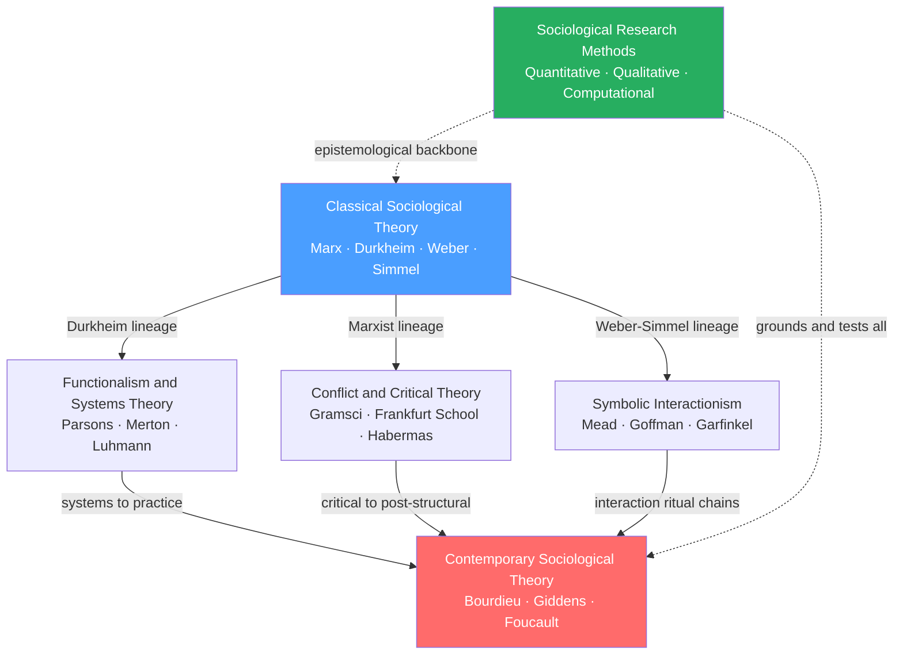

# Sociological Theory and Foundations

> [!abstract] Section Overview
> This section establishes the theoretical and methodological backbone of sociology. It traces the discipline from its four founding theorists — Marx, Durkheim, Weber, and Simmel — through the three major schools that dominated the 20th century (functionalism, conflict theory, symbolic interactionism) to the contemporary syntheses of Bourdieu, Giddens, and Foucault. Alongside the theories, it covers the epistemological stances and empirical tools through which sociologists produce warranted claims about social life, making method choice inseparable from theoretical commitment.

---

## Concept Map

*(Blue = fundamental entry point, Red = advanced synthesis, Green = methodological backbone, arrows = "leads to" or "builds on", dashed = cross-cutting relationship)*

---

## Notes in This Section

| Note | Core Idea | Difficulty |
|------|-----------|------------|
| [[Classical_Sociological_Theory]] | Marx, Durkheim, Weber, and Simmel each diagnosed a different wound of modernity: alienation, anomie, rationalization, and fragmentation of the self | Intermediate |
| [[Sociological_Research_Methods]] | Method choice is inseparable from epistemological stance; quantitative, qualitative, and computational tools each reveal different layers of social reality | Intermediate |
| [[Functionalism_and_Systems_Theory]] | Social institutions are explained by what they do for the whole — from Parsons' AGIL schema to Luhmann's autopoietic, operationally closed subsystems | Intermediate |
| [[Conflict_Theory_and_Critical_Theory]] | Society is organized around competition over scarce power; domination is sustained through ideology, hegemony, and the colonization of everyday culture | Intermediate |
| [[Symbolic_Interactionism_and_Microsociology]] | Social reality is accomplished through face-to-face interaction and the meanings people attach to symbols; the self is built from the outside in, not pre-given | Beginner–Intermediate |
| [[Contemporary_Sociological_Theory]] | Bourdieu, Giddens, and Foucault dissolve the structure-agency divide; power operates through habitus, discipline, and surveillance across liquid, precarious late modernity | Advanced |

---

## Recommended Learning Path

1. [[Classical_Sociological_Theory]] — Start here: the four founding diagnoses of modernity establish every major tension the discipline still debates; all other notes are in dialogue with this one
2. [[Sociological_Research_Methods]] — Read early: understanding how sociologists know what they claim to know illuminates why theories take the forms they do and why empirical debates remain unresolved
3. [[Functionalism_and_Systems_Theory]] — The first major macro school; Parsons and Luhmann show how societies absorb shocks and maintain functional order — and why that explanation draws such fierce critique
4. [[Conflict_Theory_and_Critical_Theory]] — The direct critique of functionalism; Gramsci and Habermas reveal how power hides inside common sense, culture, and reason itself
5. [[Symbolic_Interactionism_and_Microsociology]] — The micro turn; Goffman and Garfinkel show that social order is accomplished in every face-to-face encounter, not only in institutions and systems
6. [[Contemporary_Sociological_Theory]] — Read last: Bourdieu, Giddens, and Foucault synthesize all three prior schools, dissolve their dualisms, and push sociology into the conditions of the 21st century

---

## Key Themes

- **Structure vs. Agency** — The central theoretical tension: do social structures determine individual behavior, or do individuals produce structures through their actions? Functionalism leans structural; SI leans agential; contemporary theory argues the binary is false.
- **Macro vs. Micro** — Functionalism and conflict theory analyze system-level patterns; symbolic interactionism and ethnomethodology analyze face-to-face encounters; Giddens and Collins build bridges between the two levels.
- **Consensus vs. Conflict** — Functionalism sees society held together by shared norms and functional interdependence; conflict theory sees order maintained by the power of dominant groups over subordinate ones.
- **Explanation vs. Interpretation** — Positivist sociology explains behavior through measurable social facts following Durkheim; interpretive sociology understands the subjective meanings behind action following Weber; critical realism seeks the generative mechanisms beneath both.
- **Reproduction of Inequality** — How do class, race, and gender inequalities persist across generations? Functionalism sees differential reward; conflict theory sees ideology and hegemony; SI sees stigma enacted in interaction; Bourdieu sees habitus and misrecognition.
- **Modernity as Problem** — All four founders and their successors are in dialogue with the specific pathologies of modernity: alienation, anomie, the iron cage, the blasé attitude, rationalization, liquid precarity.

---

## Key Questions This Topic Answers

- Why did sociology emerge as a discipline in the 19th century, and what problems was it invented to diagnose?
- What is the difference between a sociological explanation and a psychological one?
- Why do social inequalities persist even in societies that formally value equality and individual merit?
- How does power maintain itself without constant visible force — through culture, common sense, and everyday interaction?
- What is the relationship between individual agency and the social structures that predate any individual?
- Is society held together primarily by shared values and functional interdependence, or by the domination of the powerful over the subordinate?
- How do researchers produce reliable, ethically defensible knowledge about social life when they are themselves embedded in the social world they study?

---

## Cross-Section Links

- [[_MOC_Sociology_Master|↑ Sociology Master MOC]] — master entry to the full Sociology vault; this section's theoretical frameworks are the analytical foundation used throughout all other sections
- **Psychology / Social Psychology** — Milgram's obedience, Asch's conformity, and Goffman's impression management overlap directly; group dynamics and social influence are the empirical micro-level counterparts to macrosociological theory on norms and control
- **Political Science** — Conflict theory, Gramsci's hegemony, and world-systems theory directly inform political sociology; the state is Parsons' G-subsystem and the terrain of hegemonic struggle in Gramsci; Habermas's public sphere is a normative theory of democratic legitimacy
- **Economics / Sociology of Markets** — Bourdieu's multi-dimensional capital theory and Wallerstein's core-periphery world-system extend and critique economic categories; Luhmann treats the economy as an operationally closed code-system
- **Philosophy** — Epistemological stances (positivism, interpretivism, critical realism) are applications of philosophy of science; Foucault's genealogy and Habermas's communicative rationality are simultaneously social theory and moral philosophy
- **History** — Classical sociology is inseparable from the history of industrialization, capitalism, and colonial modernity; world-systems theory and historical materialism are explicitly historical social sciences

---

#Sociology #MOC #SociologicalTheory
