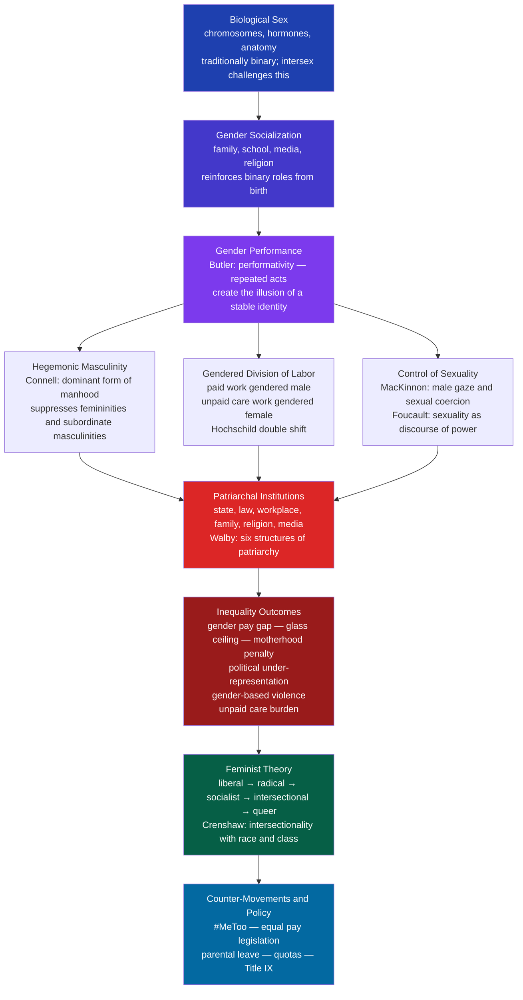

# Gender, Sex, and Patriarchy

> [!abstract] TL;DR
> Sex is a biological classification; gender is the socially constructed performance built on top of it — "one is not born, but becomes, a woman" (de Beauvoir). Patriarchy is the system of male dominance sustained through ideology, labor division, control of sexuality, and institutional power. Understanding this distinction — and the feminist theories from liberal suffragism to Butler's performativity to Crenshaw's intersectionality — is foundational to analyzing how gender inequality is produced, reproduced, and resisted.

---

## Intuition

**Analogy:** Think of a theater company that casts every production before rehearsals begin. At birth, you are assigned a costume (sex) and handed a thick script (gender norms) — lines you are expected to deliver convincingly for life. Over decades of performance, you forget you are acting: the role feels like your authentic self. The theater company (patriarchy) profits from keeping those scripts fixed, because rigid roles make the company legible, predictable, and exploitable. Judith Butler's great insight was to show that there is no actor behind the performance — the performance *is* the actor — and that the compulsion to repeat it is itself a mechanism of power.

The political implication follows immediately: if gender is a social script, it can be rewritten. But rewriting a script that billions of people have rehearsed for millennia, that is encoded in law, religion, economics, and psychology, is not a matter of personal choice. It requires dismantling the institutional structures that enforce the casting call.

---

## How It Works



---

## Key Concepts

### Secondary Level

**Sex vs. Gender: The Core Distinction**

*Biological sex* refers to chromosomal, hormonal, and anatomical characteristics — predominantly categorized as male or female, though approximately 1.7% of people are intersex (Fausto-Sterling, 2000). *Gender* refers to the social meanings, roles, behaviors, and identities attached to sex categories: femininity, masculinity, and the many arrangements beyond the binary.

The distinction matters because it breaks the claim of inevitability. If gender roles were simply biological, they would be universal and unchanging. In fact, what counts as "masculine" or "feminine" varies dramatically across cultures and historical periods — warrior masculinity, breadwinner masculinity, and "new man" caregiving masculinity have all been dominant in different times and places.

**Agents of Gender Socialization**

Gender norms are transmitted through multiple channels working simultaneously:

| Agent | Mechanism | Example |
|---|---|---|
| **Family** | Primary socialization from birth | Pink vs. blue, toy selection, different emotional expectations for boys and girls |
| **Peer groups** | Enforced through ridicule and exclusion | "You throw like a girl"; "man up" |
| **School** | Formal curriculum + hidden curriculum | Calling on boys more in math; counseling girls away from STEM |
| **Media** | Representation and narrative | Disney princess passivity; male action-hero dominance; advertising targeting insecurities |
| **Religion** | Doctrine and ritual | Male priesthood; female modesty norms |

**The Gender Pay Gap**

In the United States (2024), women earn approximately $0.84 for every dollar earned by men in median weekly full-time earnings (BLS). The raw gap has multiple components:

- **Occupational segregation**: women are concentrated in lower-paid sectors (nursing, teaching, social work vs. engineering, finance, law)
- **Within-occupation gap**: even in the same role, women earn less
- **Glass ceiling**: under-representation in senior leadership across sectors
- **Motherhood penalty**: women's earnings drop significantly at childbirth; men's often rise (the "fatherhood bonus")

The "explained" portion of the gap (hours worked, occupation, experience) accounts for roughly half; the "unexplained" residual is consistent with discrimination.

---

### Undergraduate Level

**Simone de Beauvoir: Becoming Woman**

In *The Second Sex* (1949), de Beauvoir argued that "one is not born, but becomes, a woman." Woman is not defined by biology but by her position as the *Other* — defined in relation to man as the universal subject. Femininity is a condition imposed by patriarchal society, not an essence. This was the philosophical groundwork for all subsequent feminist theory: gender as social construction rather than natural fact.

**Feminist Waves: An Overview**

| Wave | Period | Key Focus | Key Figures | Central Demand |
|---|---|---|---|---|
| **First Wave** | 1840s–1920s | Legal rights — suffrage, property, education | Wollstonecraft, Stanton, Pankhurst | Right to vote and own property |
| **Second Wave** | 1960s–1980s | Reproductive rights, workplace equality, domestic violence | Friedan, Millett, MacKinnon, hooks | "The personal is political" |
| **Third Wave** | 1990s–2000s | Individuality, sexuality, intersectionality | Walker, Baumgardner | Reclaiming femininity; diversity within feminism |
| **Fourth Wave** | 2010s–present | Online activism, institutional accountability | Tarana Burke (#MeToo) | Structural accountability for sexual violence and harassment |

**Varieties of Feminist Theory**

*Liberal feminism* (Friedan, Wollstonecraft): gender inequality stems from legal and institutional discrimination. The remedy is equality of opportunity — voting rights, equal pay legislation, affirmative action — within existing liberal democratic structures. Critique: structural transformation is not addressed; women gain equal access to a system that remains organized around masculine norms.

*Radical feminism* (Millett, MacKinnon, Dworkin): patriarchy is the foundational system of oppression, prior to and deeper than capitalism or racism. Power operates through sexuality — pornography, prostitution, and rape are instruments of political domination, not individual acts. The remedy requires transforming gender relations at their root, not merely reforming institutions.

*Socialist feminism* (Hartmann, Mitchell): gender inequality and class inequality are co-constitutive. Capitalism appropriates women's unpaid reproductive labor; patriarchy benefits capital by keeping wages for care work at zero. The "dual systems" analysis argues both must be dismantled simultaneously.

*Black and postcolonial feminism* (hooks, Collins, Mohanty): mainstream Western feminism reproduces race and class privilege. The experiences of Black, indigenous, and Third World women are not represented by white middle-class feminist agendas. Intersection of race, class, and gender must be centered.

**Hochschild's Double Shift**

Arlie Hochschild (1989) coined the *second shift* to describe the phenomenon that even as women entered the paid labor force in large numbers, they continued to bear primary responsibility for domestic labor and childcare. American women at the time were working roughly an extra month per year compared to their male partners in unpaid household work. The double shift produces structural disadvantage in career advancement: women interrupted careers for childcare, accepted fewer promotions to manage domestic responsibilities, and entered lower-paying, more flexible occupations.

Three decades later, the gender gap in unpaid care work persists. The COVID-19 pandemic (2020–2022) dramatically widened it: school closures fell disproportionately on mothers' work hours, producing the "she-cession."

**Connell's Hegemonic Masculinity**

R.W. Connell (1987, 1995) argued that there is no single masculinity — there are multiple masculinities in hierarchy. *Hegemonic masculinity* is the culturally dominant form: the characteristics (strength, stoicism, aggression, heterosexuality, economic dominance) that legitimate men's authority over women and over subordinated masculinities (gay men, men of color, working-class men). It is hegemonic not primarily through force but through consent and ideological normalization — most men do not fully embody it but still benefit from the patriarchal dividend it secures for the masculine gender category.

Connell's framework explains why gender oppression harms men too: the norms of hegemonic masculinity are emotionally restrictive, physically dangerous (men die younger, take more workplace risks), and socially isolating (men report fewer close friendships).

---

### Graduate Level

**Judith Butler: Performativity**

Butler's *Gender Trouble* (1990) and *Bodies That Matter* (1993) radically destabilized the sex/gender distinction. She argued that even biological sex is not a pre-discursive natural fact but is produced through scientific and cultural discourse — the claim that sex is natural is itself a performative act that naturalizes what is in fact socially constructed.

Gender *performativity* does not mean gender is a voluntary performance that individuals can freely choose. Rather, gender is constituted through the *compulsory repetition* of stylized acts — speaking, walking, dressing, gesturing — that are normatively required by gender discourse. The appearance of a stable inner gender identity is the *product* of these repeated acts, not their cause. There is no actor behind the performance; the performance produces the actor.

Political implication: the compulsory repetition also contains the possibility of failure, deviation, and subversion. Drag, non-binary identities, and queer sexuality are not simply marginal variations — they expose the contingency and constructedness of all gender performance.

**Crenshaw's Intersectionality**

Kimberlé Crenshaw (1989) introduced *intersectionality* through a specific legal argument: Black women face discrimination that cannot be understood as the sum of race discrimination plus gender discrimination. Courts had found that Black women's claims failed because Black men were hired (proving no race discrimination) and white women were hired (proving no gender discrimination). But Black women's specific position — at the intersection of both axes — was invisible to single-axis analysis.

Intersectionality has since expanded to a full theoretical framework: race, class, gender, sexuality, disability, and nationality are not additive but mutually constitutive systems of power. They produce qualitatively different experiences that cannot be derived from their components separately. Patricia Hill Collins developed *matrix of domination* — the interlocking nature of systems — to describe how these axes operate structurally rather than individually.

**Walby's Six Structures of Patriarchy**

Sylvia Walby (1990) systematized patriarchy as a social system with six distinct structures, each of which can be analyzed empirically:

| Structure | Mechanism of Male Dominance |
|---|---|
| **Paid work** | Occupational segregation, wage discrimination |
| **Household production** | Women's unpaid domestic and care labor |
| **Culture** | Representations of femininity as inferior or dangerous |
| **Sexuality** | Compulsory heterosexuality, sexual harassment and violence |
| **Violence** | Domestic violence, rape as social control |
| **The State** | Laws and institutions that encode gender hierarchy |

Walby distinguished *private patriarchy* (women dominated within the household by individual men — historically dominant) from *public patriarchy* (women participate in public life but face systematic discrimination — contemporary form). The transition from private to public patriarchy does not abolish male dominance; it reconfigures it.

**Queer Theory: Foucault and Sedgwick**

Michel Foucault's *History of Sexuality* (1976) argued that "sexuality" as an identity category was invented in the 19th century — before that, there were sex acts but no "homosexuals" or "heterosexuals" as stable identities. The production of sexuality as an identity was a technology of power: by inciting people to confess, classify, and regulate their sexuality, modern institutions extended social control into the most intimate domains of life.

Eve Kosofsky Sedgwick (*Epistemology of the Closet*, 1990) extended this to argue that the homo/heterosexual binary is not a minor concern but a central organizing principle of all modern Western culture. The closet — the structure of knowing and not-knowing about same-sex desire — is a productive mechanism of power, not merely a site of individual suffering.

Queer theory's contribution to gender sociology: it denaturalizes not just gender but sexuality, showing both to be historically and culturally specific systems of meaning and power rather than natural facts.

**Feminist Standpoint Epistemology**

Sandra Harding and Nancy Hartsock argued that knowledge itself is gendered. Mainstream ("malestream") social science claims to produce universal, value-neutral knowledge but actually reflects the perspective of the dominant group. Women's experiences — particularly the labor of caring, bodily vulnerability, and exclusion from knowledge-producing institutions — give women a *standpoint* that is epistemically privileged for understanding gender relations. Marginalized groups can see the social whole more clearly precisely because they must understand the dominant group to survive, while the dominant group need not understand the margins.

---

## Python Demo

```python
# Demonstrates how a modest per-step promotion bias compounds through
# a six-level corporate hierarchy to produce large representation gaps at the top.
# Each year, all employees face promotion decisions with a slight disadvantage for women.

import numpy as np
import matplotlib.pyplot as plt

rng = np.random.default_rng(seed=42)

LEVEL_NAMES = ["Entry", "Junior", "Mid", "Senior", "Director", "C-Suite"]
LEVELS = len(LEVEL_NAMES)
PROMO_RATES = np.array([0.20, 0.18, 0.15, 0.12, 0.08, 0.00])  # per year per level
GENDER_BIAS = 0.05    # women promoted at (1 - bias) * base rate
ATTRITION = 0.08      # equal attrition for all
YEARLY_HIRES = 500    # equally split at entry level
YEARS = 30

men = np.zeros(LEVELS)
women = np.zeros(LEVELS)
men[0] = YEARLY_HIRES // 2
women[0] = YEARLY_HIRES // 2

men_hist = np.zeros((YEARS, LEVELS))
women_hist = np.zeros((YEARS, LEVELS))

for yr in range(YEARS):
    men_hist[yr] = men.copy()
    women_hist[yr] = women.copy()

    # Promotions: move from level i to i+1
    for lvl in range(LEVELS - 1):
        pm = rng.binomial(int(men[lvl]), PROMO_RATES[lvl])
        pw = rng.binomial(int(women[lvl]), PROMO_RATES[lvl] * (1 - GENDER_BIAS))
        men[lvl] -= pm
        men[lvl + 1] += pm
        women[lvl] -= pw
        women[lvl + 1] += pw

    # Equal attrition at all levels
    am = rng.binomial(men.astype(int), ATTRITION)
    aw = rng.binomial(women.astype(int), ATTRITION)
    men = np.maximum(men - am, 0)
    women = np.maximum(women - aw, 0)

    # New cohort of hires at entry level
    men[0] += YEARLY_HIRES // 2
    women[0] += YEARLY_HIRES // 2

# --- Plotting ---
fig, (ax1, ax2) = plt.subplots(1, 2, figsize=(14, 6))
fig.suptitle(
    "Occupational Gender Segregation via Agent Simulation\n"
    f"Equal hiring, equal attrition, {int(GENDER_BIAS*100)}% per-step promotion bias",
    fontsize=13,
)

# Left: women's share at each level in final year
total_final = men_hist[-1] + women_hist[-1]
women_pct = np.where(total_final > 0, women_hist[-1] / total_final * 100, 0)
bar_colors = ["#2563eb" if v >= 45 else "#d97706" if v >= 30 else "#dc2626" for v in women_pct]
bars = ax1.barh(LEVEL_NAMES, women_pct, color=bar_colors)
ax1.axvline(50, color="black", linestyle="--", alpha=0.6, label="Parity (50%)")
ax1.set_xlabel("Women's Share (%)")
ax1.set_title(f"Representation After {YEARS} Years")
ax1.set_xlim(0, 60)
ax1.legend(loc="lower right")
for bar, val in zip(bars, women_pct):
    ax1.text(val + 0.8, bar.get_y() + bar.get_height() / 2, f"{val:.1f}%", va="center", fontsize=9)

# Right: C-Suite vs Entry women's share over time
csuite_ts = women_hist[:, -1] / np.maximum(men_hist[:, -1] + women_hist[:, -1], 1) * 100
entry_ts = women_hist[:, 0] / np.maximum(men_hist[:, 0] + women_hist[:, 0], 1) * 100
ax2.plot(range(YEARS), entry_ts, color="#2563eb", linewidth=2, label="Entry Level")
ax2.plot(range(YEARS), csuite_ts, color="#dc2626", linewidth=2, label="C-Suite")
ax2.axhline(50, color="black", linestyle="--", alpha=0.5, label="Parity")
ax2.fill_between(range(YEARS), csuite_ts, entry_ts, alpha=0.12, color="#dc2626", label="Representation gap")
ax2.set_xlabel("Year")
ax2.set_ylabel("Women's Share (%)")
ax2.set_title("Compounding Effect Over Time")
ax2.set_ylim(0, 60)
ax2.legend()

plt.tight_layout()
plt.savefig("gender_segregation_simulation.png", dpi=120, bbox_inches="tight")
plt.show()

print("Final-year representation:")
for name, pct in zip(LEVEL_NAMES, women_pct):
    gap = 50 - pct
    print(f"  {name:12s}: {pct:.1f}% women  ({gap:+.1f}pp from parity)")
```

**What this shows:** Starting from perfect parity (50/50 hiring) with equal attrition at all levels, a mere 5% promotion disadvantage for women produces roughly a 20–25 percentage point representation gap at the C-Suite level after 30 years. The entry level stays near parity; the gap accumulates at each transition. This is a mathematical model of how pipeline arguments ("just give it time") fail when the pipeline itself is biased.

---

## Real-World Applications

**Nordic Gender Policy as Natural Experiment**

The Nordic countries — Sweden, Norway, Denmark, Iceland — consistently rank first on the World Economic Forum's Global Gender Gap Index. Key structural features: near-universal subsidized childcare (reducing the motherhood penalty), generous gender-neutral parental leave (Sweden: 480 days, father's quota reserved for non-transferable use), pay transparency laws, and high female political representation (40%+ in parliaments). Iceland passed laws requiring pay equity certification — companies must prove equal pay for equal work or face fines. Result: Nordic gender pay gaps run 7–12% vs. OECD averages near 15–20%.

Critically, the father's quota for parental leave is behavioral engineering based on the double shift research: when leave is transferable, fathers rarely take it; when a portion is reserved exclusively for fathers and non-transferable, take-up rises dramatically, and partners' earnings converge over time.

**#MeToo and Institutional Power**

The #MeToo movement (Tarana Burke, 2006; viral moment 2017) demonstrated Walby's thesis about the state structure of patriarchy. Harvey Weinstein's behavior was known within the industry for decades. The mechanism of protection was not individual silence but institutional architecture: NDAs, legal departments, HR departments controlled by perpetrators' organizations, and the financial dependency of accusers on powerful men. The movement's sociological significance is not individual revelation but the exposure of organizational and legal systems that systematically insulated perpetrators from accountability.

Subsequent research by economists documented that #MeToo produced a measurable shift in workplace policies, NDA legislation, and institutional reporting mechanisms — though rigorous studies also document backlash: male managers became significantly more likely to avoid one-on-one contact with female subordinates (the "Pence effect"), which reduced mentorship and promotion opportunities for women.

**Gender Quotas: Parity vs. Meritocracy**

Norway (2008) mandated that corporate boards of publicly traded companies be at least 40% women. Subsequent research (Ahern & Dittmar, 2012) found short-term stock price drops at announcement — interpreted as evidence of "diluted talent pool." Counter-evidence (Matsa & Miller, 2013; later replication studies) found that female board members were equally qualified by measurable criteria, and that boards with greater gender diversity made fewer extreme acquisitions, reduced employee layoffs, and showed lower volatility. France, Germany, Italy, and many EU states followed with similar requirements.

The debate crystallizes the patriarchy/meritocracy tension: "meritocracy" arguments assume a neutral pipeline to the top; sociological analysis shows the pipeline itself is gendered at every stage.

---

## Common Pitfalls

- **Conflating sex with gender** — treating gender roles as biologically inevitable because they correlate with a binary sex classification. Cross-cultural and historical variation in gender norms refutes this. Intersex and transgender experiences show the categories themselves are neither universal nor stable.

- **Treating patriarchy as an intentional conspiracy** — patriarchy operates largely through socialization, institutional inertia, and structural advantage rather than deliberate male conspiracy. Most individual men do not consciously intend to oppress women. The sociological point is about systemic patterns, not individual malice.

- **Treating feminism as a monolithic position** — liberal, radical, socialist, intersectional, and postmodern feminisms disagree fundamentally on causes, remedies, and even core concepts. Engaging with "feminism" requires specifying which strand.

- **Ignoring intersectionality in empirical claims** — gender pay gap statistics that don't disaggregate by race dramatically underestimate the gaps facing Black, Latina, and Native American women. Intersectional analysis is not a political preference but a methodological requirement for accuracy.

- **The "women can choose" deflection** — individual choice operates within structures that constrain and incentivize differentially. Occupational segregation partly reflects preferences, but preferences are themselves formed through socialization and shaped by structural incentives. Treating structure-shaped preferences as free choices is a category error.

- **Collapsing gender and sexuality** — gender identity (who you are) and sexual orientation (who you are attracted to) are distinct dimensions. Confusing them produces both empirical errors and political misunderstanding.

---

## Related Concepts

- [[Prejudice_and_Discrimination]] — sex discrimination shares cognitive and structural mechanisms with racial discrimination; sexism and racism are analytically parallel and empirically intersecting
- [[Moral_Development]] — Carol Gilligan's foundational critique of Kohlberg argued his justice-based moral stages were derived from male subjects; women's relational, care-based ethics of care was systematically devalued
- [[Social_Influence_and_Conformity]] — gender norms are enforced through conformity pressure, ridicule, and social exclusion; deviance from gender norms triggers strong normative sanctions
- [[Group_Dynamics]] — the in-group/out-group dynamics of gender (women as out-group in male-dominated institutions) explain many documented patterns of exclusion and under-promotion
- [[Welfare_States_and_Social_Policy]] — welfare state design encodes gender assumptions; Esping-Andersen's "male breadwinner" model in conservative-corporatist regimes structurally disadvantages women; social democratic regimes with universal childcare produce the smallest gender gaps
- [[Political_Participation_and_Civil_Society]] — feminist movements are paradigmatic social movements; the suffrage movement, second-wave activism, and #MeToo are case studies in resource mobilization, political opportunity, and framing
- [[Socialism_Marxism_and_Communism]] — socialist feminism's engagement with Marx: reproductive labor is surplus value extraction; Engels' *Origin of the Family* first connected capitalism with the patriarchal family form
- [[_MOC_Social_Stratification_and_Inequality|↑ Social Stratification MOC]] — section map linking all six notes on stratification, inequality, race, gender, and global development

---

## Review Questions

### Secondary

1. What is the difference between biological sex and gender? Give three examples of how gender varies across cultures or historical periods in ways that demonstrate gender is socially constructed rather than biological.
2. Describe two agents of gender socialization and explain the specific mechanisms by which each reinforces gender norms. Which do you think is most powerful in contemporary societies, and why?
3. What is the gender pay gap, and what is the difference between the "explained" and "unexplained" portions of it?

### Undergraduate

1. Hochschild documented the "double shift" in the 1980s. How does this concept explain why women's increased participation in the paid labor force did not automatically produce earnings equality? What structural changes would be required to actually close the gap?
2. Connell argues that hegemonic masculinity harms men as well as women. Explain what he means. How does this complicate the framing of gender inequality as simply "men versus women"?
3. Compare liberal and radical feminist approaches to ending gender inequality. What do they agree on? Where do they fundamentally disagree about both the diagnosis and the remedy?

### Graduate

1. Butler argues that gender is performative rather than expressive — that there is no prior gendered self that performance expresses. What are the implications of this claim for feminist politics? Does it undermine women's solidarity by dissolving the category "woman," or does it open new forms of resistance?
2. Using Crenshaw's intersectionality framework, explain why analyzing the gender pay gap without disaggregating by race produces a misleading picture. Design a research study that would properly account for intersectionality in measuring pay discrimination.
3. Walby identifies six structures of patriarchy. Using any two advanced industrial countries as cases, compare how each structure operates and whether the form of patriarchy is "private" or "public" in each case. What explains cross-national variation in gender inequality outcomes?

---

## Sources

- Simone de Beauvoir, *The Second Sex* (1949; trans. Borde & Malovany-Chevallier, 2010)
- Judith Butler, *Gender Trouble: Feminism and the Subversion of Identity* (1990)
- Arlie Hochschild with Anne Machung, *The Second Shift* (1989)
- R.W. Connell, *Masculinities* (1995)
- Kimberlé Crenshaw, "Demarginalizing the Intersection of Race and Sex," *University of Chicago Legal Forum* 139 (1989)
- Sylvia Walby, *Theorizing Patriarchy* (1990)
- Michel Foucault, *The History of Sexuality, Vol. 1* (1976)
- Eve Kosofsky Sedgwick, *Epistemology of the Closet* (1990)
- Anne Fausto-Sterling, *Sexing the Body* (2000)
- World Economic Forum, *Global Gender Gap Report* (2024) — [https://www.weforum.org/publications/global-gender-gap-report-2024/](https://www.weforum.org/publications/global-gender-gap-report-2024/)
- U.S. Bureau of Labor Statistics, *Highlights of Women's Earnings* (2024) — [https://www.bls.gov/opub/reports/womens-earnings/2023/home.htm](https://www.bls.gov/opub/reports/womens-earnings/2023/home.htm)

---

#Sociology #Stratification #Gender #Feminism #Patriarchy #Intersectionality #QueerTheory
