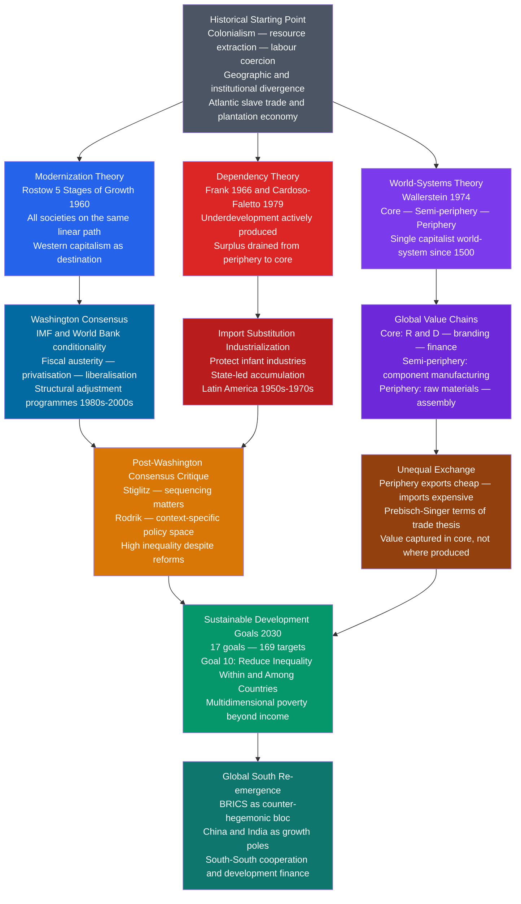

# Global Inequality and Development

> [!abstract] TL;DR
> Global inequality is the structured, historically produced gap in income, life chances, and power between nations and social classes — and the dominant sociological debate is whether development closes that gap or deepens it through the same mechanisms that created it in the first place.

---

## Intuition — analogy FIRST

Think of the world economy as a single factory complex built in the 19th century. Some buildings were constructed as design studios and headquarters — they own the patents, set the prices, and bank the profits. Other buildings were constructed as assembly lines — they provide the labour and raw materials, keep a small wage, and send the rest upward. The design studios are what we now call the Global North; the assembly lines are the Global South.

Modernization theory says the assembly-line workers just need time, training, and some outside investment and they will eventually build their own design studios. Dependency theory says the two buildings were *designed together*: the assembly line is profitable precisely because it cannot become a design studio — if it did, the whole profit structure would collapse. World-systems theory goes further: the factory complex is one integrated system running since the 16th century, and the division of roles is what keeps it running.

The empirical question Branko Milanovic put starkly: whose income actually grew over the three decades of hyper-globalisation from 1988 to 2008? The answer — shaped like an elephant — is the organizing image of this note.

---

## How It Works



---

## Key Concepts / Details

### Secondary Level

**What Is Global Inequality?**

Global inequality refers to the unequal distribution of income, wealth, health, education, and political power across the nations of the world and across social classes within those nations. Two distinct questions must be separated from the start:

- **Between-country inequality**: is the average income gap between rich and poor nations widening or narrowing?
- **Within-country inequality**: inside any given nation, is the gap between rich and poor citizens growing or shrinking?

These two questions can move in opposite directions simultaneously — which is exactly what has happened since 1980. Between-country inequality fell significantly as China, India, and other emerging economies grew rapidly. Within-country inequality rose in most of the world, including in the United States and China themselves.

**Development Measures: Beyond GDP**

For most of the 20th century, "development" meant rising GDP per capita. By the 1990s, it was clear that income alone missed too much:

| Measure | What It Captures | Key Limitation |
|---------|-----------------|---------------|
| GDP per capita | Average economic output per person | Ignores distribution, health, political freedom |
| Human Development Index (HDI) | Income + life expectancy + education | Simple composite; omits inequality and gender gaps |
| Inequality-Adjusted HDI (IHDI) | HDI discounted by actual inequality | Technically demanding; data sparse in poorest countries |
| Multidimensional Poverty Index (MPI) | 10 deprivations across health, education, living standards | Hard to compare across countries and time |
| Sustainable Development Goals (SDGs) | 17 goals, 169 targets: poverty, health, climate, institutions | Most comprehensive; hardest to aggregate into single signal |

**Rostow's Five Stages of Economic Growth**

W. W. Rostow's *The Stages of Economic Growth* (1960) — subtitled "A Non-Communist Manifesto" — proposed that all societies develop through five universal stages:

1. **Traditional society** — subsistence agriculture, rigid hierarchy, limited technology
2. **Pre-conditions for take-off** — external stimulus (trade, colonial contact) begins creating infrastructure and an entrepreneurial class
3. **Take-off** — investment exceeds a critical threshold (~10% of national income); new leading industries emerge; modern institutions form
4. **Drive to maturity** — technology spreads across the whole economy; diversification beyond leading sectors
5. **Age of high mass consumption** — economy reaches sustained high per capita income; demand shifts to consumer durables and services

Rostow's political purpose was explicit: Western aid could help poor countries reach take-off, after which convergence toward liberal capitalism would be natural, avoiding the Communist alternative. The model treats Western modernity as the universal destination and traditional societies as simply "earlier" on the same timeline — a claim dependency theorists would demolish.

**The Sustainable Development Goals**

The SDGs (2015–2030), adopted by all 193 UN member states, replaced the Millennium Development Goals with a more ambitious framework. The SDGs add three dimensions absent from the MDGs:

1. **Environmental sustainability** (Goals 13, 14, 15: climate, oceans, land) — development cannot come at the cost of planetary limits
2. **Inequality within countries** (Goal 10) — not just national averages but distributions
3. **Institutional quality** (Goal 16: Peace, Justice, and Strong Institutions) — acknowledging that governance failures, not just resource gaps, produce poverty

The headline MDG achievement — extreme poverty ($1.90/day) fell from 36% (1990) to 10% (2015) — was driven primarily by China. Sub-Saharan Africa largely missed its MDG targets. The SDGs' lesson: income growth without institutional quality, environmental sustainability, and redistribution does not constitute development.

---

### Undergraduate Level

**Dependency Theory: Frank, Cardoso, and Structural Underdevelopment**

Andre Gunder Frank's *Development of Underdevelopment* (1966) made the foundational provocation: poor countries are not undeveloped (a neutral starting condition) — they are *underdeveloped* (an active past-tense process, done to them by colonial and post-colonial relationships with wealthy core countries). Poverty in the Global South is not a primordial condition awaiting modernization; it was produced by centuries of capital extraction.

The mechanism runs through what Frank calls "metropolis-satellite" chains: a local metropolis (e.g., São Paulo) extracts surplus from its regional satellites (Brazilian hinterland), but is itself a satellite to the international metropolis (New York, London). Surplus flows upward through every link in the chain, concentrating at the top.

Fernando Henrique Cardoso (later President of Brazil) and Enzo Faletto offered a more nuanced "associated-dependent development" in *Dependency and Development in Latin America* (1979). Their argument: some peripheral countries can industrialize within the dependency relationship, but only in forms shaped and constrained by their articulation with core capital. Brazil's industrialization under the military regime was partly financed by multinational FDI and produced genuine growth — but also a highly concentrated income distribution and persistent debt dependency. Development under dependency is real but deformed.

**World-Systems Theory: Wallerstein's Core, Semi-Periphery, Periphery**

Immanuel Wallerstein's *The Modern World-System* (1974) extended dependency analysis to historical capitalism as a whole. The contemporary global order is, in his framework, a single capitalist world-system that has operated since the 16th century. Its structure has three zones:

| Zone | Role in World Economy | Examples (circa 2025) |
|------|----------------------|----------------------|
| Core | High-wage industrial production, finance, R&D, services; capital exporters | US, Germany, Japan, UK, France |
| Semi-periphery | Intermediate industrial capacity; mix of core and periphery functions; political buffer zone | China, Brazil, India, Mexico, South Africa |
| Periphery | Raw material and commodity exporters; labour-intensive low-value assembly; capital importers | Much of sub-Saharan Africa, Central America, South Asia (in parts) |

The semi-periphery is Wallerstein's key analytical innovation over Frank. Semi-peripheral countries are simultaneously exploited by the core and exploit the periphery — this intermediate position makes them politically ambiguous (they may aspire to core status, reducing anti-systemic political pressure) and economically dynamic (some, like South Korea and Taiwan, escaped to genuine core status).

**Unequal Exchange and Global Value Chains**

The Prebisch-Singer thesis (Raul Prebisch at CEPAL, 1950; Hans Singer, 1950 independently) made the structural case for why peripheral economies face a systematic disadvantage: the terms of trade between primary commodities (what peripheral countries export) and manufactured goods (what core countries export) trend downward over time. A ton of copper buys fewer computers in 2020 than in 1960.

This logic now operates through **global value chains (GVCs)**: Apple designs the iPhone in California, sources semiconductors from Taiwan and South Korea, assembles in Foxconn's Chinese factories, and sells worldwide. The breakdown of where value is captured per iPhone sold is roughly:

- Apple's profit margin: ~30-35% of retail price
- US components and design: ~5% of value added
- Japanese and Korean components: ~15%
- Chinese assembly labour: ~1-3% of retail price
- Materials and other: remainder

The country doing the physical manufacturing — China — captures the smallest slice of the value produced there. This is "smile curve" economics: value is concentrated at the two ends (design and branding at one end, retail and services at the other) and minimized in the middle (manufacturing and assembly) — precisely where developing countries are inserted.

**Milanovic's Elephant Curve: Who Won Globalisation?**

Branko Milanovic's *Global Inequality* (2016) presented the defining empirical picture of 1988–2008 globalization: the **elephant curve**. It plots cumulative real income growth against position in the global income distribution, and its shape resembles an elephant:

- **The body (hump at percentiles 10–65)**: 40–80% real income growth. These are the emerging middle classes of China, India, Vietnam, Indonesia, and other fast-growing Asian economies. Hundreds of millions of people moved from $3/day to $10-20/day.
- **The neck (trough at percentiles 75–85)**: 0–20% real income growth. These are the working and lower-middle classes of the developed world — manufacturing workers in the US Rust Belt, industrial workers in Germany and the UK. Globalization's gains largely bypassed them; import competition from China eroded their wage bargaining power.
- **The raised trunk (top 1%)**: 50–70% real income growth. The global wealthy captured an outsized share. The top 1% of the global income distribution is roughly the top 8% of Americans or Europeans — not billionaires alone, but upper-middle-class professionals in wealthy countries.

The curve's political implication: the "losers" of globalisation are not the global poor (who gained significantly) but the lower-middle class in rich countries — the demographic that produced the Trump vote, Brexit, and the rise of nationalist populism across the OECD. This is the distributional politics of globalisation that aggregate growth statistics conceal.

For the period 2008–2020, the elephant flattens somewhat: the great financial crisis and its aftermath slowed gains at most of the distribution. The top 1% hump remains, but the body gains moderately less and the neck trough persists.

**Sen's Capability Approach and the HDI**

Amartya Sen's *Development as Freedom* (1999) offered the philosophical alternative to all GDP-centric frameworks. Sen's central argument: **development is the expansion of substantive freedoms** — the real ability of people to live lives they have reason to value. GDP is not development; it is at best an instrument that may or may not expand those freedoms.

Two key distinctions:
- **Functionings**: the actual states of being and doing a person achieves (being well-nourished, literate, participating in community life)
- **Capabilities**: the real opportunities to achieve those functionings — the substantive freedoms available to a person given their resources, social context, and institutional environment

A country where university education is technically free but women are barred from attending has high formal provision but low female capability. A country where food is abundant in aggregate but where distribution failures mean the poor cannot access it can produce famine amid plenty — Sen's celebrated explanation of why the 1943 Bengal famine (which killed 3 million) occurred despite adequate aggregate food supply. The famine was not a production failure; it was an entitlement failure.

The **Human Development Index** (HDI), developed by Mahbub ul Haq and Sen for the UNDP from 1990, operationalises this framework as a composite of:
1. **Long and healthy life** — life expectancy at birth
2. **Knowledge** — mean years of schooling and expected years of schooling
3. **Decent standard of living** — GNI per capita at PPP

The HDI produces counterintuitive rankings: Cuba ranks higher on HDI than many Latin American countries with much higher GDP per capita. Kerala, India has near-European literacy and life expectancy at incomes $40,000/year lower than the European average. Sri Lanka's HDI outranks every other country in South Asia.

---

### Graduate Level

**Colonialism's Long-Run Effects: The Acemoglu-Robinson Research Programme**

Daron Acemoglu and James Robinson's empirical programme is the dominant framework for explaining persistent global inequality at the graduate level. Their 2001 *American Economic Review* paper, "The Colonial Origins of Comparative Development," makes three claims:

1. **Institutions are the fundamental cause** of income differences across countries — not geography (Diamond's thesis), not culture (Weber's Protestant Ethic), not religion
2. **Colonial institutions were determined by disease environments**: where European settlers could survive (North America, Australia, southern South America), they built *inclusive institutions* — property rights, rule of law, representative governance designed to protect the settlers themselves. Where settler mortality was catastrophic (tropical Africa, the Caribbean), they built *extractive institutions* — designed to harvest resources and coerce labour without settling. Those institutional structures persisted long after decolonization.
3. **Colonial settler mortality** provides a valid instrumental variable for current institutional quality — it is correlated with institutional form through its historical channel, not directly with current income. The IV estimates: institutions explain ~60% of the cross-country income variation.

The extractive/inclusive typology:

| Dimension | Extractive Institutions | Inclusive Institutions |
|-----------|------------------------|----------------------|
| Political power | Concentrated in narrow colonial/post-colonial elite | Broadly distributed under rule of law |
| Economic rights | Insecure property rights; forced labour; monopoly | Secure property rights; competitive markets |
| Growth dynamic | Short-run extraction; long-run stagnation | Creative destruction; innovation; sustained growth |
| Historical examples | Belgian Congo; Haiti under plantation elite | 18th-century Britain after 1688; post-1987 South Korea |

Why do extractive institutions persist after formal colonialism ends? Acemoglu and Robinson identify the mechanism: inclusive economic institutions threaten incumbent elites by redistributing power through market competition and technological disruption ("fear of creative destruction"). The same elites who benefited from extractive economic institutions typically hold the extractive political institutions that could block reform. Only major "critical junctures" — the Black Death disrupting European feudal hierarchy, the 1688 Glorious Revolution shifting Crown-Parliament power balance, or mass political mobilization — can disrupt the lock-in.

**Structural Adjustment and the Washington Consensus Critique**

The Washington Consensus (John Williamson, 1989) was the ten-point policy package the IMF and World Bank applied to developing countries, especially those in Latin American debt crises:

| Policy | Stated Rationale | Empirical Outcome |
|--------|-----------------|-------------------|
| Fiscal discipline | Eliminate deficits; control inflation | Successful on inflation; contractionary during recessions |
| Trade liberalization | Comparative advantage; integration into world markets | Premature deindustrialisation in some cases |
| Capital account liberalization | Efficient global allocation of savings | Hot money flows; serial currency crises (Mexico 1994, Asia 1997, Argentina 2001) |
| Privatization | State enterprises are inefficient | Created private monopolies without regulation |
| Deregulation | Markets self-regulate | Financial deregulation produced fragility, not growth |

Joseph Stiglitz's critique in *Globalization and Its Discontents* (2002): the consensus misunderstood sequencing. Markets require functioning institutions — property rights, contract enforcement, prudential regulation — before liberalization can be welfare-enhancing. Liberalizing capital flows before banking regulation produces crises; privatizing state enterprises before competition policy creates private monopolies. The 1997 Asian financial crisis and the IMF's pro-cyclical contractionary response (raising interest rates and cutting government spending during a depression) became the paradigm case.

The structural sociology reading is sharper: structural adjustment programmes were not simply misguided technical policy. They systematically transferred resources from states in the Global South to creditors in the core. Debt service payments consumed up to 25-30% of government budgets in some African countries during the 1980s-90s, crowding out spending on health, education, and infrastructure. The sociological pattern — austerity borne disproportionately by the poorest within already-poor countries — reproduced within-country inequality while the between-country mechanism drained resources upward to the core.

**Milanovic's Three Waves: A Framework for Global Inequality Dynamics**

Milanovic's *Global Inequality* identifies three distinct eras:

**Era 1 (pre-1820)**: Between-country inequality was low because all countries were roughly equally poor. Within-country inequality was high (extraction by landed aristocracies). The Gini of world income was driven primarily by within-country variation.

**Era 2 (Industrial Revolution to 1990)**: The Great Divergence. Between-country inequality exploded as the Industrial Revolution, concentrated in Northwest Europe and its settler colonies, produced a permanent income gap between industrializing and non-industrializing nations. By 1950, GDP per capita in the richest decile of countries was roughly 15 times that in the poorest decile.

**Era 3 (1990–present)**: Partial convergence. Between-country inequality fell for the first time in two centuries, driven by Chinese, Indian, and Southeast Asian growth. But within-country inequality rose in most nations, including fast-growing ones. The net effect: total global inequality (measured by the world Gini) fell modestly, but the distribution of benefits was politically explosive — producing the elephant curve's characteristic shape.

**Milanovic identifies a "citizenship rent"**: a large fraction of a person's lifetime income is determined not by their skills or effort but by the country they were born into. The median American worker earns more than the 90th percentile worker in Bangladesh simply because of birth location. This citizenship premium is the single largest source of global inequality, dwarfing within-country class differences — a finding that challenges the methodological nationalism of class analysis.

**BRICS, Global South, and the Challenge to Core Hegemony**

The BRICS group (Brazil, Russia, India, China, South Africa — extended to BRICS+ in 2024 with Iran, UAE, Egypt, Ethiopia, Argentina, and Saudi Arabia) represents the first organized challenge to Western-dominated global economic governance since the Non-Aligned Movement of the 1960s.

The key institutional challenges:
- **New Development Bank (NDB)**: BRICS development bank established 2015, offering loans without IMF-style conditionality — providing an exit option from the Washington institutions
- **Belt and Road Initiative (BRI)**: China's infrastructure investment programme across 150+ countries, reshaping global trade routes and offering an alternative to World Bank financing
- **BRICS+ currency proposals**: periodic discussion of a commodity-backed BRICS currency to reduce dependence on the US dollar in trade settlement
- **South-South trade**: trade flows within the Global South now exceed North-South flows for the first time

Whether BRICS represents structural transformation of the world-system (from US hegemony to multipolarity) or merely a renegotiation of positions within the same capitalist world-system is the core Wallersteinian debate. China's ascent to near-core status fits the world-systems model of semi-peripheral mobility: it has not abolished the core-periphery structure but has changed who occupies the semi-periphery and core positions.

The sociological caution: BRICS countries themselves reproduce severe internal inequalities. India has more people in extreme poverty than sub-Saharan Africa. Brazil's Gini coefficient (~0.53) is among the world's highest. South Africa's income inequality (Gini ~0.63, the world's highest measured) is the direct legacy of apartheid's extractive institutional structure. The Global South's emergence as an economic bloc does not automatically translate into improved welfare for the poorest people within those nations.

---

## Python Demo

```python
import numpy as np
import matplotlib.pyplot as plt

# -------------------------------------------------------
# Milanovic Elephant Curve: Simulated Global Income Growth
# by Percentile of World Income Distribution
#
# The "elephant curve" (Milanovic 2016) shows cumulative
# real income growth 1988-2008 at each global percentile.
#
# Characteristic features reproduced here:
#   - Hump at ~50th-60th percentile: emerging-market
#     middle class (China, India, SE Asia) gained 40-80%
#   - Trough at ~75th-85th percentile: developed-world
#     working/lower-middle class gained very little
#   - Spike at ~99th percentile: global top 1% surged
#
# Period 2 (2008-2020) shows a flatter, lower curve
# reflecting financial crisis aftermath; the top-1% spike
# re-emerges, the neck trough persists.
# -------------------------------------------------------

rng = np.random.default_rng(42)
percentile = np.linspace(1, 99, 990)


def elephant_1988_2008(p):
    """
    Simulate 1988-2008 growth curve.
    Three components: emerging-market body hump, developed-world
    neck trough, top-1% trunk spike.
    """
    body = 72 * np.exp(-0.5 * ((p - 52) / 22) ** 2)
    trough = -32 * np.exp(-0.5 * ((p - 80) / 7) ** 2)
    trunk = 58 * np.exp(-0.5 * ((p - 99) / 2.8) ** 2)
    base = 18 * np.exp(-0.5 * ((p - 5) / 18) ** 2)
    return body + trough + trunk + base + 14


def elephant_2008_2020(p):
    """
    Simulate 2008-2020 growth curve.
    Flatter overall; trough persists; trunk smaller than 1988-2008.
    Post-crisis recovery uneven: top recovered faster.
    """
    body = 38 * np.exp(-0.5 * ((p - 58) / 20) ** 2)
    trough = -18 * np.exp(-0.5 * ((p - 83) / 7) ** 2)
    trunk = 42 * np.exp(-0.5 * ((p - 99) / 2.8) ** 2)
    base = 10 * np.exp(-0.5 * ((p - 5) / 18) ** 2)
    return body + trough + trunk + base + 6


growth_a = elephant_1988_2008(percentile)
growth_b = elephant_2008_2020(percentile)

# Add small noise for realism (survey measurement uncertainty)
noise_a = rng.normal(0, 2.0, size=percentile.shape)
noise_b = rng.normal(0, 1.5, size=percentile.shape)
growth_a_noisy = growth_a + noise_a
growth_b_noisy = growth_b + noise_b

# -------------------------------------------------------
# Plot
# -------------------------------------------------------
fig, axes = plt.subplots(1, 2, figsize=(15, 6))
fig.suptitle(
    "Milanovic's Elephant Curve: Global Income Growth by Percentile",
    fontsize=13,
    fontweight="bold",
)

# Left panel: overlaid comparison
ax = axes[0]
ax.plot(
    percentile,
    growth_a_noisy,
    color="#1d4ed8",
    linewidth=2.4,
    label="1988-2008 (Hyper-globalisation era)",
)
ax.plot(
    percentile,
    growth_b_noisy,
    color="#dc2626",
    linewidth=2.4,
    linestyle="--",
    label="2008-2020 (Post-GFC era)",
)
ax.axhline(0, color="black", linewidth=0.8, linestyle=":")
ax.axhline(20, color="gray", linewidth=0.6, linestyle=":", alpha=0.5)

# Annotate key regions
ax.annotate(
    "Emerging-market\nmiddle class\n(China, India, SE Asia)",
    xy=(52, elephant_1988_2008(52)),
    xytext=(38, 95),
    fontsize=8,
    arrowprops=dict(arrowstyle="->", color="#1d4ed8"),
    color="#1d4ed8",
)
ax.annotate(
    "Developed-world\nworking class\n(US Rust Belt, UK Midlands)",
    xy=(80, elephant_1988_2008(80)),
    xytext=(62, -20),
    fontsize=8,
    arrowprops=dict(arrowstyle="->", color="#d97706"),
    color="#d97706",
)
ax.annotate(
    "Global top 1%\n(upper-middle class\nof rich countries)",
    xy=(99, elephant_1988_2008(99)),
    xytext=(83, 100),
    fontsize=8,
    arrowprops=dict(arrowstyle="->", color="#7c3aed"),
    color="#7c3aed",
)

ax.set_xlabel("Global income percentile", fontsize=10)
ax.set_ylabel("Cumulative real income growth (%)", fontsize=10)
ax.set_title("The Elephant Curve: Two Eras of Globalisation")
ax.legend(fontsize=9)
ax.set_xlim(1, 99)
ax.set_ylim(-35, 130)

# Right panel: area-shaded version of 1988-2008
ax2 = axes[1]
ax2.fill_between(
    percentile,
    0,
    growth_a_noisy,
    where=(growth_a_noisy >= 0),
    alpha=0.35,
    color="#1d4ed8",
    label="Positive growth",
)
ax2.fill_between(
    percentile,
    0,
    growth_a_noisy,
    where=(growth_a_noisy < 0),
    alpha=0.45,
    color="#dc2626",
    label="Stagnation / loss",
)
ax2.plot(percentile, growth_a_noisy, color="#1d4ed8", linewidth=2.0)
ax2.axhline(0, color="black", linewidth=1.0)

# Shade sociological zones
ax2.axvspan(5, 65, alpha=0.05, color="green", label="Emerging-market zones")
ax2.axvspan(75, 88, alpha=0.07, color="orange", label="Developed-world working class")
ax2.axvspan(95, 99, alpha=0.07, color="purple", label="Global top 1%")

ax2.set_xlabel("Global income percentile", fontsize=10)
ax2.set_ylabel("Cumulative real income growth (%)", fontsize=10)
ax2.set_title("1988-2008: Shaded Growth Distribution")
ax2.legend(fontsize=8)
ax2.set_xlim(1, 99)
ax2.set_ylim(-35, 130)

plt.tight_layout()
plt.savefig("elephant_curve.png", dpi=150)
plt.show()

# -------------------------------------------------------
# Print summary statistics by zone
# -------------------------------------------------------
zones = [
    ("Very poor (p1-p10)", 1, 10),
    ("Emerging middle class (p11-p65)", 11, 65),
    ("Developed-world lower-middle (p66-p88)", 66, 88),
    ("Upper-middle of rich countries (p89-p98)", 89, 98),
    ("Global top 1pct (p99)", 99, 99),
]

print("Simulated growth by zone — 1988-2008 vs 2008-2020")
print("-" * 75)
header = f"{'Zone':<46} {'1988-2008':>10} {'2008-2020':>10}"
print(header)
print("-" * 75)
for label, lo, hi in zones:
    mask = (percentile >= lo) & (percentile <= hi)
    mean_a = growth_a[mask].mean()
    mean_b = growth_b[mask].mean()
    print(f"{label:<46} {mean_a:>9.1f}% {mean_b:>9.1f}%")
```

**What the chart reveals and why it matters sociologically:**

The elephant's body (percentiles 10–65) corresponds to roughly 2–3 billion people in Asia and elsewhere who experienced real income gains under globalisation. Their growth is the headline achievement of market integration. The neck (percentiles 75–85) corresponds to approximately 200–300 million workers in OECD countries who saw wages stagnate in real terms over 20 years — not because the world got poorer, but because the global labour market integration drove down the return to their specific skills. The trunk (top 1%) reflects the premium on capital ownership and globally mobile skills. The political economy follows directly: the "losers" are not the global poor but the domestic lower-middle class in rich democracies who vote in the elections that shape trade policy. Protectionist populism is a rational distributional response to this curve's shape, not an irrational emotional error.

---

## Real-World Applications

**China's Poverty Reduction: The Body of the Elephant**

China's achievement between 1978 and 2015 — lifting approximately 800 million people above the extreme poverty line — is the single largest poverty reduction event in human history and forms the empirical core of the elephant's body hump. The mechanism was not pure market liberalisation (contra the Washington Consensus) but a distinctive hybrid:

- Agricultural decollectivisation (1978–1982) restored household farming incentives and more than doubled productivity, releasing surplus labour
- Township and Village Enterprises (TVEs) — hybrid public-private firms competing in markets outside the central planning system — drove rural industrialisation
- Special Economic Zones with concentrated FDI and export manufacturing absorbed rural migrants
- "Tournament federalism" — provincial officials evaluated on GDP growth — created intense competition for investment

The sociological cost: China's Gini coefficient rose from ~0.28 in 1980 to ~0.47 by 2010 — among the world's sharpest within-country inequality increases. The country that formed the body of the elephant simultaneously developed one of the world's most unequal internal income distributions. Between-country convergence and within-country divergence occurred simultaneously.

**Sub-Saharan Africa: The Persistent Periphery**

Sub-Saharan Africa's GDP per capita in 1960 (~$300) was roughly equal to East Asia's. By 2020, East Asia averaged ~$12,000 while sub-Saharan Africa averaged ~$1,700. This divergence is the empirical core of the world-systems periphery concept.

Key sociological mechanisms:
- **Colonial institutional inheritance**: where colonizers built extractive institutions (Belgian Congo, Portuguese Mozambique, apartheid South Africa), post-independence states inherited administrative structures designed for extraction, not for building inclusive political economies
- **Resource curse**: oil and mineral wealth in Nigeria, DRC, Angola financed state patronage networks without requiring broad-based taxation, severing the fiscal bargain between rulers and citizens and producing elite capture
- **Structural adjustment effects**: IMF-imposed conditionality in the 1980s-90s required health and education spending cuts precisely when HIV/AIDS was devastating the adult working-age population — a self-reinforcing trap
- **Brain drain**: the most educated Africans migrate to core countries, transferring human capital investment from periphery to core — a contemporary form of unequal exchange

**Bolivia and the 'Pink Tide': Resource Nationalism as Development Strategy**

Bolivia under Evo Morales (2006–2019) represents a dependency theory-informed development experiment. The government nationalized hydrocarbons (Petrobras' Bolivian operations, Glencore's tin and zinc), capturing resource rents for the state rather than allowing repatriation to core MNCs. Revenues financed conditional cash transfers (Bono Juancito Pinto, Bono Juana Azurduy), infrastructure investment, and social spending.

Results: poverty rate fell from 60% (2006) to 35% (2019); extreme poverty from 38% to 15%; Gini coefficient fell from 0.60 to 0.47 — among the sharpest inequality reductions in Latin America during this period. GDP grew at 5%+ annually through 2014. The dependency theory implication: resource nationalism — capturing rents domestically — can fund redistributive development, but only during commodity booms. Bolivia's model strained when commodity prices fell post-2014. The structural dependence on commodity export revenues (what dependency theorists warned about) remained the binding constraint.

---

## Common Pitfalls

- **Conflating between-country and within-country inequality** — These two dimensions moved in opposite directions after 1990. Stating that "global inequality fell" during this period is technically defensible on between-country measures but politically misleading if it ignores the within-country polarization that produced democratic populism in rich countries. Always specify which dimension.

- **Treating modernization theory as empirically falsified** — Rostow's five stages are descriptively falsified as a universal sequence (many countries did not follow the pattern), but the underlying insight — that economic development requires institutional transformation — is consistent with the Acemoglu-Robinson programme. Do not throw out the structural analysis with the linear determinism.

- **Using dependency theory as absolute determinism** — The core-periphery model correctly identifies real mechanisms of surplus extraction and unequal exchange. But it implies that peripheral countries cannot develop within the global capitalist system — which is empirically falsified by South Korea, Taiwan, Singapore, and to a significant degree China. The correct reading: dependency creates strong structural headwinds, not absolute barriers. State capacity and institutional quality determine whether those headwinds can be navigated.

- **Treating the HDI as comprehensive** — The HDI captures three important dimensions but excludes inequality within countries (the IHDI corrects this but is rarely reported), political freedoms, environmental sustainability, and social capital. A country can improve its HDI while increasing Gini, suppressing civil society, and destroying natural capital. The index is a useful first approximation, not a full account of development.

- **Reading the elephant curve as an argument against globalisation** — Milanovic explicitly does not endorse this reading. The curve shows that aggregate gains were large; the problem is distribution. The policy implication is redistribution (progressive taxation, social insurance, portable benefits) not trade closure. Closing the trade channel would primarily harm the emerging-market middle class — the body of the elephant — not help the developed-world working class.

- **Underestimating colonial path dependence** — Students often treat colonial history as analytically remote ("that was 200 years ago"). Acemoglu and Robinson's research design directly tests this: settler mortality in the 18th century, as an instrument for 21st-century institutional quality, explains a substantial fraction of contemporary income variation. The channel is institutional persistence: structures designed to extract are rebuilt after independence around the same logic of extraction, just with different beneficiaries.

- **Conflating BRICS as a cohesive political bloc** — The BRICS countries share the political interest in multipolar global governance but have profoundly different economic structures (China is a trade surplus manufacturing exporter; Brazil is a commodity exporter; Russia is an energy exporter), different political systems, and competing regional interests. Treating BRICS as a unified actor comparable to the EU systematically overstates its institutional coherence.

---

## Related Concepts

- [[Development_Economics]] — the macroeconomic treatment of the same phenomena: Solow model, poverty traps, Washington Consensus, Sachs/Easterly/Duflo; read alongside this note for the formal economic mechanics behind the sociological frameworks developed here
- [[Development_Economics_and_Political_Development]] — the political science treatment: institutions (Acemoglu-Robinson), modernization theory's political implications (Lipset), capability approach (Sen), Washington Consensus critique; directly complementary to this note's sociological framing
- [[Globalization_and_Its_Discontents]] — the political economy of globalisation: Stolper-Samuelson distributional effects, Rodrik's trilemma, the populist backlash; the elephant curve connects these two notes — distributional politics of globalisation runs through both
- [[Solow_Growth_Model]] — the standard growth model underlying poverty trap analysis; conditional convergence vs the empirical Great Divergence is the motivating puzzle for both dependency and institutional theory
- [[International_Relations_Theories]] — dependency theory and world-systems theory are structural Marxist IR theories; the core-periphery model intersects with realist analysis of hegemony and liberal analysis of international institutions
- [[International_Institutions_and_Multilateralism]] — the IMF, World Bank, WTO, and UNCTAD are the principal institutional vehicles of the Washington Consensus; their conditionality, TRIPs, and TRIMs rules directly shape developing country policy space and reproduce or challenge the core-periphery structure
- [[Balance_of_Payments]] — the current account is the mechanism through which terms of trade, capital flight, and debt service operate; unequal exchange runs through the trade and financial account channels
- [[Human_Capital_and_Education]] — Sen's capability approach places education as a primary capability rather than merely an input to GDP; developmental states (South Korea, Cuba) invested in universal education as the primary poverty-exit strategy
- [[Endogenous_Growth_Theory]] — the middle-income trap is precisely the transition from Solow-style capital deepening (exogenous technology) to endogenous innovation; GVC insertion keeps peripheral countries in the replication zone, not the innovation zone
- [[Human_Rights_and_International_Law]] — SDG Goal 16 (Peace, Justice, Strong Institutions) links development to human rights; the capability approach's central capabilities overlap significantly with international human rights norms
- [[Welfare_States_and_Social_Policy]] — the within-country face of global inequality: welfare state retrenchment under structural adjustment in the Global South, and welfare state erosion under fiscal pressure in the OECD, are the domestic political responses to the elephant curve
- [[Global_Order_and_Hegemony]] — US hegemony in the post-1945 order is the political-economic structure within which the Washington Consensus was produced; BRICS' challenge to that hegemony and China's rise are the structural shift in that order
- [[_MOC_Social_Stratification_and_Inequality|↑ Social Stratification MOC]] — section map linking all six notes on stratification, inequality, race, gender, and global development

---

## Review Questions

### Secondary

1. Rostow argued that all countries develop through five stages toward high mass consumption. What is the main sociological criticism of this model, and why do dependency theorists say it misrepresents what actually happened to countries in Africa and Latin America?

2. Amartya Sen argued that famines are caused by entitlement failures, not food shortages. What does this mean? Give an example of a country where high GDP per capita coexists with poor development outcomes on health or education indicators, and explain what Sen's framework says about that situation.

3. The UN replaced the Millennium Development Goals with the Sustainable Development Goals in 2015. Name two SDGs that go beyond income poverty and explain why those dimensions matter for a complete understanding of development.

### Undergraduate

1. Milanovic's elephant curve shows large gains for the emerging-market middle class (percentiles 10–65) and near-stagnation for the developed-world lower-middle class (percentiles 75–85) over 1988–2008. How does the Prebisch-Singer thesis of unequal exchange help explain the trough in the curve? How does the Stolper-Samuelson theorem from trade theory offer an alternative (and complementary) explanation?

2. Wallerstein's world-systems theory uses the concept of semi-periphery to explain why some countries like South Korea and China can escape peripheral status while the overall core-periphery structure persists. Apply this framework: is China's recent ascent evidence that the world-system can be reformed from within, or evidence that the system remains intact but with different actors in each position?

3. Structural adjustment programmes required Global South governments to cut public spending, privatize state enterprises, and liberalize capital accounts in exchange for IMF loans. Using dependency theory and the capability approach together, construct a sociological critique of this policy package that addresses both macro-structural and individual-level effects.

### Graduate

1. Acemoglu, Johnson, and Robinson's colonial settler mortality instrument is designed to identify the causal effect of institutions on income. Explain the instrumental variable logic fully: what are the two conditions a valid instrument must satisfy, why does settler mortality plausibly satisfy them, and what specific threats to the exclusion restriction might challenge their identification strategy? What does their estimate of ~60% of cross-country income variance explained by institutions imply for dependency theory's alternative explanation?

2. Milanovic argues that a person's country of birth is now the single largest determinant of their lifetime income — larger than their class position within their country. If this is true, it implies that global inequality is fundamentally a problem of citizenship and borders rather than class and capitalism. What are the sociological implications for classical Marxist stratification theory? How might world-systems theory and the capability approach each respond to Milanovic's "citizenship rent" finding?

3. The Global South's emergence — China's development, BRICS institutions, South-South trade — is sometimes framed as restructuring the world-system and sometimes as merely reproducing it with different beneficiaries. Drawing on Wallerstein's framework, Acemoglu-Robinson's institutional theory, and the empirical record of within-country inequality in BRICS nations, evaluate which interpretation is better supported. What would constitute decisive evidence for genuine systemic transformation rather than elite rotation?

---

## Sources

- Branko Milanovic, *Global Inequality: A New Approach for the Age of Globalization*, Harvard University Press, 2016
- Immanuel Wallerstein, *The Modern World-System*, Vols. I–III, Academic Press, 1974–1989
- Andre Gunder Frank, *Development of Underdevelopment*, Monthly Review Press, 1966
- Fernando Henrique Cardoso and Enzo Faletto, *Dependency and Development in Latin America*, University of California Press, 1979
- Amartya Sen, *Development as Freedom*, Anchor Books, 1999
- W. W. Rostow, *The Stages of Economic Growth: A Non-Communist Manifesto*, Cambridge University Press, 1960
- Daron Acemoglu, Simon Johnson & James A. Robinson, "The Colonial Origins of Comparative Development," *American Economic Review* 91(5), 2001
- Daron Acemoglu & James A. Robinson, *Why Nations Fail: The Origins of Power, Prosperity, and Poverty*, Crown, 2012
- Joseph Stiglitz, *Globalization and Its Discontents*, W. W. Norton, 2002
- Dani Rodrik, *The Globalization Paradox: Democracy and the Future of the World Economy*, W. W. Norton, 2011
- Raul Prebisch, "The Economic Development of Latin America and Its Principal Problems," CEPAL/ECLA, 1950
- UNDP, *Human Development Report 1990 — Concept and Measurement of Human Development*, Oxford University Press, 1990
- United Nations, *Transforming Our World: The 2030 Agenda for Sustainable Development*, UN General Assembly Resolution A/RES/70/1, 2015
- Branko Milanovic, "Global Income Inequality by the Numbers: In History and Now," World Bank Policy Research Working Paper 6259, 2012
- Ha-Joon Chang, *Kicking Away the Ladder: Development Strategy in Historical Perspective*, Anthem Press, 2002

---

#Sociology #Stratification #GlobalInequality #Development #WorldSystemsTheory #DependencyTheory #ModernizationTheory #CapabilityApproach #ElephantCurve #WashingtonConsensus
