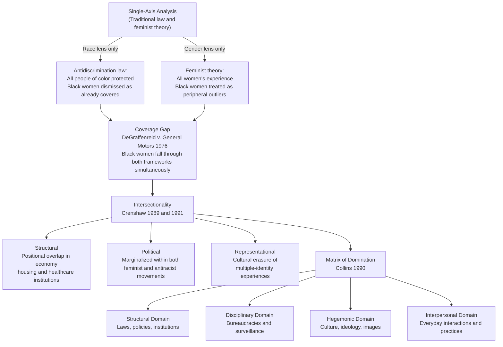

# Intersectionality

> [!abstract] TL;DR
> Intersectionality — introduced by Kimberlé Crenshaw in 1989 and elaborated by Patricia Hill Collins — holds that race, gender, class, and sexuality are not independent axes of disadvantage that stack additively; they are interlocking systems of power that produce qualitatively distinct forms of oppression at their intersections, invisible to any single-axis analysis.

---

## Intuition

**Analogy:** Imagine a road intersection where two streams of traffic collide. If you study only the north-south road and only the east-west road in isolation, you will never understand the pile-up at the crossing. You must study the intersection itself, because that is where the collision actually occurs — and the collision has properties that neither road alone can explain.

This is Crenshaw's insight applied to social identity. Black women in the United States do not experience "racism plus sexism as two separate forces." They experience a specific form of oppression that arises *at the intersection* — one that is invisible to antidiscrimination law when it looks only at race (which compares Black women to Black men and finds no discrimination) or only at gender (which compares Black women to white women and finds no discrimination). The harm is real; both frameworks look past it because neither is looking at the intersection.

---

## How It Works



---

## Key Concepts

### Secondary Level

**What is intersectionality, and why does it matter?**

When we describe a person's social position, we normally name one characteristic at a time: "she is a woman," "he is Black," "they are working class." The assumption built into this language is that each characteristic operates independently — that being a woman means the same thing regardless of race, that being Black means the same thing regardless of gender.

Intersectionality challenges that assumption. The theory holds that multiple social identities — race, gender, class, sexuality, disability, nationality — do not operate as parallel tracks but as interlocking systems that shape each other. A Black woman does not experience a "Black experience" plus a "women's experience" as separate modules. She experiences a *specific social location* — one with its own history, its own forms of vulnerability, its own forms of resistance — that cannot be derived by adding up the parts.

**The legal origin: DeGraffenreid v. General Motors (1976)**

General Motors had a seniority-based layoff system that disproportionately eliminated Black women employees because GM had not hired any Black women before 1964. Five Black women sued for employment discrimination. The court dismissed their claim: there was no racial discrimination because GM employed Black men, and there was no sex discrimination because GM employed white women. The category "Black women" was not recognized as a protected class in its own right.

Crenshaw used this case in her 1989 paper "Demarginalizing the Intersection of Race and Sex" to show that single-axis legal frameworks create systematic blind spots. The harm Black women experienced was real; neither framework could see it because neither was designed to look at the intersection. The women who suffered most were rendered legally invisible.

**Peggy McIntosh and White Privilege (1989)**

In the same year as Crenshaw's paper, Peggy McIntosh published "White Privilege: Unpacking the Invisible Knapsack," a personal essay cataloguing the unearned daily privileges that white Americans carry without noticing — being able to buy a house in any neighborhood, seeing oneself represented in textbooks, not being followed in stores. The essay contributed the concept of an **invisible knapsack**: the bundle of unearned advantages that privilege confers, which the privileged party typically cannot see precisely because advantage is the absence of obstacles rather than a visible benefit. McIntosh's contribution was phenomenological and pedagogical rather than strictly theoretical, but it complemented intersectionality by making the experiential dimension of structural privilege concrete and teachable.

---

### Undergraduate Level

**Crenshaw's Three Types of Intersectionality (1991)**

In her second major paper, "Mapping the Margins: Intersectionality, Identity Politics, and Violence Against Women of Color," Crenshaw distinguished three analytical forms:

| Type | Definition | Example |
|---|---|---|
| **Structural intersectionality** | The way in which multiply marginalized people occupy a *position* at the convergence of multiple systems — the concrete material conditions of that location | A Black woman in poverty who faces domestic violence encounters shelters built around white middle-class assumptions about housing, employment, and immigration status; her needs fall through every program's gaps |
| **Political intersectionality** | The way in which multiply marginalized people are pulled between political movements that do not fully represent their interests | Feminist movements historically centered white women's concerns; antiracist movements historically centered Black men's concerns; Black women were politically homeless in both |
| **Representational intersectionality** | The way in which cultural narratives, images, and representations erase or distort multiply marginalized identities | The "strong Black woman" trope obscures vulnerability and discourages help-seeking; the "welfare queen" stereotype combines racism and sexism to delegitimize claims on public resources |

**Patricia Hill Collins: The Matrix of Domination**

Collins' 1990 *Black Feminist Thought* introduced the **matrix of domination** — the overarching structure by which intersecting oppressions are organized and maintained. Where Crenshaw's account was primarily legal and political, Collins' was sociological and philosophical: she argued that race, class, gender, and sexuality are not merely parallel systems but *mutually constructing* ones. You cannot understand American racism without understanding how it is gendered; you cannot understand American sexism without understanding how it is racialized.

Collins organized domination into **four domains of power**:

| Domain | Description | Example |
|---|---|---|
| **Structural** | Macro-level institutions and policies that reproduce inequality | Racially segregated housing producing wealth gaps across generations |
| **Disciplinary** | Bureaucratic rules and surveillance that manage and normalize inequality | Drug sentencing policies that produce racially disparate incarceration |
| **Hegemonic** | Cultural ideology, media, and education that naturalize hierarchy | School curricula that center white history as "universal" history |
| **Interpersonal** | Everyday practices, microaggressions, and social interactions | Being followed in a store; being assumed to be the cleaner, not the doctor |

The matrix metaphor is deliberate: it suggests a grid of interlocking power relations that no single individual inhabits from only one cell. A Black middle-class woman has privilege along the class axis while facing oppression along race and gender axes; a white working-class man faces class disadvantage while enjoying race and gender privilege. No one stands entirely outside the matrix; everyone is positioned within it, simultaneously oppressor and oppressed in different dimensions.

**Standpoint Epistemology**

Collins extended this into a philosophy of knowledge. Drawing on Sandra Harding and others, she argued that social location shapes what one can know — not as a bias to be corrected, but as a potential epistemic *resource*. The experience of living at a marginalized intersection gives Black women particular insight into the workings of power that dominant groups, precisely because they are unharmed by those workings, systematically fail to see.

This is **standpoint epistemology**: knowledge is situated, and the view from the margin — the "outsider within" (Collins' term for Black women employed as domestic workers inside white households) — is often more accurate about social structure than the view from the center, because those at the margin must understand both their own world and the dominant world to survive, while those at the center can remain ignorant of the margin.

**Additive vs. Multiplicative Models of Disadvantage**

A common error is to think intersectionality simply means adding up penalties: a 17% gender pay gap plus an 18% racial pay gap equals a 35% gap for Black women. This **additive model** is what single-axis thinking produces by default. Research consistently shows this is wrong in two directions:

1. **Multiplicative interaction**: The correct statistical model is multiplicative, not additive. If white men earn $1.00, white women earn $(1 - 0.17) = $0.83, Black men earn $(1 - 0.18) = $0.82$, then the additive model predicts Black women earn $(1 - 0.35) = $0.65$. The multiplicative model predicts $0.83 \times 0.82 \approx $0.68. Neither matches the actual figure, which in most studies is lower than the multiplicative prediction — indicating an **intersectional surplus penalty** that exceeds what any single-axis model predicts.

2. **Qualitative distinctiveness**: Beyond the numbers, the *form* of discrimination differs. A Black woman's job interview involves race-gendered scripts (the "strong Black woman" trope, assumptions about professionalism rooted in white female norms) that cannot be decomposed into "race stuff" + "gender stuff." The intersection produces its own social logic.

---

### Graduate Level

**Intersectionality as Methodology**

McCall (2005) distinguished three methodological approaches that use intersectionality:

- **Anticategorical complexity**: deconstruct all social categories as fictional simplifications of fluid social reality; reject race, gender, and class as analytical tools because they reproduce the categories they study
- **Intracategorical complexity**: focus on groups at the intersection of multiple categories, using their specific experience to trouble the stability of each category (Crenshaw's original move)
- **Intercategorical complexity**: provisionally accept existing categories and use them to measure *relationships* of inequality across multiple axes simultaneously (the approach best suited to large-scale quantitative research)

Most empirical intersectionality research now employs intercategorical methods — using regression interaction terms, intersectional stratification matrices, or multilevel modeling — to test whether the effect of one axis (e.g., gender) differs across levels of another (e.g., race). The key methodological insight is that main effects and interaction terms are not separable: reporting a "gender gap" that averages across all racial groups conceals as much as it reveals.

**Critiques: Too Many Axes?**

The most sustained methodological critique of intersectionality is the "infinity problem" (Walby, 2007; Nash, 2008): if any number of axes can be added — age, disability, sexuality, religion, immigration status, body size — the framework risks analytical paralysis. Without a principled account of which axes matter in which contexts, intersectionality becomes unfalsifiable: any outcome can be attributed to some unchecked intersection.

Defenders respond that intersectionality does not require all axes simultaneously; it requires sensitivity to which axes *are* producing outcomes in a specific institutional context. This is an empirical question, not a theoretical one. The appropriate response to the infinity problem is not to abandon intersectional analysis but to design research that specifies which intersections are hypothesized to matter and why.

**Identity Politics vs. Structural Analysis**

A recurring debate concerns whether intersectionality is primarily a tool for structural analysis (as Crenshaw and Collins intended) or for identity politics (as it is often deployed in popular culture and some activist spaces). Crenshaw has repeatedly emphasized the structural dimension: the original purpose was to expose how legal and organizational structures are designed around the "most privileged member" of marginalized groups, rendering multiply marginalized people invisible. The critique of "identity politics" misreads this as pure subjectivism or competitive victimhood Olympics, when the actual argument is about institutional design and organizational accountability.

Collins extended this in *Intersectionality as Critical Social Theory* (2019): intersectionality is most powerful as a critical social theory — a framework for analyzing how power operates — not merely as a personal identity map. The danger of the identity-politics reading is that it individualizes what is structurally produced: replacing systemic analysis with diversity optics, hiring quotas without addressing structural barriers, or treating representation in elite spaces as equivalent to justice for the multiply marginalized majority.

**Intersectionality and Criminal Justice**

Crenshaw's work expanded into what she called the "structural intersectionality of violence" — particularly the way in which Black women's experience of violence (from police, from partners) is rendered invisible by both anti-police-brutality movements (which center Black men) and domestic violence movements (which center white women). The #SayHerName campaign (2015), co-founded by Crenshaw, applied intersectional analysis directly to police killings: Sandra Bland, Breonna Taylor, and other Black women killed by police received substantially less media coverage and protest mobilization than comparable cases involving Black men, despite the same structural cause. This is political intersectionality in action: the very movements that should advocate for multiply marginalized people systematically erase them.

---

## Python Demo

```python
import numpy as np
import matplotlib.pyplot as plt

rng = np.random.default_rng(42)
n = 6000

# Approximate wage penalties from U.S. labor market research (CPS-based studies)
# Race penalty: Black workers earn ~18% less than comparable white workers
# Gender penalty: Women earn ~17% less than comparable men
baseline_log_mean = np.log(65_000)   # white male median ~$65k
baseline_log_std = 0.48

race_penalty   = 0.18
gender_penalty = 0.17
# "Intersectional surplus penalty": Black women earn ~5% less than the
# multiplicative model alone would predict (documented in several wage studies)
surplus_penalty = 0.05

def sample_wages(log_mean, log_std, size):
    return rng.lognormal(log_mean, log_std, size)

# --- Four observed groups ---
white_men   = sample_wages(baseline_log_mean, baseline_log_std, n)
white_women = sample_wages(baseline_log_mean + np.log(1 - gender_penalty), baseline_log_std, n)
black_men   = sample_wages(baseline_log_mean + np.log(1 - race_penalty),   baseline_log_std, n)

# Additive model prediction for Black women
additive_factor = 1 - (race_penalty + gender_penalty)
bw_additive     = sample_wages(baseline_log_mean + np.log(additive_factor), baseline_log_std, n)

# Multiplicative model prediction for Black women
multi_factor = (1 - race_penalty) * (1 - gender_penalty)
bw_multi     = sample_wages(baseline_log_mean + np.log(multi_factor), baseline_log_std, n)

# Intersectional model: multiplicative + surplus penalty
inter_factor = multi_factor * (1 - surplus_penalty)
bw_inter     = sample_wages(baseline_log_mean + np.log(inter_factor), baseline_log_std, n)

# -----------------------------------------------------------------------
groups = {
    "White men (baseline)":          (white_men,   "#1d4ed8"),
    "White women (gender only)":     (white_women, "#7c3aed"),
    "Black men (race only)":         (black_men,   "#16a34a"),
    "BW — additive model":           (bw_additive, "#f59e0b"),
    "BW — multiplicative model":     (bw_multi,    "#ef4444"),
    "BW — intersectional model":     (bw_inter,    "#991b1b"),
}

medians   = {label: np.median(w) / 1_000 for label, (w, _) in groups.items()}
colors    = [c for _, (_, c) in groups.items()]
wages_all = [w for _, (w, _) in groups.items()]

fig, (ax1, ax2) = plt.subplots(1, 2, figsize=(14, 6))

# --- Panel 1: Overlapping wage distributions ---
bins = np.linspace(0, 250_000, 100)
for label, (wages, color) in groups.items():
    ax1.hist(wages, bins=bins, density=True, alpha=0.45, color=color, label=label)
ax1.set_xlabel("Annual Wage ($)", fontsize=11)
ax1.set_ylabel("Density", fontsize=11)
ax1.set_title("Wage Distributions: Additive vs. Multiplicative\nvs. Intersectional Model", fontsize=11, fontweight="bold")
ax1.set_xlim(0, 220_000)
ax1.legend(fontsize=7.5, loc="upper right")

# --- Panel 2: Median wages bar chart ---
labels_short = [
    "White\nMen",
    "White\nWomen",
    "Black\nMen",
    "BW\n(Additive)",
    "BW\n(Mult.)",
    "BW\n(Intersect.)",
]
bars = ax2.bar(labels_short, medians.values(), color=colors, edgecolor="white", linewidth=1.5)
baseline_median = np.median(white_men) / 1_000
ax2.axhline(baseline_median, color="#1d4ed8", linestyle="--", linewidth=1.2, alpha=0.6,
            label=f"White male median (${baseline_median:.0f}k)")
for bar, val in zip(bars, medians.values()):
    pct = 100 * val / baseline_median
    ax2.text(bar.get_x() + bar.get_width() / 2, val + 0.4,
             f"${val:.0f}k\n({pct:.0f}%)", ha="center", va="bottom", fontsize=8)
ax2.set_ylabel("Median Annual Wage ($k)", fontsize=11)
ax2.set_title("Additive vs. Multiplicative vs. Intersectional\nWage Gap (Black Women)", fontsize=11, fontweight="bold")
ax2.set_ylim(0, max(medians.values()) * 1.22)
ax2.legend(fontsize=9)

# Annotate the gap between multiplicative and intersectional predictions
bw_mult_median  = list(medians.values())[4]
bw_inter_median = list(medians.values())[5]
ax2.annotate(
    f"Surplus\npenalty\n({surplus_penalty*100:.0f}%)",
    xy=(4.5, (bw_mult_median + bw_inter_median) / 2),
    xytext=(5.3, (bw_mult_median + bw_inter_median) / 2 + 2),
    fontsize=8, color="#991b1b",
    arrowprops=dict(arrowstyle="->", color="#991b1b", lw=1.2),
)

plt.tight_layout()
plt.savefig("intersectionality_wage_models.png", dpi=150)
plt.show()

# --- Summary table ---
print(f"\n{'Group':<30} {'Median Wage':>12} {'% of White Male':>17}")
print("-" * 62)
wm_median = np.median(white_men)
for label, (wages, _) in groups.items():
    m = np.median(wages)
    print(f"{label:<30} ${m:>10,.0f} {100*m/wm_median:>15.1f}%")
```

---

## Real-World Applications

> **Health Disparities — Maternal Mortality in the United States**: Black women in the U.S. die from pregnancy-related causes at three to four times the rate of white women, a gap that persists even after controlling for income and education. A pure gender-analysis would attribute maternal mortality to being female; a pure race-analysis would attribute it to being Black. An intersectional analysis reveals a specific mechanism: Black women's reported pain and symptoms are systematically underestimated by providers (a documented racial bias), *combined with* the fact that women's pain is systematically underestimated relative to men's (a documented gender bias), producing a compound clinical failure that kills at a rate that neither bias alone predicts.

> **Labor Market — The "Concrete Ceiling" for Women of Color**: Research on corporate leadership consistently finds that white women face a "glass ceiling" (visible barrier to advancement); women of color face what researchers call a "concrete ceiling" — barriers so dense they are nearly impermeable. The mechanisms differ: white women are often excluded via "maternal wall" discrimination; Black and Latina women face additional stereotyping about professional competence and "cultural fit." The intersectional analysis reveals that diversity initiatives targeting "women" often benefit primarily white women while leaving women of color at structurally lower levels.

> **Criminal Justice — Sentencing Disparities**: Sentencing research shows that Black men receive the longest sentences for equivalent offenses; white women receive the shortest. Black women and Latina women receive sentences intermediate between these extremes — but the pattern is not simply the average of race and gender effects. Spohn (2014) and others show that judges apply "substantial assistance" departures and "first offender" consideration in patterns that are simultaneously raced and gendered: Black women are less likely than white women to receive downward departures even when they cooperate with prosecutors, and more likely than Black men to receive them, producing a distinctive intersectional sentencing profile that no single-axis analysis captures.

> **Education — Stereotype Threat at the Intersection**: Stereotype threat research (see [[Prejudice_and_Discrimination]]) typically studies race or gender separately. Intersectional studies find that Black girls in mathematics face a double threat: both the "girls are bad at math" stereotype and the "Black students are less academically capable" stereotype can be activated simultaneously. The compound threat is qualitatively different, not merely additive — teachers' expectations, peer dynamics, and self-concept are all shaped by the full intersectional position, not by two independent stereotype-threat activations running in parallel.

---

## Common Pitfalls

- **The additive fallacy** — assuming that Black women's disadvantage equals the "race gap" plus the "gender gap." The interaction term is almost always statistically significant and substantively meaningful. Research designs that include only main effects will systematically misspecify the model and underestimate harm at intersections.

- **Representation as a substitute for structural analysis** — celebrating the appointment of a Black woman to a senior role as evidence that intersectionality has been "solved" conflates individual mobility with structural change. Collins is explicit: intersectionality is not primarily about individual identity but about how *institutions* distribute power and vulnerability. Diversity optics without structural reform reproduces the matrix of domination under more palatable cover.

- **The infinite-regress trap** — rejecting intersectionality because "there will always be another axis" misunderstands the theory's purpose. Intersectionality does not require analysis of every possible axis; it requires specifying which axes are structurally salient in a given context and why. Failure to make this specification is a researcher's error, not a deficiency in the framework.

- **Conflating intersectionality with identity politics** — in popular usage, "intersectionality" often refers to a competition among identity groups for recognition or resources. In its theoretical form, intersectionality is a structural critique of how institutions are designed to protect the most privileged members of each marginalized category, not a framework for personal identity navigation. Reducing Crenshaw's argument to "I have more marginalization points" fundamentally distorts both the theory and the political project.

- **Ignoring historical specificity** — intersectionality emerged from a specific context (Black women in U.S. law) and named historically constituted systems (American racial capitalism and patriarchy). Applying it globally without attention to how different societies configure race, gender, class, and their intersections risks both analytical imprecision and a kind of theoretical imperialism. Brazilian racial categories, South Asian caste-gender intersections, and European class-ethnicity dynamics each require intersectional analysis that is *context-specific*, not a universal formula.

- **Single-axis standpoint epistemology** — accepting Collins' standpoint claim (marginalized groups have distinctive epistemic access) without the intersectional modification risks reifying "the Black experience" or "the woman's perspective" as internally homogeneous. Standpoint epistemology is itself intersectional: it is *Black women's* standpoint, shaped by their specific location, not an undifferentiated subaltern voice.

---

## Related Concepts

- [[Prejudice_and_Discrimination]] — Stereotype threat, implicit bias, and institutional discrimination are the psychological and organizational mechanisms through which intersectional disadvantage is reproduced; the contact hypothesis is insufficient when the groups in contact have intersectionally different power positions
- [[Group_Dynamics]] — Social identity theory and in-group/out-group effects explain why intersectional identities are contested within as well as between groups; the "out-group homogeneity" effect is compounded when a person belongs to multiple out-groups simultaneously
- [[Contemporary_Political_Ideologies]] — Social dominance orientation (SDO) and right-wing authoritarianism (RWA) are the ideological carriers that legitimate the matrix of domination at the political level; intersectionality explains why feminist and antiracist movements sometimes pursue contradictory political agendas
- [[Political_Participation_and_Civil_Society]] — Political intersectionality explains the distinctive mobilization challenges facing Black women and other multiply marginalized groups: neither feminist nor antiracist movements fully represent their interests, producing participation gaps that resource mobilization theory alone cannot explain
- [[Welfare_States_and_Social_Policy]] — Welfare states are designed around an implicit normative subject (typically the white male breadwinner in Esping-Andersen's typology); intersectionality reveals how social policy reproduces structural disadvantage when program eligibility, benefit calculation, and delivery mechanisms assume this default subject
- [[Socialism_Marxism_and_Communism]] — Collins explicitly engages with Marxist analysis while critiquing its class reductionism: the matrix of domination retains capitalism as a central axis but insists that race and gender are not mere epiphenomena of class but independently constitutive systems of power that capitalism exploits without producing
- [[_MOC_Social_Stratification_and_Inequality|↑ Social Stratification MOC]] — section map linking all six notes on stratification, inequality, race, gender, and global development

---

## Review Questions

### Secondary

1. Explain in your own words why a legal framework that protects "Black people" and also protects "women" could still fail to protect Black women. Use the DeGraffenreid case as your example.
2. What is the difference between saying "Black women face racism AND sexism" (additive model) and saying "Black women face a form of oppression that cannot be reduced to racism plus sexism" (intersectional model)? Give one example from health, education, or employment that illustrates the difference.
3. Peggy McIntosh argues that privilege is often invisible to those who have it. Why would this be true? Use the "invisible knapsack" metaphor to explain what white privilege means structurally, not just individually.

### Undergraduate

1. Crenshaw distinguishes three types of intersectionality: structural, political, and representational. For *one* contemporary issue (e.g., reproductive rights, immigration enforcement, or workplace safety), identify and analyze all three types, explaining how each dimension of intersectionality produces a distinct form of harm for a specific doubly or triply marginalized group.
2. Collins' matrix of domination proposes four domains of power: structural, disciplinary, hegemonic, and interpersonal. Critically evaluate whether this framework is compatible with Weberian stratification theory (which emphasizes class, status, and party as distinct dimensions) or whether it represents a fundamentally different approach to understanding social inequality.
3. Research consistently finds that the "intersectional surplus penalty" means that Black women's wages fall *below* what either the additive or multiplicative model predicts from race and gender gaps alone. Design a study to test three rival hypotheses explaining this surplus: (a) customer-side discrimination, (b) occupational segregation into lower-paying intersectional niches, and (c) reduced returns to education at the intersection. What data would you need? What methods?

### Graduate

1. McCall (2005) distinguishes anticategorical, intracategorical, and intercategorical approaches to intersectional research. Critically evaluate each approach's ability to address Walby's "infinity problem" — the proliferation of axes without a principled stopping rule. Which approach is most useful for large-scale comparative research, and what ontological assumptions does it require?
2. Collins argues that standpoint epistemology — the view that social location shapes epistemic access to structural knowledge — is essential to intersectional theory. Critically evaluate two objections: (a) the relativism objection (if all knowledge is situated, there is no standpoint-independent criterion for evaluating competing situated claims), and (b) the essentialism objection (invoking "Black women's standpoint" risks homogenizing a diverse group). Does Collins' framework successfully answer these objections?
3. Crenshaw argues that intersectionality is a structural critique, not an identity politics framework; critics argue that it has been captured by identity politics in ways that individualize and depoliticize structural analysis. Using specific empirical cases (e.g., corporate diversity programs, university DEI initiatives, or feminist movement strategy), assess whether this capture has in fact occurred, and evaluate what — if anything — preserves the structural critical edge of the theory against such capture.

---

## Sources

- [Crenshaw, K. (1989). "Demarginalizing the Intersection of Race and Sex" — Chicago Unbound](https://chicagounbound.uchicago.edu/uclf/vol1989/iss1/8/)
- [Crenshaw on Intersectionality, More than Two Decades Later — Columbia Law School](https://www.law.columbia.edu/news/archive/kimberle-crenshaw-intersectionality-more-two-decades-later)
- [Intersectionality — Britannica](https://www.britannica.com/topic/intersectionality)
- [Patricia Hill Collins: Intersecting Oppressions — SAGE (PDF)](https://uk.sagepub.com/sites/default/files/upm-binaries/13299_Chapter_16_Web_Byte_Patricia_Hill_Collins.pdf)
- [Matrix of Domination and Four Domains of Power — Black Feminisms](https://blackfeminisms.com/matrix/)
- [Intersectionality and Labor Market Wage Gaps — Washington Center for Equitable Growth (PDF)](https://equitablegrowth.org/wp-content/uploads/2018/07/080718-WP-intersectionality-labor-market.pdf)
- [Intersectionality of the Gender Wage Gap — Healthcare Professionals Scoping Review (PMC)](https://pmc.ncbi.nlm.nih.gov/articles/PMC11817435/)
- [EDITORIAL INTRODUCTION: Mapping the Movements of a Theory (Intersectionality) — UCLA (PDF)](https://sites.psych.ucla.edu/britecenter/wp-content/uploads/sites/9/2011/01/INTERSECTIONALITY-Mapping-the-Movements-of-a-Theory.pdf)

---

#Sociology #Stratification #Intersectionality #Inequality
