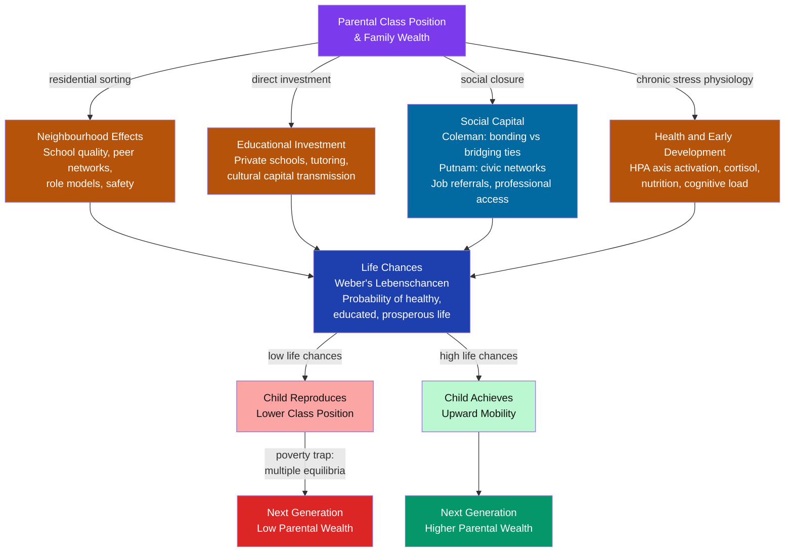

# Poverty, Social Mobility, and Life Chances

> [!abstract] TL;DR
> Poverty is both an absolute condition (inability to meet basic needs) and a relative social position (exclusion from the living standards normal to one's society). Weber's concept of **life chances** frames it as a probability distribution: your class position shapes the odds of being healthy, educated, and prosperous. Social mobility — the movement between class positions across or within a lifetime — is measured by the **intergenerational earnings elasticity (IGE)**. The **Great Gatsby Curve** (Corak 2013) reveals a striking empirical regularity: countries with higher income inequality have lower intergenerational mobility. The Nordic countries combine low inequality with high mobility; the US and UK combine high inequality with low mobility. Poverty reproduces itself not through individual character flaws but through compounding structural mechanisms: segregated neighbourhoods, unequal schools, thin social networks, and corrosive chronic stress.

---

## Intuition

**Analogy:** Imagine two hotels. In the first, the lifts work and the concierge knows everyone — arriving on the ground floor is a temporary inconvenience; with effort you ride to any floor. In the second, the lifts are broken, the staircases are guarded, and the only way to move floors is to know someone already there. In both hotels, the management insists the building is a meritocracy. The difference is not the residents' ambition — it is whether the infrastructure of opportunity actually connects the floors.

Social class is that infrastructure. Poverty is not simply a shortage of money — it is a concentration of compounding disadvantages (poor schools, unsafe neighbourhoods, weak job networks, chronic stress, criminal records) that make upward movement structurally improbable even for motivated individuals. Life chances are the probabilities the infrastructure assigns you at birth.

---

## How It Works

### Core Mechanics

The reproduction of poverty across generations operates through five interlocking channels:

1. **Residential sorting** — High housing costs in high-opportunity areas concentrate the poor in low-resource neighbourhoods. School quality, safety, peer networks, and role model availability all track neighbourhood composition.
2. **Educational investment gaps** — Wealthier families spend more on private schooling, tutoring, extracurriculars, and university application support. Cultural capital (Bourdieu) — the tacit knowledge of how institutions work — is transmitted informally at home.
3. **Social capital asymmetry** — Coleman's distinction between bonding capital (close-knit ties within a group) and bridging capital (weak ties connecting across groups) matters crucially. Bridging ties carry non-redundant information — job openings, professional introductions — and are concentrated among the middle and upper classes.
4. **Health and cognitive development** — Chronic poverty activates the HPA axis persistently. Elevated cortisol during early childhood impairs hippocampal development, working memory, and executive function. Poor nutrition and lead exposure have direct neurological effects. These are not character deficiencies — they are physiological consequences of resource scarcity during critical developmental windows.
5. **Criminal justice intersection** — A criminal record creates a formal barrier to employment, housing, and professional licensing. In the US, mass incarceration falls disproportionately on low-income Black men, directly interrupting earnings trajectories and family stability.

### Flow / Architecture



---

## Key Concepts

### Secondary Level

**Absolute vs relative poverty.** Absolute poverty is defined by a fixed material threshold: the resources needed to survive — food, shelter, clothing, healthcare. The World Bank's international poverty line ($2.15/day in 2022 PPP) is an absolute measure designed for cross-country comparison of extreme deprivation. Relative poverty is defined in relation to the distribution within a society — typically income below 50% or 60% of the national median. A person who would not be absolutely poor in Sub-Saharan Africa may be relatively poor in Norway. Both measures matter: absolute poverty tells us about survival; relative poverty tells us about social exclusion, participation, and dignity. Peter Townsend argued that poverty is inherently relative — it is an inability to participate in the customs and activities normal in one's society.

**Weber's life chances (Lebenschancen).** Max Weber introduced life chances as a sociological concept distinct from Marx's class: whereas Marx defined class by relationship to the means of production (owner vs worker), Weber defined class by market position — by the differential ability to command resources in the market. Life chances are not about what you have now but about your objective probability of future access to scarce goods — health, longevity, education, housing, legal protection. They are probabilistic and structured: the same social position, repeated across thousands of people, produces systematically different distributions of outcomes. This framing makes poverty a statistical property of social positions, not just a personal misfortune.

**Types of social mobility.** Sociologists distinguish:
- **Intergenerational mobility** — comparison between a parent's and their child's class position (the most-studied form).
- **Intragenerational mobility** — movement within a single person's career or lifetime.
- **Vertical mobility** — movement up or down the class hierarchy.
- **Horizontal mobility** — movement between positions at the same level (e.g., changing industry without changing status).
- **Absolute mobility** — the net change in the class distribution when the overall class structure changes (more professionals exist, so more people become professional — structural mobility). Absolute mobility has been high in post-war decades as economies shifted from manufacturing to professional services.
- **Relative mobility** — odds ratios comparing the likelihood of reaching a given class from different origins, *after* controlling for structural change. Relative mobility measures whether the system is genuinely fluid or whether parents' class still predicts children's class.

### Undergraduate Level

**The Culture of Poverty thesis and its critics.** Oscar Lewis coined "culture of poverty" in 1959 to describe a set of attitudes — fatalism, present orientation, distrust of institutions — that he observed among poor families in Mexico and Puerto Rico. Lewis himself framed these adaptations as rational responses to poverty, but the concept was rapidly misappropriated. Edward Banfield (1970) and later Charles Murray (1984, *Losing Ground*) recast these attitudes as the cause of poverty rather than its product — arguing that welfare programmes reinforced pathological values. William Julius Wilson's *The Truly Disadvantaged* (1987) offered a structural counter: the deindustrialisation of American cities destroyed the employment base of Black working-class communities, producing concentrated poverty that generated genuine changes in neighbourhood norms — but the cause was economic restructuring, not culture. Critics (Wacquant, Small) argue that "culture of poverty" and the related term "underclass" shift analytical attention from structural causes (discrimination, deindustrialisation, residential segregation) to individual character, conveniently locating the problem inside the poor themselves.

**The Great Gatsby Curve.** Economist Miles Corak (2013) named and formalised the empirical relationship between income inequality (Gini coefficient) and intergenerational earnings elasticity (IGE). The **IGE** measures how much of a parent's income position is transmitted to the child: an IGE of 0.5 means a 10% higher parental income is associated with a 5% higher child income. Low IGE = high mobility; high IGE = low mobility.

The curve shows that unequal societies have persistently low mobility:

| Country | Gini (approx.) | IGE (approx.) |
|---------|----------------|----------------|
| Denmark | 0.25 | 0.15 |
| Canada | 0.32 | 0.19 |
| Germany | 0.31 | 0.32 |
| UK | 0.34 | 0.50 |
| USA | 0.39 | 0.45 |
| Italy | 0.35 | 0.50 |
| Peru | 0.47 | 0.67 |

The mechanism: high inequality raises the stakes of staying in one's class (greater distance between top and bottom) and simultaneously increases the return to investing in keeping your children at the top, making the winners more willing to use social closure, private schools, and political influence to preserve their position.

**Social capital and mobility.** James Coleman (1988) distinguished bonding capital (dense, trust-based ties within a homogeneous group) from bridging capital (weaker ties across group boundaries). For mobility, bridging capital is the decisive resource: it carries job information, professional introductions, and access to institutions that closed networks do not provide. Robert Putnam (*Bowling Alone*, 2000) documented the decline of civic participation in the US since the 1960s, arguing that eroding social capital hits the poor hardest because they cannot substitute private alternatives. The rich manufacture their own bridging capital through alumni networks, professional associations, and charitable boards. The poor, segregated in neighbourhoods with limited bridging ties, face a network penalty on top of all other disadvantages.

**The meritocracy myth.** Michael Young coined "meritocracy" in a 1958 satirical novel, *The Rise of the Meritocracy*, imagining a dystopia where the clever and the well-born become identical and the system's victims cannot even contest their position — because their inferiority has been scientifically certified. The term was adopted without irony. Michael Sandel (*The Tyranny of Merit*, 2020) argues that meritocratic ideology performs two harms: it tells winners they deserve their position (encouraging hubris) and tells losers they deserve their position too (generating shame rather than solidarity). The empirical question — whether actual social position reflects merit rather than birth — is answered by the IGE data above: in the US, about 45% of income advantage is transmitted from parent to child, substantially more than zero. If the system were purely meritocratic, the IGE would be near zero (the relevant ability of parents would not predict children's outcomes after controlling for children's own ability). The persistence of IGE above zero means that birth matters, that resources flow to the already-resourced, and that meritocracy as actually practised is substantially a legitimating ideology.

### Graduate Level

**Poverty traps as multiple equilibria.** Formally, a poverty trap is a self-reinforcing low-income equilibrium. In Solow-model terms: if the effective saving rate at very low incomes falls below the break-even investment rate (δ + n)k — because households must consume almost all income to survive — the capital accumulation curve lies below the break-even line for k < k*, creating a stable low-income steady state alongside a high-income steady state. An individual trapped below k* cannot save their way out; they need an exogenous push (credit, transfer, or public investment) to cross the threshold.

At the individual level, the mechanism is cognitive bandwidth. Mullainathan and Shafir (*Scarcity*, 2013) demonstrate experimentally that scarcity taxes mental bandwidth: the cognitive load of managing financial shortfall — juggling bills, anticipating eviction — reduces effective IQ-equivalent scores on unrelated tests by ~13 points. This is not an innate property of the poor; it is a property of the condition of scarcity. It produces short-termism, increased error rates, and reduced impulse control — behaviours that culture-of-poverty theorists misread as stable character traits.

**Measuring structural vs exchange mobility.** The Erikson-Goldthorpe-Portocarero (EGP) class schema distinguishes structural mobility (changes due to shifts in the class structure — more professional positions becoming available over time) from exchange mobility (true fluidity — equal probability of reaching any class from any origin). The **odds ratio** is the standard measure of exchange mobility: if P(reaching class A from class A origin) / P(reaching class B from class A origin) = [P(reaching class A from class B origin) / P(reaching class B from class B origin)], then there is perfect exchange mobility. Real odds ratios are always greater than one — the children of professionals are always more likely to become professionals than children of manual workers, even after removing all structural effects. Comparative research (Breen & Goldthorpe 1997) found that while absolute mobility increased across OECD countries in the post-war period, relative mobility (exchange mobility) remained surprisingly stable — a finding called "Featherman-Jones-Hauser conjecture."

**Neighbourhood effects: the Moving to Opportunity experiment.** William Julius Wilson's *The Truly Disadvantaged* (1987) argued that neighbourhood-level concentrated poverty — not individual culture — is the key mechanism: isolation from employed role models, overburdened schools, and high violence create compounding disadvantages independent of family income. Raj Chetty, Nathaniel Hendren, and Lawrence Katz's analysis of the Moving to Opportunity (MTO) natural experiment (2016) provided causal evidence: children who moved to lower-poverty neighbourhoods before age 13 had substantially higher earnings as adults (approximately 31% higher), higher rates of university attendance, and lower rates of single parenthood. Children who moved after age 13 showed no effect. The evidence implies there is a critical developmental window during which neighbourhood context has permanent effects on life chances — and that the mechanism is not just family income but the quality of the surrounding environment.

**The Nordic model of high mobility.** Denmark, Sweden, and Norway combine the world's lowest Ginis with the lowest IGEs. The mechanisms are mutually reinforcing:
- Universal, high-quality publicly funded childcare from infancy compresses the developmental head start of wealthy families.
- Comprehensive, relatively homogeneous public schools reduce the within-country variance in educational quality.
- Active labour market policies (retraining, job placement) reduce the duration and cost of unemployment transitions.
- Universal healthcare removes the poverty-inducing effect of medical catastrophe.
- Compressed wage structures reduce the return to inheritance of parental position.

This is not simply redistribution after the fact but structural compression of inequality before it compounds. The result: an IGE of approximately 0.15 in Denmark compared with 0.45 in the US — meaning a Danish child born to poor parents has roughly three times the probability of escaping poverty than an American one.

---

## Python Demo

```python
# Simulate intergenerational mobility as a Markov chain.
# Transition matrices calibrated to empirical IGE data:
#   US  ~0.45 (Corak 2013), UK ~0.50 (Blanden et al. 2004), Denmark ~0.15
# Three classes: Lower, Middle, Upper (each ~ 1/3 of income distribution).
# Row = parent class; Column = child class.
# T[i,j] = P(child ends in class j | parent in class i).
# Run 10 generations from an equal starting distribution;
# compute the stationary distribution (long-run steady state).

import numpy as np
import matplotlib.pyplot as plt

rng = np.random.default_rng(seed=42)

CLASSES = ["Lower", "Middle", "Upper"]
N_GEN = 10

# --- Transition matrices ---
# More persistent diagonal  = lower mobility (higher IGE)
# More uniform rows = higher mobility (lower IGE)

T_us = np.array([
    [0.42, 0.36, 0.22],   # Lower-class parents
    [0.24, 0.47, 0.29],   # Middle-class parents
    [0.11, 0.33, 0.56],   # Upper-class parents
])

T_uk = np.array([
    [0.38, 0.37, 0.25],
    [0.22, 0.46, 0.32],
    [0.12, 0.36, 0.52],
])

T_dk = np.array([
    [0.26, 0.43, 0.31],
    [0.20, 0.44, 0.36],
    [0.15, 0.42, 0.43],
])

# Verify rows sum to 1
for name, T in [("US", T_us), ("UK", T_uk), ("Denmark", T_dk)]:
    assert np.allclose(T.sum(axis=1), 1.0), f"Row sums != 1 for {name}"

def stationary_distribution(T: np.ndarray) -> np.ndarray:
    """Solve pi @ T = pi, sum(pi) = 1 using eigenvector decomposition."""
    # Left eigenvectors: (T^T) v = lambda v
    eigenvalues, eigenvectors = np.linalg.eig(T.T)
    # Stationary distribution corresponds to eigenvalue closest to 1
    idx = np.argmin(np.abs(eigenvalues - 1.0))
    pi = eigenvectors[:, idx].real
    pi = np.abs(pi)
    return pi / pi.sum()

def simulate_generations(T: np.ndarray, start: np.ndarray, n_gen: int) -> np.ndarray:
    """Iterate the Markov chain for n_gen generations.
    Returns array of shape (n_gen+1, 3)."""
    trajectory = [start.copy()]
    pi = start.copy()
    for _ in range(n_gen):
        pi = pi @ T
        trajectory.append(pi.copy())
    return np.array(trajectory)

# Equal starting distribution: 1/3 in each class
start = np.array([1/3, 1/3, 1/3])

regimes = {
    "USA": T_us,
    "UK":  T_uk,
    "Denmark": T_dk,
}
colors_regime = {"USA": "#dc2626", "UK": "#b45309", "Denmark": "#0369a1"}
labels_class  = ["Lower", "Middle", "Upper"]
colors_class  = ["#ef4444", "#f59e0b", "#10b981"]

trajectories = {name: simulate_generations(T, start, N_GEN)
                for name, T in regimes.items()}
stationaries = {name: stationary_distribution(T)
                for name, T in regimes.items()}

# --- Print summary ---
print("Stationary class distributions (long-run steady state)\n")
print(f"{'Country':<12} {'Lower':>8} {'Middle':>8} {'Upper':>8}")
print("-" * 40)
for name, pi in stationaries.items():
    print(f"{name:<12} {pi[0]:>7.1%} {pi[1]:>8.1%} {pi[2]:>8.1%}")

print("\nProbability of escaping lower class (child of lower-class parent)")
print(f"{'Country':<12} {'P(stay Lower)':>14} {'P(reach Upper)':>15}")
print("-" * 45)
for name, T in regimes.items():
    print(f"{name:<12} {T[0,0]:>13.1%} {T[0,2]:>14.1%}")

# --- Visualisation ---
fig, axes = plt.subplots(1, 3, figsize=(17, 5))

# Panel 1: Class trajectories per regime (share of Lower class over generations)
ax1 = axes[0]
for name, traj in trajectories.items():
    ax1.plot(range(N_GEN + 1), traj[:, 0],
             color=colors_regime[name], lw=2.5, marker="o", ms=5, label=name)
ax1.axhline(1/3, color="gray", ls="--", lw=1, label="Equal baseline (1/3)")
ax1.set_title("Share in Lower Class Over Generations\n(starting from equal distribution)")
ax1.set_xlabel("Generation")
ax1.set_ylabel("Share of Population in Lower Class")
ax1.set_xlim(0, N_GEN)
ax1.set_ylim(0, 0.55)
ax1.legend(fontsize=9)
ax1.grid(alpha=0.3)

# Panel 2: Stationary distribution (grouped bar chart)
ax2 = axes[1]
x = np.arange(len(CLASSES))
w = 0.28
offsets = [-w, 0, w]
for i, (name, pi) in enumerate(stationaries.items()):
    bars = ax2.bar(x + offsets[i], pi, w, label=name,
                   color=colors_regime[name], alpha=0.85, zorder=3)
    for bar in bars:
        ax2.text(bar.get_x() + bar.get_width() / 2,
                 bar.get_height() + 0.005,
                 f"{bar.get_height():.1%}",
                 ha="center", va="bottom", fontsize=7.5)
ax2.axhline(1/3, color="gray", ls="--", lw=1, label="Perfect equality (1/3)")
ax2.set_xticks(x)
ax2.set_xticklabels(CLASSES)
ax2.set_ylabel("Steady-State Class Share")
ax2.set_title("Stationary Distribution by Mobility Regime\n(long-run class composition)")
ax2.set_ylim(0, 0.65)
ax2.legend(fontsize=9)
ax2.grid(axis="y", alpha=0.3)

# Panel 3: Great Gatsby Curve (stylized scatter)
# Empirical Gini and IGE values from Corak (2013) and OECD
ggc_countries = {
    "Denmark":    (0.25, 0.15),
    "Norway":     (0.26, 0.17),
    "Finland":    (0.27, 0.18),
    "Canada":     (0.32, 0.19),
    "Germany":    (0.31, 0.32),
    "France":     (0.33, 0.41),
    "UK":         (0.34, 0.50),
    "USA":        (0.39, 0.45),
    "Italy":      (0.35, 0.50),
    "Brazil":     (0.52, 0.58),
    "Peru":       (0.47, 0.67),
}
highlight = {"Denmark", "UK", "USA"}
ax3 = axes[2]
for country, (gini, ige) in ggc_countries.items():
    color = "#0369a1" if country == "Denmark" else \
            "#b45309" if country == "UK" else \
            "#dc2626" if country == "USA" else "#94a3b8"
    size  = 140 if country in highlight else 70
    ax3.scatter(gini, ige, s=size, color=color, zorder=5, alpha=0.9)
    offset = (0.003, 0.015) if country not in {"Italy", "France"} else (0.003, -0.03)
    ax3.annotate(country, xy=(gini, ige),
                 xytext=(gini + offset[0], ige + offset[1]),
                 fontsize=8, color=color, fontweight="bold" if country in highlight else "normal")

# Trend line
ginis = np.array([v[0] for v in ggc_countries.values()])
iges  = np.array([v[1] for v in ggc_countries.values()])
m, b  = np.polyfit(ginis, iges, 1)
xs = np.linspace(ginis.min() - 0.02, ginis.max() + 0.02, 100)
ax3.plot(xs, m * xs + b, "k--", lw=1.5, alpha=0.5, label=f"Linear fit (slope={m:.2f})")
ax3.set_xlabel("Income Inequality (Gini Coefficient)")
ax3.set_ylabel("Intergenerational Earnings Elasticity (IGE)\n(higher = lower mobility)")
ax3.set_title("The Great Gatsby Curve\n(Corak 2013: inequality predicts immobility)")
ax3.set_xlim(0.22, 0.56)
ax3.set_ylim(0.10, 0.75)
ax3.legend(fontsize=8)
ax3.grid(alpha=0.3)

fig.suptitle(
    "Intergenerational Mobility: Markov Chain Simulation and the Great Gatsby Curve",
    fontsize=13, fontweight="bold", y=1.02
)
plt.tight_layout()
plt.savefig("mobility_simulation.png", dpi=150, bbox_inches="tight")
plt.show()
print("\nFigure saved to mobility_simulation.png")
```

**Reading the output.** The stationary distribution panel shows that even starting from equal class shares, the US and UK converge to a distribution with a higher lower-class share than Denmark — the immobility baked into the transition matrix concentrates people at the bottom. The Great Gatsby Curve panel reproduces the empirical pattern from Corak (2013): countries like Denmark with low Ginis have low IGEs; countries like the US and UK with higher Ginis have higher IGEs. The Markov chain formalism makes precise what "mobility regime" means: it is the complete matrix of transition probabilities, and its stationary distribution is the class structure the society is drifting toward if the regime persists.

---

## Real-World Applications

**1. The "American Dream" vs the data.** The US has the highest per-capita income and self-reported belief in meritocracy among OECD nations, yet its IGE (~0.45) is among the highest in the developed world. Raj Chetty's large-scale analysis of US tax records (*Equality of Opportunity Project*) found that a child born in the bottom income quintile has only an 8% chance of reaching the top quintile — but this probability varies enormously by geography: Salt Lake City (11%) vs Charlotte, NC (4%). The spatial variation implicates neighbourhood effects and local school quality, not individual variation in ambition, as the primary determinant of mobility outcomes.

**2. Denmark and the high-mobility model.** Denmark maintains an IGE of approximately 0.15 — meaning only 15% of income advantage is transmitted from parent to child, compared with 45% in the US. Denmark also has a Gini of approximately 0.25 and spends about 30% of GDP on social services. The mechanism is not redistribution alone: Denmark's universal childcare from age 1, compressed public school quality, free university education, and active labour market retraining all operate *before* income inequality can compound into life-chance inequality. The result: poverty is not spatially concentrated, school quality is not postcode-determined, and a child born to a cleaner has genuine probability of becoming a doctor.

**3. Moving to Opportunity experiment.** The MTO experiment (1994–1998) randomly assigned housing vouchers to families in high-poverty US neighbourhoods, allowing some to move to low-poverty areas. Chetty, Hendren, and Katz (2016) found that children who moved before age 13 earned 31% more as adults than the control group. Children who moved later showed no earnings benefit. The experiment provides rare causal evidence that neighbourhood environment — not just family income or parenting — shapes life chances during a specific developmental window.

**4. Conditional cash transfers and the human capital channel.** Brazil's *Bolsa Família* programme (2003–present) transfers cash to low-income families on the condition that children maintain school attendance and vaccination schedules. Evaluations show that it reduced extreme poverty from 8% to below 4%, increased secondary school completion by 4–6 percentage points, and produced measurable improvements in next-generation earnings. It works not by changing culture but by relieving the bandwidth tax of scarcity and directly funding the human capital investment that mobility requires.

---

## Common Pitfalls

- **Confusing absolute and relative mobility** — Post-war economic growth produced large absolute mobility gains: more professional jobs were created, so more people became professionals. But relative mobility (odds ratios) has remained stubbornly stable across generations in most OECD countries. Politicians who celebrate the fact that "more people are reaching the middle class than ever before" may be describing structural change in the class distribution, not genuine fluidity in the system.

- **Treating culture as a cause rather than a consequence** — Longitudinal studies consistently show that so-called "cultural" attributes of poverty (short-termism, distrust, reduced aspiration) appear *after* economic stress, not before it. Mullainathan and Shafir's bandwidth research makes this experimentally clear: the same person exhibits poorer decision-making under scarcity. Attributing poverty to cultural pathology inverts the causal arrow.

- **Assuming high inequality necessarily causes low mobility** — The Great Gatsby Curve is a correlation across countries, not a controlled experiment. Confounders include institutional quality, ethnic heterogeneity, and policy history. The curve is consistent with multiple mechanisms (returns to family investment, social closure, political economy of public education funding) — it tells us the relationship is robust but not which mechanism dominates in a specific context.

- **Ignoring non-income dimensions of poverty** — Amartya Sen's capability approach (*Development as Freedom*, 1999) argues that income is an instrumental means, not an end. What matters is the set of functionings a person can achieve — being healthy, being educated, participating in social life, having personal dignity. Two people with the same income may have very different capabilities if one faces discrimination, disability, or care obligations. Poverty measurement that tracks only income misses capability deprivation that income cannot fully capture.

- **Using cross-sectional snapshots to infer mobility** — Poverty rates at a point in time do not reveal how long individuals spend in poverty or how often they move in and out. Panel data (tracking the same individuals over time) shows that poverty in developed countries is more transient for some groups and more permanent for others. The long-term poor are a distinct group with compounded disadvantages; the episodically poor are a larger group experiencing temporary shocks. Policy designed for one group may be poorly suited to the other.

---

## Related Concepts

- [[Development_Economics]] — poverty traps at the national level mirror individual-level traps; Sachs's Big Push theory and the multiple-equilibria Solow framework are the macroeconomic counterpart to this note's individual-level mobility analysis.
- [[Human_Capital_and_Education]] — education is the primary mechanism through which life chances are transmitted across generations; the Mincerian return to schooling directly quantifies how educational investment translates into income mobility.
- [[Welfare_States_and_Social_Policy]] — Esping-Andersen's regime typology explains why the Nordic social democratic model produces high mobility and low inequality while the liberal US/UK model produces the opposite; decommodification is the structural complement to life chances.
- [[Development_Economics_and_Political_Development]] — Sen's capability approach and the human development index (HDI) provide the political-economy framework for operationalising life chances beyond income; institutions as the fundamental cause of both national poverty and intergenerational immobility.
- [[Stress_and_Coping]] — chronic poverty activates the HPA axis, elevating cortisol and impairing the cognitive and emotional regulation that mobility requires; the biology of allostatic load makes poverty a physiological condition, not merely an economic one.
- [[Maslows_Hierarchy]] — the deficiency-need structure (physiological → safety → belonging → esteem → self-actualisation) maps directly onto the barriers to mobility: people expending cognitive and material resources meeting physiological and safety needs have less capacity available for the goal-directed behaviour that mobility requires.
- [[Lifespan_Development]] — Bronfenbrenner's ecological systems model and the concept of developmental microsystems provide the framework for understanding how neighbourhood, school, and peer effects operate on children across developmental stages.
- [[Attachment_Theory]] — socioeconomic stress disrupts parental sensitivity and attachment security; secure attachment predicts better cognitive and socio-emotional outcomes in school, providing one pathway through which poverty transmits disadvantage across generations.
- [[Socialism_Marxism_and_Communism]] — Marx's original class analysis (ownership of means of production as the fundamental determinant of life chances) is the intellectual precursor; Weber's life chances concept extended and partly refuted Marx by disaggregating status and party from economic class.
- [[Liberalism_and_Its_Variants]] — the debate between equality of opportunity (formal liberalism) and equality of outcome (social liberalism and rawlsianism) maps onto the meritocracy debate; Rawls' difference principle provides the philosophical foundation for welfare state redistribution that reduces life-chance inequality.
- [[_MOC_Social_Stratification_and_Inequality|↑ Social Stratification MOC]] — section map linking all six notes on stratification, inequality, race, gender, and global development

---

## Review Questions

### Secondary

1. A government official argues that poverty in your country is "absolute" — everyone can afford food and shelter — so poverty is no longer a serious problem. What concept would you use to challenge this claim, and why might relative poverty still matter even when absolute deprivation has been eliminated?
2. Your classmate says social mobility is low because poor people "don't try hard enough." Using Weber's concept of life chances and at least two structural mechanisms from this note, construct a response.
3. What is the difference between intergenerational and intragenerational mobility? Give a concrete example of each.

### Undergraduate

1. Miles Corak's Great Gatsby Curve shows that countries with higher income inequality have lower intergenerational mobility (higher IGE). Identify two distinct mechanisms through which high inequality could reduce mobility — one operating through the labour market and one through spatial or educational sorting — and assess the evidence for each.
2. The Culture of Poverty thesis (Lewis) and the structural/neighbourhood explanation (Wilson, Chetty) both explain the persistence of poverty, but they locate the cause differently. How would each perspective evaluate a policy of unconditional cash transfers to poor families? Which prediction is better supported by the evidence from *Bolsa Família* and the *Moving to Opportunity* experiment?
3. Coleman distinguished bonding capital from bridging capital. Explain why the distribution of bridging capital across social classes reinforces inequality even when formal discrimination is illegal and when all children have equal access to formal education.

### Graduate

1. The Markov chain model of intergenerational mobility produces a stationary distribution that depends entirely on the transition matrix. A country's long-run class structure therefore reflects its current mobility regime. What does this imply for the interpretation of cross-sectional poverty statistics? And what combination of policy interventions would most efficiently shift the US transition matrix toward the Danish one — focusing specifically on which off-diagonal elements to target?
2. Mullainathan and Shafir's bandwidth theory implies that the cognitive shortcomings attributed to the "culture of poverty" are a *consequence* of scarcity rather than its cause. If this is correct, what does it imply for the design of anti-poverty policy? Specifically, contrast a bandwidth-informed policy architecture with a human capital investment architecture (e.g., conditional cash transfers vs unconditional cash transfers vs educational subsidies), and evaluate what evidence would distinguish between them.
3. The "Featherman-Jones-Hauser conjecture" holds that relative mobility (measured by odds ratios) is trendless across industrialised countries and over time, even as absolute mobility has risen. Evaluate this conjecture critically: what methodological choices (class schema, income vs occupation, son-only vs gender-inclusive studies) affect the result? Does the conjecture imply that rising inequality since the 1980s has had no effect on relative mobility — and if so, should we expect a lag before the Great Gatsby Curve relationship manifests in within-country mobility trends?

---

## Sources

- [Miles Corak, "Income Inequality, Equality of Opportunity, and Intergenerational Mobility," *Journal of Economic Perspectives*, 2013](https://pubs.aeaweb.org/doi/10.1257/jep.27.3.79)
- [Raj Chetty, Nathaniel Hendren & Lawrence Katz, "The Effects of Exposure to Better Neighborhoods on Children," *American Economic Review*, 2016](https://www.aeaweb.org/articles?id=10.1257/aer.20150572)
- [Sendhil Mullainathan & Eldar Shafir, *Scarcity: Why Having Too Little Means So Much*, 2013 — Henry Holt](https://us.macmillan.com/books/9780805092646/scarcity)
- [William Julius Wilson, *The Truly Disadvantaged: The Inner City, the Underclass, and Public Policy*, University of Chicago Press, 1987](https://press.uchicago.edu/ucp/books/book/chicago/T/bo13375722.html)
- [Robert D. Putnam, *Bowling Alone: The Collapse and Revival of American Community*, Simon & Schuster, 2000](https://www.simonandschuster.com/books/Bowling-Alone/Robert-D-Putnam/9780743203043)
- [Michael J. Sandel, *The Tyranny of Merit: What's Become of the Common Good?*, Farrar, Straus and Giroux, 2020](https://us.macmillan.com/books/9780374289980/thetyrannyofmerit)
- [James S. Coleman, "Social Capital in the Creation of Human Capital," *American Journal of Sociology*, 1988](https://www.jstor.org/stable/2780243)
- [Amartya Sen, *Development as Freedom*, Oxford University Press, 1999](https://global.oup.com/academic/product/development-as-freedom-9780192893307)
- [Great Gatsby Curve — Miles Corak's research page](https://milescorak.com/research/great-gatsby-curve/)
- [Raj Chetty et al., "Where is the Land of Opportunity? The Geography of Intergenerational Mobility in the United States," *Quarterly Journal of Economics*, 2014](https://academic.oup.com/qje/article/129/4/1553/1853754)

---

#Sociology #Stratification #Poverty #SocialMobility #LifeChances
