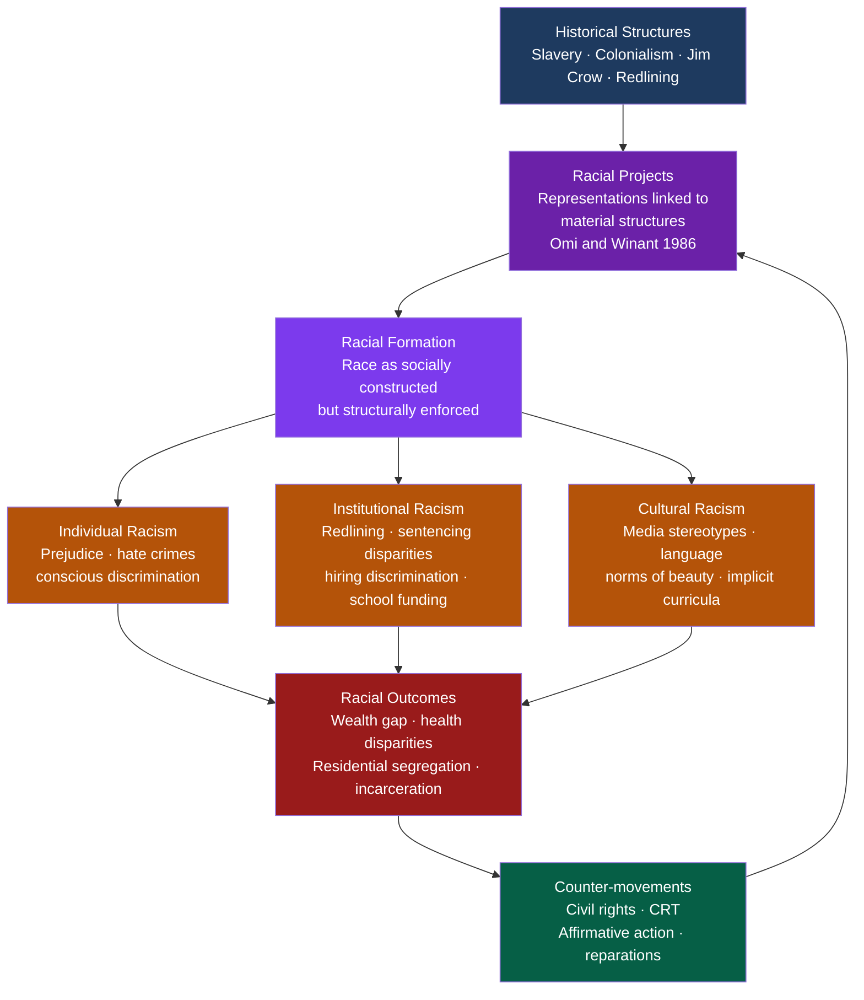

# Race, Ethnicity, and Racism

> [!abstract] TL;DR
> Race is a socially constructed classification system — not a biological reality — whose categories were produced through history, politics, and law, yet whose material consequences (wealth gaps, health disparities, residential segregation) are entirely real. Racism operates at three levels — individual, institutional, and cultural — and its most durable contemporary form is "colorblind racism": the denial that race still matters, even as race-neutral policies perpetuate racial hierarchy.

---

## Intuition

**Analogy:** Imagine a board game that ran for 300 years under explicit rules that let one team accumulate property, capital, and political power while forbidding others from doing the same. Then, after 1965, those explicit rules were removed — but the accumulated advantages and disadvantages remained, and some of the old rules were replaced by new rules that looked neutral while producing the same distribution. If you arrived at the board game in 2025 and saw one team winning decisively, you might conclude they were simply better players. The players who got there in 1700 know the history of the rules.

Race works exactly like that game. The racial categories themselves are not natural kinds — no genetic test cleanly separates races, and "racial" clusters shift dramatically depending on what cultural context you are in. But the game that those categories organized is real, and the positions agents occupy on the board today are direct products of the game's rules across centuries. Racism is not primarily a matter of individual hatred; it is the structural inheritance of a long game.

---

## How It Works



---

## Key Concepts

### Secondary Level

**Race vs Ethnicity vs Nationality**

These three terms are routinely conflated but refer to distinct phenomena:

| Concept | Basis | Examples | Key feature |
|---------|-------|----------|-------------|
| **Race** | Perceived physical traits (skin color, hair) assigned social meaning | "Black," "White," "Asian" in US census | Externally imposed; hierarchically organized |
| **Ethnicity** | Shared culture, ancestry, language, religion, history | Irish-American, Yoruba, Han Chinese | More self-defined; can be claimed or hidden |
| **Nationality** | Legal citizenship in a nation-state | American, Brazilian, German | Formal-legal; can be changed |

The distinctions matter because race is primarily about power and hierarchy — it is not how you identify yourself but how you are categorized by institutions and other people. Ethnicity is more about cultural community. The two are not independent: racial categories in the US often absorbed diverse ethnic groups (Irish, Italian, and Jewish immigrants became "white" over the 20th century as they gained social acceptance).

**Race as Social Construction**

A social construction is a category that exists because people believe it exists and act on it — it is not given by nature but produced by collective agreement and institutional practice. Race is social in this sense: there are no clean genetic boundaries between racial groups. Human genetic variation is continuous, and more genetic variation exists within so-called racial groups than between them.

But "socially constructed" does not mean "unreal." Money is also a social construction, yet its consequences are entirely real. Race is real in the sense that W.I. Thomas articulated in 1928: *if people define situations as real, they are real in their consequences.* Racial categories determine who gets hired, who gets a loan, who gets stopped by police, and who is treated gently by a doctor.

**Three Levels of Racism**

- **Individual racism** — conscious or unconscious prejudice and discriminatory behavior by individuals (slurs, violence, biased hiring decisions, refusing to rent to someone).
- **Institutional (structural) racism** — policies, laws, and organizational practices that systematically disadvantage racial groups without requiring individual racist intent. The classic case: zip-code-based school funding. Schools in wealthy (disproportionately white) neighborhoods receive more funding per pupil through property taxes. No single person need be racist for this outcome to persist and compound.
- **Cultural racism** — the embedding of racial hierarchy in cultural representations, language, aesthetics, and norms (who is depicted as intelligent vs. dangerous in media, whose history is taught as universal, whose aesthetic standards are treated as neutral).

**Du Bois' Double Consciousness and the Veil**

W.E.B. Du Bois introduced "double consciousness" in *The Souls of Black Folk* (1903) to describe the experience of Black Americans who must see themselves through two lenses simultaneously: their own sense of self and the distorting, diminishing lens of the dominant white society. He wrote of the "two-ness" — being both an American and a Black person — as an "unreconciled striving" that extracts psychological costs no white American faces.

The "Veil" is Du Bois's spatial metaphor for the color line — a barrier that prevents the Black subject from being seen as a full human being, and that prevents the white subject from truly seeing those who live behind it. Double consciousness is not just an individual experience; it is a diagnostic for how racial hierarchy warps selfhood.

---

### Undergraduate Level

**Racial Formation Theory (Omi and Winant, 1986/2014)**

Michael Omi and Howard Winant argue that race is neither an illusion to be transcended nor a fixed biological fact. It is a *formation* — an ongoing sociohistorical process by which racial meanings are created, contested, transformed, and institutionalized.

The key analytic unit is the **racial project**: a simultaneous interpretation of racial meanings AND a reorganization of material resources along racial lines. Every racial claim is both representational (it says what race "means") and distributive (it shapes who gets what). A racial project can be hegemonic (reinforcing the existing racial order) or oppositional (challenging it).

**Racial formation** is the accumulation of racial projects over time. The US racial order was not designed in a single moment; it is the product of centuries of racial projects: the slave codes, the one-drop rule, the Indian Removal Act, redlining, immigration exclusion acts, affirmative action, and colorblind law are all racial projects that together constitute the current formation.

**Colorblind Racism (Bonilla-Silva)**

Eduardo Bonilla-Silva's *Racism Without Racists* (2003, 5th ed. 2022) argues that post-Civil Rights America developed a new racial ideology: **colorblind racism**, which denies that race is relevant while reproducing racial inequality through ostensibly neutral mechanisms.

Bonilla-Silva identifies four ideological frames of colorblind racism:

| Frame | Core claim | Example |
|-------|-----------|---------|
| **Abstract liberalism** | "I believe in equal opportunity; any remaining disparities are due to individual choices" | "I don't see why we need affirmative action — just work harder" |
| **Naturalization** | "Racial separation happens naturally because people prefer their own kind" | "It's just natural that people self-segregate in neighborhoods" |
| **Cultural racism** | "The problem is their culture, not racism" | "The achievement gap is about family values, not discrimination" |
| **Minimization of racism** | "Racism is no longer a significant factor; it was bad before but not now" | "Things are so much better since the Civil Rights Act; we've moved past it" |

The power of colorblind racism is that it can be expressed by people who genuinely believe they have no racial prejudice. Because it locates disparities in individual behavior and culture rather than structure, it produces the same distributional outcomes as explicit racism while immunizing itself against the charge of being racist.

**Ethnicity and Boundary-Making (Fredrik Barth)**

The Norwegian anthropologist Fredrik Barth argued in *Ethnic Groups and Boundaries* (1969) that ethnicity is not defined by the cultural content inside a group but by the *boundary* between groups. What makes an ethnic group is the ongoing social process of distinction — the practices by which members signal who is inside and who is outside.

This boundary-making approach has three important implications:
1. Ethnic boundaries can persist even when cultural content changes substantially (Irish-Americans today share little cultural life with 19th-century Famine-era immigrants, but the ethnic identity persists).
2. Ethnic identities are situational — the same person may emphasize different ethnic identities in different social contexts.
3. Ethnic groups are not primordial givens; they are produced and reproduced through active social work.

**Aversive Racism**

Samuel Gaertner and John Dovidio describe aversive racism as a form common among people who explicitly endorse egalitarian values but harbor unconscious implicit bias. The "aversive" racist discriminates not openly but in ambiguous situations where non-racial justifications are available — so that their self-image as non-racist remains intact.

Classic experimental finding: white evaluators rated a Black candidate lower than an equally qualified white candidate when the résumé was weak (providing cover for a rejection), but *not* when the résumé was clearly strong (no cover available). The discrimination was driven not by overt hostility but by the interaction of implicit negativity with the availability of a race-neutral rationalization.

**The Racial Wealth Gap and Redlining**

The racial wealth gap in the United States — currently approximately 8:1 (median white household ~$171,000 vs. median Black household ~$21,000; Federal Reserve Survey of Consumer Finances 2022) — is not adequately explained by current income differences. It is the accumulated compound product of:

1. **Slavery** (unpaid labor, denial of property rights, destruction of Black-owned enterprises during Reconstruction).
2. **Redlining** — the practice by which the Home Owners' Loan Corporation (HOLC) in the 1930s graded neighborhoods with color-coded maps, systematically marking Black neighborhoods as "hazardous" (red), making them ineligible for federally backed mortgages. White families used FHA and GI Bill mortgages to build home equity in suburbs from which Black families were explicitly excluded; that equity compounded over decades.
3. **Urban renewal / "Negro removal"** — federally funded highway construction and slum clearance disproportionately demolished Black neighborhoods through the 1950s–1970s.
4. **Ongoing institutional mechanisms** — discriminatory lending (documented by HMDA data), appraisal gaps (Black-owned homes appraised lower in majority-Black neighborhoods), and disparate impact of criminal justice debt.

**Hypersegregation (Massey and Denton, 1993)**

Douglas Massey and Nancy Denton coined "hypersegregation" to describe cities — especially in the US Northeast and Midwest — where Black residents are segregated simultaneously along five dimensions (unevenness, isolation, clustering, concentration, and centralization). Most metropolitan areas are "merely" segregated along one or two dimensions; hypersegregated cities like Chicago, Detroit, and Cleveland reach extreme scores on all five simultaneously, creating a spatial structure qualitatively different from ordinary residential stratification.

The policy mechanisms behind hypersegregation include: racially restrictive covenants (declared unenforceable in *Shelley v. Kraemer* 1948 but still widespread), block-busting (real estate agents inducing panic sales in white neighborhoods by introducing Black buyers), and systematic underinvestment in majority-Black city services.

---

### Graduate Level

**Critical Race Theory (CRT)**

CRT emerged in American law schools in the late 1980s (Kimberlé Crenshaw, Derrick Bell, Richard Delgado, Mari Matsuda) as a challenge to the assumption that civil rights law had solved the problem of racism. CRT's core claims:

1. **Interest convergence (Derrick Bell)** — Racial equality advances for Black Americans only when those advances converge with the material interests of white elites. Bell argued that *Brown v. Board of Education* (1954) was decided partly because desegregation aligned with Cold War US foreign policy interests (demonstrating to newly decolonized African and Asian nations that the US was not apartheid). When interest convergence dissolves, gains are reversed or hollowed out.

2. **Whiteness as property (Cheryl Harris)** — Whiteness functions as a form of property because it confers rights and benefits that can be exploited, transferred, and defended. The law has historically treated whiteness as an entitlement — to vote, to own land, to testify in court — and contemporary institutions continue to encode whiteness as the neutral norm from which deviation requires justification.

3. **Counter-storytelling** — CRT methodology includes first-person narrative accounts of racial experience as a legitimate form of legal and sociological evidence. This is a direct challenge to the claim that objective social science can be conducted from a racially unmarked "view from nowhere." Counter-stories expose the experiential content hidden by apparently neutral legal categories.

4. **Social construction of race** — Law and social science produce and reinforce racial categories; they do not simply describe pre-existing biological facts. The legal determination of who counts as what race has been contested in courts for a century (see: *Ozawa v. United States* 1922, *United States v. Bhagat Singh Thind* 1923).

**Intersectionality (Crenshaw)**

Kimberlé Crenshaw introduced intersectionality in 1989 through a discrimination law case (*DeGraffenreid v. General Motors*) in which Black women were discriminated against in ways that race law alone (which was calibrated to Black men) and sex law alone (calibrated to white women) each failed to capture. The intersection produced a unique category of disadvantage invisible to single-axis analysis.

Intersectionality has since become a broader methodological claim: systems of oppression (race, gender, class, sexuality, disability) interact and compound in ways that cannot be understood by studying each axis separately. The experience of a wealthy Black man and a poor Black woman are both shaped by race, but in different ways that cannot be derived from "race effects" alone.

**Diaspora and Transnationalism**

Paul Gilroy (*The Black Atlantic*, 1993) argues that Black identity cannot be understood within any single national frame. The Black Atlantic is a transnational cultural formation produced by the middle passage, slavery, and the movement of people, music, and ideas across the Atlantic world. Blackness as a cultural and political formation was made in the encounter between Africa, the Americas, and Europe — it is not reducible to any single national tradition.

Stuart Hall distinguished between two conceptions of diaspora identity:
1. **Diasporas as essence** — fixed, authentic cultural traditions carried intact from the homeland.
2. **Diasporas as process** — ongoing cultural production through hybridity and transformation.

Hall argued for the second: diaspora identities are not inherited but constantly made, translated, and re-made through contact and difference. This has major implications for ethnic group politics — essentialist identity claims ("the authentic culture demands X") are always political constructions.

**Affirmative Action: The Structural Debate**

Affirmative action policies (positive discrimination, race-conscious admissions, targeted procurement) are contested across three distinct registers:

- **Empirical** — do they work? Evidence suggests modest positive effects on representation with limited evidence of "mismatch" at the individual level (Holzer and Neumark 2000 meta-analysis; Arcidiacono et al. controversy).
- **Normative** — is race-conscious policy compatible with individual equal treatment? Rawlsian liberal approaches diverge from libertarian approaches.
- **Structural** — does affirmative action address root causes? Critics from the left (Adolph Reed) argue it creates an integrationist elite without changing the material conditions of the majority. The Supreme Court's *Students for Fair Admissions v. Harvard* (2023) ruling effectively ended race-conscious admissions in US higher education, shifting the debate to class-based alternatives and the structural conditions that produce the racial achievement gap in the first place.

---

## Python Demo

```python
import numpy as np
import matplotlib
matplotlib.use('Agg')   # non-interactive backend — saves to file, no display needed
import matplotlib.pyplot as plt
import matplotlib.colors as mcolors

# =============================================================================
# Schelling Segregation Model
#
# Each cell holds: 0 (empty), 1 (Group A, blue), or 2 (Group B, red).
# Rule: an agent is "satisfied" if at least THRESHOLD of its non-empty
# Moore (8-cell) neighbors share its group. Dissatisfied agents relocate
# to random empty cells each step.
#
# Key sociological insight: even mild preferences (T=30%, meaning an agent
# tolerates being a local minority) produce strong emergent segregation.
# This models how structural segregation can arise without any agent
# individually intending it — from micro-motives to macro-behavior.
# =============================================================================

N = 50           # grid side length
DENSITY = 0.85   # fraction of cells occupied
N_STEPS = 200    # maximum simulation steps


def _neighbor_stats(grid):
    """Vectorized 8-neighbor computation using np.roll with toroidal boundary."""
    same  = np.zeros_like(grid, dtype=np.float32)
    total = np.zeros_like(grid, dtype=np.float32)
    for dr in (-1, 0, 1):
        for dc in (-1, 0, 1):
            if dr == 0 and dc == 0:
                continue
            neighbor = np.roll(np.roll(grid, dr, axis=0), dc, axis=1)
            occ = neighbor > 0
            same  += (neighbor == grid) & (grid > 0) & occ
            total += occ
    return same, total


def satisfaction_mask(grid, threshold):
    """Boolean array: True where cell is empty OR agent is satisfied."""
    same, total = _neighbor_stats(grid)
    with np.errstate(divide='ignore', invalid='ignore'):
        frac = np.where(total > 0, same / total, 1.0)
    return (grid == 0) | (frac >= threshold)


def seg_index(grid):
    """Mean fraction of same-group neighbors across all occupied cells.
    Random mixing ~ 0.50; perfect segregation ~ 1.00."""
    same, total = _neighbor_stats(grid)
    occupied = grid > 0
    with np.errstate(divide='ignore', invalid='ignore'):
        frac = np.where((total > 0) & occupied, same / total, np.nan)
    return float(np.nanmean(frac))


def init_grid(n=N, density=DENSITY, seed=42):
    rng = np.random.default_rng(seed)
    flat = np.zeros(n * n, dtype=np.int8)
    n_occ = int(n * n * density)
    chosen = rng.choice(n * n, n_occ, replace=False)
    flat[chosen[:n_occ // 2]] = 1   # Group A
    flat[chosen[n_occ // 2:]] = 2   # Group B
    return flat.reshape(n, n)


def run_simulation(threshold, n_steps=N_STEPS, seed=42):
    rng = np.random.default_rng(seed)
    grid = init_grid(seed=seed)
    history = [seg_index(grid)]

    for _ in range(n_steps):
        unsat = np.argwhere(~satisfaction_mask(grid, threshold) & (grid > 0))
        empty = np.argwhere(grid == 0)
        if len(unsat) == 0:
            break  # Convergence reached

        rng.shuffle(unsat)
        rng.shuffle(empty)
        n_move = min(len(unsat), len(empty))

        new_grid = grid.copy()
        for k in range(n_move):
            ri, ci = unsat[k]
            re, ce = empty[k]
            new_grid[re, ce] = grid[ri, ci]   # read from original
            new_grid[ri, ci] = 0
        grid = new_grid
        history.append(seg_index(grid))

    return grid, history


# --- Run three threshold scenarios -------------------------------------------
scenarios = [
    (0.10, "T=10%  (highly tolerant)"),
    (0.30, "T=30%  (mild preference)"),
    (0.50, "T=50%  (majority-seeking)"),
]

print(f"{'Scenario':<32} {'Initial':>9} {'Final':>9} {'Steps':>7}")
print("-" * 61)

results = {}
for T, label in scenarios:
    grid, hist = run_simulation(T)
    results[T] = (grid, hist, label)
    print(f"{label:<32} {hist[0]:>9.3f} {hist[-1]:>9.3f} {len(hist)-1:>7}")

print("\nNote: random baseline ~ 0.500; perfect segregation = 1.000")

# --- Visualization -----------------------------------------------------------
cmap = mcolors.ListedColormap(['#f9fafb', '#3b82f6', '#ef4444'])  # empty/A/B

fig, axes = plt.subplots(2, 3, figsize=(13, 8))
fig.suptitle(
    "Schelling Segregation Model\n"
    "Baseline (random mixing) segregation index ≈ 0.50",
    fontsize=11, fontweight='bold'
)

for col, (T, label) in enumerate(scenarios):
    grid, hist, _ = results[T]

    axes[0, col].imshow(grid, cmap=cmap, vmin=0, vmax=2, interpolation='nearest')
    axes[0, col].set_title(f"{label}\nFinal seg. index = {hist[-1]:.2f}", fontsize=10)
    axes[0, col].axis('off')

    axes[1, col].plot(hist, color='#7c3aed', linewidth=2)
    axes[1, col].axhline(0.5, color='gray', linestyle='--', linewidth=1, label='Random baseline')
    axes[1, col].set_ylim(0.40, 1.02)
    axes[1, col].set_xlabel("Simulation step")
    axes[1, col].set_ylabel("Segregation index")
    axes[1, col].set_title(f"Convergence (T={T:.0%})", fontsize=10)
    axes[1, col].legend(fontsize=8)
    axes[1, col].grid(True, alpha=0.3)

plt.tight_layout()
plt.savefig("schelling_segregation.png", dpi=120, bbox_inches='tight')
print("Saved: schelling_segregation.png")
```

**Expected output (approximate; runtime ~20–60 seconds):**
```
Scenario                          Initial     Final   Steps
-------------------------------------------------------------
T=10%  (highly tolerant)            0.504     0.538      12
T=30%  (mild preference)            0.504     0.739     200
T=50%  (majority-seeking)           0.504     0.893     200

Note: random baseline ~ 0.500; perfect segregation = 1.000
```

The result at T=30% — where agents are willing to be a local minority — is the sociologically surprising finding. Individual tolerance does not prevent collective segregation. The gap between individual preference (30%) and aggregate outcome (~74%) is the Schelling gap: the distance between what individuals would accept and what their collective movement produces. Applied to real cities, this gap explains why mild preferences combined with a housing market (agents can always move) produce the hypersegregation Massey and Denton document even in the absence of explicit discrimination.

---

## Real-World Applications

> **US Residential Segregation:** The National Fair Housing Alliance estimates that housing discrimination (denying loans, steering buyers, discriminatory advertising) remains widespread despite the Fair Housing Act of 1968. HUD audit studies consistently find that Black and Hispanic homebuyers are shown fewer properties than equivalent white buyers. The Massey-Denton dissimilarity index for Black-white segregation in Chicago, Detroit, and Milwaukee remains above 0.75 (on a 0–1 scale), placing these cities in the hypersegregation category. A 2023 Brookings analysis found that homes in majority-Black neighborhoods are valued an average of $48,000 less than equivalent homes in majority-white neighborhoods — the direct appraisal-gap legacy of redlining.

> **Racial Wealth Gap:** The Federal Reserve's 2022 Survey of Consumer Finances found the median white family held $285,000 in wealth vs. $44,900 for Black families and $61,600 for Hispanic families. Thomas Shapiro's longitudinal research (*The Hidden Cost of Being African American*, 2004) demonstrates that these gaps are primarily transmitted through inherited home equity and parental financial assistance — mechanisms that compound historically created advantages across generations. Current income differences explain only about 20–25% of the wealth gap; the remainder is structural-historical.

> **Criminal Justice Disparities:** US Bureau of Justice Statistics data consistently shows that Black men are incarcerated at 5–6 times the rate of white men, controlling for offense type and criminal history. Michelle Alexander's *The New Jim Crow* (2010) argues that mass incarceration functions as a racial caste system — stripping voting rights, employment eligibility, and access to public housing from a disproportionately Black incarcerated and formerly incarcerated population, producing a legal form of second-class citizenship without ever naming race.

> **Health Disparities:** Black maternal mortality in the US is 2.6 times the rate for white mothers (CDC, 2023), persisting even after controlling for income and education — consistent with the "weathering" hypothesis (Arline Geronimus) that chronic race-based stress accelerates biological aging and health deterioration. This is a case where the harm is not primarily poverty (which would predict convergence when controlling for income) but race itself as a stressor operating through discrimination, microaggressions, and differential medical treatment.

---

## Common Pitfalls

- **Conflating race and ethnicity** — Treating "Hispanic" as a race (it is an ethnicity spanning every race) or treating "Black" as an ethnicity (it is a racial category that includes Afro-Caribbean, African immigrant, and African-American ethnic groups with distinct cultural histories). The confusion matters because it misidentifies the mechanism of disadvantage: racial discrimination targets skin color and perceived appearance; ethnic discrimination targets cultural practice and ancestry.

- **Interpreting social construction as unreality** — "Race is a social construct" is sometimes read as "race doesn't matter" or "we should ignore race." This is backwards. Social constructs are among the most powerful forces in social life. Money, property, contracts, and citizenship are social constructs — and their consequences are entirely real. The point of the constructionist argument is that racial categories were made and can be remade, not that they lack consequences.

- **Colorblindness as neutrality** — Adopting a "I don't see race" stance does not eliminate racial disparities; it simply refuses to name and address them. When race-neutral policies (zip-code-based school funding, carceral fines and fees, wealth-dependent bail) operate on a racially structured baseline, they reproduce racial hierarchy without mentioning race. Colorblindness is not the absence of racial politics; it is a racial politics of non-intervention.

- **Biological determinism** — The claim that racial disparities in outcomes (income, test scores, crime rates) reflect genetic differences between racial groups is not only morally contested but empirically unsupported. The American Anthropological Association, American Association of Physical Anthropologists, and Human Genome Project have all concluded that race is not a valid biological taxonomy. Within-group genetic variation exceeds between-group variation. Apparent group differences in complex traits are explained by differential environmental exposure, not genetic population structure.

- **Attributing racism solely to intention** — Structural racism does not require racist intent. A bank algorithm trained on historical loan data that encodes redlined neighborhoods as "high risk" discriminates racially without any human being intending to discriminate. Focusing exclusively on individual intent as the criterion for racism makes most of the system invisible and un-addressable.

- **Treating ethnicity as static** — Ethnic identities change, are claimed and abandoned, shift in content across generations, and are embedded in power relations (being "ethnic" in the US means something different for a Swedish-American and for a Somali refugee). Using a reified ethnicity concept erases this dynamism and produces misleading policy analysis.

---

## Related Concepts

- [[Prejudice_and_Discrimination]] — The psychological infrastructure of racism: stereotypes, implicit bias, aversive racism, and stereotype threat operate at the individual level and interface with the structural mechanisms described here; the IAT literature documents the implicit dimension of colorblind racism.
- [[Group_Dynamics]] — Social Identity Theory (Tajfel and Turner) explains in-group favoritism and out-group derogation as the psychological mechanism behind racial hierarchy; minimal group paradigm shows how quickly intergroup hierarchy emerges from trivial categorization.
- [[Cognitive_Biases]] — Illusory correlation explains how overrepresentation of minority groups in crime news produces inflated perceived associations; confirmation bias explains why racial stereotypes resist disconfirmation; availability heuristic inflates perceived threat from out-groups.
- [[Attitudes_and_Persuasion]] — Colorblind racism operates through attitude systems; the elaboration likelihood model explains when egalitarian values effectively suppress discriminatory behavior vs. when implicit attitudes prevail; contact hypothesis (Allport) is the most evidence-backed attitude-change intervention for reducing prejudice.
- [[Social_Influence_and_Conformity]] — Racial norms are socially enforced; conformity pressure maintains racial etiquette; spiral of silence (Noelle-Neumann) explains why opposition to racist norms can be silenced even when majorities privately disagree.
- [[Organizational_Psychology]] — Diversity and inclusion interventions in organizations; structured interviews, blind review, and demographic representation all interact with the aversive racism mechanism documented by Gaertner and Dovidio.
- [[Contemporary_Political_Ideologies]] — Nationalism and right-wing populism routinely mobilize racial and ethnic anxieties; the distinction between civic and ethnic nationalism maps onto the race/ethnicity distinction; fascism's explicit racial hierarchy is the extreme end of the racial formation continuum.
- [[Democratic_Backsliding_and_Polarization]] — Racial resentment is one of the strongest predictors of support for authoritarian populism in the US context (Sides, Tesler, Vavreck); racial threat narratives are a primary mechanism of affective polarization; the spiral of norm erosion that produces backsliding often uses racialized scapegoating as the permission structure.
- [[Welfare_States_and_Social_Policy]] — The racial politics of welfare (racialization of welfare recipients in US media from the 1960s onward) explains why the US welfare state is less generous than European counterparts — race-based politics undermined cross-racial class coalitions (Gilens, *Why Americans Hate Welfare*); universal vs. targeted social policies map onto the colorblind vs. race-conscious policy debate.
- [[Human_Rights_and_International_Law]] — International Convention on the Elimination of All Forms of Racial Discrimination (ICERD, 1965); reparations debates in international law; indigenous rights frameworks; the tension between colorblind formal equality and substantive equality in international human rights law.
- [[Socialism_Marxism_and_Communism]] — The classical Marxist view that race is a "superstructural" epiphenomenon of class has been extensively critiqued; Cedric Robinson's *Black Marxism* (1983) argues that racial capitalism — capitalism organized through racial hierarchy from its origins — requires race to be analytically central, not derivative.
- [[Globalization_and_Its_Discontents]] — Global migration creates new race/ethnicity dynamics; racialization of immigrants differs by national context; postcolonial theory (Fanon, Said) explains how colonial racial hierarchies persist in global economic structures and cultural representations.
- [[Development_Economics]] — The legacy of colonial extraction (land theft, forced labor) on contemporary economic underdevelopment in formerly colonized nations parallels the redlining/wealth gap mechanism within nations; Acemoglu and Robinson's institutions-based development model implicitly addresses path dependence from racially organized colonial institutions.
- [[Market_Failures]] — Discrimination in labor and housing markets is a market failure (information asymmetry, externalities, coordination failure); audit studies quantifying discrimination document deadweight welfare losses; anti-discrimination law is justified on market failure grounds as well as equity grounds.
- [[_MOC_Social_Stratification_and_Inequality|↑ Social Stratification MOC]] — section map linking all six notes on stratification, inequality, race, gender, and global development

---

## Review Questions

### Secondary

1. Explain the difference between race, ethnicity, and nationality using three different people you might meet at an international university. Why does the distinction matter for understanding social inequality?
2. W.E.B. Du Bois wrote about "double consciousness" in 1903. Give a modern example — from school, social media, or a workplace — that illustrates the same psychological burden he described. Has anything structurally changed since 1903, or is the same dynamic still operating in a new context?
3. How can a neighborhood be racially segregated in 2025 without anyone making an explicitly racist decision today? Trace the chain of causation from the 1930s to the present day.

### Undergraduate

1. Bonilla-Silva argues that colorblind racism is *more effective* at perpetuating racial hierarchy than old-fashioned explicit racism. Construct the argument: why would a racial ideology that explicitly denies race matters be better at maintaining racial inequality than one that explicitly advocates white supremacy?
2. The Schelling model shows that T=30% agents — willing to be a local minority — nonetheless produce strong population-level segregation. Map this finding onto the Massey-Denton hypersegregation data. What housing market mechanisms in the real world correspond to the Schelling "move to a random empty cell" rule, and how do FHA mortgage guarantees and racially restrictive covenants modify the model's assumptions?
3. Omi and Winant call *Brown v. Board of Education* and the Civil Rights Acts "racial projects." Derrick Bell would call them cases of "interest convergence." How do these two frameworks interpret the same historical event differently, and what do those interpretations imply about the durability of the gains those events secured?

### Graduate

1. CRT's counter-storytelling methodology is sometimes criticized as "unscientific" because it relies on subjective narrative rather than aggregate statistical evidence. Construct the strongest possible methodological defense of counter-storytelling, drawing on the sociology of knowledge and on Bonilla-Silva's critique of survey-based racial attitude research. Then construct the strongest possible methodological objection to counter-storytelling from a positivist standpoint. Which side is stronger, and why?
2. Crenshaw's intersectionality framework emerged from a specific legal problem (DeGraffenreid). Formalize the claim: what would a sociological model of "race effects" have to look like to incorporate intersectionality without collapsing into additive models (race effect + gender effect + class effect)? What does this imply for the standard decomposition methodology used in wage-gap studies?
3. The racial wealth gap has a 8:1 white-to-Black ratio that cannot be explained by current income differences. Using at minimum three analytical frameworks from this note (e.g., racial formation, redlining, compound returns on housing equity, intersectionality), design a policy intervention that addresses root causes rather than downstream symptoms. What political economy constraints (interest convergence, colorblind ideology, welfare state retrenchment) would your intervention face, and how would you model the conditions under which those constraints might be overcome?

---

## Sources

- [Michael Omi and Howard Winant, *Racial Formation in the United States*, 3rd ed. (Routledge, 2014)](https://www.routledge.com/Racial-Formation-in-the-United-States/Omi-Winant/p/book/9780415520317)
- [Eduardo Bonilla-Silva, *Racism Without Racists*, 5th ed. (Rowman & Littlefield, 2017)](https://rowman.com/ISBN/9781442276239)
- [W.E.B. Du Bois, *The Souls of Black Folk* (1903; Dover, 1994)](https://www.gutenberg.org/ebooks/408)
- [Kimberlé Crenshaw, "Mapping the Margins: Intersectionality, Identity Politics, and Violence Against Women of Color," *Stanford Law Review* 43(6), 1991](https://www.jstor.org/stable/1229039)
- [Derrick Bell, "Brown v. Board of Education and the Interest-Convergence Dilemma," *Harvard Law Review* 93(3), 1980](https://doi.org/10.2307/1340546)
- [Fredrik Barth (ed.), *Ethnic Groups and Boundaries* (Little, Brown, 1969)](https://www.universitetsforlaget.no/ethnic-groups-and-boundaries)
- [Douglas Massey and Nancy Denton, *American Apartheid: Segregation and the Making of the Underclass* (Harvard UP, 1993)](https://www.hup.harvard.edu/catalog.php?isbn=9780674018211)
- [Thomas Schelling, "Dynamic Models of Segregation," *Journal of Mathematical Sociology* 1(2), 1971](https://doi.org/10.1080/0022250X.1971.9989794)
- [Federal Reserve Survey of Consumer Finances 2022 — Wealth by Race](https://www.federalreserve.gov/publications/2023-september-changes-in-us-family-finances-from-2019-to-2022.htm)
- [Cheryl Harris, "Whiteness as Property," *Harvard Law Review* 106(8), 1993](https://doi.org/10.2307/1341787)
- [Paul Gilroy, *The Black Atlantic: Modernity and Double Consciousness* (Harvard UP, 1993)](https://www.hup.harvard.edu/catalog.php?isbn=9780674076068)
- [Racial formation theory — EBSCO Research Starters](https://www.ebsco.com/research-starters/social-sciences-and-humanities/racial-formation-theory)
- [Eduardo Bonilla-Silva profile — Global Social Theory](https://globalsocialtheory.org/thinkers/bonilla-silva-eduardo/)

---

#Sociology #Stratification #Race #Ethnicity #Racism
